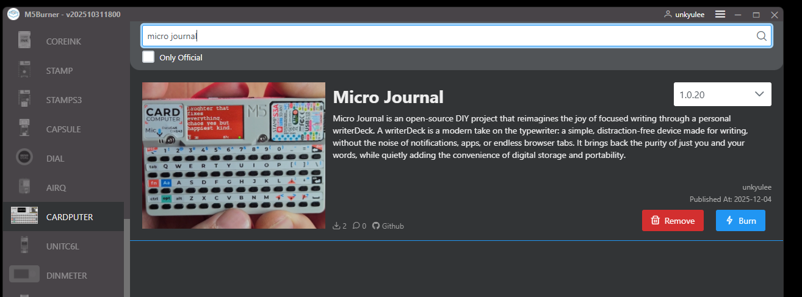

# Micro Journal for Cardputer

Micro Journal is a minimal writing tool built for the M5Stack Cardputer. It is a small experiment in exploring what a truly pocketable digital journal can feel like.


## Introduction

For a long time, I wondered if it would be possible to create a pocketable writing device. The idea of carrying a digital journal in my pocket sounded exciting, almost like combining the convenience of a notepad with the flexibility of a computer. I spent a lot of time thinking about different ways to build such a device. By chance, I discovered the M5Stack Cardputer. It already had the perfect form factor, a built in keyboard, and all the hardware needed for a tiny writing tool. It felt like it was just waiting for the right software to turn it into a micro journal. So I decided to begin the journey. Porting the firmware to the Cardputer took some effort, but most of the features were already implemented in previous versions of Micro Journal. With a bit of work, I was able to get everything running on the device.

The conclusion surprised me. I do not know if this size makes sense for writing anything long. Typing more than a few words at a time quickly becomes uncomfortable, and the tiny keyboard makes longer writing stressful. That was a bit disappointing. 

[EDIT] Later added support for external keyboards. It works with BLE keyboard and USB keyboard to type. With those features, the device became very decent writerDeck. 

But then something unexpected happened. My four year old son picked it up and started playing with it. He began typing simple words with me and treated it as a fun way to learn letters. He still insists that the letter I is the number one. It was a surprise to find an educational purpose by accident.

After that, I started looking for practical uses. It turns out that the Cardputer is surprisingly good for very short writing tasks, such as quick todo items or shopping lists. It powers on quickly, and you can begin writing within seconds. For these tiny tasks, the size actually works well.

Overall, this project has been a fun way to explore what a pocketable writing device can and cannot do. I am happy I was able to experiment with this form factor without needing to build the hardware myself. It gave me a clear idea of the limitations of such a small device. It is difficult to make a good typing experience at this size, but my son and I are enjoying it, and that makes the whole effort worthwhile.

I hope you enjoy exploring Micro Journal on the Cardputer. It is worth trying, but do not get carried away by the idea of it. It is a tiny tool with very real limits, but also a few delightful surprises.

* [Video of Carputer in Micro Jouranl](https://youtu.be/Zwxg0xYPfAk)


## Installing the Firmware Using M5Burner

1. Download M5Burner from:  
   https://docs.m5stack.com/en/uiflow/m5burner/intro

2. Open M5Burner on your computer and select the Cardputer device.

3. Choose the Cardputer device, then type "micro journal" in the search bar.


4. Download the firmware and press Burn.  
   Make sure the Cardputer is in download mode. While pressing BtnG0, tap Rst. This will boot the device into download mode.

5. Insert a FAT32 formatted microSD card into the device.

6. Restart the Cardputer when the flashing process completes.

After these steps, Micro Journal is ready to use.

## How to Use Micro Journal

### Writing Notes
- Power on the Cardputer.  
- Begin typing. Text appears immediately on the screen.  

### Syncing to Google Drive
- Choose the Sync option in the menu. (FN + ESC)
- For setup instructions, you can follow the Rev.6 setup guide:  
  https://github.com/unkyulee/micro-journal/blob/main/micro-journal-rev-6-one-piece/quickstart.md

### Sending Text via Bluetooth
- Select "BLE Bluetooth" from the menu.  
- Pair the Cardputer with your phone or computer.  
- You can then use the device as a Bluetooth keyboard.  
- Pressing FN + Tab will send your text as keystrokes to the paired device.

## Keyboard Language

Other language keyboard than US layout is supported. But this is going to require manual update on the config.json inside the SD card. You will see config.json file inside the SD card and adding this property will allow you to use other keyboard layouts.

```json
{
   ... other configurations

   "keyboard_layout": "UK"
}
```

* "INT": international layout
* "BE": Belgium
* "CA": Canada Multi Language 
* "DV": I totally forgot what this stands for... Dvorak maybe?
* "FN": Finnish
* "SWE": Swedish
* "NO": Norweigian
* "FR": AZERTY
* "GE": German
* "IT": Italian
* "LAT": Latin American Layout
* "UK": Great Britain


## External Keyboard Support - Connecting BLE, and USB Keyboard

* BLE Keyboard
  You can use BLE keyboard. It's BLE (Bluetooth Low Energy) not Bluetooth Classic. Make sure to distinguish the differences. Go through pairing process and you will be able to write with BLE keyboard. [BLE Keyboard Usage Video](https://www.youtube.com/watch?v=SoMUMCcXLDs).


* USB Keyboard
  You can connect to the USB port on the cardputer to use USB keyboard. Make sure to turn the switch on the left hand side to "5V OUT" on the device which power the connected USB Keyboard. [USB Keyboard Usage Video] TBD.


## Building From Source (Optional)

If you want to compile the firmware yourself:

1. Clone this repository.  
2. Open the folder "micro-journal-rev-4-esp32" in Visual Studio Code with PlatformIO installed.  
3. Select the environment named "m5stack-stamps3".  
4. Build and upload to your device.  
5. You may also merge the binaries if you want to distribute them through M5Burner.

Most users do not need to build the firmware manually. Flashing through M5Burner is the simplest option.

## Feedback and Contributions

Issues, suggestions, and pull requests are welcome. If you find a problem or want to share how you are using Micro Journal, feel free to open an issue in this repository.

Micro Journal is an open source project built with curiosity, care, and a genuine love for writing. If you enjoyed exploring the project or building your own writerDeck and would like to support the work, even a small gesture means a lot. Every contribution helps me continue improving Micro Journal and sharing it with the community.

* https://www.buymeacoffee.com/unkyulee

Un Kyu Lee