# Build Guide

This is the build guide for the AlphaSmart Neo2 Desktop Typewriter Transform Kit: Micro Journal Neo2.

This project allows you to transform your own AlphaSmart Neo2 into a beautiful desktop typewriter.

> **Important:** You must already own an AlphaSmart Neo2. This kit does **not** include the device itself. This is a "new dress" for an existing device, not an original build.

- [Requirements](#requirements)
- [Video Guide](#video-guide)
- [Bill of Materials](#bill-of-materials)
- [Required Tools](#required-tools)
- [Build Order](#build-order)
- [1. 3D Printing the Parts](#1-3d-printing-the-parts)
- [2. Preparing the AlphaSmart Neo2](#2-preparing-the-alphasmart-neo2)
- [3. Assembling the Enclosure](#3-assembling-the-enclosure)
- [4. Installing the Neo2 Electronics](#4-installing-the-neo2-electronics)
- [Replacing Batteries](#replacing-batteries)
- [Community](#community)
- [Support](#support)

---

# Requirements

Fortunately, you won't need advanced skills to complete the build. **No soldering is required.** If you can use a screwdriver, you can finish the assembly. You will need some specialty screwdrivers for disassembling the Neo2.

You will need the 3D printed parts. You can print them yourself, or buy the kit.

I offer a kit with all screws and heat inserts pre-installed to simplify assembly. Buying from my shop supports this project and allows me to continue it. However, it is an open source project, and all the design files are free and open for anyone to print for themselves.

- [Buy the kit from my Tindie store](https://www.tindie.com/products/unkyulee/alphasmart-neo2-desktop-typewriter-transform-kit/)

If you have the kit, the printing and heat inserts are already done. You can skip [step 1](#1-3d-printing-the-parts).

---

# Video Guide

The full build process has been recorded. If you get stuck, the videos may help clarify the trickier steps.

- Step 1. [3D Prints Assembly](https://youtu.be/myslRnqBZu8)
- Step 2. [AlphaSmart Neo2 Disassembly (Not Mine)](https://www.youtube.com/watch?v=RzWr7zDEymY)
- Step 3. [How to Assemble Enclosure](https://www.youtube.com/watch?v=NZRDTKvcuAM)
- Step 4. [Transform AlphaSmart Neo2](https://youtu.be/ckPTIjm1Qb4?si=wbaUMtP5fM4lTc7Y&t=224)
- [Tips & Tricks](https://www.reddit.com/r/writerDeck/comments/1o5yeii/microjournal_neo2/)

---

# Bill of Materials

## From Your AlphaSmart Neo2

| Part |
| ---- |
| Keyboard matrix |
| Display module |
| PCB |

## Hardware

| Part | Quantity |
| ---- | -------- |
| AAA battery holder (3 AAA batteries) | 1 |
| M3 Hex Screw Length 5mm | 8 |
| M3 Hex Screw Length 10mm | 4 |
| M3 Hex Screw Length 40mm | 4 |
| M3 Hex Screw Length 60mm | 2 |
| M3 Hex Screw Length 70mm | 4 |
| M3 Heated Inserts OD 4.5mm Length 3mm | As many as the screws |
| Double-sided tape | A small piece |

## 3D Printed Parts

The design files are in the [STL folder](./STL). A combined print project, `micro-journal-neo2.3mf`, and the Fusion 360 source file, `Alphasmart Neo2.f3d`, are in the same folder.

| Group | Files |
| ----- | ----- |
| Enclosure | `Enclosure.stl`, `Enclosure Left.stl`, `Enclosure Right.stl`, `Enclosure Top.stl`, `Enclosure PCB.stl` |
| Display | `Display Port.stl`, `Display Port Left.stl`, `Display Port Right.stl` |
| Knobs | `Knob.stl`, `Knob Small.stl` |
| Label | `Label.stl` |

---

# Required Tools

- TORX T10H screwdriver, for the hex screws
- Precision screwdriver set with star-shaped (TORX) bits, for the Neo2 disassembly
- Soldering iron, only if you print the parts yourself and need to install the heat inserts

---

# Build Order

1. Print the parts (skip this if you have the kit)
2. Prepare the AlphaSmart Neo2
3. Assemble the enclosure
4. Install the Neo2 electronics

---

# 1. 3D Printing the Parts

The design files can be found in the [STL folder](./STL). I used a Bambu Lab P1S, but any CoreXY printer should also work well.

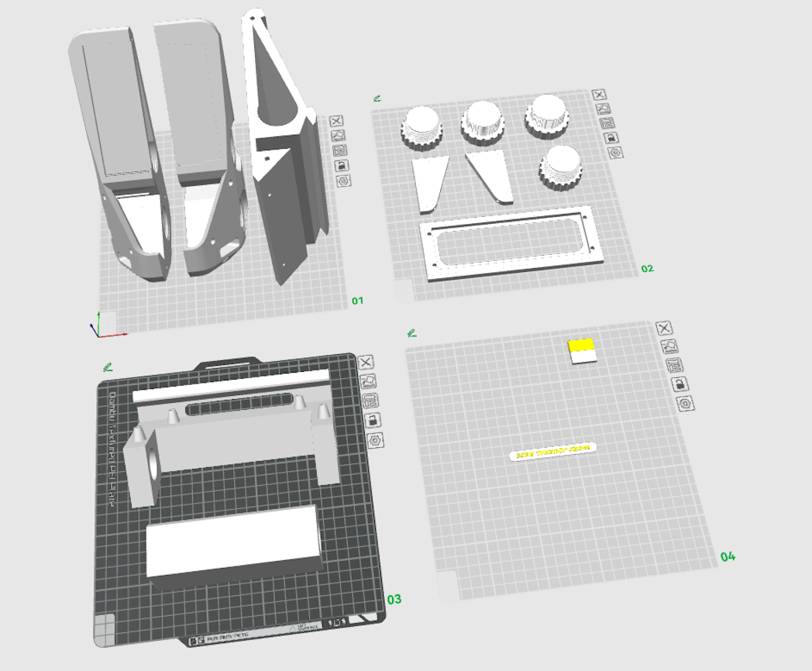

Print orientation is important for quality. Front-facing surfaces should be smooth, while less visible parts can tolerate minor imperfections.

The full build takes around **40 hours** of printing and a significant amount of filament. Consider printing one part at a time to reduce the risk of failed prints.

Here is a video that shows how to assemble the 3D printed enclosure:

- https://youtu.be/myslRnqBZu8

---

# 2. Preparing the AlphaSmart Neo2

Disassemble your Neo2 using precision screwdrivers with star-shaped (TORX) bits.

Here is a video you can follow to disassemble your AlphaSmart Neo2:

- https://www.youtube.com/watch?v=RzWr7zDEymY

## Display Module

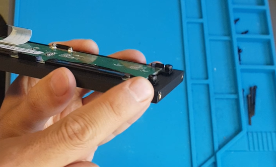

- Slide the display module into the printed enclosure.
- **Do not overtighten the screws!** Leave a small gap so the display bracket floats freely. Tightening too much can bend or damage the display.

## Keyboard Module

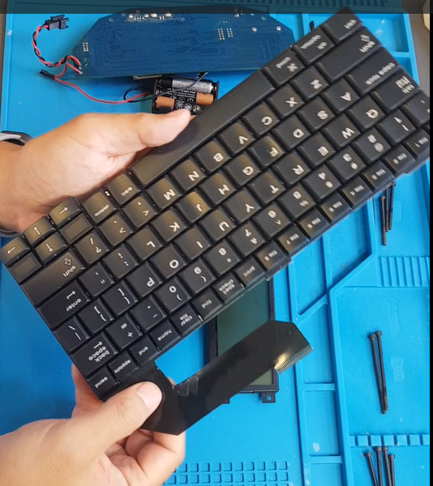

- No modifications are needed for the keyboard PCB.
- Optional: reinforce the angled film cables with tape to reduce stress and prevent damage.

## PCB and Battery

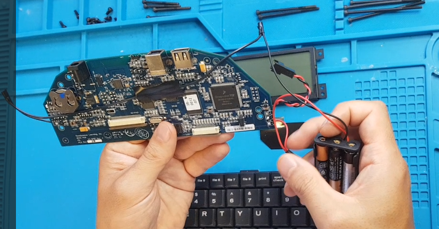

> **Important:** The coin battery is what prevents you from losing data when you change the batteries. It may also preserve settings. It needs to be changed every 5 to 7 years. Consider replacing the coin cell battery before installing the PCB in the new enclosure.

- Replace the original battery clips with the AAA battery holder.
- Extend the black wire and connect the wires (black to black, red to red), then insulate them with tape.
- No soldering is required. Just twist and tape.
- Place the battery holder in the left compartment. Do not use the space under the PCB for the battery holder.

---

# 3. Assembling the Enclosure

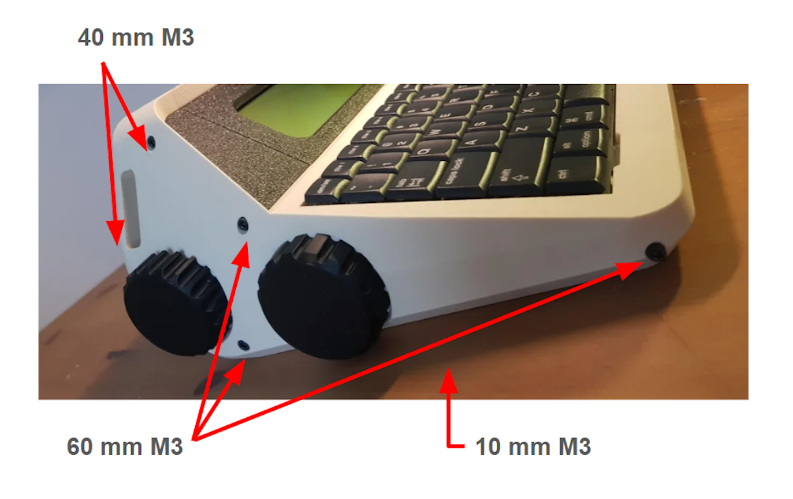

- Begin with all the outer enclosure pieces. Leave the display and PCB covers aside for later.
- Tighten the screws only partially. Final tightening is done after the electronics are mounted.

---

# 4. Installing the Neo2 Electronics

Watch the [video instructions](https://youtu.be/ckPTIjm1Qb4?si=EI0IFE9el5tizdBq&t=224) for the step order.

1. Thread the keyboard film cable through the right-side compartment.

   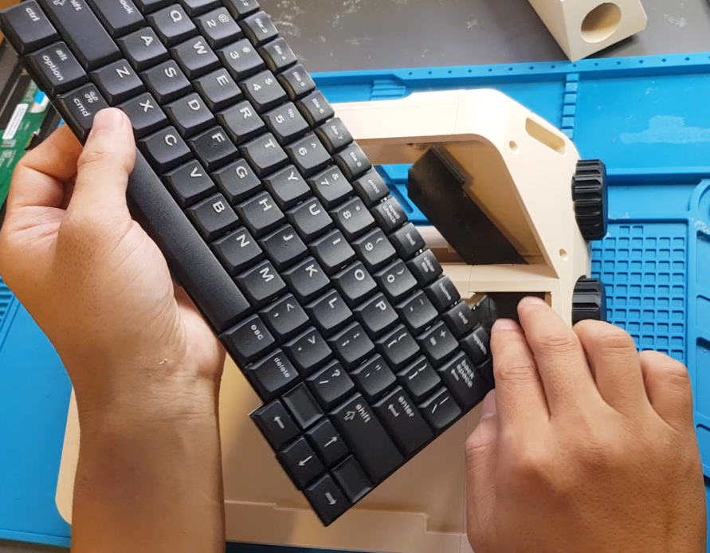

2. Apply double-sided tape to the middle-bottom of the keyboard only. Avoid the left and right edges, so the keyboard can be removed again later.

   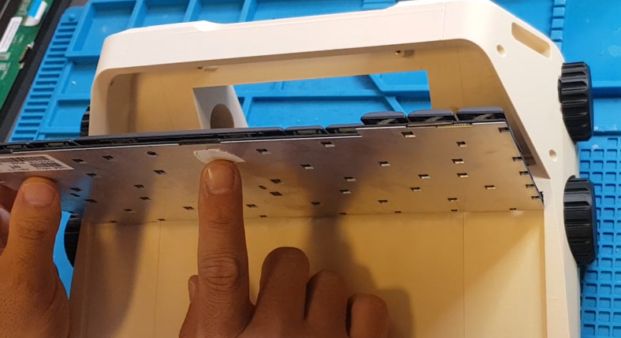

3. Place the PCB with the smooth surface facing front. Expose the USB and power ports at the top. Use 4x 5mm M3 screws to secure it.

   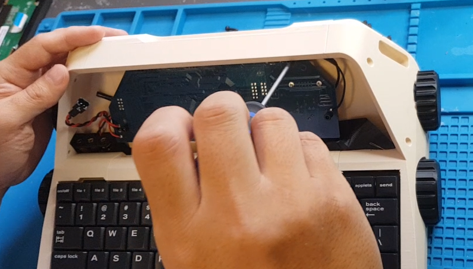

4. Install the side panels and the display module. Make sure the cables are at the bottom. Lock all three panels in place with the correctly sized M3 screws.

   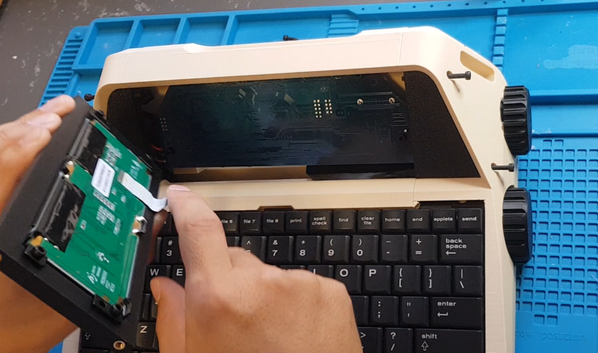

5. Flip the case and attach the keyboard and display cables to the PCB connectors.

   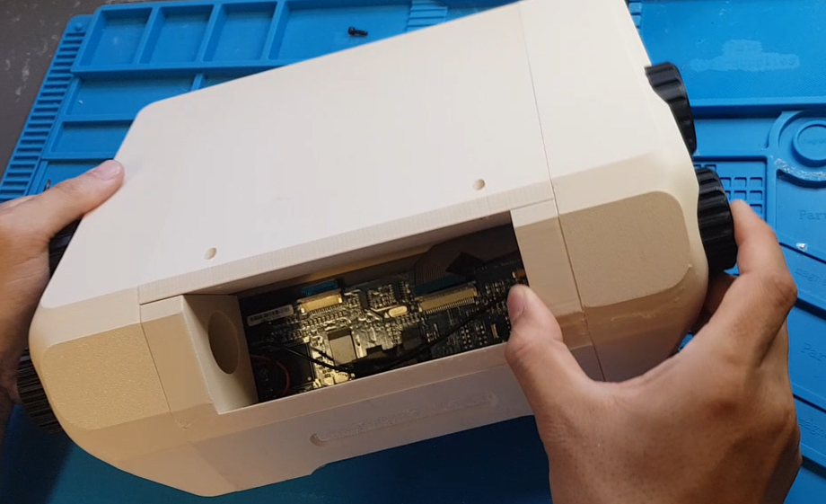

6. Test power-on and key registration.

   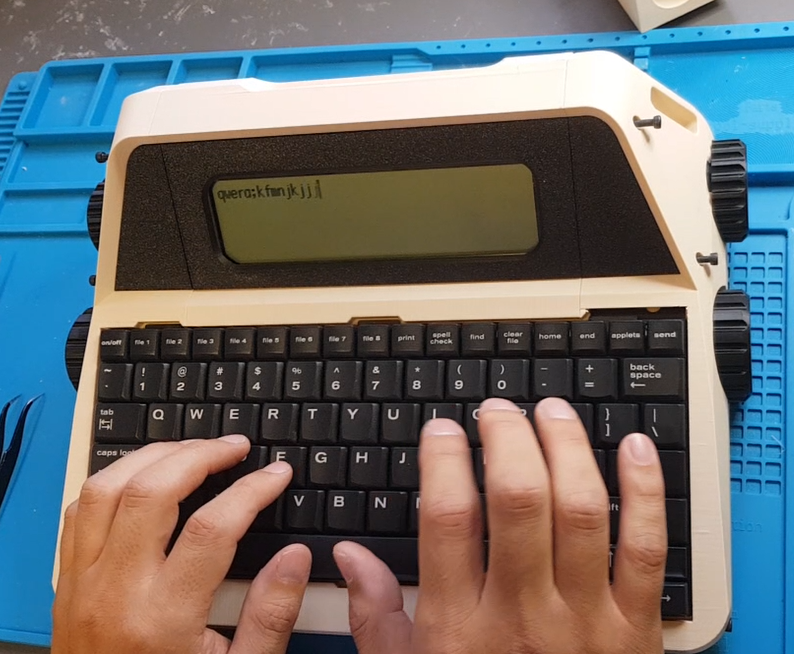

7. Close the PCB cover and secure it with 10mm M3 screws.

   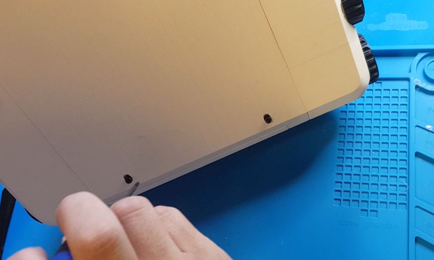

Now, your AlphaSmart Neo2 is reborn as a **beautifully crafted desktop typewriter**. Enjoy the tactile joy of writing on a legendary keyboard with a fresh new look!

---

# Replacing Batteries

1. Open the left-side display panel.
2. Loosen all the screws on that side.
3. Access the battery holder, replace the AAA batteries, and reassemble.

---

# Community

There is an active online community for Neo2 enthusiasts. Answers usually come within a day.

[https://www.flickr.com/groups/alphasmart/](https://www.flickr.com/groups/alphasmart/)

---

# Support

If Micro Journal helped you build something you love, consider buying me a coffee through the link below. It is a small gesture, but it helps keep the project alive, cared for, and open for everyone.

* [Buy me a coffee](https://www.buymeacoffee.com/unkyulee)

Un Kyu Lee
