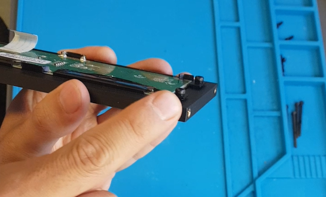
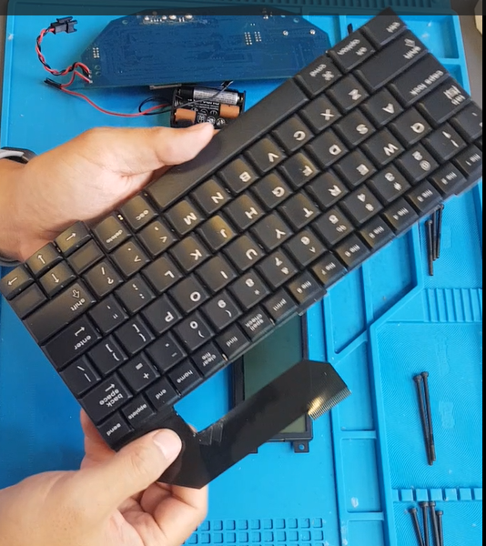
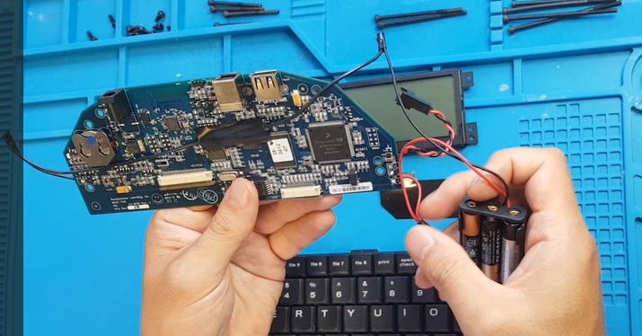
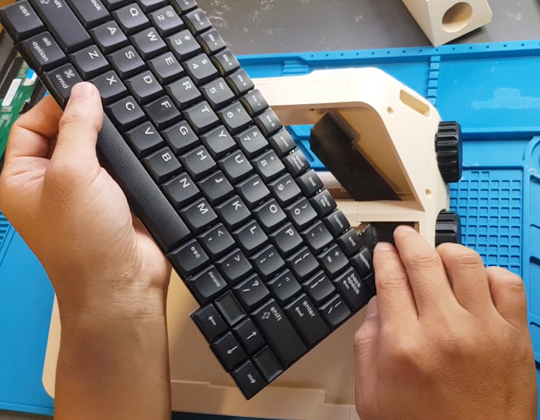
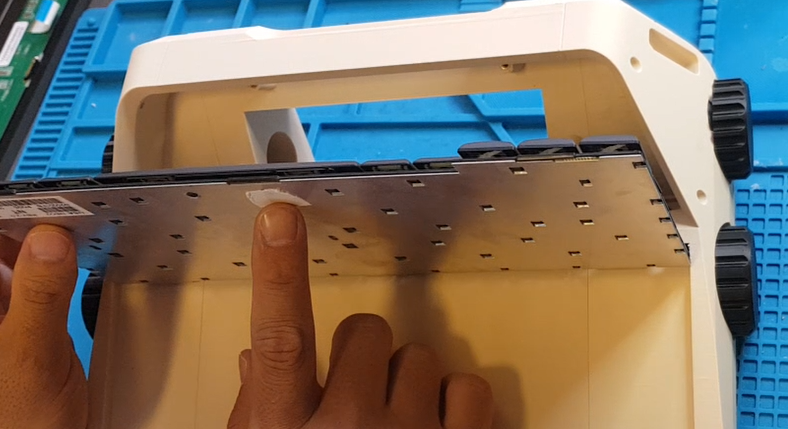
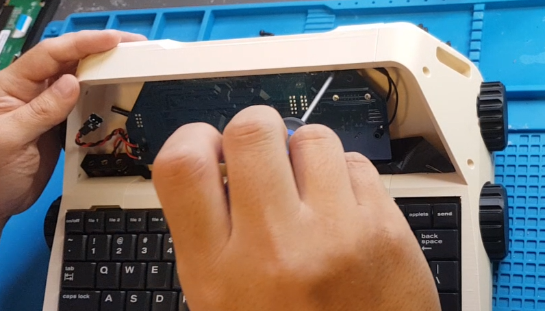
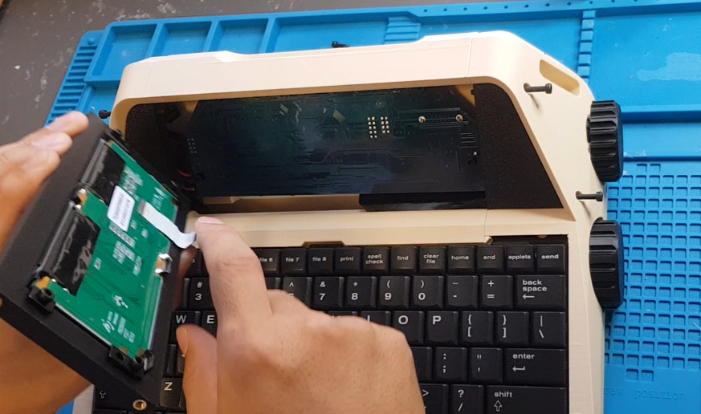
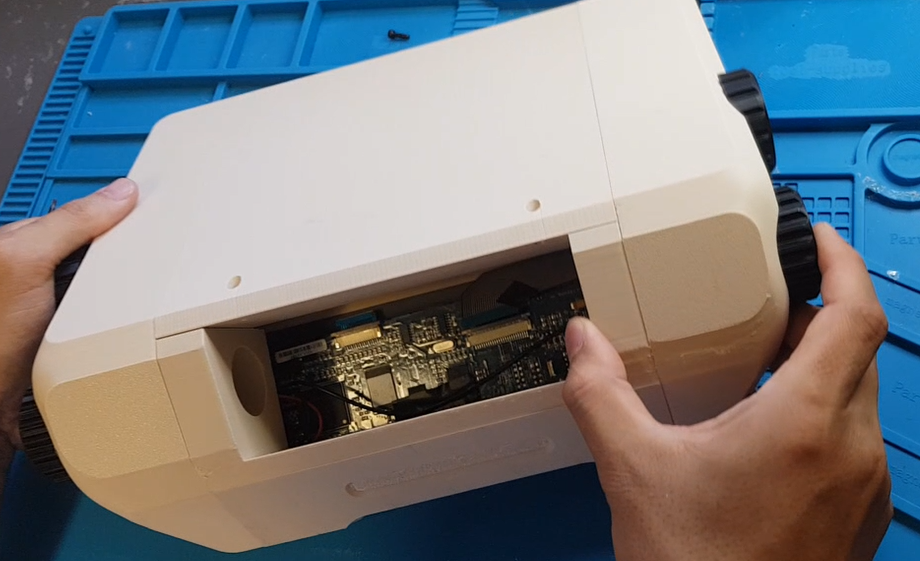
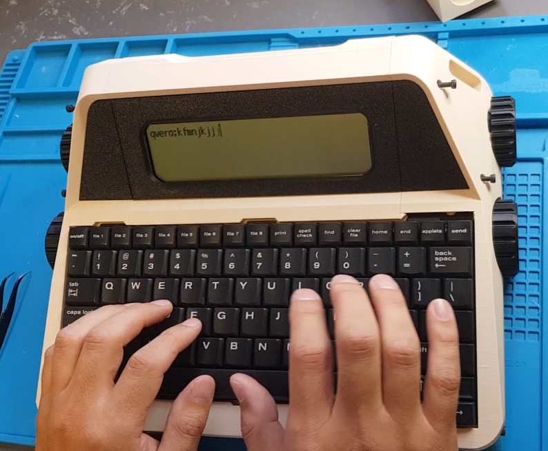
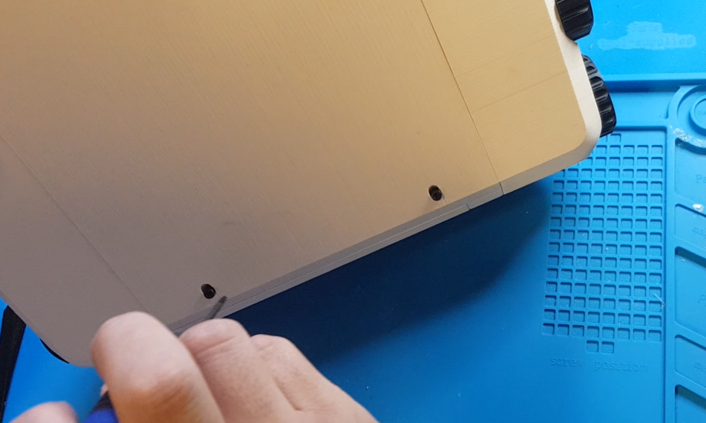

# AlphaSmart Neo2 Desktop Typewriter Transform Kit: Micro Journal Neo2

This project allows you to transform your own AlphaSmart Neo2 into a beautiful desktop typewriter.

**Important:** You must already own an AlphaSmart Neo2. This kit does **not** include the device itself. This is a "new dress" for an existing device, not an original build.

Fortunately, you won't need advanced skills to complete the build. **No soldering required**. If you can use a screwdriver, you can finish the assembly. You will need some specialty screwdrivers for disassembling the Neo2.

I offer a kit with all screws and heat inserts pre-installed to simplify assembly.
Buying from my shop supports this project and allows me to continue this project. However, it is an open source project and all the design files are free and open for anyone to print for themselves.

[Buy the KIT from my Tindie Store](https://www.tindie.com/products/unkyulee/alphasmart-neo2-desktop-typewriter-transform-kit/)

---

## Video Guide Step by Step

- Step 1. [3D Prints Assembly](https://youtu.be/myslRnqBZu8)
- Step 2. [AlphaSmart Neo2 Disassembly (Not Mine)](https://www.youtube.com/watch?v=RzWr7zDEymY)
- Step 3. [Transform AlphaSmart Neo2](https://youtu.be/ckPTIjm1Qb4?si=wbaUMtP5fM4lTc7Y&t=224)

- [Tips & Tricks](https://www.reddit.com/r/writerDeck/comments/1o5yeii/microjournal_neo2/) 

---

## Bill of Materials

* 3D printed parts (STL/3MF files in the GitHub repository)  
* AAA Battery Holder (3 AAA batteries)  
* 8x 5mm M3 Hex Screws  
* 4x 10mm M3 Hex Screws  
* 4x 40mm M3 Hex Screws  
* 4x 60mm M3 Hex Screws  
* 2x 70mm M3 Hex Screws  
* TORX T10H Screwdriver  
* Precision Screwdriver Set (for Neo2 disassembly)  
* Small piece of double-sided tape  
* Disassembled AlphaSmart Neo2 (Keyboard Matrix, Display Module, PCB)

---

## 3D Printing the Parts

The design files can be found in the [STL folder](./STL) in the GitHub repository. I used a BambuLab P1S, but any CoreXY printers should also work well.

Print orientation is important for quality. Front-facing surfaces should be smooth, while less visible parts can tolerate minor imperfections. The full build takes around **40 hours** and a significant amount of filament. Consider printing one part at a time to reduce risk of failed prints.

Here is a video where it shows how to assemble the 3D printed enclosure
- https://youtu.be/myslRnqBZu8

---

## Preparing the AlphaSmart Neo2

Disassemble your Neo2 using precision screwdrivers with star-shaped (TORX) bits.  

Here is a video where you can follow to disassemble your AlphaSmart Neo2
- https://www.youtube.com/watch?v=RzWr7zDEymY

### Display Module

* Slide the display module into the printed enclosure.  
* **Do not overtighten screws!** Leave a small gap so the display bracket floats freely. Tightening too much can bend or damage the display.

### Keyboard Module

* No modifications needed for the keyboard PCB.  
* Optional: reinforce angled film cables with tape to reduce stress and prevent damage.

### PCB & Battery

**Important:** The coin battery is what prevents you form losing data when you change batteries. It may also preserve settings. The battery needs to be changed out every 5 to 7 years. Consider replacing the coin cell battery before installing the PCB to the new enclosure.

* Replace the original battery clips with a AAA battery holder.  
* Extend the black wire and connect the wires (black to black, red to red), then insulate with tape.  
* No soldering required. Just twist and tape.

---

## Assembling the Enclosure

* Begin with all outer enclosure pieces. Leave the display and PCB covers aside for later.  
* Partially tighten screws. Final tightening is done after electronics are mounted.  

---

## Installing the Neo2 Electronics

Watch [video instructions](https://youtu.be/ckPTIjm1Qb4?si=EI0IFE9el5tizdBq&t=224) for step order.

1. Thread the keyboard film cable through the right-side compartment.  

2. Apply double-sided tape to the middle-bottom of the keyboard only (avoid left/right edges for disassembly).  

3. Place the PCB with smooth surface facing front. Expose USB and power ports at the top. Use 4x 5mm M3 screws to secure.  

4. Install side panels and display module. Ensure cables are at the bottom. Lock all three panels in place with correctly sized M3 screws.

5. Flip the case and attach keyboard and display cables to PCB connectors.  

6. Test power-on and key registration.  
   

7. Close PCB cover and secure with 10mm M3 screws.

---

## Replacing Batteries

1. Open the left-side display panel.  
2. Loosen all screws on that side.  
3. Access battery holder, replace AAA batteries, and reassemble.

---

## AlphaSmart Neo2 Community

There is an active online community for Neo2 enthusiasts. Answers usually come within a day.

[https://www.flickr.com/groups/alphasmart/](https://www.flickr.com/groups/alphasmart/)

---

Now, your AlphaSmart Neo2 is reborn as a **beautifully crafted desktop typewriter**. Enjoy the tactile joy of writing on a legendary keyboard with a fresh new look!

Un Kyu Lee
