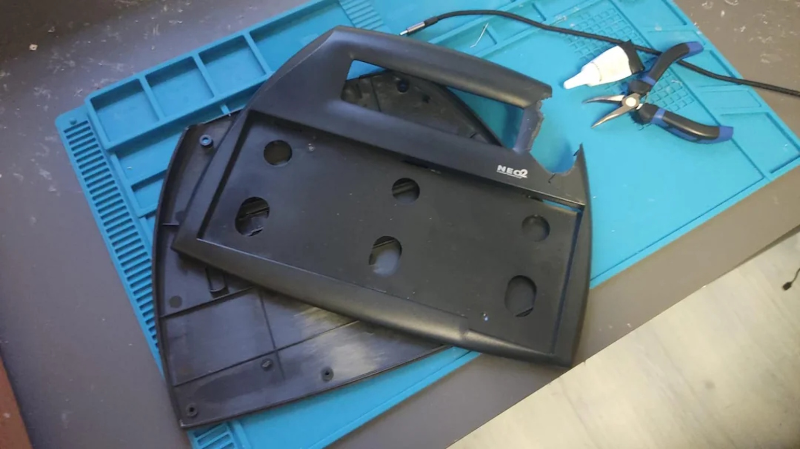
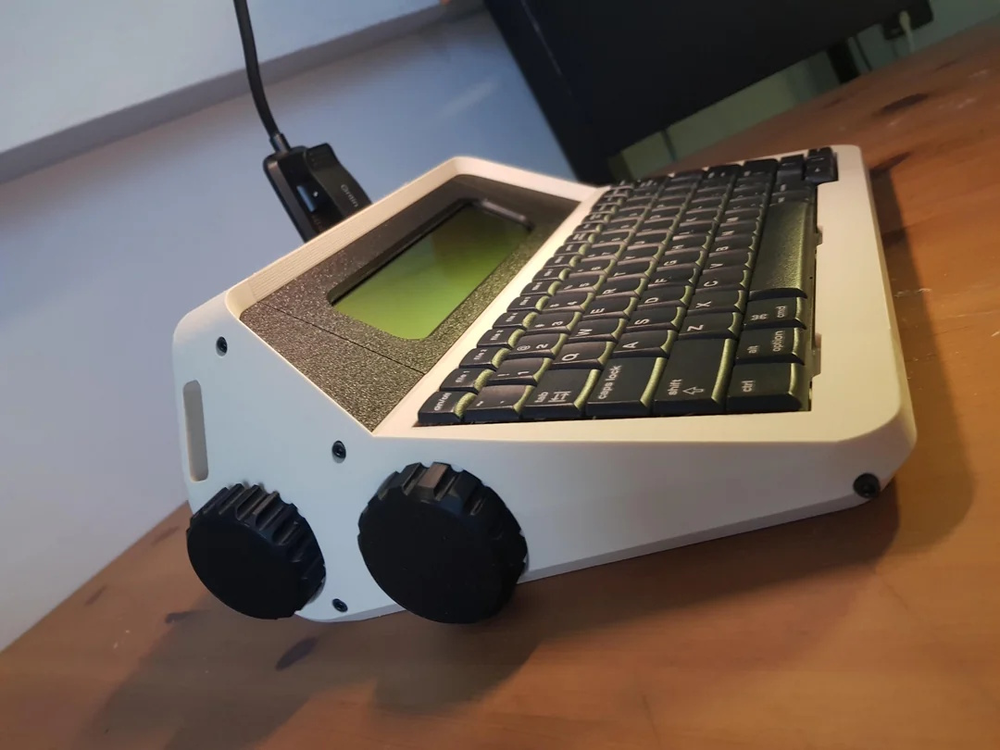

## AlphaSmart Neo2 Desktop Typewriter Transform Kit: Micro Journal Neo2

One of my dear friends, Hook, gifted me an AlphaSmart Neo2 around the time I was developing the Micro Journal Rev.2. He couldn't believe I didn't already own one.

The Neo2 had everything I could ask for in terms of software. But there was one thing holding me back. The physical design. The low keyboard angle and flat enclosure just didn't feel right to me, and I couldn't fully commit to using it.  So, it sat on my shelf. From time to time, I'd turn it on, just to study how its features were implemented. It was like having a legendary artifact, admired but not fully embraced.

Then, one day, while cleaning and moving furniture, disaster struck. The Neo2 fell from the top shelf and hit the floor, shattering its enclosure.

I froze. This was a product no longer in production. Replacement parts don't exist. For a moment, I panicked. Thinking I had destroyed something irreplaceable. But when I inspected it closely, I realized the internals were still perfectly fine. That was my turning point.

Instead of despair, I saw an opportunity. **Why not design a new enclosure?** Not just a repair job, but a complete transformation. A way to turn the Neo2 into something I'd *love* to use. Something that would sit proudly on my desk like a classic typewriter.

What followed was three months of trial, error, and obsession. It takes almost **1 kilogram of filament** and **40 hours of printing** to produce a single enclosure. I did **six full prints** and countless partial prints, endlessly tweaking dimensions and alignments. 

There was always a risk. I had only one working Neo2 motherboard. If I damaged it, there would be no replacement. And, at one point, I *did* break an AlphaSmart unit during testing. I can't fully describe how devastating that felt. I had betrayed the very object I was trying to save.  

Still, I kept going. Each iteration was a leap of faith. I could have stopped at earlier versions. They were functional, even good enough. But I wanted more than just functionality. I wanted simplicity, beauty, and a design that felt inevitable. Finally, after countless late nights and failures, I got it right. The result is what you see here: a clean, elegant enclosure that transforms the Neo2 into a **desktop typewriter**.  

It's easy to assemble, satisfying to use. Most importantly, brings the AlphaSmart Neo2 back to life in a form worthy of its legacy.

### Documents 

* [Introduction Video](https://youtu.be/ckPTIjm1Qb4)
* [Build Guide](./build-guide.md)

### Resources

* [Design Files](./STL)

### Community

* [Flickr - AlphaSmart - Writing Tools](https://www.flickr.com/groups/alphasmart/discuss/72157721923133428/)
* [Reddit - writerDeck](https://www.reddit.com/r/writerDeck/)

### Online Shop

* [Order from Un Kyu's Tindie Shop](https://www.tindie.com/products/unkyulee/alphasmart-neo2-desktop-typewriter-transform-kit/)
