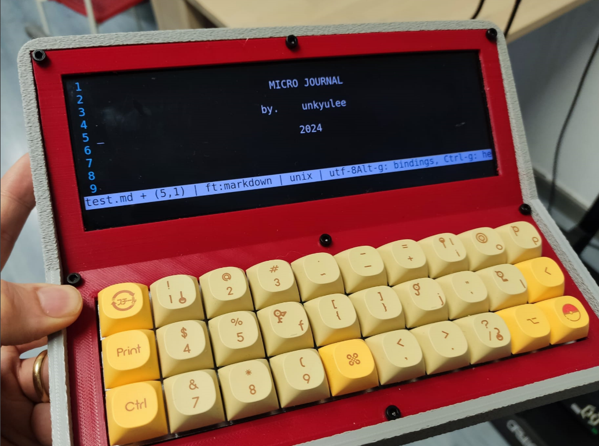
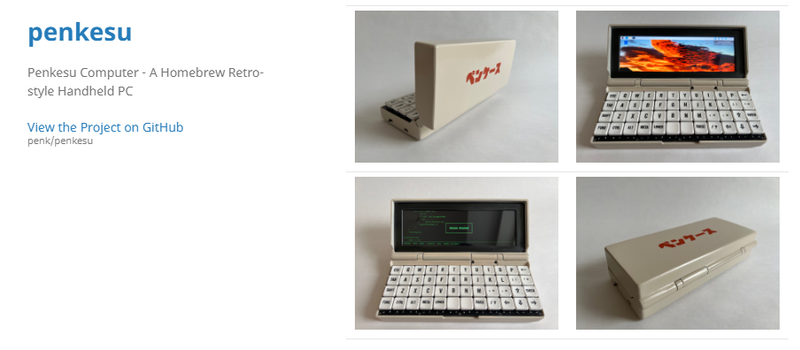
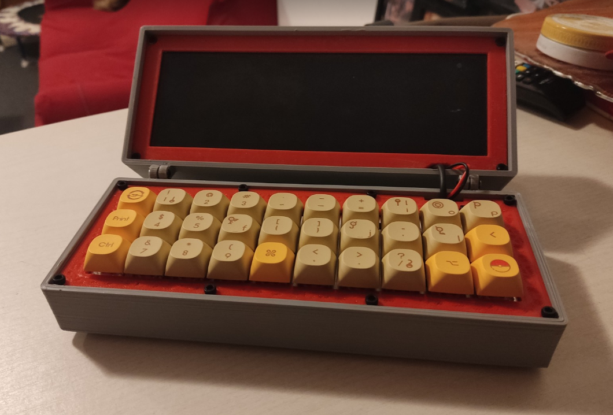
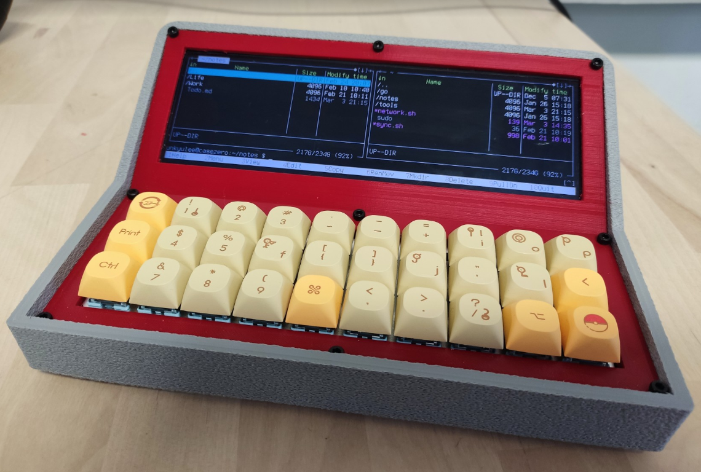
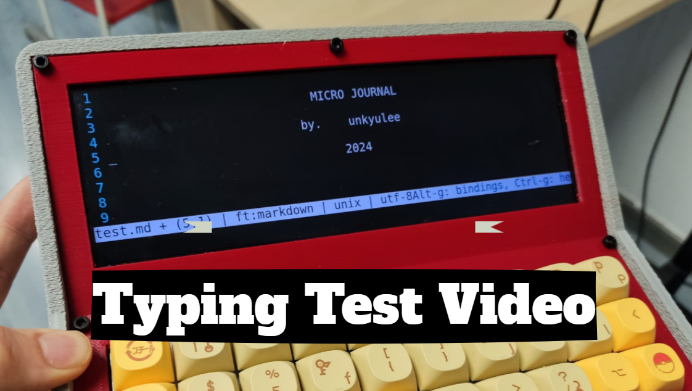
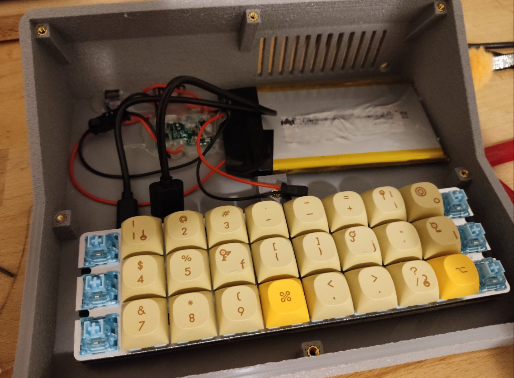
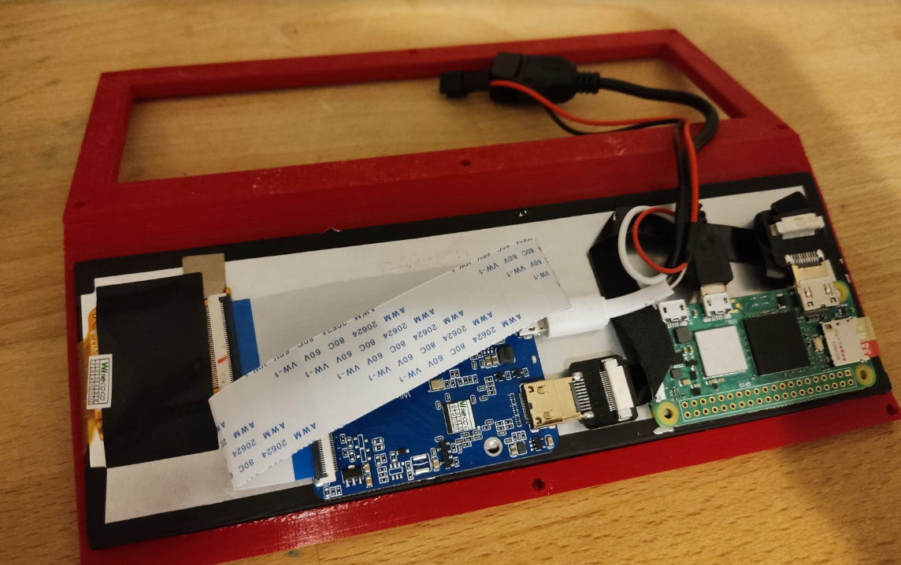

## First iteration: Using Raspberry Pi and 30 Keys mechanical keyboards. 

I experimented with various iterations to explore different options for creating a distraction-free writing device. The initial version involved using a Raspberry Pi 2W, a small Linux computer, paired with a 30-key mechanical keyboard.

A crucial aspect of achieving distraction-free writing is to eliminate all possible distractions. The Raspberry Pi 2W excelled in this regard due to its Linux terminal-based interface, devoid of any graphical user interface. This meant there were no avenues for distractions like YouTube or other similar distractions.

Upon powering on the device, I utilized the midnight commander to navigate to the desired folder and used the "micro" editor (similar to nano or vi) to begin writing. The screen transformed into a simple black-and-white display, solely focused on the text being written. This immersive environment facilitated quick entry into the flow state, resulting in remarkable productivity and quality of writing. When the brain is compelled to focus solely on one task, the results can be truly impressive.

This is the write up for the build guide of ths raspberry pi build.

### Documents

* [Micro Journal Rev.2 Build Guide](/micro-journal-rev-2-raspberypi/readme.md) 

* [Reddit Post](https://new.reddit.com/r/writerDeck/comments/1b6ff16/micro_journal_rev_2/)

## Second iteration: Using an old phone to make a writerDeck

In the next iteration, I explored building a writing device using easily accessible components, such as an old phone. Old phones still possess sufficient power to serve as effective writing tools when coupled with a keyboard.

The primary focus of this build was to provide a platform for my daughter to write journals without the complexities associated with Linux commands. Since she was accustomed to tablet environments, this solution aligned well with her needs. She could simply pick up the device and begin writing.

This particular build involved 3D prints and hand-wired keyboards, making it slightly more complex. However, the core idea of combining an old phone with a keyboard can be easily replicated for similar purposes.

It's important to note that achieving a distraction-free environment was challenging with this build. Phones are inherently versatile devices, offering access to various forms of entertainment like YouTube and music streaming services. Consequently, maintaining focus on writing proved difficult. Despite this limitation, the device still served its purpose well by assisting my daughter in continuing her journal writing.

### Documents

* [Micro Journal Rev.3 Build Guide](/micro-journal-rev-3-samsung-galaxy-s8/readme.md)

* [Reddit Post](https://new.reddit.com/r/writerDeck/comments/1bfhnfz/writerdeck_with_samsung_s8_using_an_old_mobile/)

# Micro Journal - Rev. 2

Micro journal is distraction free writing device. Featuring 30-key mechanical keyboard, and 8-inch wide screen, and powered by Raspberry Pi Zero 2W, providing a focused writing environment.

I would like to explain the inspiration, design challenges, and the evolution of the unique cyberdeck-like creation, ulitimately resulting in a compact and stable writing companion. 

I use this for keeping journals. Been using it since the beginning of 2024. While typing, there are only texts on the screen. Nothing else. Provides immersive experience. Focused. Something about this device. It does one thing. And it does really well. (better than my goverment)

This is built by myself. Got hooked into the keyword, "Cyberdeck" while ago. Been searching around for quite a while. I wanted something, that is rather useful with unconventional form factor. 

# Inspired by

http://penkesu.computer/

Came across the a device called penkesu computer. I was inspired. Felt like really close to what I was looking for. A device that delivers mechanical keyboard sensation on a portable format. It is more like, Wuuut? is this even possible? Cuuuuuuuute! Immediately, I wanted to possess this and feel it with my own hands.

So, I built one. I couldn't use the design files that were provided at the penkesu website. Because I was using slightly different screen and also different keyboard. I mean, the main reason for not able to use the design files is, I didn't know how to use CAD software, yet. I learned to use fusion 360 along the project.

So, I tried to build up from zero. Watched several youtube tutorial to design boxes and cases. At the end, I have achieved some what similar look and feel.

**First Version**

(now that I look back at the first version. It does look more slick tho... too bad I am not able to resolve the hinge problem.)

Satisfied. Very.

But there were two problems.

1) Hinges
2) Chunky size

Hinges were not at all holding the screen. There is a sense of tick in the hinge activation. But it is absolutely not possible to hold it in place. I had to place some object to support behind. 

Second part of the problem was the rather chunky size. I used the cherry mx switch. It is used on the regular mechanical keyboards. They have quite a height. From the bottom to the keycap tip... it takes around 3 ~ 4 cm. That is chunky. All together, It became around the size of 1 litre bottle that you'd take to the hiking.

Probably, size issue could have been improved if I was using low profile switches. In my defense, I had very little knowledge about mechanical keyboards, and didn't know the difference between low profile switches to cherry mx swtiches.

But, I loved the cherry mx format switches and the how easy to get supplies of switches. Also, I found one (Akko Cream Blue Pro) that felt so satisfying. So, I decided to stick with the cherry mx profile. 

Collecting those problems. I went to make the newer revision. Removing hinges making a solid flat platform and for the size, just gave up pocketability. Reason being, it has been mostly used on the desk and occassionaly on the sofa. So, it didn't really need to be closeable box form. 

# Micro Journal - a second revision

I need a stable positioning to write. I can't have the screen swinging around while writing. It's a small form factor, and means can be repositioned many times while writing. Every time if the screen has to be stabilized. It was hurting the flow. 

I went with the accountant calculator form factor to resolve that. Also, other commercial focus writing devices were using flat panel designs. Having a large flat panel provides a lot of stability while typing on the desk and also writing lying down on the sofa.

Results were very satisfying. With this form factor. With the screen slightly inclined. Provided much stability. I could just power on and start typing. No need to find the place to stabilize the hinge. I liked it very much. 

# Writing Experience

I write journal everyday with this device since the beginning of 2024. I missed 4 days since. Only reason I missed writing is because these 4 days were when I diassembled the device and preparing the newer revision. 

This means, average 30 minutes of use per day. Nothing compare to the daily driver laptops. Also, I wouldn't use it for work or any producitivy related tasks. It's not designed for that.

However, It is absolutely amazing to write with this device. Provides shortcut to get into the concentrated flow. Those who writes text, or writes code, you guys know, how long it takes to get into the flow. Also, how easy to break the flow... by just receiving an email (or whatsapp) notification on the screen. 

Experience is pleasant. I would say, 80% of the pleasure is from the mechanical keyboard. Also, being able to write on the 30 keys, gives some weird satisfaction that no one would ever care, that it is a pervertiuous sensation for me and I like it. Also, the switches provides a cute girlfriend vibe. My fingers cuddling with the cute sexy cherry switches... sometimes I just continue to type random words making no sense, just because I wanted to keep feelin' those key strokes. 

Oh. right. The joural. I am not sure if I am on the device for writing a journal or just to use the keyboard. One thing for sure, this device, helps a lot to write. Mostly, due to pleasurable experience with keyboard and the fact with such a low power, it can't do anything else than that. Naturally distraction free.

# Keyboard

TU30 Type-c Hot Swappable Mechanical Keyboard DIY Kits 30 Planck Programmable Keyboard Kit Aluminum Plate Plastic Shell

https://www.aliexpress.com/item/1005005719514694.html

This is 30 keys keyboard. Not 30%, it has less keys than that. It took me three days of commitment to get used to and within couple of weeks I was typing as normal. But can't get rid of thinking... If I had just, just... three keys more. But writing in general is not a problem once you get used to it.

# Screen

Wisecoco 7.84 Inch 1280x400 LCD Display Stretched Bar LCD Monitor Aida64 Laptop Raspberry Pi Long Strip Panel MIPI Driver Board

(Screen with board)

https://www.aliexpress.com/item/1005004986951553.html

Wide screen format. This should be the screen that is almost exactly same size as the keyboard. How cute to picture them cuddling together to cyber deck. 

# STL files

https://github.com/unkyulee/micro-journal

You can find the stl files in the stl folder.
You just need to print two parts. Enclosure and the cover. 

# Assembly

I am using raspberry pi zero 2w on this device. But any other SBC that runs linux can and will do. You wouldn't need any fancy software or hardware. It is just a linux terminal with text editors. (nano, vi, micro... ) 

You would need to figure out the power supply part of the design. There are plenty of space under the screen to put a battery and charge controllers and so on. 

https://www.amazon.it/gp/product/B091YQRZPL/ref=ppx_yo_dt_b_asin_title_o04_s00?ie=UTF8&psc=1

I used this parts to supply the power. 

If any soldering or wiring is a tough deal then, you can simply pass through a usb cable to power the device directly without any battery. Most of the time, you would be seating on the desk while using this device. Having a battery wasn't really mandatory anyways.

# Conclusion

Micro Journal, is a pursuit of a simple yet effective writing solution. Born from inspiration of many cyberdeck ideas from the internet, overcoming design challenges, and fueled by a passion for mechanical keyboards, this device has found its place as a cherished tool for daily journaling. While not a daily driver, it provides a delightful writing experience and serves as a proof that mechanical keyboards can indeed find a place in a portable writing device. For those seeking niche solution for the on-the-go writing pleasure, this can open up a new channel for creativity and expression.

