# Rev.2. Build Guide

This guide is for building the **Micro Journal Rev.2.ReVamp**, allowing you to assemble one on your own. It provides detailed information for troubleshooting if any parts of the build encounter issues and serves as a resource for those curious about the construction of the Micro Journal Rev.2.ReVamp.

To complete this build, basic soldering skills are necessary, though advanced skills aren’t required. All components are through-hole types, so with some practice, you’ll be able to achieve the level needed.

You’ll also need access to 3D-printed parts to complete the build. Many 3D printing services are available, but if you’d prefer to assemble your own and are having difficulty sourcing components, feel free to contact me—I’ll do my best to help provide a DIY kit.

- Build Time: 4 ~ 6 hours
- Basic level of soldering is required to complete the build

[Buy a DIY Kit](https://www.tindie.com/products/unkyulee/micro-journal-diy-kit-all-components/)

## Credit

Build guide credit goes to a reddit user with a name ruleugim who has sourced all the material by oneself and has been reporting me all the missing points and difficulties that has occurred during the build. Thanks for the reports and all the feedback has been reinforced to the build guide thanks to ruleugim.

# System Architecture

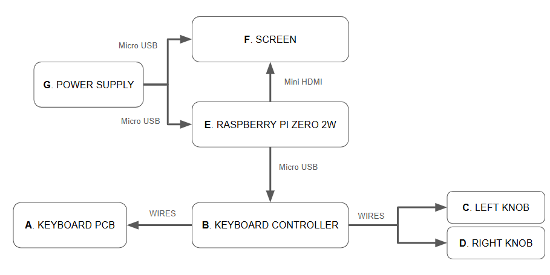

Rev.2. is a small computer. Process of the building rev.2. is very similar to building a PC. There is a computer at the center of it, the assembly consists of connecting a display, power supply and the keyboard.

### A. Keyboard PCB

This build utilized how swappable mechanical keyboard. Design files for the keyboard is in [this github repository](https://github.com/unkyulee/micro-journal/tree/main/micro-journal-rev-6-one-piece/PCB). You can use, PCB manufacturing services to get the PCB printed. Should be cheaper to buy from [my tindie store](https://www.tindie.com/stores/unkyulee) when you need just one or two PCBs.

### B. Keyboard Controller

Keyboard controller is going to provide USB interface to connect to the raspberry pi computer. In order to control the key inputs, you are going to need a "raspberry pi PICO". Please, note that this is not to be confused with "Raspberry Pi Zero 2W". PICO is a micro controller. It is a tiny processing unit that is dedicated to handle the key inputs. This component will be called as "keyboard controller" throughout the document.

### C and D. LEFT / RIGHT KNOB

Knobs are installed on both left and right hand side of the build. Each knob can roll up and down, and can be clicked. Knobs are connected to the keyboard controller and can be used as a keyboard input. Providing, left and right, scroll up and down respectively.

### E. Raspberry Pi Zero 2W

Raspberry Pi Zero 2W is at the heart of the build. Providing Linux terminal environment. Very simple and low powered computer that provides sufficient power to receive USB keyboard and connect to the wide screen with HDMI cable.

### F. Screen

[7.84 inch 1280x400 LCD Display](https://www.aliexpress.com/item/1005004986951553.html)

Screen received mini HDMI interface. This display is almost exact the size of the keyboard and it has a bit quirky aspect ratio, but attractive writing environment.

### G. Power Supply

This build uses a USB-C Female Port that will be connected to external power supply such as a phone charger or a portable battery to supply power to the device.

# Materials

- [Wisecoco 7.84 Inch 1280x400 LCD Display](https://www.aliexpress.com/item/1005004986951553.html)
- Raspberry Pi Zero 2W
- Raspberry Pi Pico (rp2040)
- [48 Keyboard PCB](https://www.tindie.com/products/unkyulee/micro-journal-diy-kit-keyboard-pcb/)
- [O-ring 10x5.2x2.4](https://www.aliexpress.com/item/1005002753756030.html)
- [USB-C Female Port](https://it.aliexpress.com/item/1005007348932368.html)
- [Micro USB Male Connector](https://it.aliexpress.com/item/33060931097.html)
- 2x [Micro USB cable - 2 pin USB male](https://www.aliexpress.com/item/1005004982855996.html)
- 1x [Micro USB cable - 4 pin Micro Male](https://www.aliexpress.com/item/1005004982855996.html)
- [5mm SS12F15 Mini Size Black SPDT Slide Switch](https://www.aliexpress.com/item/1005007077815408.html)

- 2x [EC11 15mm Half handle](https://it.aliexpress.com/item/1005005983134515.html) for the knobs
- 50x Diode IN4148
- 48x Kailih Hot-Swappable PCB socket Cherry MX Switches (CPG151101S11)
- Micro SD card minimum 8 GB
- 2x [FPV mini HDMI connector](https://www.aliexpress.com/item/1005004374555360.html)
- [FFC HDMI Cable](https://www.aliexpress.com/item/1005004374555360.html)

- 16x M3 Heated Inserts OD 4.5mm Length 3mm
- 8x M3 Hex Screw Length 10mm
- 2x M3 Hex Screw Length 20mm
- 6x M3 Hex Screw Length 5mm

- 11x M2 Heated Inserts OD 3.2mm Length 3mm
- 7x M2 Hex Screw Length 5mm
- 4x M2 HEx Screw Length 3mm

- You will need TORX T10H to handle Hex screws

- Any typical wires for electronics would do. I use [Wires 30 AWG](https://it.aliexpress.com/item/1005007081117235.html)

# Build Order

1. Prepare the Enclosure
2. Build Keyboard PCB
3. Power Supply
4. Display and Rasbperry Pi 2W
5. Closing the Enclosure
6. Switches and Keycaps
7. Flashing the SD card

# Enclosure Preparation

[STL files](https://github.com/unkyulee/micro-journal/tree/main/micro-journal-rev-2-revamp/STL) for the 3D prints are available in the github.

Please, refer to the image below for placement of the prints. Most of the prints requries support. I have used tree support for the best results. Bolts do not need supports. I have used PLA for the print material.

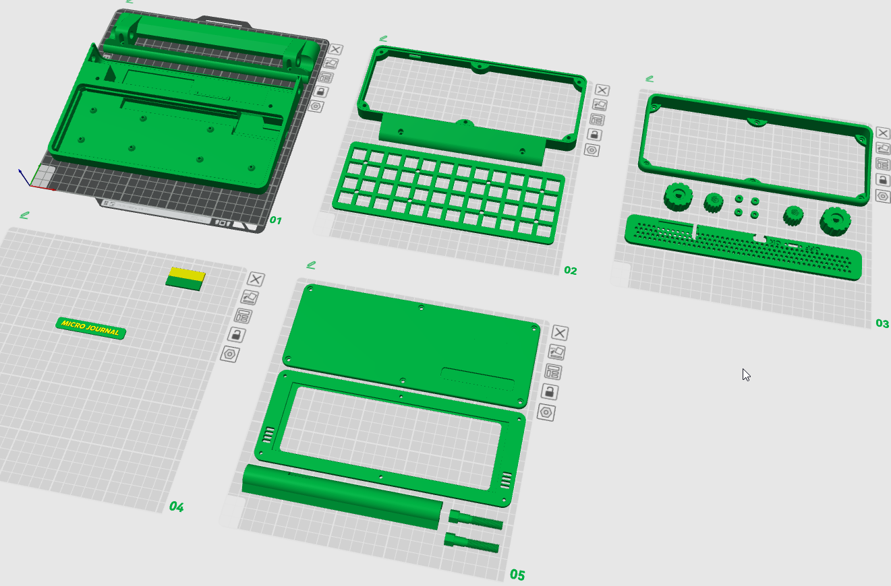

Once the prints are done. Remove the support materials from the print.

## Installing Heat Inserts

# Keyboard PCB

[Gerber File](https://github.com/unkyulee/micro-journal/tree/main/micro-journal-rev-6-one-piece/PCB) for the Keyboard PCB are available in the github.

You can print and order the PCB using the PCB manufacturing services. Typically I use JLCPCB or PCBWay for the order. They will ask for minimum quantify of 5 PCBs. So you will have extra PCB. These PCBs can be reused for other projects that needs mini mechanical keyboard, so, it's not too bad to have some extra laying around.

I think Keyboard PCB is the only component that can't be sourced from the market. Apart from the 3d printed materials. I have prepared a kit packed with PCB and diode and hotswappable sockets. If ordering from PCB manufacturer is found a bit difficult, you can use my tindie shop to order a PCB parts.

[Buy Keyboard PCB DIY Kit](https://www.tindie.com/products/unkyulee/micro-journal-diy-kit-keyboard-pcb/)

In order to assemble the keyboard PCB. You will need 48 pieces of the following items.

- Kailh Hot-swappable PCB socket Hot Plug
- IN4148 diode. Through hole size.

First step is to apply solder to the PCB, where hot socket will be placed. Place the tip of the soldering iron on top of squared copper pad on the PCB, then melt the solder on it. Apply it slightly more than usual. Until you feel like there is a little blob of solder on it. It will be easier to place the hot-swappable socket.

Once both slots are pre soldered. Place the hotswappable socket on top of it. There should be a hole that fits into the PCB, so should be quite easy to place them. Once there are on the right place. Place the soldering iron on the side where you have presoldered, you will feel the solder melting and the socket sinking into the hole. Try to use some wooden stick not to get burned. Apply the solder on both ends of the socket.

Do this for 48 times.

Now it is time to place the diodes. Place the diode head on the side where there are the sockets. Place the black line aligned with the directions that are printed on the PCB. Diodes has polarity. So, you must make sure that the direction that you place the diodes are correct.

When all diodes are in place. Solder their legs, and cut of to the excess legs.

Do this for 48 times.

# Preparing the Keyboard PCB

Prepare the wires with the length

- 16x 11cm wires

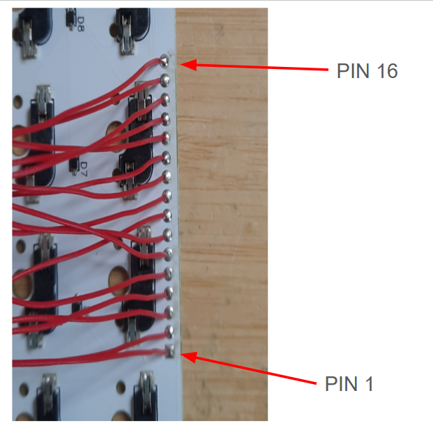

When soldring the wire on the keyboard PCB. It is important to determine which side you should put the wires in. You need to solder the wires on the side where hot swap sockets are soldered on. Please, refer to the picture above and make sure that you are orienting the side of the PCB correctly showing the hot swappable socket while you are soldering the wires on.

Note where the pin 1 starts on the PCB. Pin 1 is the square marked hole.

# Preparing EC11 Rotary Encoder

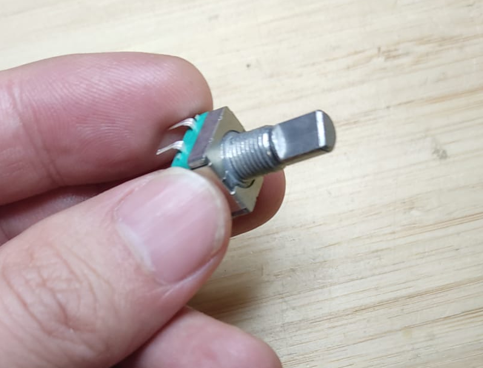

Rotary Encoder EC11 Looks like this. Make sure to user 15mm length and Half Handle shape.

Prepare the wires with the length

- 10x 18cm wires
- 2x Diode IN4148

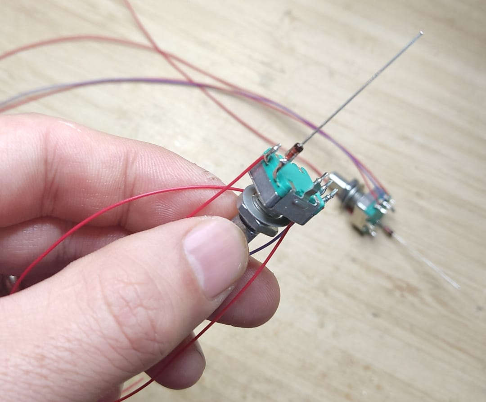

Rotary encoder EC11 have two pins for the button, and three pins for the encoder.

On the two pin side solder one wire and on the other pin solder on a DIODE. Note the black line side should be headed outwards.

On the three pin side. solder three wires. Middle pin is the ground. I have soldered a different color wire so that it is easy to detect in the midst of bunch of wires.

# Connecting Keyboard Controller to the Keyboard PCB

Keyboard controller is raspberry pi PICO. Be careful with the temperature of the soldering iron. Do no exceed 310 degrees celcius. Also, cover the pico controller with the masking tape to prevent heat issues. I have broken quite a few controller when applying too high temperature.

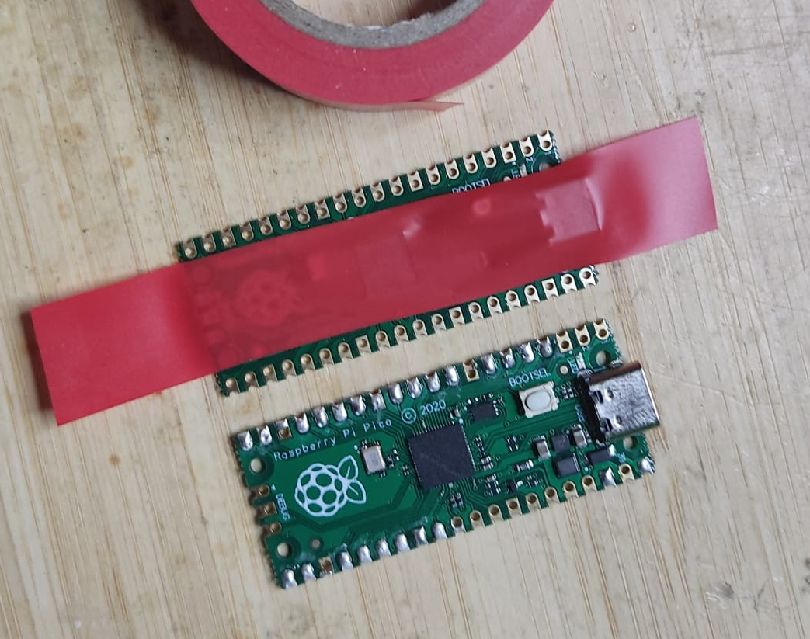

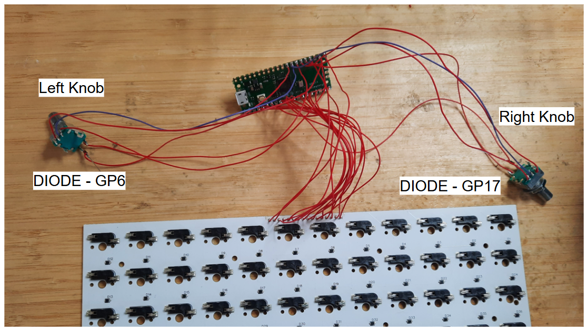

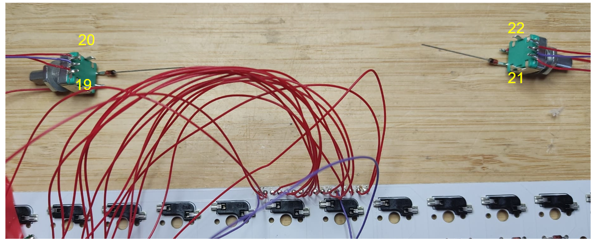

| Keyboard PIN No. | RP Pico PIN No. | EC11 Rotary            |
| ---------------- | --------------- | ---------------------- |
| 1                | 2               |                        |
| 2                | 3               |                        |
| 3                | 4               |                        |
| 4                | 5               |                        |
| 5                | 6               | Left Diode Leg         |
| 6                | 7               |                        |
| 7                | 8               |                        |
| 8                | 9               |                        |
| 9                | 10              |                        |
| 10               | 11              |                        |
| 11               | 12              |                        |
| 12               | 13              |                        |
| 13               | 14              |                        |
| 14               | 15              |                        |
| 15               | 16              |                        |
| 16               | 17              | Right Diode Leg        |
|                  | 18              | Merge Both Button Legs |
|                  | 19              | Left Rotary            |
|                  | 20              | Left Rotary            |
|                  | 21              | Right Rotary           |
|                  | GND             | Merge Both GND Legs    |
|                  | 22              | Right Rotary           |

# Preparing a Micro USB to Micro USB Cable

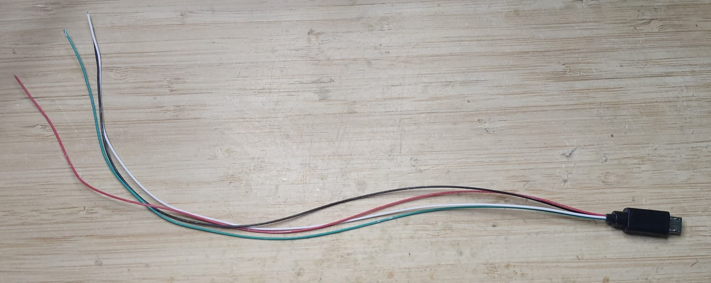

Prepare the USB cable as such. Strip off the black insulation.

Solder a Micro USB Connector

| USB Cable | Connector Pin from Left |
| --------- | ----------------------- |
| Red       | 0                       |
| White     | 1                       |
| Green     | 2                       |
| Black     | 3                       |

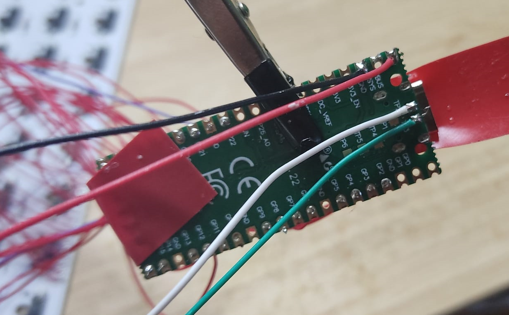

# Flash QMK-Vial Firmare on the Keyboard controller

Connect the keyboard controller to the PC. If everything went well... Keyboard controller will be recognized as a thumb drive. [Download](https://github.com/unkyulee/micro-journal/tree/main/micro-journal-rev-2-revamp/keyboard) the firmware from the github repository. Default firmware is "unkyulee_ortho_48_vial.uf2". Depending on the language configuration you may need to flash different firmware. Copy the file to the drive and the drive will disappear after few seconds. This means, the firmware has been successfully flashed. You can test the keyboard by re-plug the cable.

If the keyboard controller doesn't show up as a thumb drive, connect to the PC WHILE pressing down the reset button on the controller.

# USB-C Female Port as a Power Supply receiver 

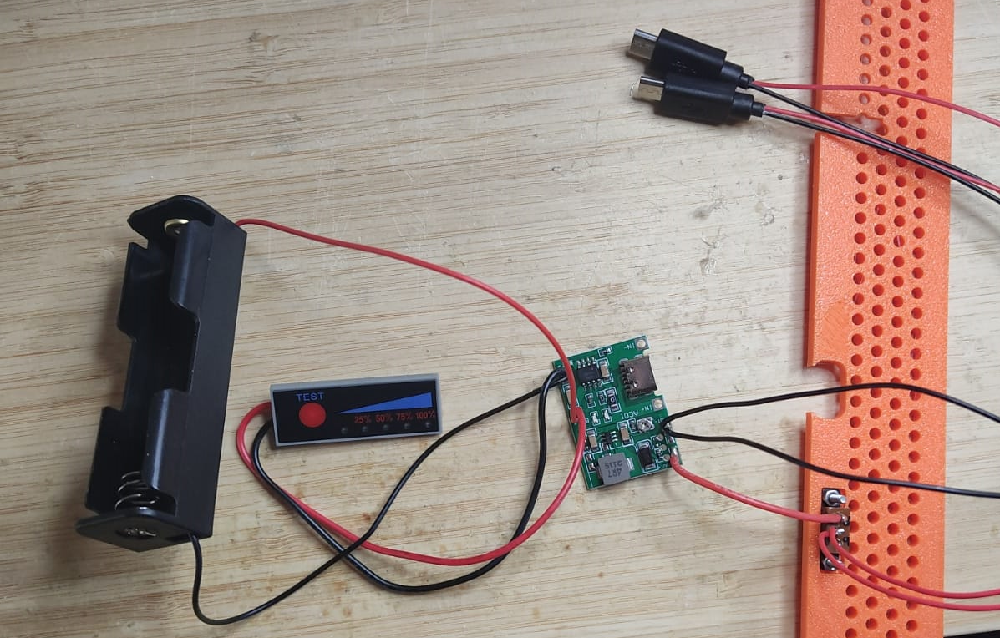

Merge Micro USB Cable (with 2 cable) and solder the cables to the USB-C Female Connector

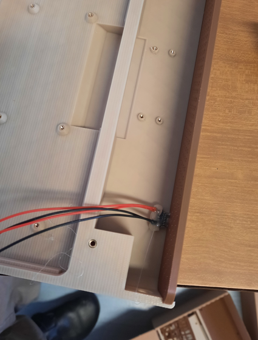

Use hot glue to place the connector on the bottom enclosure

# Display installation

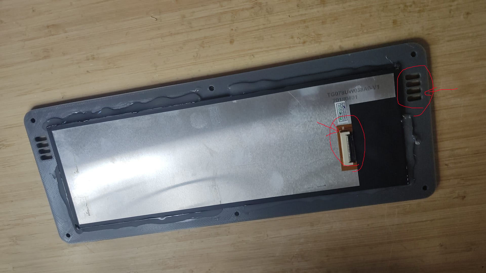

Glue the display to the display port. Make sure that the grill is facing upwards and the connector is oriented as the picture above. Let the glue dry.

Glue is a typical hobby hot glue. Heat the glue gun and pour the glue around the edges of the display.

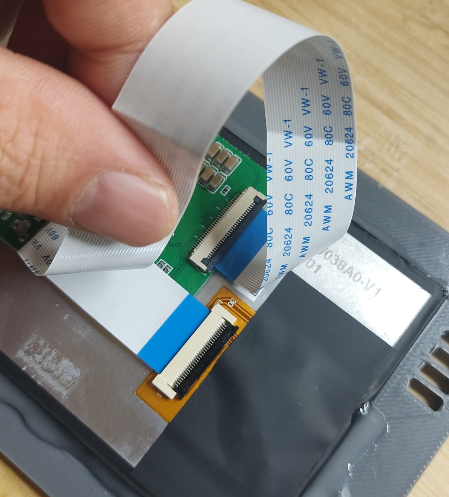

Connect the display connector with the display and the display controller.

Once the display and the display controller is well settled. You need to change the brightness of the display to the lowest. The power supply module and the battery capacity is not sufficient to drive the display with the higher brightness. Connect the display with the computer HDMI and also power the display with micro USB (5V) and then press the button on the display controller to change the brightness.

# Prepare the mini HDMI cable

This component is called FPV mini HDMI cable. It consists of two mini HDMI male connectors and a think film. Connect those elements together as the picture. Place the tape around the connector in order to prevent the cable being disconnected.

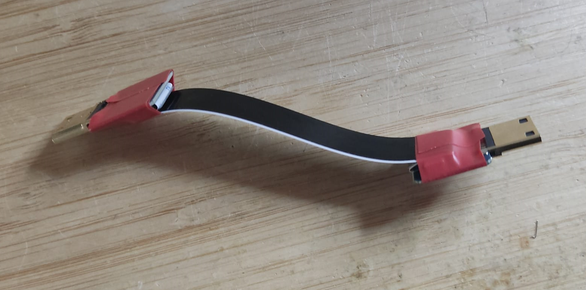

# Display Enclosure Assembly

Insert total of 12x M3 heated inserts into the display holder. You need to insert both back side and the front side.

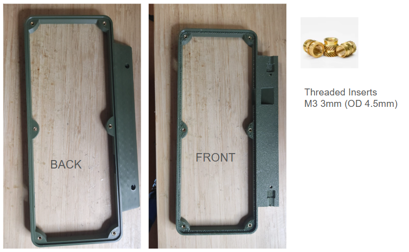

Once the heated inserts are in place. Then place the display panel on the front side of the holder. After that place the hood. Use 10 mm M3 Hex screws to fix the front display parts.

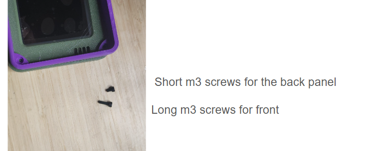

Leave the back panel open for now. It should be the last step to complete.

# Hinge Assembly

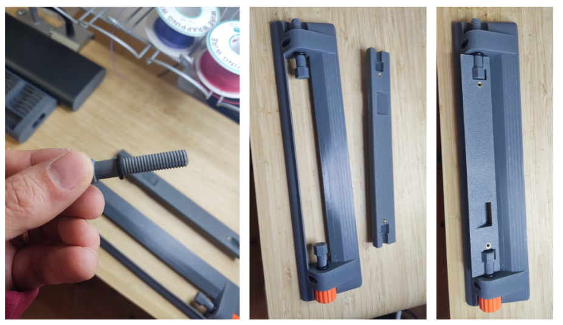

Place the rubber o-ring on the bolt

Place the bolt as the picture above in the bottom enclosure.

Place the display hinge below the bolt, and place the bolt tightly in the hole.

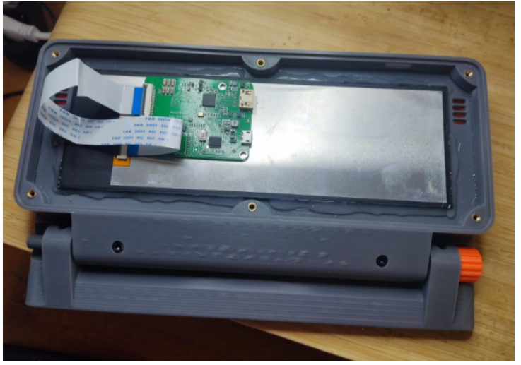

Place the display on top the the hinge and tighten it with m3 10 mm screw.

# Keyboard Components Assembly

Place the keyboard PCB and the controller as such in the picture.

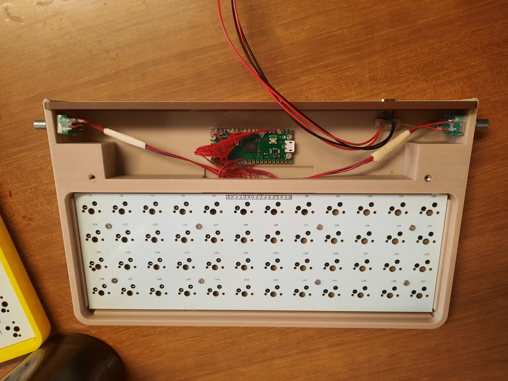

Tighten the knob on each side. 

# Finalize the wiring

Two cables with red/black wires, and one cable with 4 wries goes through the hole underneath the display. Power cables will be connected to the display controller and the raspberry pi. USB cable will be connected to the USB port of the raspberry pi

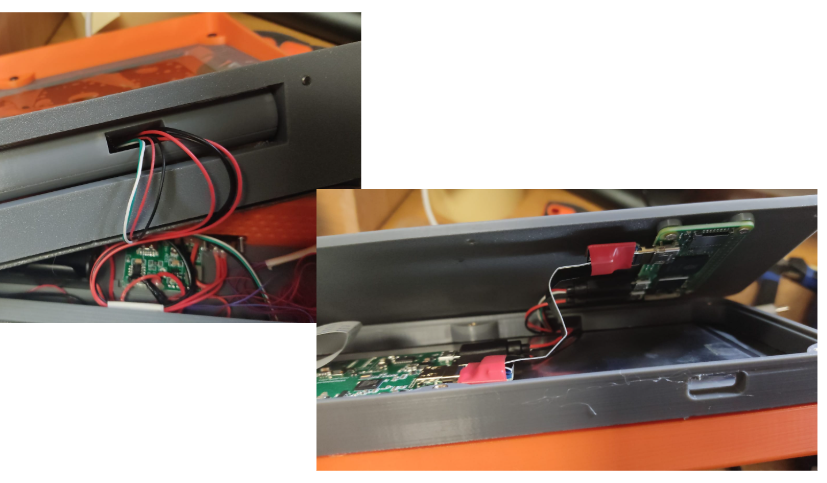

Make sure to remove the SD card from the rasbperry pi before closing the lid.

# Final Assembly

Use m3 20mm screws to close the enclosure. Be very careful not to clip any wires inside.

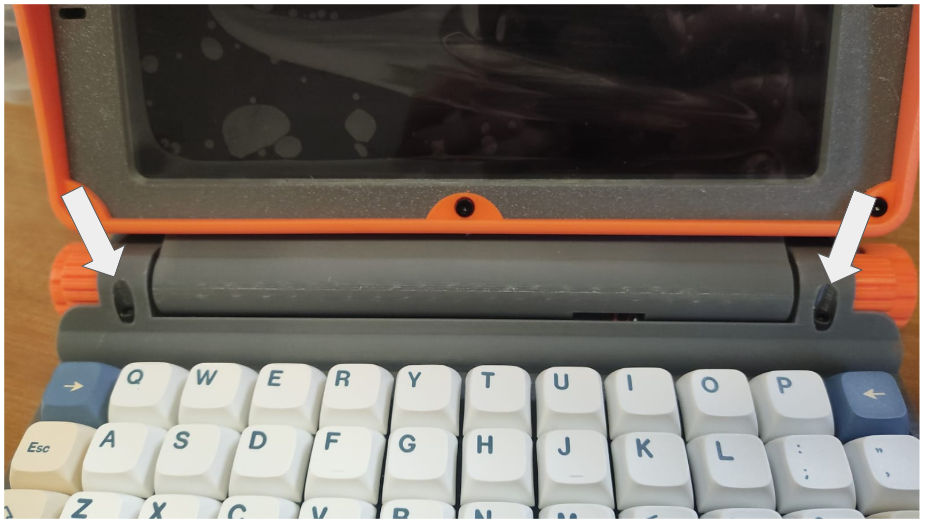

From this point, follow the quick start guide in order to complete the installation

https://github.com/unkyulee/micro-journal/blob/main/micro-journal-rev-2-revamp/quickstart.md
