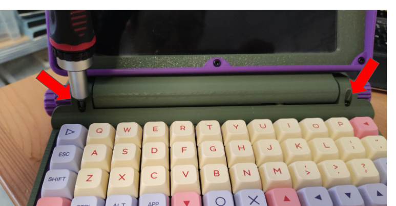
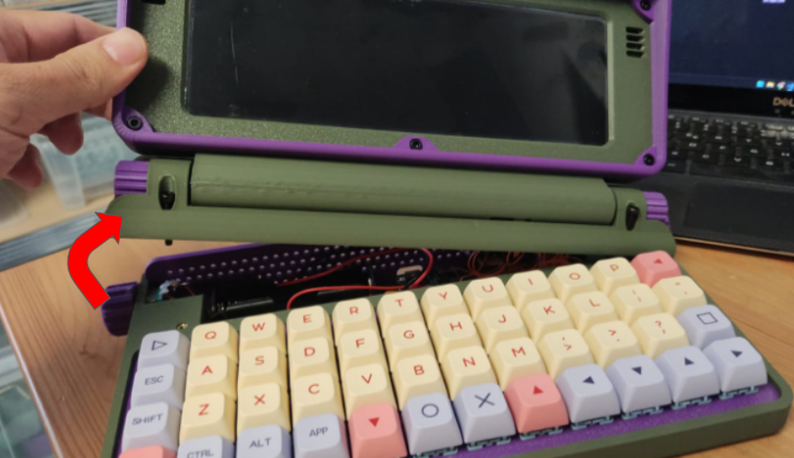
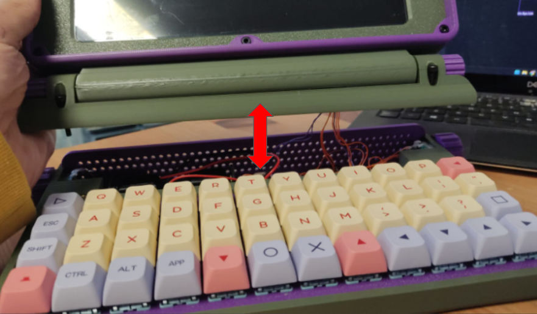
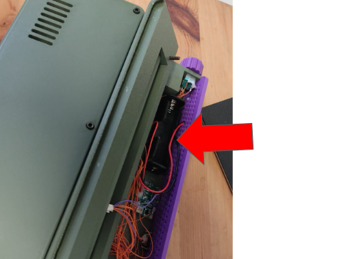
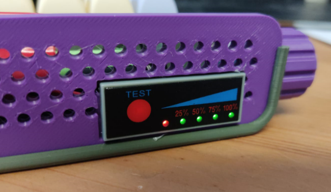
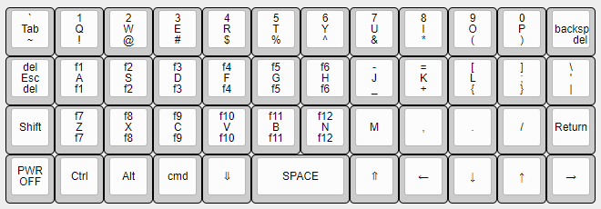
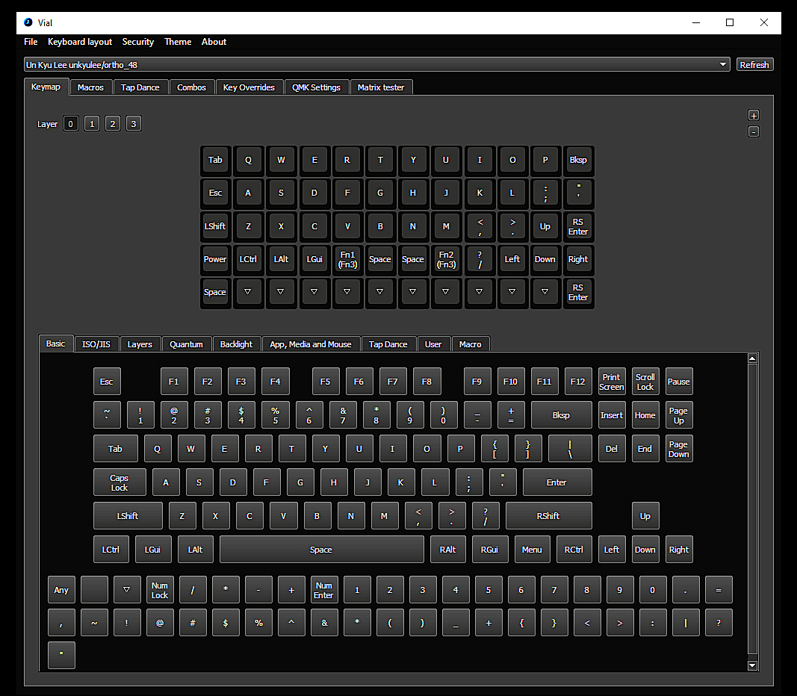

# Quick Start Guide - Micro Journal Rev.2.ReVamp

What you get out of the box is a writing device with a large screen, a mechanical keyboard that is well laid out for writers, a well-featured while still minimal text editor and a quick and easy method of sharing files with your PC. In other words, everything you need to write (and even edit if you want to, but your PC will always be better at that). You don't need any technical skills beyond following directions to set it up and you quickly have a Modern Dana. You should add an external battery to get longer life, but that's it.

# First things to do

When you receive the **Micro Journal Rev.2**, you'll need to install a battery before using it. Please follow the steps below to complete the setup:

1. **Buy 18650 Lithium ion battery**. Search with term "LiPo 18650" and should be able to find the fitting battery. Here is the link where battery is sourced typically from the users.

   * https://www.18650batterystore.com/products/samsung-30q
   * Send a message in tindie when you find some reliable places or links to buy the battery in your country.

2. **Install the battery**: The **Rev.2.Revamp** will not function without a battery. Ensure the battery is properly installed before attempting to power it on.

3. **Power on**: Once the battery is installed, you're ready to power on and begin using your device.

4. Peel off the plastic from the display: You may see some scratches or some bubbles on the display. That's part of packaging plastic supposed to be peeled off. It's up to you leave it or peel it. Don't force the peel, it should be smooth experience. 

# Battery Information

**Important: The Micro Journal Rev.2 requires a specific battery type, not AA or AAA batteries.**

Due to EU delivery restrictions, **the required battery is not included** in the package. To power your device, you will need to purchase an 18650 Lithium-ion battery separately. 

#### Battery Specifications:
- **Type:** 18650 Lithium-ion battery

You can find 18650 batteries online or at most electronics retailers. **Both flat top and button top batteries are compatible,** though users report that flat tops may fit better.

#### Important Tips for Battery Selection:
- **Capacity limit:** Be cautious of any battery that claims a capacity higher than 3300mAh—batteries with higher capacities in this form factor do not exist.

Please make sure to install the battery correctly before powering on your Micro Journal Rev.2 for the first time.

**Battery Life:** The internal battery will typically provide **2 to 3 hours** of usage. For extended writing sessions, it's recommended to connect a **portable battery pack**. 

- A **10,000 mAh power bank** will provide approximately **+10 hours** of usage. Every additional **1,000 mAh** translates to about **+1 hour** of writing time.

- https://www.amazon.com/dp/B0CZ9LH53B

- When buying power bank, make sure to have USB-A port avaialble. Some advanced chargers which supports only PD may not be able to charge. 

# Setup Micro SD Card

**Note: A pre-configured Micro SD card is included with the Micro Journal Rev.2. You do not need to buy or set it up. Refer to this guide only if you need to replace or reinstall the Micro SD card.**

The Micro Journal Rev.2 uses a Micro SD card for its Raspberry Pi Zero 2W computer. The card should have a capacity of **at least 4GB**. Using a faster card will improve boot times and overall performance.

While your Micro Journal Rev.2 ships with the Micro SD card already installed and configured, you may need to set up a new card in the future. For detailed instructions on how to do this, refer to the following guide:

[Raspberry Pi SD Card Setup How-To](./raspberrypi/readme.md)

Default configuration is designed to be user-friendly, allowing you to quickly get into writing mode without needing to learn complex Linux terminal commands.

### Note for Advanced Users

If you are familiar with Raspberry Pi and Linux configurations, feel free to customize the setup. The Micro Journal Rev.2 has no major constraints, though a minor display configuration may be necessary. Beyond that, you have the freedom to configure the Raspberry Pi as you prefer.

# First Setup

### Step 1. Open the Bottom Compartment and Install the Battery

There are two TORX T10H screws on either side in front of the hinge cylinders. They are long screws and you don't need to pull them all the way out. 

**Unscrew the two screws** located on the bottom compartment. Carefully lift the display section and place it on top of the keyboard. Be gentle—there are thin wires connected to the display, and pulling too hard may disconnect them.

**Lift from the left-hand side** to reduce the risk of damaging the wires.

**Be mindful of the wire length.** If you lift the display higher than shown above, you may risk damaging the wires.

Once lifted, gently rest the display on top of the keyboard. You will now see the battery holder.

### Installing the Battery

**Check the battery polarity carefully.** The battery holder has markings for positive (+) and negative (-) polarity. The spring side of the holder is the negative (-) side. Incorrect polarity can cause irreversible damage to the device.

**Install the 18650 battery,** ensuring you follow the correct polarity as shown on the battery holder.

**Double-check the installation** to ensure the battery is properly seated and the polarity is correct.

### Important Notes:

**Ensure the battery is fully charged** before use. LiPo batteries are not shipped fully charged. After installing the battery, connect the device to the charging port and leave it charging for at least 4 hours before first use.

**Battery installation safety:** Improper handling or installation can cause a fire. Be cautious and avoid over-tightening the screws. If the case doesn’t close easily, check that no cables are pinched, as this could lead to short circuits, damage, or fire hazards.

---

### Step 2. Power On

**Battery Life:** The internal battery will typically provide **2 to 3 hours** of usage. For extended writing sessions, it's recommended to connect a **portable battery pack**. 

**Once the battery is fully charged,** flick the power switch to the "ON" position. It will take around **30 to 50 seconds** for the Micro Journal to fully boot up and be ready for use.
 - to verify it's charging, look for a red light to shine through the grill in the back when you plug it in.
 - use a small mobile phone charger to charge the Rev2, because trying to use a bigger/more advanced charger (PD Charger) does not charge the Rev2. Typically usb-c to c cables won't be able to charge. Try with USB-A to C charging cables.

**Initial delay:**  Rev 2 is not instant on. It has to boot Linux first, since everything runs off that. If you haven't used Linux before, you will see a lot of incomprehensible text go whizzing by too fast to read. At first the text will fly by in the wrong direction on the screen and finally it will reorient. Just ignore everything until you are given the terminal dashboard.

**Check the SD card:** If the screen remains blank for too long, check for a green light near the micro SD card slot. This light indicates that the system is booting. If no green light appears, the SD card may not be properly installed. 

**When not booting** Power off, reinsert the SD card, and try again. If the issue persists, you may need to replace or reconfigure the SD card. 99% of the issues is related to SD card. Please, refer to this document when you need to setup the SD card.

[Raspberry Pi SD Card Setup How-To](./raspberrypi/readme.md)

---

### Step 3. Using the Dashboard

After the device has fully booted up, you will be greeted with the **Dashboard**. 

The dashboard is a kind of menu. It really is a crude file manager, but you have one folder (documents) and several scripts (files ending with .sh-- if you ever used DOS, think batch files) and you use the arrow keys to select among them, so it acts like a menu.

The documents folder is obviously where your files will be stored. You use the right arrow to move to the list of file names in that folder and hit enter to open any file in WordGrinder. To create a new file, you arrow down from the documents folder to the script called newfile. We will get to WordGrinder in a moment.

Use the **cursor keys** to navigate the options on the screen. You can press the **up** and **down** arrows to move between selections.
  
To create a new document, select **"newfile.sh"** and press **Enter** or the **right cursor key**. This will open **WordGrinder**, where you can begin typing.

To save your work in WordGrinder, press **Ctrl + S**, and to quit, press **Ctrl + Q**.

Here are some more commands that you can utilize in the dashboard.

https://gist.github.com/heroheman/aba73e47443340c35526755ef79647eb

---

### Step 4. WiFi Setup

To connect to a WiFi network, follow these steps:

1. Navigate to **"config.sh"** on the dashboard and press **Enter** to open the Raspberry Pi configuration screen.
2. Select **"1 System Options"** and press **Enter**.
3. Select **"S1 Wireless LAN"** and press **Enter**.
4. Enter the **SSID** (name) of your WiFi network.
5. Enter the **password** for your WiFi network.

---

### Step 5. Sharing Your Files

To share or access files from the Micro Journal, follow these steps:

1. Select **"share.sh"** from the dashboard and press **Enter**.
2. Wait a few seconds, and once you see the **IP address**, enter it in the web browser of your PC.

You will be greeted by a web interface where you can download, manage, and extract files stored in the **"documents"** folder on your Micro Journal.

---

### Step 6. Getting into Writing

You are now ready to go. Select **newfile.sh** on the dashboard and hit enter and you are in [WordGrinder](https://cowlark.com/wordgrinder/index.html). It will tell you it can't load your file (of course not... it's a new file so it doesn't exist yet). Hit space and you will be in the new, blank WordGrinder file. Quite honestly you can just type, and use **ctrl-s** to save and **ctrl-q** to quit. But WordGrinder has a complete menu system you access with the **Esc** key. Wordgrinder saves in a non-standard Text format. Luckily, WordGrinder has it's own export function to convert it to text or pdf.

All your files go into the documents folder, including the exported text and pdf files. You then get access to them on your computer by exiting WordGrinder and selecting the **share.sh** script. It will give you an ip address. Type that ip address into your browser on your computer (or, I assume, phone) and you will be able to see those files, open them and copy and paste.

You may need to be in the same wifi network as the Micro Journal in order to access the share features.

#### Note on WordGrinder Files:

WordGrinder saves files in its own format. To read or share them easily, you must export the file as either **PDF** or **Plain Text**. To export a document, press the **ESC** key while in WordGrinder to access the export options.

---

### Customizing the Keyboard Layout

You can customize the keyboard layout. Here are the steps that has been discovered by Hook.

So here is the method I have used and it works every time. I am working with a ThinkPad laptop with Windows 10. I assume it would be fine with Win 11 and Linux, but haven't tested.

In order to do this, you first need to download and install Vial. The download and user manual are available here:

get.vial.today/

Once Vial is installed, you are ready to begin.

1. Power down the Rev 2 by holding the bottom left hand power key on the keyboard. You can let go once the shutdown sequence begins.

2. Set the power switch on the back to off.

3. connect a USB cable from the USB port on the side of the keyboard (Micro-USB or USB-c) to your computer (USB-A in my case). That port is for the keyboard controller which Vial will access.

4. Open Vial on your computer. When it opens, you will see a screen that looks like this.

There are a lot of things you can do with Vial, but I have not explored them. You can do whatever you are comfortable with from the user manual, but I am only going to address the simple matter of changing the position of keys in the top layer of your keyboard.

The smaller keyboard at the top is what Vial is reading from the Rev 2. You will notice it shows 5 rows but you only have 4. So ignore the 5th row. All those triangles means there is nothing there anyway. You can see there are tabs to change to you other layers (shift, arrow up and arrow down) but I am only going to deal with this top layer, the normal map for pressing a key and getting a character or function.

Below is a larger set of keys. There are several tabs on this lower display allowing you to select from many kinds of keys. Everything you need is on the basic tab,. Until you learn more and are comfortable,if you don't know what something does, don't mess with it. Lol.

To change a key, select it in the top image of your ortholinear keyboard and then select what key you want to replace it with on the keys in the bottom half of the screen. Click on it and that key will replace the key you previously selected. As soon as you do it, that change is reflected in the Micro Journal's keyboard. That's my keyboard up top. You can see I have changed my arrow navigation keys to a more conventional D-Pad configuration.

5. When you are done, close Vial.

6. Disconnect the USB cord from the keyboard USB port on the Micro Journal.

That's it. When you start up the Micro Journal, you should have your key assignments that you changed.

### Powering Off

Pressing LOWER + POWER key for 3 seconds will turn off the raspberry pi. Then turn off the switch at the back in order to turn off the display.

# Credit

[Many of the texts and instructions provided by Hook from Flickr community](https://www.flickr.com/groups/alphasmart/discuss/72157721921183163)
