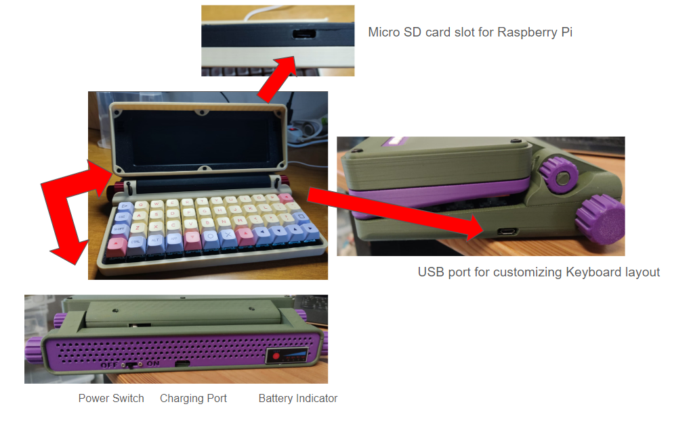
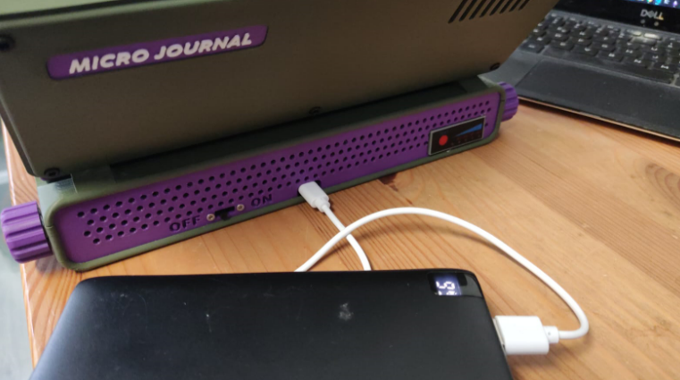
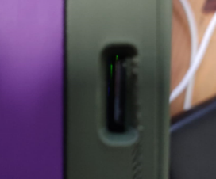
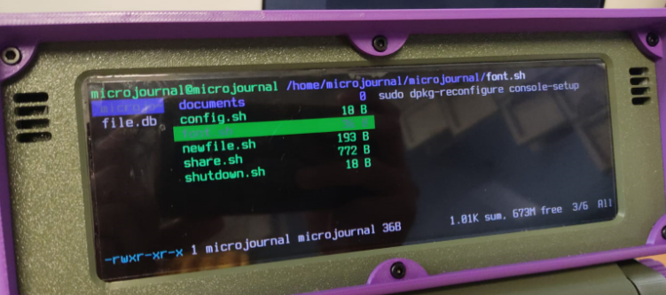
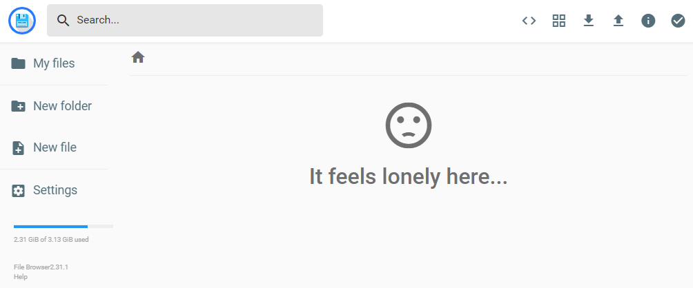

# Quick Start Guide - Micro Journal Rev.2.ReVamp

What you get out of the box is a writing device with a large screen, a mechanical keyboard that is well laid out for writers, a well-featured while still minimal text editor and a quick and easy method of sharing files with your PC. In other words, everything you need to write (and even edit if you want to, but your PC will always be better at that). You don't need any technical skills beyond following directions to set it up and you quickly have a Modern Dana. You should add an external battery to get longer life, but that's it.

* [Quick Start Guide for the build purchased before 2025-03-7](https://github.com/unkyulee/micro-journal/blob/8c094b73cb37829cf0c793ede7a3ebdd549733d1/micro-journal-rev-2-revamp/quickstart.md)

---

# Setup Micro SD Card

**Note: A pre-configured Micro SD card is included with the Micro Journal Rev.2. You do not need to buy or set it up. Refer to this guide only if you need to replace or reinstall the Micro SD card.**

The Micro Journal Rev.2 uses a Micro SD card for its Raspberry Pi Zero 2W computer. The card should have a capacity of **at least 4GB**. Using a faster card will improve boot times and overall performance.

While your Micro Journal Rev.2 ships with the Micro SD card already installed and configured, you may need to set up a new card in the future. For detailed instructions on how to do this, refer to the following guide:

[Raspberry Pi SD Card Setup How-To](./raspberrypi/readme.md)

Default configuration is designed to be user-friendly, allowing you to quickly get into writing mode without needing to learn complex Linux terminal commands.

### Note for Advanced Users

If you are familiar with Raspberry Pi and Linux configurations, feel free to customize the setup. The Micro Journal Rev.2 has no major constraints, though a minor display configuration may be necessary. Beyond that, you have the freedom to configure the Raspberry Pi as you prefer.

---

### Step 1. Supplying Power

There is a USB port at the back of the device. You can connect to a phone charger or a portable battery bank in order to supply the power to the Micro Journal. 

* PD chargers won't work. USB-c to c cables most likely won't be able to supply power. 
* Use old(er) phone chargers
* Per 1000 mAh of the battery it will provide additional 1 hour of usage. For example, 10,000 mAh battery bank should provide in the range of 10 hours of usage.   

**Initial delay:**  Rev 2 is not instant on. It has to boot Linux first, since everything runs off that. If you haven't used Linux before, you will see a lot of incomprehensible text go whizzing by too fast to read. At first the text will fly by in the wrong direction on the screen and finally it will reorient. Just ignore everything until you are given the terminal dashboard.

**Check the SD card:** If the screen remains blank for too long, check for a green light near the micro SD card slot. This light indicates that the system is booting. If no green light appears, the SD card may not be properly installed. 

**When not booting** Power off, reinsert the SD card, and try again. If the issue persists, you may need to replace or reconfigure the SD card. 99% of the issues is related to SD card. Please, refer to this document when you need to setup the SD card.

[Raspberry Pi SD Card Setup How-To](./raspberrypi/readme.md)

---

### Step 2. Using the Dashboard

After the device has fully booted up, you will be greeted with the **Dashboard**. 

The dashboard is a kind of menu. It really is a crude file manager, but you have one folder (documents) and several scripts (files ending with .sh-- if you ever used DOS, think batch files) and you use the arrow keys to select among them, so it acts like a menu.

The documents folder is obviously where your files will be stored. You use the right arrow to move to the list of file names in that folder and hit enter to open any file in WordGrinder. To create a new file, you arrow down from the documents folder to the script called newfile. We will get to WordGrinder in a moment.

Use the **cursor keys** to navigate the options on the screen. You can press the **up** and **down** arrows to move between selections.
  
To create a new document, select **"newfile.sh"** and press **Enter** or the **right cursor key**. This will open **WordGrinder**, where you can begin typing.

To save your work in WordGrinder, press **Ctrl + S**, and to quit, press **Ctrl + Q**.

Here are some more commands that you can utilize in the dashboard.

https://gist.github.com/heroheman/aba73e47443340c35526755ef79647eb

---

### Step 3. WiFi Setup

To connect to a WiFi network, follow these steps:

1. Navigate to **"config.sh"** on the dashboard and press **Enter** to open the Raspberry Pi configuration screen.
2. Select **"1 System Options"** and press **Enter**.
3. Select **"S1 Wireless LAN"** and press **Enter**.
4. Enter the **SSID** (name) of your WiFi network.
5. Enter the **password** for your WiFi network.

---

### Step 4. How to Transfer Your Files

To share or access files from the Micro Journal, follow these steps:

1. Select **"share.sh"** from the dashboard and press **Enter**.
2. Wait a few seconds, and once you see the **IP address**, enter it in the web browser of your PC.

You will be greeted by a web interface where you can download, manage, and extract files stored in the **"documents"** folder on your Micro Journal.

#### Using Dropbox to sync files

Detailed guide on how to setup Dropbox via Rclone written by HollerPots:

https://hoolis.net/posts/rev2.html

---

### Step 5. Getting into Writing

You are now ready to go. Select **newfile.sh** on the dashboard and hit enter and you are in [WordGrinder](https://cowlark.com/wordgrinder/index.html). It will tell you it can't load your file (of course not... it's a new file so it doesn't exist yet). Hit space and you will be in the new, blank WordGrinder file. Quite honestly you can just type, and use **ctrl-s** to save and **ctrl-q** to quit. But WordGrinder has a complete menu system you access with the **Esc** key. Wordgrinder saves in a non-standard Text format. Luckily, WordGrinder has it's own export function to convert it to text or pdf.

All your files go into the documents folder, including the exported text and pdf files. You then get access to them on your computer by exiting WordGrinder and selecting the **share.sh** script. It will give you an ip address. Type that ip address into your browser on your computer (or, I assume, phone) and you will be able to see those files, open them and copy and paste.

You may need to be in the same wifi network as the Micro Journal in order to access the share features.

#### Note on WordGrinder Files:

WordGrinder saves files in its own format. To read or share them easily, you must export the file as either **PDF** or **Plain Text**. To export a document, press the **ESC** key while in WordGrinder to access the export options.

#### Adding Spellcheck Feature 

https://www.reddit.com/r/writerDeck/comments/1ja4hdg/adding_spellcheck_feature_to_micro_journal_rev2/

Credit to: Misplaced_Fan_15

#### Using Micro as a editor

To get Micro added:

When Ranger pops up, hit q to quit.

Type "sudo systemctl start NetworkManager" to start up your network connection

Type "curl https://getmic.ro | bash"

It should download micro and you can access it by hitting q in ranger to access the command line and typing "./micro"

Git can be downloaded from the command line with "sudo apt-get install git" but setting that up is up to you. :)

https://www.reddit.com/r/writerDeck/comments/1hs2nrr/microjournal_rev_2_micro_text_editor_git_awesome/

---

### Customizing the Keyboard Layout

Please refer to the PDF document written by Hook:

https://github.com/unkyulee/micro-journal/blob/main/micro-journal-rev-2-revamp/keyboard/Hooks-Keymap-Guide.pdf

### Powering Off

Pressing LOWER + POWER key for 3 seconds will turn off the raspberry pi. Then turn off the switch at the back in order to turn off the display.

### Korean Language Support

In order to use Korean language, you simply need to reflash the image. Please, download the corresponding image and flash the SD card of your language of choice.

https://github.com/unkyulee/micro-journal-linux/releases

# User Manual by Hook

Written By Hook:

http://www.thewritekeys.com:8080/

This is a site dedicated to providing help links, reviews, documentation and even downloads to support writers using the various Writer Decks I own and have actual hands on experience with. I started out with an Alphasmart Neo 2 in 2007, when I bought it new shortly after it's release by Renaissance Learning. It revolutionized my writing experience, giving me a great deal of focus. It allowed me to draft 5 novels and a large collection of short stories. It was, and still is, a remarkable Writer Deck more than 10 years since it was discontinued.

# Carrying Case

https://www.reddit.com/r/writerDeck/comments/1hkx7ia/microjournal_rev2_case/

https://www.reddit.com/r/writerDeck/comments/1inrlnr/micro_journal_rev2_jurassic_park_analog_case/

# Credit

[Many of the texts and instructions provided by Hook from Flickr community](https://www.flickr.com/groups/alphasmart/discuss/72157721921183163)
