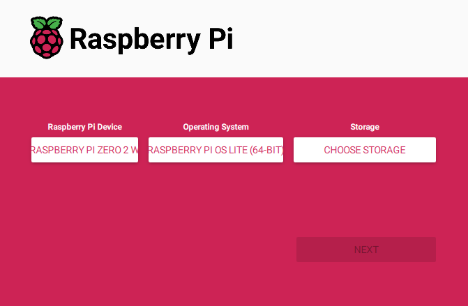

# Raspberry Pi Setup

Micro Journal Rev.2 ReVamp uses Raspberry Pi Zero 2W. This is a guide to setup the Raspberry Pi 2W for the Micro Journal.

You will need:

* Raspberry Pi Zero 2W
* Micro SD card minimum 4GB
* PC and Micro SD card reader
* Micro Jouran Rev.2.ReVamp
 

# Flash Raspberry Pi OS Lite



1) Download the "Raspberry Pi Image"

https://www.raspberrypi.com/software/


2) Insert the SD card to the computer

3) Choose Device: Raspberry Pi Zero 2W

4) Choose OS: Raspberry Pi OS (other) -> Raspberry Pi OS Lite (64-bit)

5) Choose Storage: Specify the Micro SD card

6) Setup wifi connection and credentials 

7) Flash the micro SD card

First boot will take quite some time and the screen may remain blank for 1 ~ 2 minutes. Be patient and wait for it to complete. If it takes more than 10 minutes. Then make sure that the battery is fully charged before proceeding this operation.


# Rotate screen

When initially boot with default setup. Screen will be displayed in portrait mode. Need to edit cmdline.txt inside the micro SD card to make it landscape mode.

1) Insert the micro SD card into the PC using sd card reader

2) Open cmdline.txt with a text editor

3) Add "video" parameter to the cmdline

```
video=HDMI-A-1:400x1280M@60,rotate=90 
```

complete cmdline.txt would look like this
```
console=serial0,115200 console=tty1 root=PARTUUID=xxxxxxx-xx rootfstype=ext4 fsck.repair=yes rootwait
```

4) Save the file and eject the micro SD card

5) Insert the micro SD card to the Micro Jouranl and verify if the screen is displayed in correct orientation


# Auto Login

Default credentials when installed 

login: microjournal
password: microjournal

It is possible to skip this process and boot into the system when powered on. This is an optional step in order to reduce the steps to get into writing immediately. This will deactivate security and privacy for the system so, it is an optional step for those who prefer.

```bash
sudo raspi-config

# System Options -> Boot / Auto Login -> Console Autologin
```


# Setup Wifi Connection

```bash
sudo raspi-config

# System Options -> Wireless LAN
# Follow the Steps to enable WiFi

# once all completed press ESC to back to console
# reboot the system
```

# Update the system 

```bash
# run the following to update the system
sudo apt update
sudo apt upgrade
```


# Setup Ranger as boot up as file manager

```bash
sudo apt install ranger
mkdir ~/microjournal
mkdir ~/microjournal/documents
nano ~/.bashrc
```

Add the following line at the last of the file

```bash
# Startup app - ranger
cd ~/microjournal
ranger

# Ctrl + s then Ctrl + x to close nano
```

```bash
# file extension association
# at least run once ranger
nano ~/.config/ranger/rifle.conf
```

```bash
# content of the rifle.conf
ext wg = wordgrinder "$@"
ext sh = bash "$@"
```


# Install Word Grider

```bash
sudo apt install wordgrinder
```


# Setup File Explorer Service

```bash
# download
curl -fsSL https://raw.githubusercontent.com/filebrowser/get/master/get.sh | bash

# Create share.sh 
nano ~/microjournal/share.sh
```

```bash
#!/bin/bash

# Function to run when Ctrl + C (SIGINT) is detected
cleanup() {
    echo "Disabling NetworkManager.service..."
    sudo systemctl stop NetworkManager.service
    echo "NetworkManager.service disabled."
    exit 0
}

# Trap Ctrl + C (SIGINT) and call the cleanup function
trap cleanup SIGINT

sudo systemctl start NetworkManager.service
echo "########################################"
echo "Open http://$(hostname -I | awk '{print $1}'):8080 in your web browser"
echo "Ctrl + C to exit"
echo "########################################"

# Start the file browser, suppressing output
filebrowser -r ~/microjournal/documents -a 0.0.0.0 --noauth -d ~/file.db > /dev/null 2>&1

# Wait indefinitely until Ctrl + C is pressed
while true; do
    sleep 1
done
```

```bash
chmod +x ~/microjournal/share.sh
```

# Changing the font size

```bash
nano ~/microjournal/font.sh
```

```
sudo dpkg-reconfigure console-setup
```

```bash
chmod +x ~/microjournal/font.sh
```


# Enter Raspi Config Script

```bash
nano ~/microjournal/config.sh
```

```config.sh
sudo systemctl start NetworkManager.service
sudo raspi-config
sudo systemctl stop NetworkManager.service
```

```bash
chmod +x ~/microjournal/config.sh
```


# Create new file

```bash
nano ~/microjournal/newfile.sh
```

```newfile.sh
#!/bin/bash

# Get the current date and time in the format YYYY.MM.DD-HHMM
filename=$(date +"%Y.%m.%d-%H%M.wg")

# Run WordGrinder with the generated filename
wordgrinder "~/microjournal/documents/$filename"
```

```bash
chmod +x ~/microjournal/newfile.sh
```


# Shutdown script

```bash
nano ~/microjournal/shutdown.sh
```

```shudown.sh
sudo shutdown now
```

```bash
chmod +x ~/microjournal/shutdown.sh
```


# Improving the boot time

Analyze which process take long time and disable them

```bash
systemd-analyze blame
```

These are my go to disable options

```bash
sudo systemctl disable NetworkManager-wait-online.service
sudo systemctl disable apt-daily.service
sudo systemctl disable apt-daily-upgrade.service
sudo systemctl disable apt-daily.timer
sudo systemctl disable apt-daily-upgrade.timer
sudo systemctl disable ModemManager.service
sudo systemctl disable bluetooth.service
sudo systemctl disable networking.service
sudo systemctl disable NetworkManager.service
``` 

can even disable some cores in order save more power

Edit the /boot/cmdline .txt file and added maxcpus=1 after console=tty1, then saved the file and reboot.
