# Micro Journal Rev.2.ReVamp: Is this a digital TypeWriter?

I initially never wanted to build a foldable design. The complexity of having many moving parts, coupled with my lack of mechanical engineering knowledge, made it daunting. I worried about the durability of moving parts and feared that the design would look bulky and impractical. 

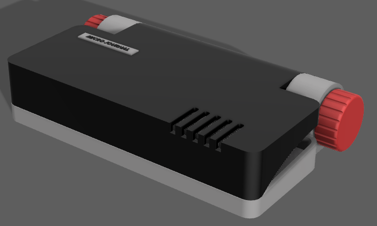

My early attempts looked quite like a thick bible adding features like mechanical keyboard switches, screens, and control boards only complicated things further. My previous version, Revision 1, ended up looking like a box where grandmothers might keep their stashes. No offense intended. It wasn't something you'd want to take out to a café.

# A Mother of Twins

Even though I had plenty of excuses to avoid any foldable design requests and was focusing on my next iterations, one day I received a private message asking for a foldable design. I gently declined, saying I would consider it in the future.

Then she added, "I have twins."

I have one son and a daughter, who is 4 years old and 7, has a knack for breaking things. They sometimes visits my office between the babysitter and dinner, staying for just 10 minutes. The next day, I often find things missing, doors locked in odd ways, and objects not where they should be.

I couldn't turn away from that request.

She needed protection for her device, and Revision 6 had a solid foundation. However, the open design without a cover wasn't practical. It would break immediately when exposed to the boys. It needed a cover, ideally foldable. While I might not be able to create a design as rugged as I'd like, I understand the need for a foldable design to provide at least a first layer of protection.

Thus began my journey into foldable design. As I've mentioned before, I wasn't confident that I could create a functional or attractive design.

# Design Inspirations

While I was procrastinating and battling with my ego, which kept telling me I couldn't design a foldable device and should just give up, I came across a Reddit post that was irresistibly cute. It made me go 'awww' and sparked a strong urge to create something similar. That was the turning point. I had to start this journey.

https://www.reddit.com/r/writerDeck/comments/1ec00rp/a_cute_hanoian_corner_with_my_pencil_case_deck/

Since then, the [writerDeck](https://www.reddit.com/r/writerDeck) community was brimming with foldable designs. Making me feel like maybe I could do it too.

I revisited [copilot](https://copilot.microsoft.com/) to ask questions about integrating foldable designs with typewriter and displays. Unfortunately, the image generation wasn't working well. Neither it didn't generate images or they were a bit distant to what I actually asked.

However, I had some earlier-generated images to contemplate, and I remembered exploring the idea before. This is the vision I wanted to achieve:

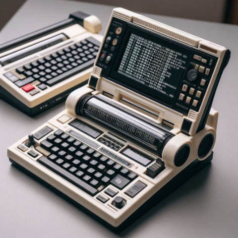

A display mounted on top of large hinges, with the classic typewriter aesthetic of dual hinges. Though I'm no typewriter expert, the repeated generation of two hinges seemed to be a key visual element connecting to the typewriter style.

The Olivetti 35i caught my eye with its beauty and simplicity. Olivetti products have always impressed me with their design—simple, functional, and aesthetically pleasing.

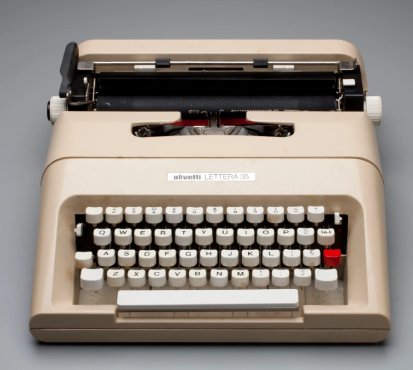

https://collection.powerhouse.com.au/object/462408

The incline of the keys, the bright red accent key, and the smooth, rounded edges were particularly striking. It's a testament to how a single color accent can make a strong impact in a small space.

I also remember encountering the 1969 Olympia SM9 typewriter at a photo shoot location. The black base with white accents and the red spot for an accent left a lasting impression. The color contrast and branding details were perfect.

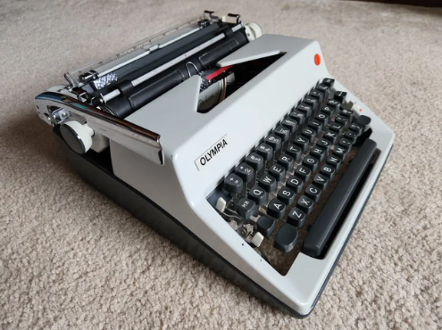

https://www.typewriters101.com/store/p744/1969_Olympia_SM9.html

Inspired by these designs, I finally sat down and began sketching out circles and rectangles, ready to bring my vision to life.

# Design in Reality

I started by designing the keyboard parts using the dimensions from a previous iteration. I measured the display size and depth, as well as the Raspberry Pi dimensions, to figure out the appropriate thickness for the display section.

Next, I placed the hinges to connect the display and keyboard, envisioning one large circular hinge. In my head, it didn't seem so bad. But when the device opened up, the hinges looked hideous, and I couldn't figure out how the wires were supposed to pass through.

So........ Ta-da!

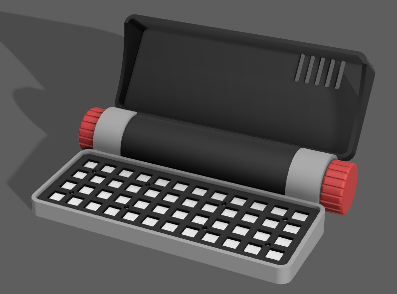

Reality was harsh. It looked awful. No one would find this design appealing. I actually sent this design to Vivian, the muse of rev.6 design, and he stopped replying to my messages. 

I wanted the hinge to be large to ensure a stable connection. I didn't want to rely on off-the-shelf hinge parts from Amazon or AliExpress. Instead, I aimed to integrate mechanical hinges into the design, so I could control the stiffness without relying on external sources. This was a crucial component in making the foldable design work.

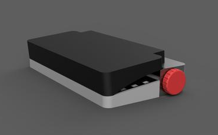

Where do I go from here? Well, I decided to iterate with small changes over time, without worrying too much about immediate results. I reduced the size of the hinges in subsequent versions. So, that big hinge problem is resolved. Then, I also inclined the display slightly to follow the height of the keycaps, rather than keeping everything at maximum height. This way, the final product wouldn't look like just another box. Also, an effort to make it less thicker.

I went through several iterations, but I couldn't abandon the large hinge. It was an important design statement for me. I wanted the device to look more like a typewriter than a computer, so I kept the hinge on the side, without really thinking about its function. A small hinge underneath the display was already holding it in place, so why add another?

After several more tweaks, I refined the aesthetics by adding smoother edges and adjusting the hinge placement. I made sure the display connected logically to the bottom compartment, giving the assembly a cohesive sense.

It started to look ok. 

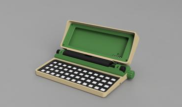

The color scheme was chosen by my daughter—we decided to call it "Jurassic Park."

However, I wasn't thrilled with the front. This is the part users will be looking at the most, and it didn't convey much. It just looked like a regular computer. And if that's the case, why not just buy a pre-made laptop?

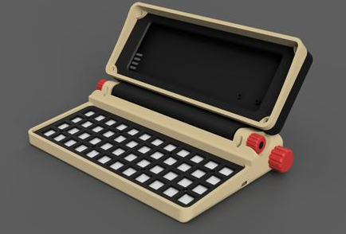

So, I gave the front a "hood" look, splitting it from the display body and adding contrasting colors. This added some layers, breaking away from the boxy aesthetic.

At this stage, I started placing the electronic components inside.

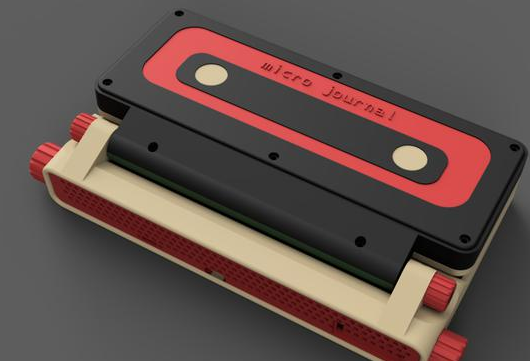

I also tried adding some design elements to the top panel to make it look like a cassette tape. The idea was cool, but in the end, it didn't make much sense and had no functional purpose. It was purely decorative, and I couldn't justify its inclusion. So, it didn't make it to the final version, even though I printed it out and took a photo.

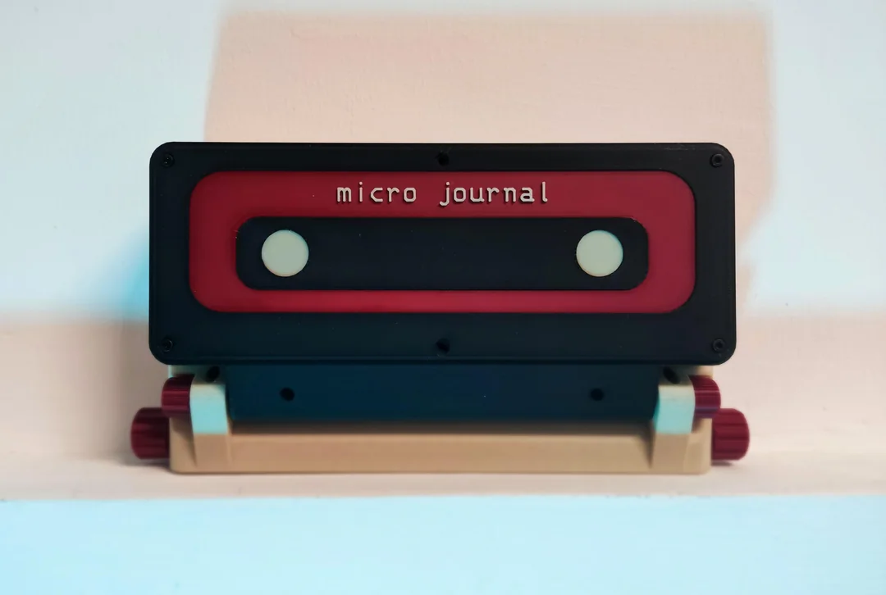

After my daughter gave it a firm "no." Also, the mother of twins, kinda said "no.", also my wife said, "meh...". I don't know. Don't I have backbones? A real designer with strong philosophy would have pushed to the release! The cassette tape design didn't make the final cut. I have silently deleted it from the timeline.

# Hinges

I wanted to dive into the hinge design process, as it's a critical element that could shape future designs. The basic mechanism I developed relies on friction using a rubber o-ring. This o-ring is positioned between the display and the bottom compartment. There's a slight gap between the display hinge and the bottom compartment hinge—just enough to squeeze in the o-ring. This creates friction, which holds the parts in place. The tighter the fit, the stronger the hinge becomes.

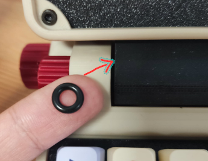

I realized that this could also be achieved with a rubber band wrapped around the same area, creating a similar effect. This makes the hinge design more accessible for DIY enthusiasts, as sourcing a rubber band or o-ring is relatively easy. It's not going to have the sleek, polished look of a commercial hinge, but for those building their own projects, it's a practical solution.

The hinge works well to hold the display in place and has the added benefit of making the top close slowly, preventing it from clashing shut each time you close the device.

# Electrical Components

A key component of the build revolves around the keyboard. It takes up a significant amount of space and leaves a strong first impression. The layout is still a 48-key ortholinear design, which might raise a few eyebrows. This is likely the smallest usable keyboard you can get with full-sized mechanical switches. While it may not be as familiar as a conventional layout, it's on the borderline of being functional for many scenarios.

This entire journey began with a desire to create the smallest yet usable cyberDeck. This device scratches that itch perfectly.

Another unique feature is the ultrawide screen. Its proportions complement the keyboard, with a well-balanced margin that makes it feel like the display was designed specifically for this layout. That's one of the reasons I opted for such a wide aspect ratio.

Although the display isn't the most practical for certain tasks. Especially when vertical space is needed. It's ideal for distraction-free writing. You can spread text horizontally without constant word wrapping and comfortably view entire paragraphs. There's just enough space for a decent chunk of text.

The knobs are rotary encoders connected to the keyboard. They function like a mouse wheel and also have a clickable feature, acting as keys. The knobs serve as cursor keys for navigating up, down, left, and right. When pressed, they act as enter and space keys. They make moving through text and finding exact spots to edit much smoother, avoiding the need to repeatedly press arrow keys. Would a mouse be more efficient? Maybe. But can a mouse look as cool as a knob? Well, that's what she sai...

Moving on.

# Sharing and Sync Features

One of the key features of the Micro Journal is its easy file sharing and synchronization. In earlier iterations, this was simple to implement since it only involved editing a single text file. Syncing one file was no big deal.

However, with the Raspberry Pi 2W running a full Linux environment, the situation changes. There could be multiple files, and users might want different storage solutions. Saving to a personal NAS, network folders, or just extracting files without relying on external systems or the cloud.

The challenge is that all of these options are possible, but what should be the default? With so many choices, it's hard to settle on just one. Limiting it to a single method feels restrictive.

That's when I thought, why not let users access a simple file explorer from their computer? This way, they could download files or make quick edits on their PC. The text wouldn't be locked inside the device. It could be easily shared or redirected to other systems.

I ended up integrating an open-source project called "File Browser." It sets up a server, allowing users to access their files through a web browser. The server only runs when the user requests it and closes once the task is complete. This approach is ideal for users who can't connect to cloud services due to security restrictions at work.

https://github.com/filebrowser/filebrowser

# Linux Terminal for ... people?

When someone picks up the Micro Journal and turns it on, I want them to figure out how to start writing without too much hassle. Maybe there will be a few missteps at first, but ultimately, they should be able to get into the writing process with minimal effort. While the Linux environment offers many possibilities, the core idea for this device, as a writerDeck, is that it should be easy to use for writing.

The Linux terminal can be a daunting place, especially for newcomers. You need to know several commands just to get started. Even though I've used it for years in a work setting, I still don't feel completely comfortable with it, and I'm sure many others feel the same.

That's why I started thinking about a simple dashboard-like application with a few buttons to create new files, open recent ones, and share files. It sounds simple, but when I looked for existing Linux solutions, I didn't find much. Terminal user interfaces (TUIs) usually need to be built case by case, and that seemed like an overwhelming task.

Then one day, it hit me. Why not use a file management system like Midnight Commander or Ranger? I could set up a few scripts in the home folder that users can navigate to with the arrow keys. By pressing Enter, the script would perform simple tasks like shutting down, creating a new file, or sharing files.

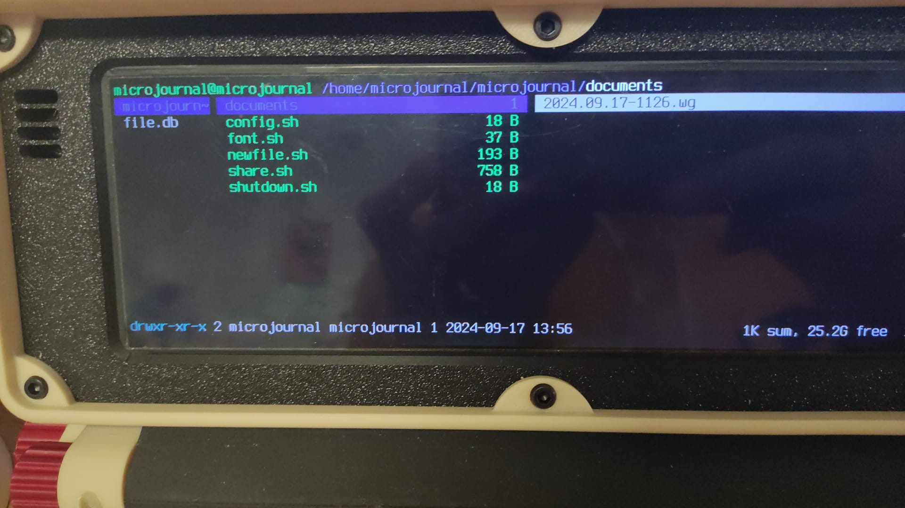

So, I installed Ranger and made it the default app to run at boot. I placed a few key scripts, and voilà! It's now a functional writing environment that's simple enough to use as a writerDeck.

# Choosing Word Grinder as an Editor

From the feedback I received on earlier iterations, I realized that writing requires more than just displaying text on a screen. Features like word counts, word wrapping, highlighting, copy-pasting, and editing are essential to creating a complete writing experience.

In previous versions, I used Nano because it was simple and easy to work with. However, I soon ran into issues, especially with word wrapping. When writing longer paragraphs, the text would flip around a lot, making it difficult to keep track of where I was.

So, I started looking for a solution developed by someone who truly understands the needs of a writer.

That's when I found WordGrinder.

WordGrinder is a word processor built for the Linux terminal, and it's a perfect fit for the Micro Journal. It's incredibly intuitive and easy to use, despite being terminal-based. The best part? It was written by a writer, for writers. That makes it an ideal choice for the default writing software—tailored to the needs of those who know what writing really involves.

# Conclusion

Returning to the "Mother of Twins," she truly helped me understand the necessity of a foldable design. It's always a pleasure to work with someone who has clear needs and can articulate their intentions so well. She became a real muse for this project, guiding me with her calm and thoughtful approach. I'm still impressed by how quickly she convinced me to pursue a foldable design.

This build has been far from easy. Between the moving parts, hinges, and power supply challenges, I've had to confront my limited 3D design skills and lack of electronics experience. It felt like tackling a long-overdue assignment, but now I can finally say I've built something that moves!

The build isn't fully released yet (at the moment of writing this). I've only shared a preview video of the unfinished design, but it's already attracted more attention than I anticipated, getting picked up by various sources. I think it's the mix of conventional computer aesthetics with quirky touches that's resonating with people.

I do want to emphasize that this project is focused on distraction-free writing, and that remains my core intention.

That said, it's a Raspberry Pi-powered computer with a keyboard, so there's a lot of potential for other applications. I'm excited to see what possibilities emerge from this build.

