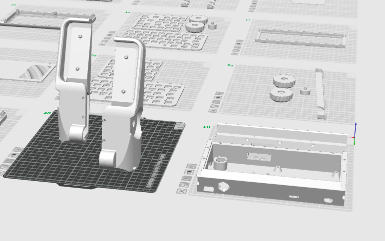
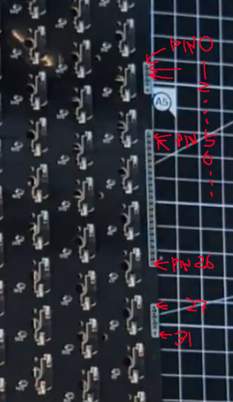

# Micro Journal Rev.2.1. Build Guide

This guide is for building the **Micro Journal Rev.2.1: cyberDeck**, allowing you to assemble one on your own. It provides detailed information for troubleshooting if any parts of the build encounter issues and serves as a resource for those curious about the construction of the Micro Journal Rev.2.ReVamp.

- [Video Guide](https://youtu.be/-GmhE2VCncA)

To complete this build, basic soldering skills are necessary, though advanced skills aren't required. All components are through-hole types, so with some practice, you'll be able to achieve the level needed.

You'll also need access to 3D printed parts to complete the build. Many 3D printing services are available, but if you'd prefer to assemble your own and are having difficulty sourcing components, feel free to contact me. I'll do my best to help provide a DIY kit.

- Build Time: 4 ~ 6 hours
- Basic level of soldering is required to complete the build

# Bill of Materials

All the components are easily obtainable from Amazon, or Aliexpress. You should be able to identify the exact item looking at the build guide video. 
One component may not come in easily is the Keyboard PCB. There is a link to the  where you can buy just one or low quanity directly from the supplier.

Most components are readily available from platforms such as Amazon or AliExpress. You should be able to identify the exact items by referring to the build guide video. One component that may be slightly more difficult to source is the [keyboard PCB](https://www.elecrow.com/micro-journal-diy-kit-68-keys-keyboard-pcb.html). You can purchase it [directly from the supplier](https://www.elecrow.com/micro-journal-diy-kit-68-keys-keyboard-pcb.html), even in small quantities

| # | Part | Qty |
|---|------|-----|
| 1 | [Wisecoco 7.84" 1280x400 LCD Display](https://www.amazon.com/wisecoco-Secondary-Stretched-Temperature-Monitoring/dp/B0BXL2Q53Y) | 1 |
| 2 | [Rubber O-ring 18x13.2x2.4mm](https://www.amazon.com/uxcell-Rings-Nitrile-Rubber-Diameter/dp/B07JHNDXCX) | 1 |
| 3 | [HDMI Cable 25cm](https://www.amazon.com/UVOOI-HDMI-Cable/dp/B0B5JM7Y4G) | 1 |
| 4 | [Raspberry Pi Zero 2W](https://www.amazon.com/Raspberry-Zero-Bluetooth-RPi-2W/dp/B09LH5SBPS) | 1 |
| 5 | [Raspberry Pi Pico (RP2040)](https://www.amazon.com/Raspberry-Pi-Pico/dp/B09KVB8LVR) | 1 |
| 6 | [Micro SD Card (min 8GB)](https://www.amazon.com/SanDisk-microSD-High-Capacity-microSDHC/dp/B00488G6P8) | 1 |
| 7 | [68 Keyboard PCB](https://www.elecrow.com/micro-journal-diy-kit-68-keys-keyboard-pcb.html) | 1 |
| 8 | [EC11 15mm Half Handle Rotary Encoder](https://www.amazon.com/Position-Degree-Rotary-Encoder-Button/dp/B0GRNSTXFC) | 2 |
| 9 | [18650 Battery Shield w/ 4-Slot Holder](https://www.amazon.com/diymore-Battery-Holder-Charging-Holders/dp/B0CBMQ8PZH) | 1 |
| 10 | Micro USB Hub with Power Input | 1 |
| 11 | [Micro USB 2-PIN Male Pigtail Cable](https://www.amazon.com/Jienk-Micro-Male-Pigtail-Cable/dp/B0D9LJ1J4R) | 2 |
| 12 | [USB 2-PIN Male Cable](https://www.amazon.com/Jienk-Micro-Male-Pigtail-Cable/dp/B0D9LJ1J4R) | 1 |
| 13 | [SPST Snap-in Rocker Switch 2-Pin 19mm](https://www.amazon.com/YXQ-SPST-Rocker-Switch-5Pieces/dp/B01DZ8BHBE) | 1 |
| 14 | [DIN 912 M3 Hex Socket Screw — 5mm](https://www.amazon.com/M3-3mm-0-50-Stainless-MonsterBolts/dp/B078L44PWY) | 4+ |
| 15 | [DIN 912 M3 Hex Socket Screw — 10mm](https://www.amazon.com/Socket-Screw-M3-0-5-Metric-Quantity/dp/B07CPMTDPV) | 4+ |
| 16 | [DIN 912 M3 Hex Socket Screw — 50mm](https://www.amazon.com/Socket-Screw-M3-0-5-Metric-Quantity/dp/B07CPGYJHG) | 4+ |
| 17 | [DIN 7046 M2 Phillips Pan Head Screw — 5mm](https://www.amazon.com/M2-0-4X10-Metric-Phillips-Machine-Thread/dp/B01ILZX2VO) | 8+ |
| 18 | [M3 Heated Inserts (OD 4.5mm, L 3mm)](https://www.amazon.com/Threaded-Inserts-Embedment-Printing-Automotive/dp/B0CH32W3W5) | 10+ |
| 19 | [M2 Heated Inserts (OD 3.2mm, L 3mm)](https://www.amazon.com/uxcell-Knurled-Threaded-Insert-Embedment/dp/B07LBRL93N) | 10+ |
| 20 | [TORX T10H Screwdriver](https://www.amazon.com/Torx-Screwdriver-Security-security-Screws/dp/B093DTBMNN) | 1 |
| 21 | [Wires 30 AWG (assorted)](https://www.amazon.com/JESSINIE-8-Color-Electronic-DM-30-1000-Wrapping/dp/B0BJ86D1Q3) | 1 |
| 22 | PLA+ Filament (for 3D-printed enclosure) | 1 |

- [Wisecoco 7.84 Inch 1280x400 LCD Display](https://www.aliexpress.com/item/1005004986951553.html)
- [Rubber O-ring 18x13.2x2.4mm](https://www.aliexpress.com/item/1005002753756030.html)
- [HDMI Cable 25 cm](https://www.aliexpress.com/item/1005007721692972.html)

- Raspberry Pi Zero 2W
- Raspberry Pi Pico (rp2040)
- Micro SD card minimum 8 GB

- [68 Keyboard PCB](https://www.elecrow.com/micro-journal-diy-kit-68-keys-keyboard-pcb.html)
- 2x [EC11 15mm Half handle](https://it.aliexpress.com/item/1005005983134515.html) 

- [18650 Lithium Battery Shield with 4 Battery Holder](https://www.aliexpress.com/item/1005007581124399.html)
- [Micro USB Hub with Power Input](https://www.aliexpress.com/item/1005006750076510.html)
- [2x Micro USB 2 PIN Male Cable](https://www.aliexpress.com/item/1005008243661710.html)
- [USB 2 PIN Male Cable](https://www.aliexpress.com/item/1005008243661710.html)
- SPST Snap in Switch ON Off 2Pin 19mm

- DIN 912 M3 Hex Screw Length 5mm
- DIN 912 M3 Hex Screw Length 10mm
- DIN 912 M3 Hex Screw Length 50mm
- DIN 7046 M2 Machine Screw Length 5mm

- M3 Heated Inserts OD 4.5mm Length 3mm
- M2 Heated Inserts OD 3.2mm Length 3mm

- You will need TORX T10H to handle Hex screws

- Any typical wires for electronics would do. I use [Wires 30 AWG](https://it.aliexpress.com/item/1005007081117235.html)

# 3D Prints

I use PLA+ filaments to print the enclosure. For the best results, please follow the recommended part orientations when printing.

The printer I use is the Bambulab P1S. In the [STL](./STL/) folder, you will find a "rev.2.1.3mf" file, which is the complete 3D printing project file. It includes the settings I use for printing the build. Printing the full enclosure takes approximately 30 hours. It is a relatively large print, but the assembly process is very rewarding, and seeing the final result makes it well worth the effort.

The STL folder also contains all individual STL files, which you can import into your own toolchain for printing. The enclosure was designed using Fusion 360, and the original design file is included as well. You are welcome to modify the design and adjust dimensions to suit your specific needs.

# Wiring the Keyboard

| Keyboard PCB PIN | Connects to           |
| ---------------- | --------------------- |
| Pin 0            | Right Knob Out B      |
| Pin 1            | Right Knob GND        |
| Pin 2            | Right Knob Out A      |
| Pin 3            | Right Knob Switch     |
| Pin 4            | Right Knob Switch GND |
|                  |                       |
| Pin 5            | PICO GPIO 2           |
| Pin 6            | PICO GPIO 3           |
| Pin 7            | PICO GPIO 4           |
| Pin 8            | PICO GPIO 5           |
| Pin 9            | PICO GPIO 6           |
| Pin 10           | PICO GPIO 7           |
| Pin 11           | PICO GPIO 8           |
| Pin 12           | PICO GPIO 9           |
| Pin 13           | PICO GPIO 10          |
| Pin 14           | PICO GPIO 11          |
| Pin 15           | PICO GPIO 12          |
| Pin 16           | PICO GPIO 13          |
| Pin 17           | PICO GPIO 14          |
| Pin 18           | PICO GPIO 15          |
| Pin 19           | PICO GPIO 16          |
| Pin 20           | PICO GPIO 17          |
| Pin 21           | PICO GPIO 18          |
| Pin 22           | PICO GPIO 19          |
| Pin 23           | PICO GPIO 20          |
| Pin 24           | PICO GPIO 21          |
| Pin 25           | PICO GPIO 22          |
| Pin 26           | PICO GND              |
|                  |                       |
| Pin 27           | Left Knob Out B       |
| Pin 28           | Left Knob GND         |
| Pin 29           | Left Knob Out A       |
| Pin 30           | Left Knob Switch      |
| Pin 31           | Left Knob Switch GND  |

## Support

If Micro Journal helped you build something you love, consider buying me a coffee through the link below. It is a small gesture, but it helps keep the project alive, cared for, and open for everyone.

* [Buy me a coffee](https://www.buymeacoffee.com/unkyulee)  

Un Kyu Lee