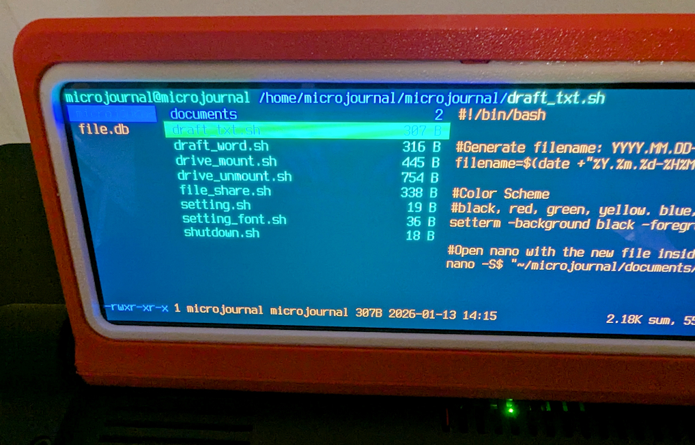
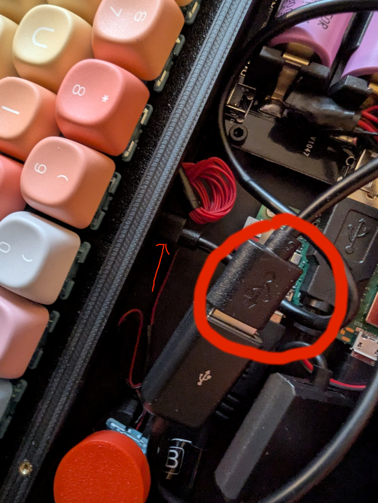
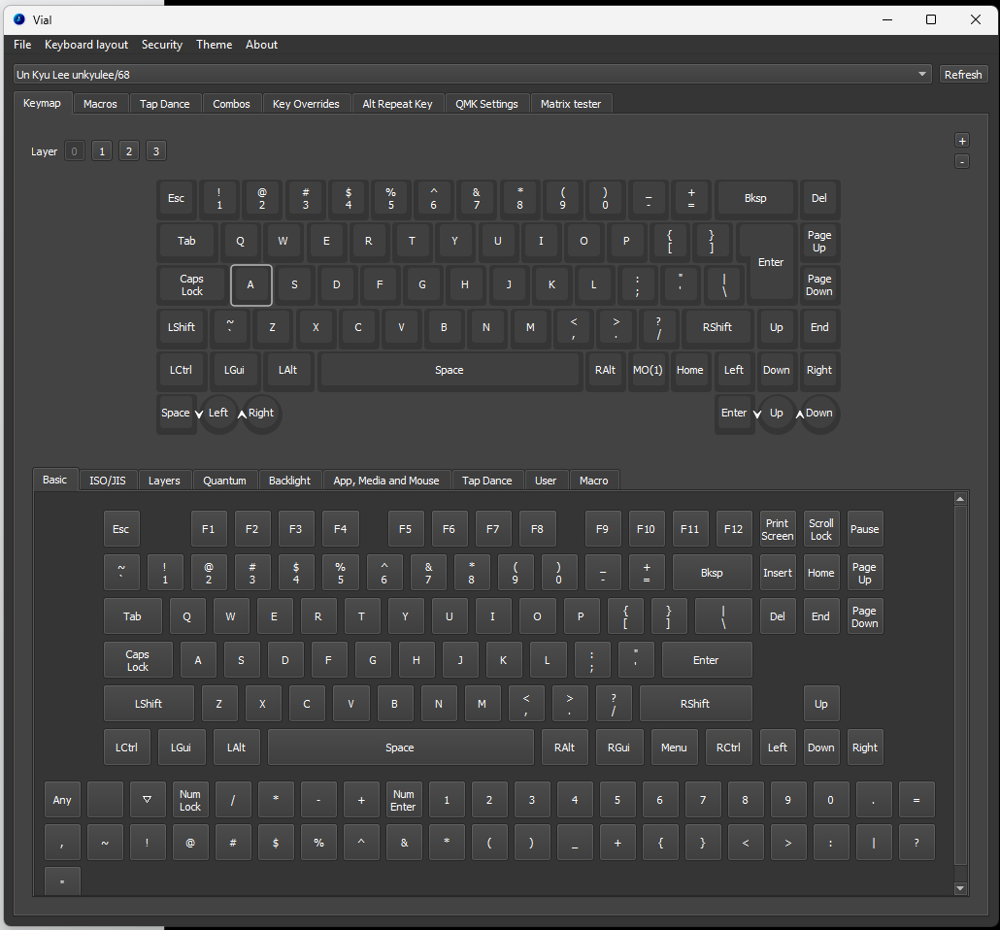
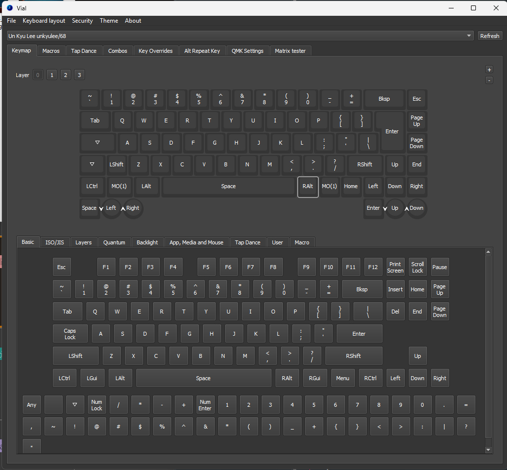
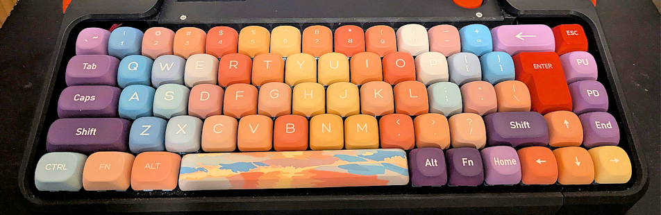
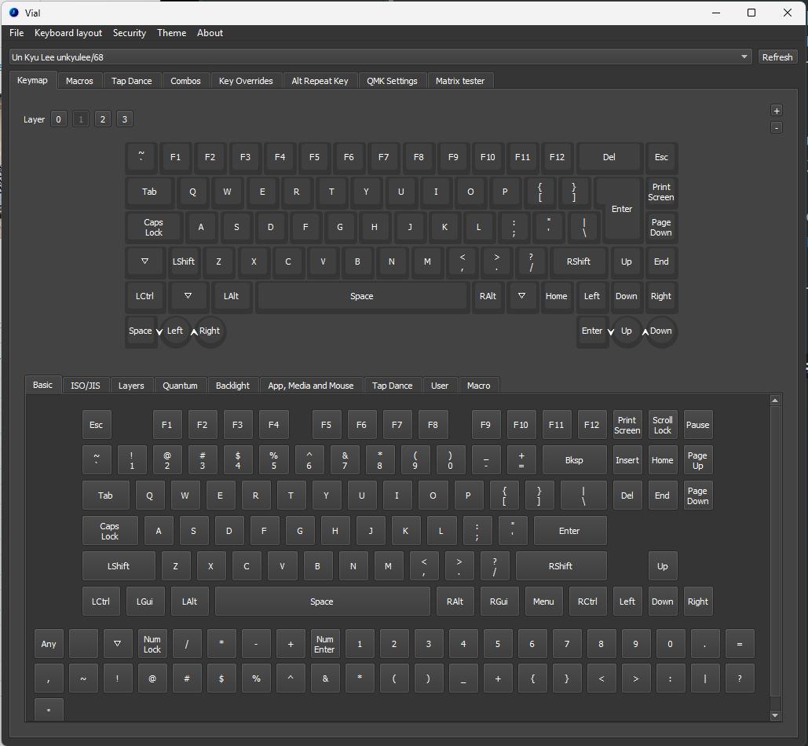

# The Micro Journal Rev 2.1

Prepared by Hook
Edited by Un Kyu Lee

---

## Introduction

This document combines the Quick Start Guide and the detailed Micro Journal Rev 2.1 User Guide into a single reference.

The first section is intended to get you powered on and writing as quickly as possible. The second section is a deeper dive into the system, its tools, and configuration options. You do not need to read everything in order. Use the table of contents to navigate.

---

## Table of Contents

* **Introduction**

* **Part I: Quick Start Guide**

  * Things to Buy

    * Charger Adapter
    * USB-A to USB-C Cable (for Charging and Power)
    * Battery (Optional)
  * How to Power the Device

    * Important: Use Only Non-PD USB Chargers
    * Using the Device Without Batteries
    * Lower the Display Brightness when Display Flickers
    * Installing Batteries
    * Powering On After Battery Installation
  * When It Does Not Boot
  * Setup Micro SD Card

    * Note for Advanced Users
  * Using the Dashboard
  * WiFi Setup
  * How to Transfer Your Files

    * Using Dropbox to Sync Files
  * Getting into Writing

* **Part II: Full User Guide**

  * Introducing the Micro Journal Rev 2.1
  * The Micro Journal Rev 2.1 Walkthrough
  * Using the Rev 2.1 Part 1: The Launcher
  * Using the Rev 2.1 Part 2: Drafting and Editing

    * WordGrinder
    * nano
  * Using the Rev 2.1 Part 3: File Management and Backups

    * Backup Over Network
    * Back Up to a Flash Drive
  * Using the Rev 2.1 Part 4: Modifying the Key Map with Vial

    * Procedure: Changing your Key Map
    * Example: Changing your Key Map
  * Reporting Issues and Getting Help
  * The Micro Journal Rev 2.1 Is In Your Hands Now

* Reporting Issues and Getting Help 

---

# Part I: Quick Start Guide

## Things to Buy

### Charger Adapter

Use a **USB-A wall charger** that can supply **at least 2A**.
The device **does not support USB Power Delivery (PD)**. This means:

* **PD chargers will not work**
* **USB-C to USB-C cables will not charge nor power the device**

You must use a **USB-A charger** with a **USB-A to USB-C cable**.

*Example:*
[https://www.amazon.com/MEHIDFY-USB-Wall-Charger-Charging/dp/B0BZCY3HF9/](https://www.amazon.com/MEHIDFY-USB-Wall-Charger-Charging/dp/B0BZCY3HF9/)

---

### USB-A to USB-C Cable (for Charging and Power)

You will need a **USB-A to USB-C cable** capable of delivering **up to 15W (5V/3A)**.
Check that the cable specifications explicitly support **3A or higher** current output.

*Example:*
[https://www.amazon.com/Amazon-Basics-Charger-480Mbps-Certified/dp/B01GGKYN0A/](https://www.amazon.com/Amazon-Basics-Charger-480Mbps-Certified/dp/B01GGKYN0A/)

---

### Battery (Optional)

The device supports **up to four 18650 lithium-ion batteries**, but can also run **without any batteries installed**.
For stable performance, it is recommended to install **at least two** batteries.
Make sure the batteries are **fully charged** before first use.

Helpful links:

* [**Battery Buying Guide:**]https://www.reddit.com/r/18650masterrace/comments/qp21o8/buying_18650_batteries_start_here/?share_id=RTqe02Hqv2l_VwJTwoIi1&utm_content=2&utm_medium=android_app&utm_name=androidcss&utm_source=share&utm_term=1()

* [**Verified Working Battery (Flat-top, US):**](https://www.18650batterystore.com/products/samsung-30q)

Search for **18650 Li-ion flat-top** or **LiPo 18650** to find compatible batteries. These are the most commonly used by current Micro Journal users.

---

## How to Power the Device

### Important: Use Only Non-PD USB Chargers

The Micro Journal **does not support USB Power Delivery (PD)**.
This means:

* **PD chargers will not work**
* **USB-C to USB-C cables will not power or charge the device**
* The device may appear dead or unresponsive if powered with the wrong charger

To power the device correctly, **you must use a standard 5V USB-A charger** (such as an older phone charger) **together with a USB-A to USB-C cable**.
Using the proper charger ensures reliable power and protects the device from damage.

---

### Using the Device Without Batteries

You can run the Micro Journal Rev.2.1 entirely from USB power.

1. **Connect a USB-A to USB-C cable** to the USB-C charging port located at the back of the device.
2. **Turn the power switch ON.**
3. You should see:

   * A **red light** glowing at the back (power indicator)
   * A **green blinking light** under the front grill (Raspberry Pi activity / boot indicator)
4. **To turn the device off:**

   * Perform a **soft shutdown** from the menu
   * Wait until the screen is fully off
   * Ensure the **green light stops blinking**
   * Then turn the switch to the **OFF** position

---

### Lower the Display Brightness when Display Flickers

If the display begins to flicker during boot or operation, this usually indicates that the device is drawing more power than the current power supply can reliably provide. This is most often caused by a charger or cable that cannot sustain sufficient current under load.

In many cases, the issue can be resolved by lowering the display brightness, which reduces overall power consumption.

To lower the display brightness:

Locate the brightness control button behind the display. Press the button to cycle through the available brightness levels. Select a lower brightness setting and observe whether the flickering stops.

If flickering continues after lowering the brightness, ensure that you are using a proper USB-A charger capable of supplying at least 2A, along with a high quality USB-A to USB-C cable. Lower quality cables or underpowered adapters are common causes of unstable operation.

Reducing brightness is a practical first step and often sufficient to stabilize the device without changing hardware.

---

### Installing Batteries

The device can operate using up to **four 18650 lithium-ion batteries**.

1. Remove the **two small screws under the screen** to access the battery compartment.
2. Installing the **fourth battery** requires opening the left side of the enclosure (remove 4 Torx screws).
3. Video instructions are available here:
   **[Battery Installation Guide](https://youtu.be/-P8MK0iT04k?si=TgdXtUZAtJaRblRU&t=400)**

---

#### ⚠️ Important Battery Safety & Setup Notes

**⚠️ Do NOT connect the charging cable while inserting batteries.**

Insert all batteries first, with the device fully disconnected from power.

**⚠️ You must charge the batteries at least once after installation.**

The battery module **won’t activate** until it detects a charge cycle.
After inserting batteries:

1. Connect your USB-A charger
2. Allow the device to begin charging
3. After this first charge, battery power will work normally

**⚠️ Pay close attention to battery polarity.**

Incorrect polarity can cause **short circuits, overheating, or fire**.
Match the + and – signs carefully before inserting each battery.

---

#### **Power Requirements & Important Warnings**

This device does **not** support USB Power Delivery (PD). Do **not** use PD chargers or USB-C to USB-C cables, as the device will not power on with them. You must use a **standard USB-A charger** (such as an older phone charger) together with a **USB-A to USB-C cable**.

If the screen **flickers during boot**, this indicates that the power supply is insufficient. Ensure that your charger and cable can reliably provide **at least 2A**. Lower-quality cables or low-power adapters may cause unstable operation. Reducing the display brightness can also help lower the power draw—press the button behind the display to cycle through the available brightness levels.

---

### **Powering On After Battery Installation**

* Turn the switch to the **ON** position.
  The device should power on normally.
* If it does not turn on, **press the power reset button once**.
* Pressing the reset button **twice** or **holding it** will turn the battery module **off**.
  You will notice the **red light turning off** when the battery module is disabled.

### When It Does Not Boot

**Initial delay:**  Rev 2.1 is not instant on. It has to boot Linux first, since everything runs off that. If you haven't used Linux before, you will see a lot of incomprehensible text go whizzing by too fast to read. At first the text will fly by in the wrong direction on the screen and finally it will reorient. Just ignore everything until you are given the terminal dashboard.

**Check the SD card:** If the screen remains blank for too long, check for a green light on raspberry pi. This light indicates that the system is booting. If no green light appears, the SD card may not be properly installed. 

**When not booting** Power off, reinsert the SD card, and try again. If the issue persists, you may need to replace or reconfigure the SD card. 99% of the issues is related to SD card. Please, refer to this document when you need to setup the SD card.

---

## Setup Micro SD Card

**Note: A pre-configured Micro SD card is included with the Micro Journal Rev.2.1. You do not need to buy or set it up. Refer to this guide only if you need to replace or reinstall the Micro SD card.**

The Micro Journal Rev.2 uses a Micro SD card for its Raspberry Pi Zero 2W computer. The card should have a capacity of **at least 4GB**. Using a faster card will improve boot times and overall performance.

While your Micro Journal Rev.2 ships with the Micro SD card already installed and configured, you may need to set up a new card in the future. For detailed instructions on how to do this, refer to the following guide:

[Raspberry Pi SD Card Setup How-To](https://github.com/unkyulee/micro-journal-linux/)

Default configuration is designed to be user-friendly, allowing you to quickly get into writing mode without needing to learn complex Linux terminal commands.

### Note for Advanced Users

If you are familiar with Raspberry Pi and Linux configurations, feel free to customize the setup. The Micro Journal Rev.2 has no major constraints, though a minor display configuration may be necessary. Beyond that, you have the freedom to configure the Raspberry Pi as you prefer.

---

## Using the Dashboard

After the device has fully booted up, you will be greeted with the **Dashboard**. 

The dashboard is a kind of menu. It really is a crude file manager, but you have one folder (documents) and several scripts (files ending with .sh-- if you ever used DOS, think batch files) and you use the arrow keys to select among them, so it acts like a menu.

The documents folder is obviously where your files will be stored. You use the right arrow to move to the list of file names in that folder and hit enter to open any file in WordGrinder. To create a new file, you arrow down from the documents folder to the script called newfile. We will get to WordGrinder in a moment.

Use the **cursor keys** to navigate the options on the screen. You can press the **up** and **down** arrows to move between selections.
  
To create a new document, select **"newfile.sh"** and press **Enter** or the **right cursor key**. This will open **WordGrinder**, where you can begin typing.

To save your work in WordGrinder, press **Ctrl + S**, and to quit, press **Ctrl + Q**.

Here are some more commands that you can utilize in the dashboard.

https://gist.github.com/heroheman/aba73e47443340c35526755ef79647eb

---

## WiFi Setup

To connect to a WiFi network, follow these steps:

1. Navigate to **"config.sh"** on the dashboard and press **Enter** to open the Raspberry Pi configuration screen.
2. Select **"1 System Options"** and press **Enter**.
3. Select **"S1 Wireless LAN"** and press **Enter**.
4. Enter the **SSID** (name) of your WiFi network.
5. Enter the **password** for your WiFi network.

Make sure that the wifi system is in 2.4 Ghz. 
Also, try to seting the WiFi country. 5 Localisation Options -> L4 WLAN Country

---

## How to Transfer Your Files

To share or access files from the Micro Journal, follow these steps:

1. Select **"share.sh"** from the dashboard and press **Enter**.
2. Wait a few seconds, and once you see the **IP address**, enter it in the web browser of your PC.

You will be greeted by a web interface where you can download, manage, and extract files stored in the **"documents"** folder on your Micro Journal.

#### Using Dropbox to sync files

Detailed guide on how to setup Dropbox via Rclone written by HollerPots:

https://hoolis.net/posts/rev2.html

---

## Getting into Writing

You are now ready to go. Select **newfile.sh** on the dashboard and hit enter and you are in [WordGrinder](https://cowlark.com/wordgrinder/index.html). It will tell you it can't load your file (of course not... it's a new file so it doesn't exist yet). Hit space and you will be in the new, blank WordGrinder file. Quite honestly you can just type, and use **ctrl-s** to save and **ctrl-q** to quit. But WordGrinder has a complete menu system you access with the **Esc** key. Wordgrinder saves in a non-standard Text format. Luckily, WordGrinder has it's own export function to convert it to text or pdf.

All your files go into the documents folder, including the exported text and pdf files. You then get access to them on your computer by exiting WordGrinder and selecting the **share.sh** script. It will give you an ip address. Type that ip address into your browser on your computer (or, I assume, phone) and you will be able to see those files, open them and copy and paste.

You may need to be in the same wifi network as the Micro Journal in order to access the share features.

#### Note on WordGrinder Files:

WordGrinder saves files in its own format. To read or share them easily, you must export the file as either **PDF** or **Plain Text**. To export a document, press the **ESC** key while in WordGrinder to access the export options.

#### Adding Spellcheck Feature 

https://www.reddit.com/r/writerDeck/comments/1ja4hdg/adding_spellcheck_feature_to_micro_journal_rev2/

Credit to: Misplaced_Fan_15

#### Using NeoVim as an editor

https://www.reddit.com/r/writerDeck/comments/1jf4fqm/micro_journal_rev_2_with_neovim_as_word_processor/

---

# Part II: Full User Guide

## Introducing the Micro Journal Rev 2.1

The Rev 2.1 is one of a line of Micro Journal Writer Decks aimed at *writing focused* drafting. That is, they are digital typewriters that help you stay on task to get your words out. However, the Rev 2.1 is unique in that it is also a Linux Cyberdeck. This creates great flexibility and options both to support your writing and to do much more, if you are familiar with Linux and choose to explore that. However there is something we need to make clear.

**We will not be giving any in-depth documentation on Linux or Cyberdeck uses in this guide.** We offer no support for learning Linux. In addition, we won't provide in-depth guides to the software, none of it being our creation. However, you shouldn't need any of that for the basic and default Writer Deck functions of the Rev 2.1.  If you want something more or different than what has been set up, the good news is that you can get that, but you have to be able to figure that out on your own by researching it yourself. But, in fact, a lot of thought and planning has been put into configuring the software so that things will be easy for writers with no Linux experience. And there are plenty of resources on the net for learning Linux if you wish to.

The advantage of such a powerful system for a Writer Deck is that it opens up the possibility of editing as well as writing in a design that is still light weight and portable. There is no buffer limit for reviewing text. The color screen is large and clear, allowing you to view more of your text on-screen, and it provides 2 different text editors to work with. All these functions are available using the simple Launcher. And because it is terminal based, even with an internet connection, it remains writing focused with no social media or browser. If you have knowledge of Linux you can do other things like adding a different editor you prefer or using the Rev 2.1's Cyberdeck capabilities, but we will not cover much of that here. 

---

## The Micro Journal Rev 2.1 Walkthrough

The Micro Journal Rev 2.1 is not instant on. Because it is starting up Linux, it takes some time to boot.  However, it is only about 20 seconds. For the first half of that 20 seconds, after you turn on power and hit the big button in front of the screen, you may not see anything on the screen and may think it didn't come on.  Be patient. You will suddenly see all kinds of status lines on the screen. You don't need to be concerned about any of those lines flashing by. Finally it will drop you into a launcher menu.

---

## Using the Rev 2.1 Part 1: The Launcher

The launcher menu is where you start various functions and software.  The program providing the menu is called ranger and it is actually a file manager. The launcher is showing folders and script files in the current directory. By selecting a script and pressing Enter, you can start programs and settings. This menu is where you will operate from unless you choose to go and do more with Linux. There is no reason for anyone to have to use anything else if just using the Rev 2.1 as a Writer Deck. 

Here is the menu you will see when you first boot up. We will go through each of the options.

The first item you have at the top of the launcher is *documents*, so we will start there. You will notice there is an  item on the menu in the picture called "DISK", but that won't appear on your first boot, so we'll come back to that. First we'll briefly describe the function of each menu choice. Then we will follow up with more detail on each choice organized by Task.

* ***Documents*** - This is a directory ("folder" to Windows users). It is the directory that, as set up now, all of your writing will be stored in. When selected, it will show a list of all the writing files you have saved to the right of the Launcher menu. If you haven't yet created any writing files, as on fist boot, it will show "empty" in a red box. Once you have created writing files, to continue working on the same file, you would move the cursor to the list of files (right arrow) and then move up and down until you have selected the file you want to work with. Then hit Enter.

    > **<u>Note:</u>** *We will use arrow keys to describe cursor movement in ranger/the launcher. The scroll wheels on the Rev 2.1 also control cursor movement. The right wheel scrolls up and down and the left wheel scrolls right and left.  However, if you make a mistake in the direction you turn with the left wheel in the launcher, you will scroll across to other folders and you may be disoriented. It is clearer and more precise to use arrow keys in the directions here.* 

* ***setting.sh*** - All the rest of the choices on the launcher are executable shell scripts (like batch files in Windows) that all end in ".sh". When each is selected, you will see the actual script inn the right pane, but you don't care about that script. Config.sh grants you temporary root (administrator) privileges and takes you to the Raspberry Pi system configuration tools.  We recommend not changing anything you don't need to or understand. If you have a lot of experience, feel free to change anything you want. You will want to set up your network by selecting "S1 Wireless LAN" under "System Options" and you will want to identify your locale and Time Zone under "Localization Options". Esc backs you out to the top level when you are done and a final Esc takes you back to the menu. And, in fact, exiting from any of these launcher script functions returns you to the launcher as part of the script.

* ***setting_font.sh*** -  This takes you to the console configuration utility. If you have not done this before and the font size and style are usable for you, you might wait to experiment with this. 

* ***draft_txt.sh*** - this opens the plain text editor nano creates a new text file to start writing in with the plain text editor **<u>nano</u>**, one of two editors made available to you on this launcher.  I will go into more detail on both editors below. The script obtains the system date/time and uses those as a filename for the new file, which you can change later. But using date and time means that even if you create a second file 30 seconds later and don't rename either, the second one won't overwrite the first.

* ***draft_word.sh*** - This script opens a new document to start writing in the editor **<u>WordGrinder</u>**. Unlike micro, WordGrinder doesn't use plain text natively but uses it's own proprietary format you can export to text. But it offers more word processor-like features even though it is a terminal editor. And, while it offers extensive features, it keeps the UI out of the way while you are typing. WordGrinder also uses the date/time filename convention.

* ***file_share.sh*** - This is a script that displays a network URL that you can type into your browser address bar. You will be presented with a file manager window looking in the documents directory. You can use this to either copy files to your computer or upload files to The Rev 2.1. 

* ***shutdown.sh*** - This is a script you use as the first stage of turning off the Rev 2.1. It does a proper shutdown of the software and operating system. Unlike with computers, it does not actually shut down power, so you will still have to switch off the power toggle on the back of the Rev 2.1. Just don't turn off the power toggle before you use the shutdown script.

* ***drive_mount.sh*** - This script allows the Rev 2.1 to mount an external flash drive that has been inserted into the USB-A port at the back of the Rev 2.1. This is alternative method to back up or load files without the internet. When you make this connection, the DISK directory is added to the launcher menu. This will likely only work with flash memory (thumb drives, SD cards), not larger external drives that have moving parts or high energy demands.

* ***drive_unmount.sh*** - This script allows you to safely remove the external flash drive, in order to be sure the drive has stopped operations and been unmounted.

---

## Using the Rev 2.1 Part 2: Drafting and Editing

There are two programs for writing and editing that have been set up and are made available by the launcher. This guide only gives you a general overview of the two programs, not a thorough walkthrough of each. We will provide links to online documentation and one of the programs, micro, includes internal help documentation.  However, as set up here, for just drafting and basic editing, either program is intuitive and simple to use without digging into documentation.

**WordGrinder** - This is one of two text editors made available by the launcher as a default on the Rev 2.1. It operates in a terminal, but is has some advanced functions usually associated with word processing software. But don't expect an office style word processor. There is nothing WYSIWYG about WordGrinder. It is focused on typing words. It's advantage is relatively straight forward and simple. Type and save. It has key functions like copy and paste, find and replace, undo and redo and spell check. There are basic paragraph styles and character styles.  These are all available on menus invoked by pressing Esc, or you can use keyboard shortcuts. Wordgrinder will feel familiar to people who use office style word processors even though it is a terminal app and therefore may be easier for folks to use. But when you are writing, the menu for all these many features disappears until you hit Esc again, so you have a pretty clean writing screen with no complex UI features getting in your way. 

However, the one minor disadvantage is that WordGrinder, like office apps in general, uses a proprietary file format, with the file extension ".wg".  In order to use a WordGrinder file outside of WordGrinder, you have to use the option on the File menu to export to text. While it is an inconvenient extra step, if you like what WordGrinder offers you, it is easy enough to do. There is no dedicated manual for Wordgrinder, but that should indicate how easy it is to figure out on your own.

Here is a page that documents WordGrinder in more detail: https://gist.github.com/davidgiven/1aba97e96a9b8f9b573b 

**nano** - is a terminal based text editor designed to be simple, predictable, and immediately usable. It is widely available on Linux systems and is often the first editor encountered by new users. As configured on the Micro Journal Rev 2.1, nano is intended to function as a straightforward plain text editor that lets you begin writing without learning complex commands or workflows.

nano was not created specifically for writers. Like many terminal editors, it is also commonly used for configuration files, scripting, and remote editing over SSH. However, its minimal interface and clear on screen guidance make it well suited for drafting text. Files created in nano are saved in plain text format, with no conversion required.

When you open a new file in nano, you are presented with a mostly blank screen and a blinking cursor at the top left. At the bottom of the screen is a two line help bar that displays commonly used keyboard shortcuts. These shortcuts are shown directly on screen, using the caret notation for the Control key. For example, ^O is used to write a file, and ^X is used to exit.

The help bar remains visible while you work, which makes nano easy to use without memorizing commands. Pressing ^G opens the built in help screen, which provides an overview of available commands and navigation options. If this level of functionality meets your needs, nano allows you to write, save, and exit with very little friction.

nano includes basic editing features such as search, replace, copy and paste, and undo. While it does not offer the extensive customization or advanced features of more complex editors, those features are intentionally unnecessary for focused drafting. The editor stays out of the way and allows you to concentrate on writing.

For users who also work with code or system configuration, nano provides a familiar environment that can be used interchangeably for writing and technical tasks.

Official nano documentation can be found here:
https://www.nano-editor.org/docs.php

---

## Using the Rev 2.1 Part 3: File Management and Backups

Once you have done some writing, edited or not, you want to back it up to your computer. You do this in order to have back-ups, but also to do things with what you have written that are harder to do on the Rev 2.1, such as loading the text into Scrivener or some other WYSIWYG editing and publishing platform.  The Rev 2.1 provides two ways of doing this.

**Backup over Network** - This is not a cloud backup. It uses your own personal network (WIFI) to allow your computer to copy files from the documents directory on your Rev 2.1.  Let's say you have the fille test1.txt in your documents directory. You've been working on writing that text all day and you want to make sure it is backed up to your computer.  

We are assuming you have previously set up the Rev 2.1 to use your network using the configuration script as that is required for this method to work (the second method, described below, requires no network connection). When  you are ready to back up your files, select Share.sh on the launcher. You will be instructed to open a URL with an IP address. If you don't know what an IP address is, it will look like a series of numbers divided into four groups of from 1 to 3 digits with a dot in between each group. Go to your browser on any device—computer, phone or tablet. Type the URL that the Rev 2.1 gives you into the address field in your browser and hit enter. In your browser a simple and very basic file manager will appear showing whatever documents you have in your documents directory. Click once on a file to select it and then click the download icon on the toolbar at the top right of  the screen. A download prompt from your computer's file manager and you can download the file to the location offered or navigate to the folder you want it to be saved in.

When you have finished, press Ctrl+c to return to the launcher.

**Back up to a Flash Drive** - You can also back up files directly to a USB flash storage device. No network is involved in this. With the Rev 2.1 on, plug an external memory accessory into the USB-A port in the back of the Rev 2.1.  On the launcher menu, select "drive_mount.sh" and press Enter.  At the bottom of the screen you will see:

        Device /dev/sda1 mounted to /home/microjournal/microjournal/DISK
        Press any key to continue...

As it says, press any key.

You will now see the "DISK" directory has been added at the top of the Launcher menu. Select DISK and you will see any files that are already on the flash memory device. To back up a file to the external memory, select the documents folder. Use the right arrow to move to your list of files in documents.  Use the up arrow and down arrow to select the file you want to back up. Type **yy** (a command help text will appear with the first y, but just type the second y). This copies the file.  Then type the left arrow to return to the launcher list and select DISK. Use the right arrow again to move into the DISK directory and type **pp** to paste the file there.  That file is now on the flash memory.  Repeat this as needed for whatever files you want to transfer. You can also copy files from the external memory and paste them in the documents folder if you choose by reversing these instructions.

When you are finished copying files, on the launcher, select "drive_unmount.sh". Hit Enter. At the bottom of the screen you will see:

        Flushing filesystem buffers...
        Unmounting /home/microjournal/microjournal/DISK...
        USB disk safely removed
        Press any key to continue...

Press any key and remove the external memory device from the port in the back of the Rev 2.1. 

This is an entirely private way to back up your files and get them to your computer. Not even the local network is involved, so this can be done even where there is no internet or where the network provided isn't secure. Or even in a location with no electricity (if your batteries aren't low).

---

## Using the Rev 2.1 Part 4: Modifying the Key Map with Vial

Because the Rev 2.1 uses a full staggered QWERTY keyboard, there may not be a compelling reason to make custom modifications of your standard keyboard layout, but you can if you wish. The Rev 2.1 doesn't use the Json file method of altering your Key Map that the Rev 4, Rev 5 and Rev 6 use. Instead it uses QMK-Vial software on your computer and makes a direct connection to your keyboard controller on the Rev 2.1 from your computer.  This is a little more technical but it really gives you full control over your keyboard layout. As such, this method has more of a learning curve, so you might consider whether you really need to tweak the default key map. However, it is quite doable.

To change your key map assignments you will need to download and install a program called Vial on your computer (not the Rev 2.1). The following instructions are based on Windows version, but there is also a Mac and Linux version that shouldn't look much different. To download Vial go to https://get.vial.today/  There is also a user manual there if you want to delve deeper into Vial’s capabilities than we will here.

After you have installed Vial on your computer, you need to connect the keyboard
controller to your computer so Vial can read the current key map.  To do this, with the Rev 2.1 powered down (rear power toggle switched off), remove the two screws from the plate that the screen folds down onto. Then slide the plate out. You will see a cord coming through the front wall from under the keyboard plugged into a female USB socket on a cable from a small USB hub.

Disconnect the keyboard cable from the female socket. This will give you a short cable with a male USB-A connector. It is short, but do whatever you need to to plug it into your computer. If you need it, use a USB extension cable. 

Now launch Vial on your computer.  When it fully loads, you should see a screen like this:

This screen roughly divides into 2 halves. The top half is your keyboard, showing the key assignments. Just above that keyboard to the left are the tabs for different layers 0, 1, 2 and 3. Because we have a full QWERTY keyboard, there's not much reason to get into layers. Your main keyboard is layer 0, and that is what you are viewing here. The only key assignment you will see here that may be puzzling to you is the key labeled "MO(1)". That is a "layer" key. Holding it down will activate Layer 1. On layer 1, the top row keys (the numbers and the two punctuation keys in front of backspace) become F keys (F1-F12) and Backspace becomes Delete.  So if you want to use F keys (they have Linux applications, but mostly don't have much use for just writing with the default setup) or you want to delete rather than backspace, hold down the MO(1) key (Fn on the key cap) and hit the F-key or Delete key.  Most of Layer 1 just reproduces Layer 0. You'll see an example of Layer 1 below. However, if you need key assignments on your Rev 2.1 that you can't fit on Layer 0, you can assign them to Layer 1. We will focus on layer 0, but Layer one works the same way. 

The bottom half is your source of key functions to assign.  There are several tabs, This is the Basic tab and it is all I’m going to show you because it has pretty much everything you need for the Rev 2.1.

Lets look at the Key Map for your keyboard in the top half. you will see the five rows that match your keyboard.  Below that are the scroll wheel assignments for up and down and pushing each wheel in. So turning the left scroll wheel will move the cursor left and right and pushing the left wheel in will type a space.  Turning the right scroll wheel will move the cursor up and down and pressing the right wheel. We will ignore the scroll wheel assignments and just deal with the standard five rows of the keyboard.

So now let us walk you through changing key functions and layers: There are two things you will most likely want to do. One is to replace one key assignment on the key map with another key assignment. The other to move a key assignment to another location. 

**Replacing** a key assignment is easy.  You simply click on the key you want to replace on your key map on the top half.  Then click the key assignment you want to replace it with on the bottom half. You don’t have to match the size of the key in the lower half to assign that key function. The reassignment on the Rev 2.1’s keyboard is made instantly.  You don’t save. It is done.  You also have no undo, except by reassigning the key the same way.  

**Moving** a key assignment is the same basic instructions except you are involving more than one key assignment. To move a key assignment, it starts out the same as replace.  Select the key in the  your key map in the top half where you want to move an assignment, then click on that assignment in the lower half. But now you have a duplicate key in the old location. Replace that key’s assignment, possibly with the assignment you eliminated in the first step.

Make sure **before** replacing a key, you know how to get that key back if you need to.  For example, the MO(1) key assignment doesn't appear on the Basic tab. It's a layer key, so you will find it on the Layers tab.

When you are done with whatever changes you are making, close Vial and unplug the cable from your Rev 2.1 from the computer. Now, reconnect the keyboard cable to the female USB connection you unplugged it from before. Replace and screw down the plate that slides in under the screen.

So here are the basic steps, from beginning to end, for making simple changes (replace assignment, move assignment) to your key map summarized for you.  

## Procedure: Changing your Key Map.

1. Back up any writing on your Rev 2.1. This is just a precaution. Very little can go wrong here.

2. Shutdown the Rev 2.1 and click the power switch to off. 

3. Remove the two screws from the front of the plate that the screen folds down onto. Look for the USB cord from the keyboard and unplug it from the hub.

4. Plug the keyboard cable into your computer. Then start up Vial on your computer.

5. Make your changes to either replace or move key assignments as detailed above. Click on the key you want to replace on your key map in the top half of the screen and then click on the function you want to replace it with in the bottom half of the screen. Repeat this for as many changes as you wish.  

6. When you have completed all your changes, simply exit Vial on your computer and disconnect the USB cable that connects your Rev 2.1 to the computer. 

7. Reconnect the keyboard cable to the female socket from the hub inside the Rev 2.1. Replace the plate and secure it with the 2 screws. 

That’s it.  The next time you boot up, you should have the changes on the Rev 2.1’s keyboard. It really is that easy.

## Example: Changing your Key Map.

So here is an example of simple changes Hook made to his key map. This is just to show you an example, not to suggest that you should make these changes.  Here is Layer 0 on Hook's Key Map:

A few, very simple changes. First, the Caps Lock key has been replaced with the upside down triangle symbol.  That key results in tapping the key on that layer doing nothing.  Hook finds Caps Lock too easy to set off accidentally and he rarely has a use for it. Also, the `~ key has been moved to the top row before the 1 key where you expect it on most keyboards and, therefore, Esc was moved to the other end of that top row where delete used to be.

A more unusual change is where LShift is.  Hook prefers a longer shift key in that position. What was done was, with the `~ key moved, that key was assigned as LShift and the left-most switch was removed and assigned the upside down triangle.  This allowed the use of the longer shift key cap. The stiches were too close together for any longer Shift Key Cap to sit on both switches, that's why one switch has been removed. The Key Cap works just fine only sitting on one switch and it doesn't teeter-totter when tapped. Here is the keyboard with the long shift key on the right:

Finally, LGui is meaningless without a GUI (on Windows keyboards, this is the Windows key), so it was replaces with a second Level 1 key, or Fn, the key you press when you want the key pressed while holding the Fn key to give you its Level 1 output. Handy to have it on both sides of the keyboard so you can use two hands for the shift-type operation.

Let's look at what Hook did on Level 1:

These are very minor changes. This layer enables Caps Lock if it is ever needed.  Simply hold down the Fn key and tap the Caps lock Key. Repeat to toggle it off. Holding down one of the 2 layer keys will also get you Delete when you tap the Backspace key. As you can see (and this is not one of Hook's changes)  holding down the Layer 1 key is how you get F Keys.  Finally, the layer keys on Layer 1 do nothing since you are already holding down one of those keys to have access to the Layer 1 key map.

Hopefully it helps to see a concrete example.  The keyboard is already set up pretty well for drafting with the default key map using only Layer 0.  But if you want to tweak, you can.

## The Micro Journal Rev 2.1 Is In You Hands Now.

That's it for getting started. If you have questions or want to reach out to other users, check out the links here under "Community."

https://github.com/unkyulee/micro-journal/blob/main/micro-journal-rev-2.1/readme.md#community

Happy Writing!

---

# Reporting Issues and Getting Help

If you encounter a problem with the Micro Journal Rev 2.1, the preferred way to report it is through the project GitHub issues page. This helps track problems, share solutions, and improve future revisions.

To report an issue:

1. Visit the Micro Journal issues page:
   [https://github.com/unkyulee/micro-journal/issues](https://github.com/unkyulee/micro-journal/issues)

2. Check existing issues to see if your problem has already been reported. If it has, you can add additional details or confirm that you are experiencing the same behavior.

3. If your issue is new, select **New issue** and provide as much detail as possible, including:

   * A clear description of the problem
   * What you were doing when the issue occurred
   * Any error messages shown on screen
   * Your power setup, including charger type, cable, and whether batteries are installed
   * Photos or videos, if they help illustrate the issue

Clear and detailed reports make it much easier to diagnose problems and respond effectively.

If you are unfamiliar with GitHub, you may need to create a free GitHub account before submitting an issue. Once submitted, you can return to the issue page to follow updates or respond to questions.

