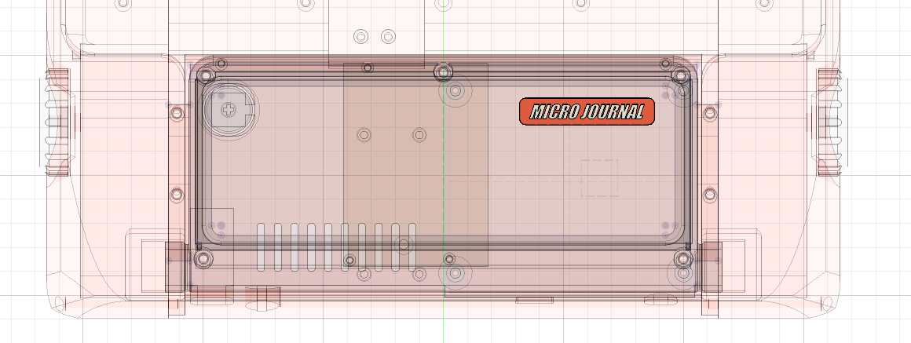
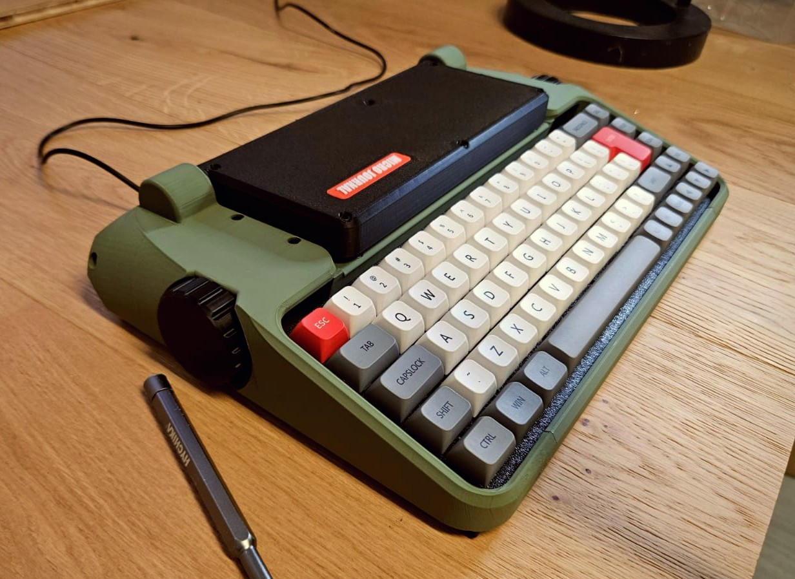

## Micro Journal Rev.2.1: cyberDeck

A typewriter reborn for the digital age.

Micro Journal Rev.2.1: cyberDeck blends the tactile joy of mechanical typing with the power and flexibility of a tiny computer. It's a portable writing deck built around a wide, clear display and a Raspberry Pi Zero 2 W, paired with a satisfying mechanical keyboard that makes every keystroke feel like heaven. Whether you draft essays, capture sudden insights, or keep a slow, deliberate journal, the cyberDeck turns typing into a ritual again.

### Documents 

* [Behind Story](./story.md)
* [Introduction Video](https://youtu.be/-P8MK0iT04k)
* [Quick Start Guide] TBD
* [Build Guide] TBD

### Resources

* [Design Files](./STL)
* [QMK Vial Keyboard Firmware Source](https://github.com/unkyulee/micro-journal/tree/main/micro-journal-rev-2.1/keyboard)
* [Linux Image for the Micro Journal Rev.2.1](https://github.com/unkyulee/micro-journal-linux)

### Community

* [Flickr - AlphaSmart - Writing Tools](https://www.flickr.com/groups/alphasmart/discuss/72157721923133428/)
* [Reddit - writerDeck](https://www.reddit.com/r/writerDeck/)

### Press

* [Liliputing - Micro Journal Rev.2.1 is a distraction-free writerDeck with a full-sized keyboard and flip-up display](https://liliputing.com/micro-journal-rev-2-1-is-a-distraction-free-writerdeck-with-a-full-sized-keyboard-and-flip-up-display/)

### Online Shop

* [Order from Un Kyu's Tindie Shop](https://www.tindie.com/products/unkyulee/micro-journal-rev21-cyberdeck/)
