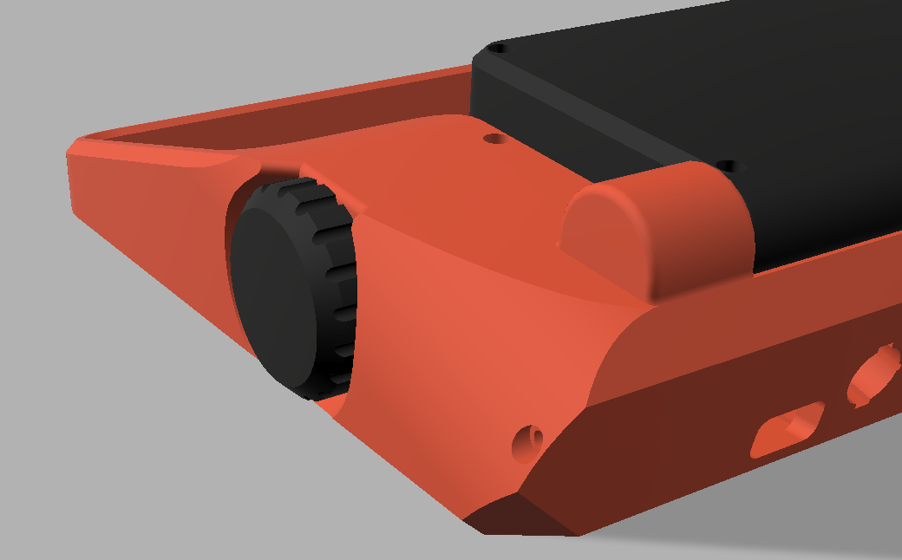
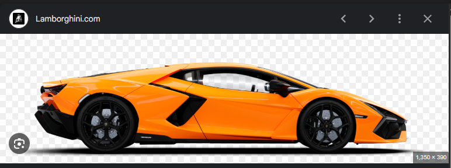
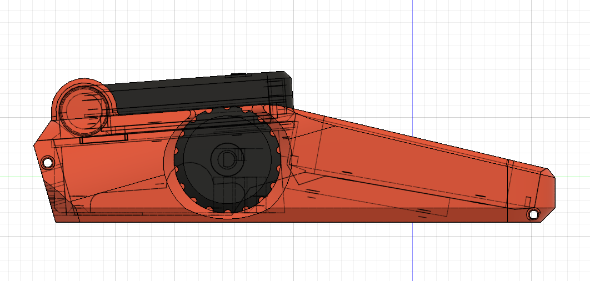
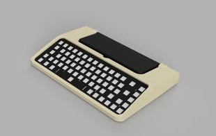
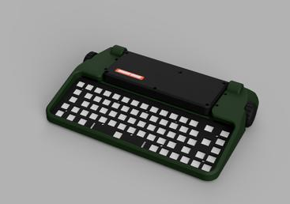
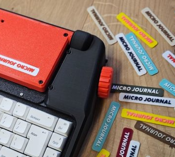
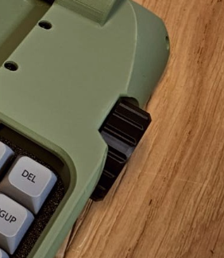

## Story behind building the Micro Journal Rev.2.1: cyberDeck

It's almost been two years since I started working on the Micro Journal project. This is the tenth iteration I've released, and when I look back at the first design, I can see how much has changed and improved along the way.

One of my biggest achievements in 2024:

Now, as I head toward 2026, I'm still using the same screen.

What looks "prettier" will always be subjective. Some people still prefer the 2024 version because it feels modern, minimal, and uses every possible millimeter of space. For them, that design is more visually appealing than the 2025 version. So I can't simply say that each iteration becomes more beautiful. The improvement I'm experiencing isn't only aesthetic. It's something deeper. So what exactly is it?

I've realized that my imagination has become more detailed. The way I visualize the cuts, the steps, the shape I'm trying to create. Everything feels clearer. There are far more technical considerations in my mind now compared to two years ago. The appearance matters, of course, but what matters even more is how the user feels when they face the device. Can it communicate its purpose without explanation? Does it instantly give off "typewriter energy"? And within the constraints of arranging components, wiring them, and designing assembly methods. Will everything actually fit? Can I make it look slimmer than it is?

All of these considerations are constantly running through my head. And my ability to realize them with the tools I have has improved, too. Before, I couldn't work confidently with curves. Now I can form curves from multiple angles and create angled shapes. Not just square boxes. I can bring in far more variations and still manage them.

These are the things I feel I've truly improved. Maybe I'm still doing the same kind of work, but now with many more layers of thought, and with the ability to explain my process more clearly. I feel like this latest build might even be something that could be licensed commercially. Maybe it's time to show it to professionals and see what feedback they might have.

The growth I feel is satisfying. Whether or not I have objectively reached a "professional" level yet. I'm confident that I'll get there someday, even if that isn't my main goal.

## Design Concept

What I've recently come to admire and wish I could express in my own work are curves. When you look at the front of a car, the bonnet isn't just a flat surface. It's full of carefully shaped curves combined with sharp, intentional cuts. Whether it's a high-end sports car or an ordinary car you see every day, the bonnet always makes a statement. It's a blend of smooth, flowing lines and crisp edges that guide the air and create a sense of precision at the same time. This balance of fluidity and sharpness is something I find beautiful. Something I aspire to capture in my designs.

From the side, a car's bonnet starts low to capture and cut through the air at high speed, then gradually rises toward the windshield and flows out toward the back. That smooth, continuous curve has always captured my attention. Even though the overall volume of the bonnet could be described in simple geometric terms, when it's shaped with airflow in mind, it becomes something entirely different. The beauty of that flow the slight drop toward the end, the way everything feels effortless. That scene stays in my mind.

I don't fully understand the mechanical reasons behind every aspect of automotive aerodynamics, but visually, the shape feels so natural and smooth. What fascinates me is that it doesn't look like an aesthetic choice. It looks like a functional decision that happens to be beautiful. And that makes me wonder. If a similar curve were used in a keyboard design, would it still feel functional?

 

What I attempted here was to introduce an "up and down" shape in an area that could easily have been a simple straight line. Probably more practical and offering more internal space. Does this design choice actually make sense? A smooth, curved surface reduces usable internal volume and makes measurements and manufacturing more difficult. Am I just making things harder for myself by approaching it this way?

It's a struggle. But the moment I began sketching the shape, the reasoning became clearer. Mechanical keyboards and small displays are chunky compared to the ultra-slim devices we're used to modern tablets, phones, laptops. When paired with straight lines the has perfect alignments whereas that chunkiness of my design looked bland. The design lacked any kind of statement. It needed details. Something to give the form meaning.

By exaggerating the curves and adding some bold cuts, I think I made the right call. Maybe these aren't functional decisions in the strict engineering sense, but they do serve a purpose. They help the components fit together in a way that feels natural, as if they were always meant to be connected. In that sense, I can call it functional. Function through harmony.

## The Knobs

On an old typewriter, the knobs were never loud or flashy. They weren't the keys you pressed or the carriage you pushed. They were quiet tools. Small wheels at the edges. With a gentle twist, they pulled the paper into place, lifted the words, or gave space for the next sentence to breathe. They were subtle, tactile, and honest.

When I began designing my own device, I didn't set out to pay homage to those typewriter knobs. Somehow, they found their way in. Maybe it was the simple truth that a good design always starts with what feels natural. Every iteration of my project carried a knob. Rev.2 had one, Rev.4, 7 had one, and so did the versions after that. In each design, the knob sat quietly on the side, just like its ancestors on old typewriters. And just like those typewriter knobs, it had a clear purpose. To move the text. Up, down, with that same satisfying, minimal rotation.

In early versions, my knobs stuck out like tiny towers. They seemed proud, eager to be turned. But reality reminded me that design isn't just about appearance. It's about the way a hand reaches for an object without thinking. So I pushed the knob inward, letting it nestle into the enclosure instead of rising above it. Suddenly the motion felt right, as if the finger knew exactly where to land. It became a small, quiet place of interaction. Just like the typewriter knobs always were.

It made me realize something. the beauty of the typewriter knob wasn't in its shape. It was in its humility. It didn't demand attention. It simply worked, grounding the whole machine through a simple, circular gesture. And now, every time I design a new version, the knob stays. It has become a small signature, connecting the past to the present—my device to the lineage of typewriters that inspired it. A reminder that sometimes, the smallest part holds the deepest story.

## Story of a Battery System 

In the previous version, the battery system began almost as an afterthought. During the design phase, I didn't include a battery at all. Later, I added one at the last moment, only to remove it again when everything started falling apart.

The problem was simple, but painful. The power module I chose was meant for low-power devices like the ESP32. I assumed it would be enough. After all, it could provide around 500 mA, which seemed reasonable at the time. And in perfectly ideal conditions, it actually worked… for a moment.

But the Raspberry Pi is a completely different creature. Its power consumption is unpredictable and demanding, and the poor little power module struggled to keep up. If the battery wasn't fully charged, or even slightly low, the entire system became unstable. Sometimes it wouldn't power on. Sometimes it booted, only to crash a moment later. It was fragile, temperamental. Definitely not reliable.

So I had to remove it. It felt like taking a step backward, but I learned something important. A power system should never operate near its limit. If the Pi consumes 500 mA, the supply shouldn't be 500 mA. It should be more than double that. Enough room for spikes, inefficiencies, and real-world conditions.

This time, I approached it differently. I chose a power module capable of delivering 3A, fed by four batteries. It's strong, stable, and importantly, it can run even without a battery installed. Perfect for people who want to keep things simple and always plugged in. It finally feels like a proper power system rather than a patch.

But the battery system comes with its own challenges. It's one of the biggest and thickest components, and finding space for it inside the enclosure was like solving a puzzle with too many large pieces. Almost the entire space beneath the screen and a few extra centimeters was dedicated to it. Sometimes I wondered if I should have chosen a smaller battery, made life easier for myself.

But then I thought about the purpose of the device. A writing tool should feel reliable. It should disappear from your worries while you're in the middle of a sentence. I wanted at least 10 hours of writing time on a single charge. Maybe more than 12 hours if the conditions were right. Enough that you never have to think, mid-paragraph, "Is my battery dying?"

In the end, that vision made the decision clear. Portability isn't just about being able to pick up the device. It's about knowing that it will stay alive with you through a full day of writing. That's the battery I wanted to build.

## What Makes Me Feel Alive

The Micro Journal has always been an open-source project. Everything. From the keyboard PCB to the enclosure design files, and even the raw source files used to create them. Is out in the open. I've written build guides, recorded videos, and done everything I can to make the project inviting, almost like handing people a full meal and saying, "Go ahead, make it yourself." For those who can't or don't want to build it on their own, I offer an assembly service. But at its core, the project was always meant to stay open.

One of my goals with open source is to give people enough detail and clarity that they can build the device even on their first attempt. If this project is great, I don't want it to be great only for me. I want to share that feeling. The excitement of creating something with your own hands, the joy of holding a device you assembled from scratch. I want people to see that they can do it. With enough willingness and passion, anyone can build something that solves real problems in their daily life.

And maybe, if enough people try, the Micro Journal could outlive me. That idea fills me with a warm sense of purpose. I imagine someone, ten years from now, discovering the files, printing the parts, building a unit, and showing it to a friend. Maybe my name is mentioned in passing as the original creator. That's the dream. Not fame, but longevity. A project that keeps breathing, long after I stop working on it.

Financially, the assembly services help me keep everything afloat. They pay for tools, materials, and the experiments I need to continue improving the project. I kind of consume a lot of time in the assembly process, but it pushes me to refine and revisit the design again and again. Every build teaches me something. So, it's time well spent.

And then, every now and then, someone sends me a photo of their completed Micro Journal. Sometimes through a message, sometimes posted on Reddit. Whenever I see those posts, something lights up inside me. It makes me feel alive. Knowing that someone found value in this device. They are writing on it, carrying it around, using it for real work. Creates a kind of joy that's almost addictive. It's hard to describe. It reminds me why I keep everything open, and why the temptation to close the project must stay a temptation… and nothing more.