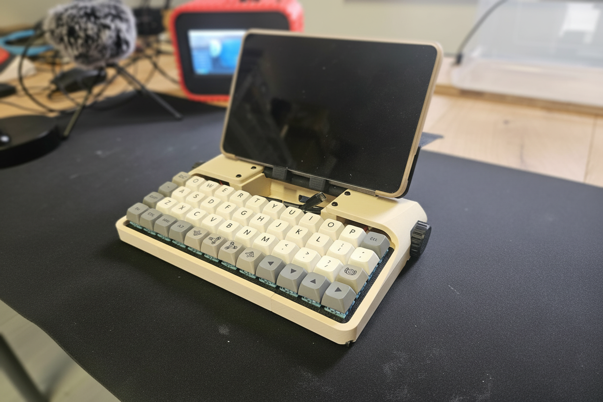

## Micro Journal Rev.3: Nadia

Micro Journal Rev.3: Nadia is a small keyboard meant to live beside a phone or a tablet. Sometimes I sit on the sofa. The television is on, though it belongs to the kids. I sit nearby. A thought drifts in. Will there ever be a moment of television for me? The future feels distant. So I pull out my phone. Emails. I scroll through them, answering with my thumbs.

I wish I had a keyboard.

The phone is a common device these days, and it is clearly capable of being a decent writing tool. At the same time, it is also a powerful distraction trap. One moment you intend to write, and the next you find yourself drifting into endless scrolling without noticing. Yet I cannot deny that it is also a wonderful device for closing a few emails that were due tomorrow.

### Documents 

* [Behind Story] TBD
* [Introduction Video](https://youtu.be/GcJ9Ggf5daw)
* [Quick Start Guide] TBD
* [Build Guide] TBD
* [Various Colorway](https://www.youtube.com/playlist?list=PLrUXYLEnAaNR1lVuNkHQ0WrtUofGpW3S8)

### Resources

* [Design Files](./STL)
* [QMK Vial Keyboard Firmware Source](https://github.com/unkyulee/micro-journal/tree/main/micro-journal-rev-3-revamp/QMK)

### Community

* [Flickr - AlphaSmart - Writing Tools](https://www.flickr.com/groups/alphasmart/discuss/72157721923133428/)
* [Reddit - Un Kyu Lee's Timeline](https://www.reddit.com/r/unkyulee/)
* [Reddit - writerDeck](https://www.reddit.com/r/writerDeck/)

### Press

### Online Shop

* [Order from Un Kyu's Tindie Shop](https://www.tindie.com/stores/unkyulee/)
* [Un Kyu Lee's Design Gallery](https://www.yesbut.it/)