# WriterDeck with Samsung S8

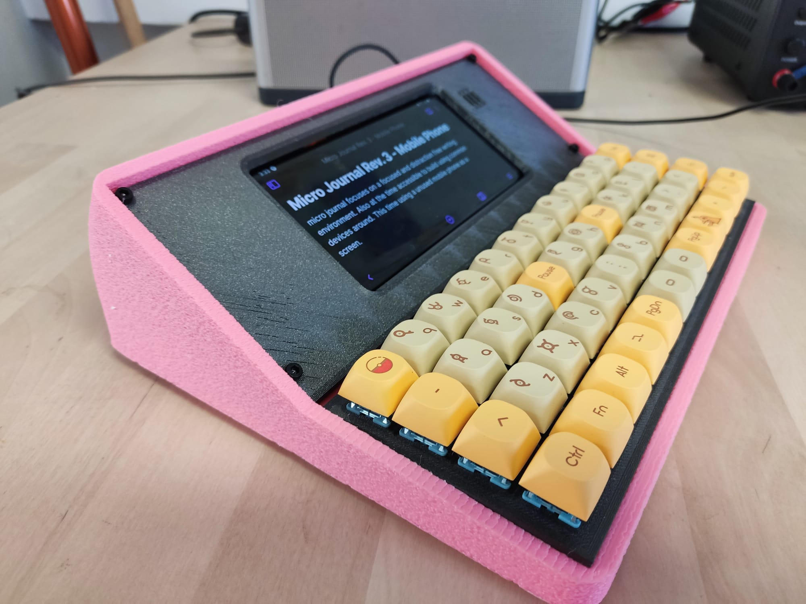

The Micro Journal is a simple yet effective tool for distraction-free writing. My latest iteration, Rev. 3, utilizes an old Samsung Galaxy S8 and a hand-wired keyboard, offering a focused writing environment with the satisfying tactile feedback of mechanical keys.

My journey with the Micro Journal began with a Raspberry Pi-based build featuring an 8-inch wide screen. While it served me well, I found its setup process and reliance on Linux to be somewhat daunting to recommend easily to others.

[Micro Journal Rev.2 Build Details](/micro-journal-rev-2-raspberypi/readme.md) 

Inspiration struck when I considered introducing my daughter to journaling. Teaching her to navigate Linux commands at the age of 8 seemed impractical. Thus, the idea of utilizing an Android phone, simpler and more intuitive, was born.

# Preparing the Samsung Galaxy s8

Digging out my old Samsung Galaxy S8, I found it in surprisingly good condition, save for a cracked back panel. After some makeshift repairs using black tape, I was relieved to discover the battery still held a substantial charge, perfect for extended writing sessions.

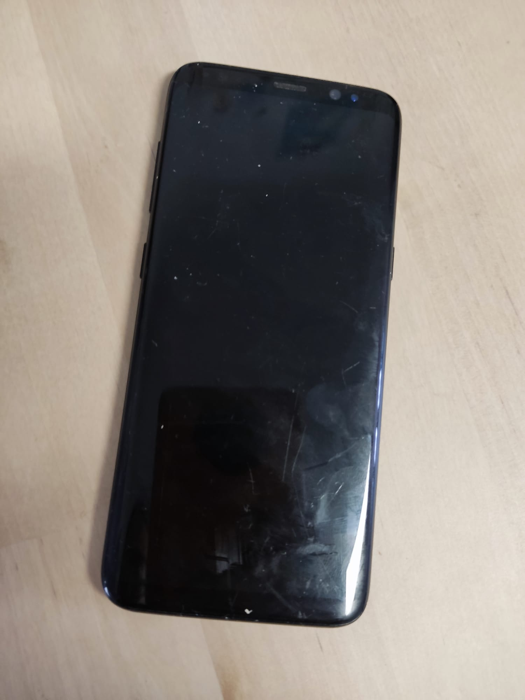

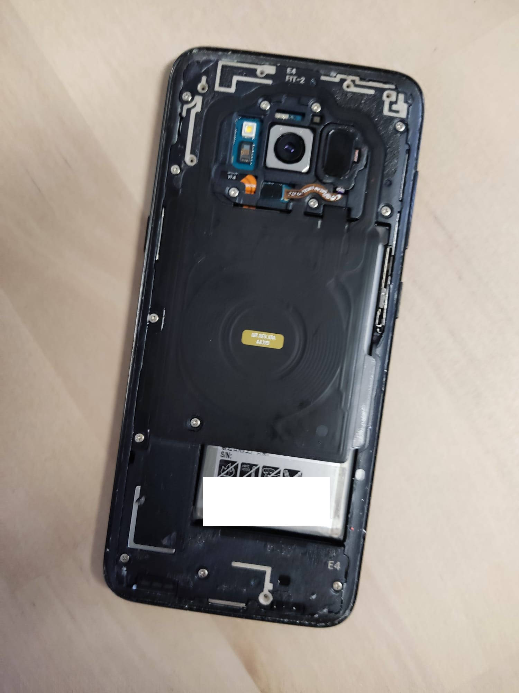

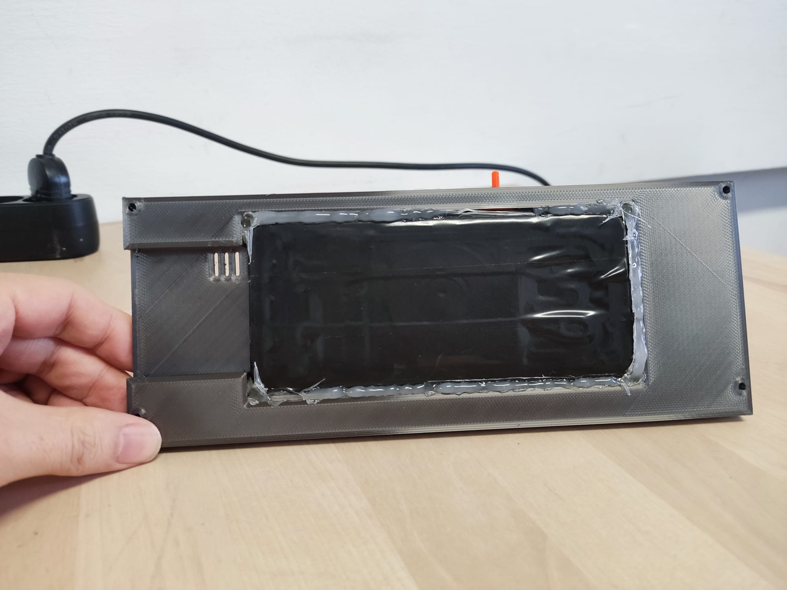

# Preparing the 3D design with Fusion 360

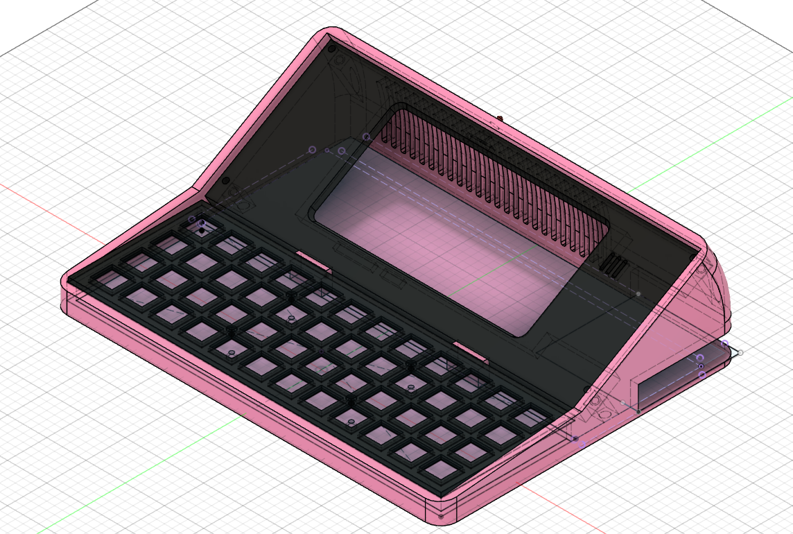

Following the framework of my previous build, I opted for a compact, accountant calculator-like design with a slight screen incline for ergonomic typing. While the pink color scheme was non-negotiable (thanks to my daughter's insistence), the design process was a delightful collaboration.

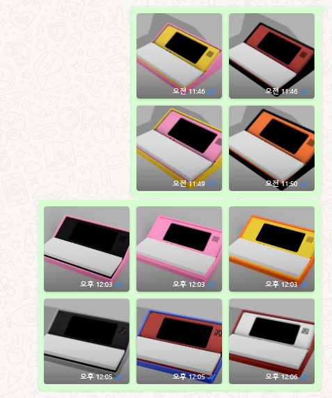

# Hand wiring the keyboard

Despite initial apprehension, hand-wiring the mechanical keyboard proved to be a rewarding endeavor. Armed with soldering skills and a 3D printer, I embarked on creating a customized keyboard layout, a process that offered both challenge and satisfaction.

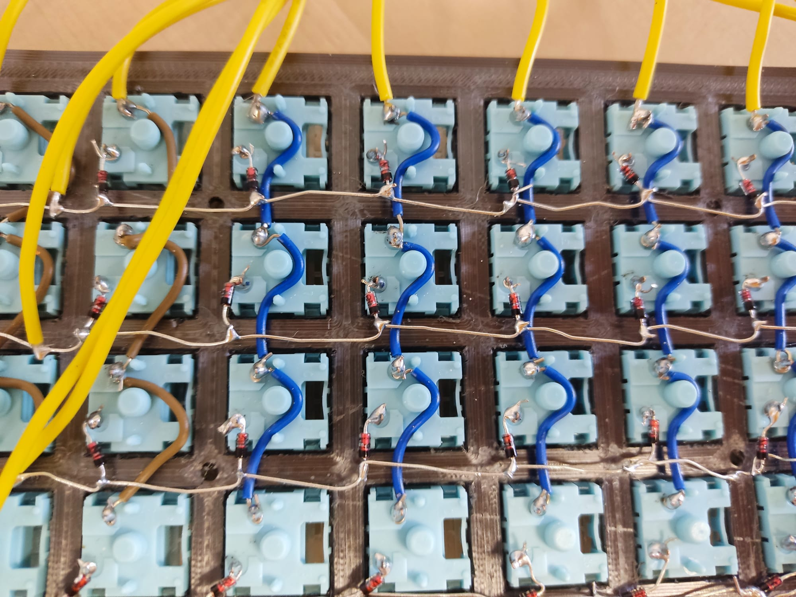

Soldering may look intimidating and I think it is going to be show stopper for many people. However, for those willing to try to learn, you should be able to get your first handwired version in a 3 - 4 hours of work.

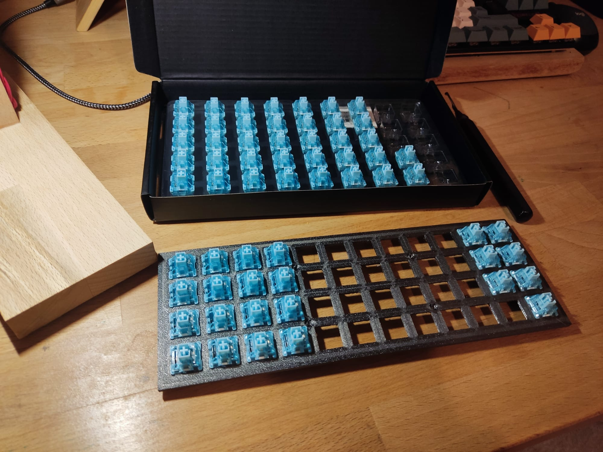

Hand wiring requires you to build a plate. It is a place where all your mechanical keyboard switches are place and fixed. You can use CAD and 3d printer to print your own. 

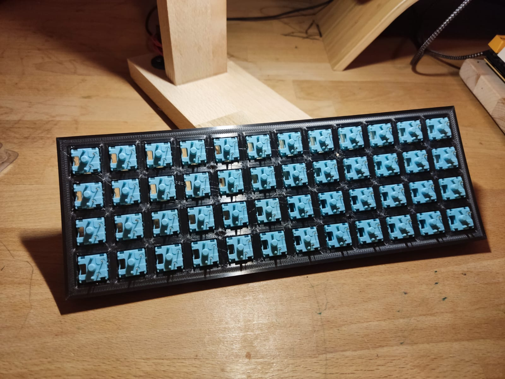

Once the plate is printed it is a process of placing the switch and wiring them with diodes and cables. 

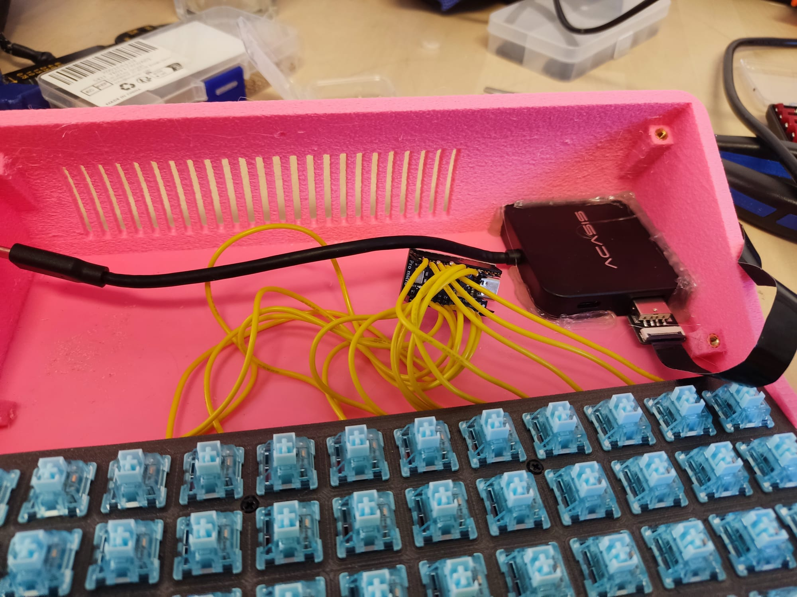

Once the keyboard matrix is done. You can connect to the micro controller in order to make it function as a usb keyboard. I have used Arduino Pro Micro as a micro controller for the keyboard. 

# Assembling the device

With the phone handling the bulk of the work, assembling the Micro Journal was a straightforward task. A USB-C hub facilitated connection to the keyboard interface.

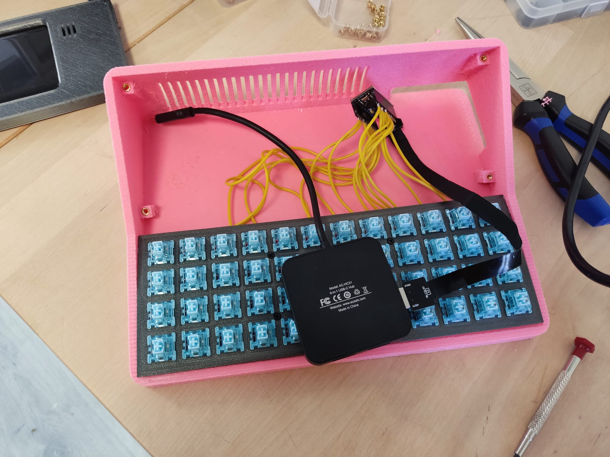

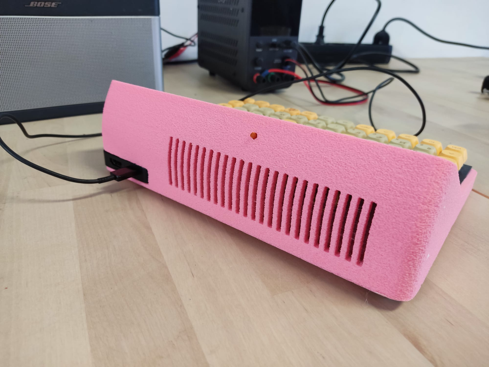

A little orange thingy sticking out is a little plastic that is going to push the power button on the phone. When it is pushed from outside, phone will power on, and also used it for turning it off. 

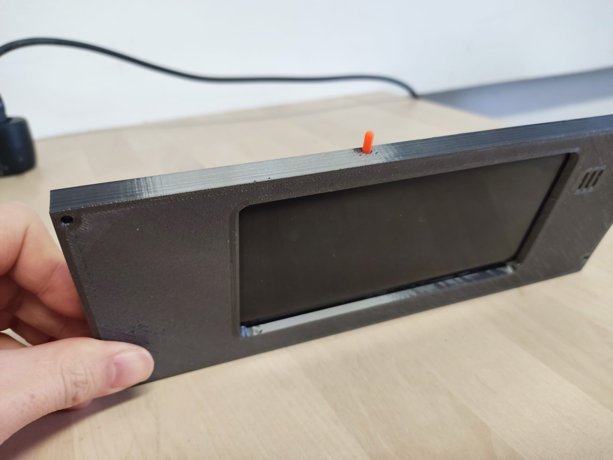

A face plate is printed and the phone is glued to the plate. I have used the Heated Glue gun to stick to the face plate. It is strong enough to hold it in place and no problem to use it as a touch interface. I had to tear it out once to adjust the position... and it was really hard to take it off from the plate. 

Putting it all together. Tighten with m3 screws. Placing the keycaps. It is done. With some adjustments for keyboard layout and it was ready for a use. 

# Writing app

I have chosen "obsidian" for the writing tool. This app provides markdown format writing and it is really useful when writing complex documents, because you can create links between documents and shows the connection though a graph. 

For oganizing idea, or digging into the complex problems, I find obsidian as a great tool. 

# Conclusion

This started as an idea to use the phone to build a focused writing device, that would be appropriate for my daughter. Hence the pink. I was thinking to make it more accessible to build for those diy'er out there... but I ended up making a hand-wired mechanical keyboard. 

Since, the mechanical keyboard is quite an essential component when it comes to a writing device like this. Hand wiring seems like a great skill to have and use for such a build. It opens up large amount of options to choose from when you can create an hand-wired keyboard. It is not that difficult, in my opinion, and it really does provide great satisfaction to my tingling sense of diy. 
