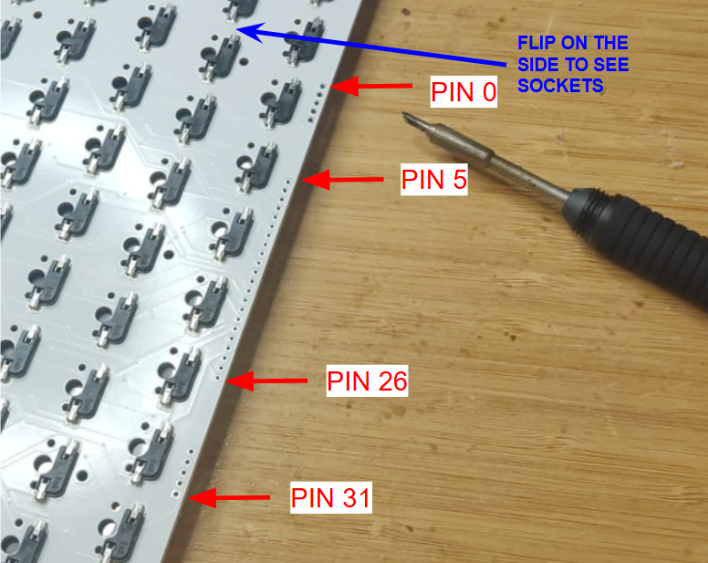
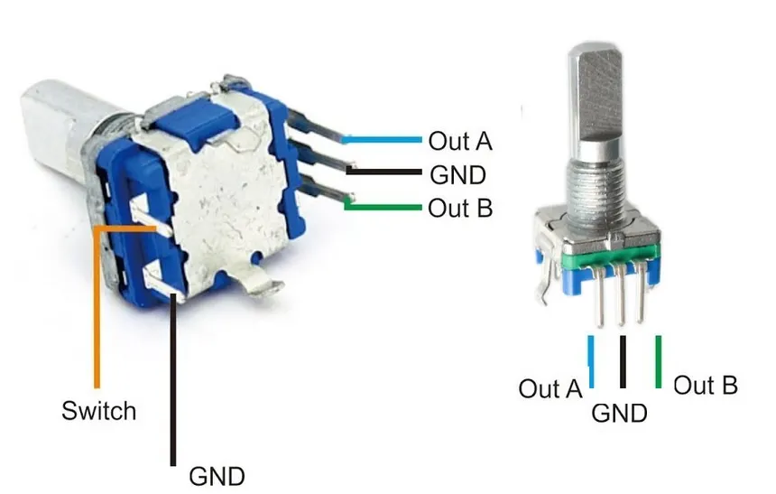
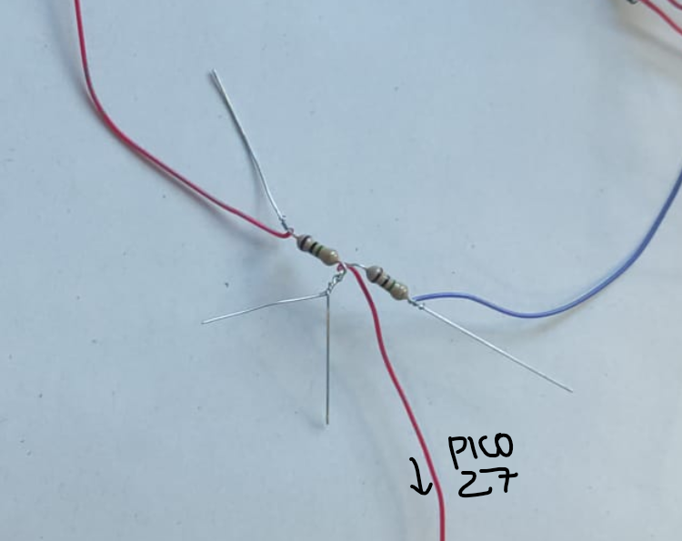

# Materials

- [RP2040-LCD-0.96, a Pico-like MCU Board Based on Raspberry Pi MCU RP2040, with LCD](https://www.waveshare.com/rp2040-lcd-0.96.htm)

### Keyboard PCB Wiring

| Keyboard PCB PIN | Connects to     |
| ---------------- | --------------- |
|                  |                 |
| Pin 5            | PICO GPIO 0     |
| Pin 6            | PICO GPIO 1     |
| Pin 7            | PICO GPIO 2     |
| Pin 8            | PICO GPIO 3     |
| Pin 9            | PICO GPIO 4     |
| Pin 10           | PICO GPIO 5     |
| Pin 11           | PICO GPIO 6     |
| Pin 12           | PICO GPIO 7     |
| Pin 13           | PICO GPIO 13    |
| Pin 14           | PICO GPIO 14    |
| Pin 15           | PICO GPIO 15    |
| Pin 16           | PICO GPIO 16    |
| Pin 17           | PICO GPIO 17    |
| Pin 18           | PICO GPIO 18    |
| Pin 19           | PICO GPIO 19    |
| Pin 20           | PICO GPIO 20    |
| Pin 21           | PICO GPIO 21    |
| Pin 22           | PICO GPIO 22    |
| Pin 23           | PICO GPIO 26    |
|                  |                 |
| Pin 26           | PICO GND        |
|                  |                 |
| Pin 27           | Knob Out B      |
| Pin 28           | Knob GND        |
| Pin 29           | Knob Out A      |
| Pin 30           | Knob Switch     |
| Pin 31           | Knob Switch GND |

Raspberry Pico 27 goes to Battery Voltage Divider

### Battery Level Inidicator

Voltage Diviver with two 1 M ohm resistor in series. 
One end of the divider goes to negative of battery holder. Other end goes to positive end of the switch when on. Middle of the voltage divider goes to PICO GPIO 27. 
Battery holder positive goes to switch when off. 