# Micro Journal Rev.4. Build Guide

This guide is for building the **Micro Journal Rev.4**, allowing you to assemble one on your own. It provides detailed information for troubleshooting if any parts of the build encounter issues and serves as a resource for those curious about the construction of the Micro Journal Rev.4.

- [Video Guide](https://youtu.be/6Jh86PdquAY)

To complete this build, basic soldering skills are necessary, though advanced skills aren't required. All components are through-hole types, so with some practice, you'll be able to achieve the level needed.

You'll also need access to 3D-printed parts to complete the build. Many 3D printing services are available, but if you'd prefer to assemble your own and are having difficulty sourcing components, feel free to contact me—I'll do my best to help provide a DIY kit.

- Build Time: 2 ~ 4 hours
- Basic level of soldering is required to complete the build
- [Buy a DIY Kit](https://www.tindie.com/stores/unkyulee/)

# Materials

- [RP2040-LCD-0.96, a Pico-like MCU Board Based on Raspberry Pi MCU RP2040, with LCD](https://www.waveshare.com/rp2040-lcd-0.96.htm)
- [69 Keyboard PCB](https://www.tindie.com/products/unkyulee/diy-kit-keyboard-pcb/)

- 12x M3 Heated Inserts OD 4.5mm Length 3mm
- 12x M3 Hex Screw Length 10mm

- 14x M2 Heated Inserts OD 3.2mm Length 3mm
- 8x M2 Hex Screw Length 5mm

- 3 AAA battery holder
- [JST 1.25mm 2P](https://it.aliexpress.com/item/1005001649158434.html)
- SPST On Off Switch Round Switch 16mm
- [USB C female to C male](https://it.aliexpress.com/item/1005007531893239.html)
- [EC11 15mm Half handle](https://it.aliexpress.com/item/1005005983134515.html) 
- [Spacebar Stabilizer 6.25](https://it.aliexpress.com/item/1005007119644385.html)
- [B-7000 Glue](https://www.aliexpress.com/item/1005005379063116.html)

- You will need TORX T10H to handle Hex screws
- A Wire Wrap Hand Tool can be a life saver for a lot of tasks - WSU-30
- Any typical wires for electronics would do. I use [Wires 30 AWG](https://it.aliexpress.com/item/1005007081117235.html)

# Build Order

1. Enclosure Preparation
2. EC11 Rotary Encoder Preparation
3. Keyboard PCB Wiring
4. Battery and Switch
5. Assemble the Enclosure
6. Upload the firmware

### Enclosure Preparation

[STL files](https://github.com/unkyulee/micro-journal/tree/main/micro-journal-rev-4-revamp/STL) for the 3D prints are available in the github.

Please, refer to the image below for placement of the prints. Vertical placements of the enclosure parts gave the best prints results, so far in my builds. This orientation gives the most coverage of the smooth surfaces.

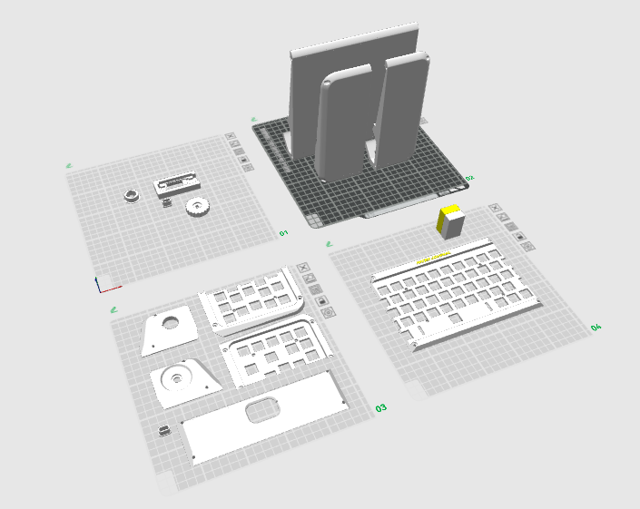

Once the prints are done. Remove the support materials from the print.

### EC11 Rotary Encoder Preparation

EC11 rotary encode needs to be prep'd. You can use Wire Wrap Hand Tool to make things easier to wrap around the wire to those legs.

Cut 10x 30 cm wires. Make two with different colors to identify the GND pin if possible.

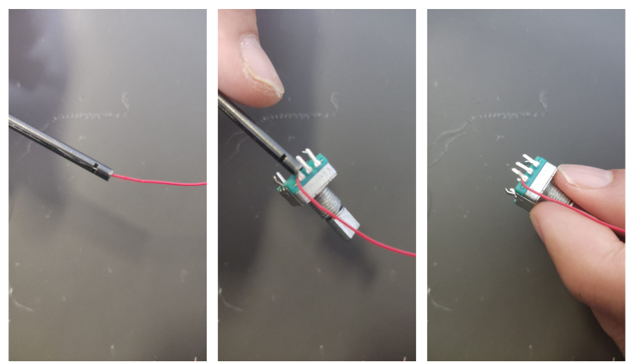

There are two holes in the tool. Pass through the wire into the hole closer to the surface. Then pass through the leg to the hole in the middle. That roll it. Afer some several roles. Wires are neatly wrapped on to the leg.

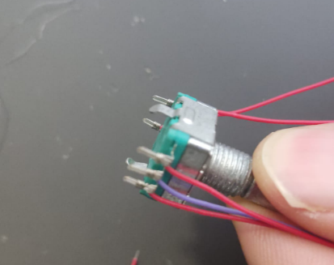

Wire up all 5 legs. Making one leg in the middle as a different color can be useful. This is GND point. The wires are pretty well stuck so, no need to do further actions. But, if you want to make sure then apply the solder in order to stick it permanently.

### Keyboard PCB Wiring

Cut 20x 12 cm wires.

Make sure to flip the keyboard PCB to see the sockets. Then from the top is PIN 0, then pin number increments till the end.

| Keyboard PCB PIN | Connects to     |
| ---------------- | --------------- |
|                  |                 |
| Pin 5            | PICO GPIO 0     |
| Pin 6            | PICO GPIO 1     |
| Pin 7            | PICO GPIO 2     |
| Pin 8            | PICO GPIO 3     |
| Pin 9            | PICO GPIO 4     |
| Pin 10           | PICO GPIO 5     |
| Pin 11           | PICO GPIO 6     |
| Pin 12           | PICO GPIO 7     |
| Pin 13           | PICO GPIO 13    |
| Pin 14           | PICO GPIO 14    |
| Pin 15           | PICO GPIO 15    |
| Pin 16           | PICO GPIO 16    |
| Pin 17           | PICO GPIO 17    |
| Pin 18           | PICO GPIO 18    |
| Pin 19           | PICO GPIO 19    |
| Pin 20           | PICO GPIO 20    |
| Pin 21           | PICO GPIO 21    |
| Pin 22           | PICO GPIO 22    |
| Pin 23           | PICO GPIO 26    |
|                  |                 |
| Pin 26           | PICO GND        |
|                  |                 |
| Pin 27           | Knob Out B      |
| Pin 28           | Knob GND        |
| Pin 29           | Knob Out A      |
| Pin 30           | Knob Switch     |
| Pin 31           | Knob Switch GND |

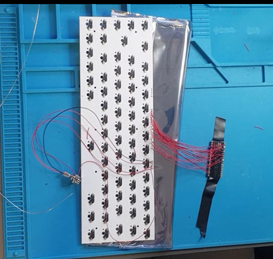

Raspberry Pico 27 goes to Battery Voltage Divider Measuring wire.

### Battery and Switch

Voltage Diviver with two 1 M ohm resistor in series. 
One end of the divider goes to negative of battery holder. Other end goes to positive end of the switch when on. Middle of the voltage divider goes to PICO GPIO 27. 
Battery holder positive goes to switch when off. 

Connect these NEGATIVE wires together:

- Battery Holder (-) 
- Voltage Divider Black Wire
- JST Black Wire

Connect these POSITIVE wires together:

- JST Red Wire
- One 10 cm Red Wire Extension
- Voltage Divider Positive Red Wire

Switch Connection:

- One end with Battery Holder (+)
- The other end with "One 10 cm Red Wire Extension"

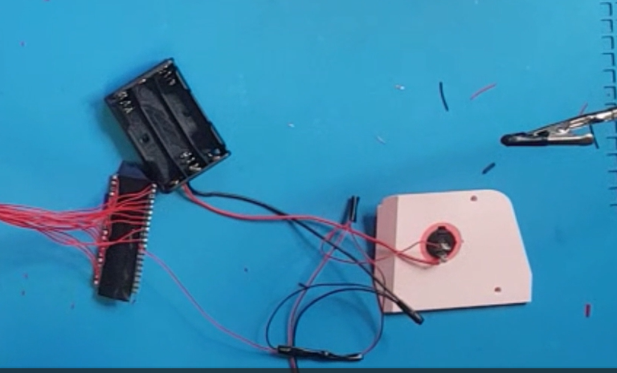

### Assemble the Enclosure

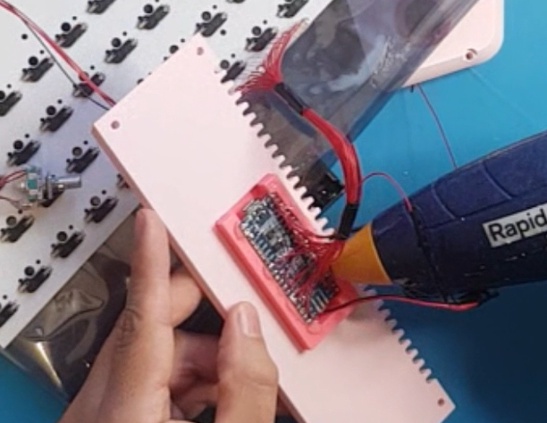

Snap in the display module to the display port.

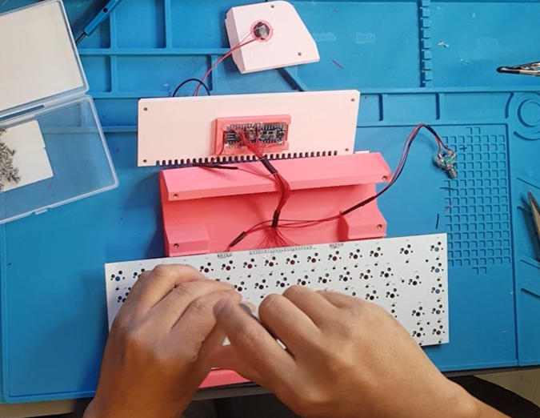

Place the Keyboard PCB and screw it with m2 screws

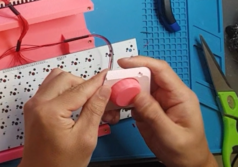

Install EC11 Rotary encoder and place the knob handle

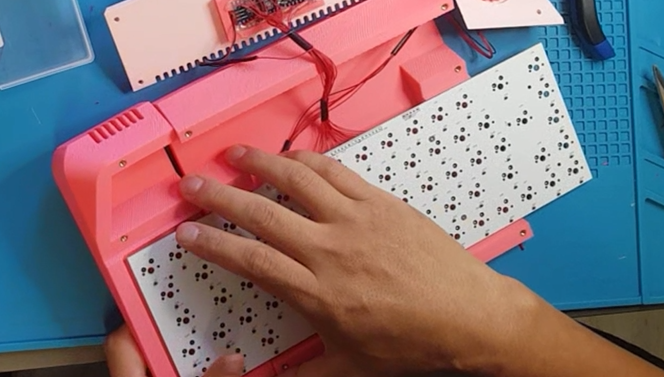

Assemble Left and Right enclosure and screw them with 70 mm m3 screws.

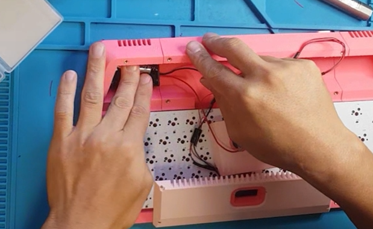

Use a double sided tape to hold down the battery holder on the left hand side

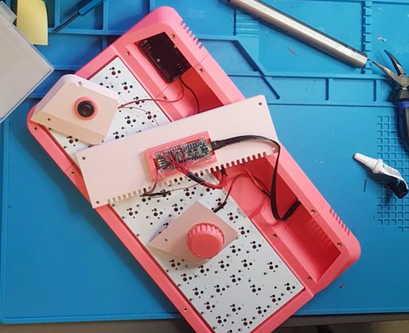

Use USB extension cable to connect the display module and extend it to the USB port

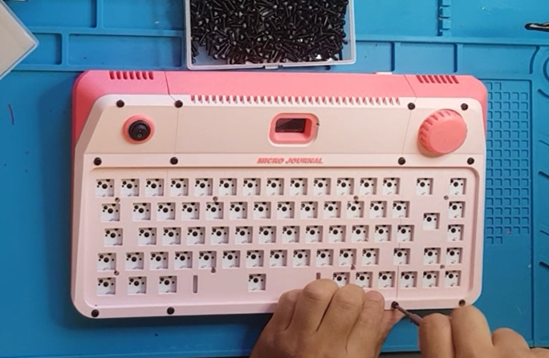

Use 10 mm m3 screws to hold down the front panels

### Upload the firmware

Once assembly is complete, it’s time to flash the firmware.

- Download the [GitHub repository](https://github.com/unkyulee/micro-journal/tree/main)
- Install Visual Studio Code on your PC.
- Install the PlatformIO extension within VS Code.
- Open the folder “micro-journal-rev-4-esp32” in VS Code.
- Connect your device to the PC via USB.
- Upload the Rev.4 firmware.
