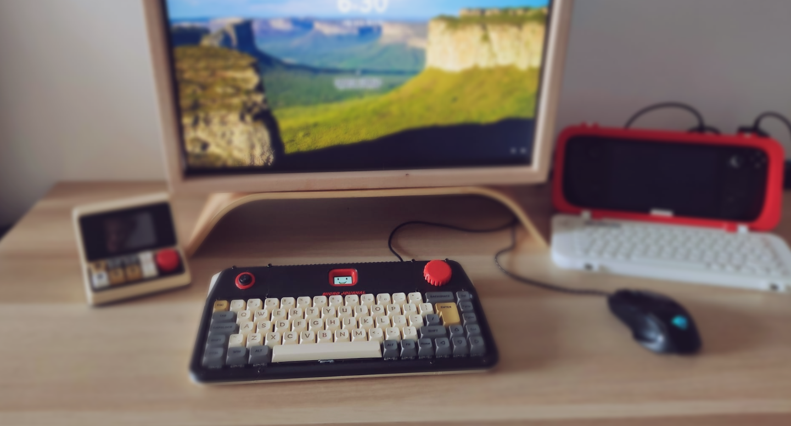

## Micro Journal Rev.4.Revamp: Captain Hook

What makes a good keyboard for a writer? Micro Journal Rev.4 is a computer keyboard, but it's designed with writers in mind. People who craft words carefully, arrange them professionally, and need a tool that adapts to their workflow. Here's what I focused on to make this keyboard truly unique and indispensable.

**Specialized keys for writers.** Sometimes the smallest details matter. Em dashes, accented letters like é, copyright symbols ©, open and close smart quotes, ellipses … All these tiny characters make a big difference in polished writing. Rev.4 gives you easy access to them without breaking your flow.

**Customizable key behavior.** Every writer works differently. Caps Lock might be useless for one person but essential for another. In Rev.4, you get full control over what each key does. Swap functions, assign macros, or replace rarely used keys with your favorite shortcuts. It's your keyboard, your rules.

**Capture instant thoughts.** Inspiration doesn't wait. The moment an idea sparks, you want to jot it down immediately. With Rev.4, switching from normal keyboard to writerDeck is fast and intuitive. That fleeting sentence or sudden insight is never lost. You can capture it right in front of your screen.

**Typing should feel good.** Writing is physical as well as mental. The feel of each keystroke matters. Rev.4 uses mechanical switches and carefully considered ergonomics so that typing is not just functional, but pleasurable. Long writing sessions become less fatiguing and more immersive.

Rev.4 was designed as a bridge between everyday work and spontaneous writing. At its core, it functions as a regular mechanical keyboard for your computer, but with a flick of a switch, it instantly transforms into a standalone writerDeck. This makes it perfect for those moments when inspiration strikes while you're at your desk. Instead of reaching for a notebook or hunting for another device, you can capture thoughts and ideas right away, without breaking your flow.

### Documents 

* [Story behind the Rev.4](./story.md)
* [Feature and Use Case of Rev.4.ReVamp](https://youtu.be/C-KRcLu5P9o)
* [Quick Start Guide](./quickstartguide.md)
* [Build Guide](./build-guide.md)
* [User Manual for the Micro Journal written by Hook](./user-manual.md)

### Resources

* [Firmware Release Page](https://github.com/unkyulee/micro-journal/releases)
* [Firmware Source Code](../micro-journal-rev-4-esp32/)
* [Design Files](./STL)
* [Keyboard PCB](../micro-journal-rev-7-e-ink/PCB/)  

### Videos

* [YouTube Playlist of Micro Journal Rev.4](https://www.youtube.com/playlist?list=PLrUXYLEnAaNRAbBpNLji7nE78z-edy8Na)
* [Build Video](https://youtu.be/6Jh86PdquAY)

### Community

* [Flickr - AlphaSmart - Writing Tools](https://www.flickr.com/groups/alphasmart/discuss/72157721923133428/)
* [Reddit - writerDeck](https://www.reddit.com/r/writerDeck/)

### Online Shop

* [Order from Un Kyu's Tindie Shop](https://www.tindie.com/stores/unkyulee/)

