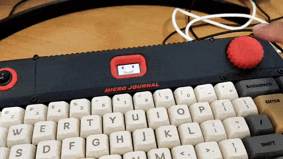

# Micro Journal Rev.4.Revamp — Behind the Story

Micro Journal Rev.4.Revamp is a hybrid mechanical keyboard designed for writers. A regular computer keyboard that transforms into a standalone writerDeck for capturing fleeting thoughts.

Writing a book, or publishing an article, involves a lot of typing. Usually in front of a computer. There's editing, fixing typos, checking spelling, rearranging and refining paragraphs. On top of that, countless editorial and technical tasks fill the workflow. All of this means the writing process keeps you sitting in front of a screen for hours.

So of course, the first thing that came to my mind was: *build a keyboard.*

While writing, the screen shows nearly finished paragraphs. Sentences grow, words appear. But in my head, fragments of other thoughts are flying by. Some belong to the context, some come from nowhere with a smooth vibe. I can't stop chasing that golden sentence I just thought of. It doesn't fit right now, but it feels too good to lose. *Where's my notebook? Where's my pen?* Let me write this down for later.

Oh crap... what was it? Gone. Back to the draft.

Life goes on. But it always feels like those fleeting thoughts are worth capturing. Maybe they're nothing. Maybe they're worth noting. You never know.

---

## The Trigger Moment

My wife and I decided to set up office space at home: two desks, two monitors, two computers… and keyboards. She asked, *"Do we have any extra keyboards?"*

For over a year, I'd been building devices for writing. Not a single one could just plug into a PC. Should I tell her to order two from Amazon? Pride wouldn't allow it. Instead, I dug through the garage, found an old keyboard, tossed it to her, and said, *"Use this. We won't be working from home that much anyway."*

I could see her thinking, without saying it out loud: *No keyboard for me? Seriously?*

That small moment sparked **Rev.4.Revamp**—the idea that a proper computer keyboard could come first, before the Micro Journal.

Through testing and feedback from writers, Rev.4.Revamp grew into something far beyond a simple keyboard. What began as my wife's offhand complaint became a tool that any writer would actually love. A keyboard designed to catch fleeting ideas, keep your flow, and make writing a pleasure.


---

## Design Motives

This one had to be a staggered layout. I wasn't about to risk my marriage trying to explain ortholinear. She'd ask every time: *“Where's the F5 key?”*

It also needed a display. But how big? How wide? What proportions would feel natural?

The keyboard had to remain the star of the show. If the display stood out too much, the keyboard would become just a supporting character. Too small, and the display would be useless for writing.

I wanted something I would personally find useful for writing. Enough to justify the effort. Still, doubts crept in. Was I trying to catch two birds with one stone, and risk losing both?

  

I sat down in Fusion 360, sketching key dimensions and testing how a display might fit. Normally keyboards are just keys and enclosure. Adding extra elements, a display, batteries, charging modules, required more space.

But the more space I added, the less it looked like a keyboard.

  

At one point I thought: what if it had *no screen at all*? A writing machine, like a keylogger? Maybe just an LED to confirm input, with no way to see the text. Crazy, right? But someone online had actually asked for that. Makes me wonder. What is the essence of that desire?

I slept on the idea. Maybe just a minimal indicator is enough. You don't *need* to see every word. In fact, it might encourage better writing. No chance to endlessly reread and edit. Just keep writing.

That thought stuck with me.

Writing is hard, mostly because of fear. Fear that what you're writing isn't good enough. Fear that the first word will set the wrong tone. So you reread, refine, rearrange. Again and again. Until "Chapter 1" sits blank for months.

But Micro Journal is about capturing flowing ideas. Not perfect texts. It's about lowering the resistance to just *write*. Thoughts don't need to be correct. They don't need to make sense. Just capture them. Like a journal only you will ever read.

If no one else will see it, do you still need to be correct?


---

## Evolution of the Idea

During the development of several Micro Journal revisions, I exchanged ideas with a number of writers. Their requests often centered on accessing specific characters—like `·` (middot) or `—` (em dash). Symbols I had never used myself. Yet, for professional writing, they felt essential. Word count also emerged as a crucial metric for them.

I love writing, but I'm not a professional writer. These little details were new to me, and I didn't fully grasp how much weight each request carried. Then Hook entered the picture. We talked a lot. He loves micro journals, and I love that he loves them. When he asked for something, I took it seriously and tried to bring it into the real world as best I could.

Hook specifically wanted an em dash on his keyboard also. He even described exactly how he typed it: a combination of Alt keys and the numpad to generate the single character. Implementing that wasn't a big deal technically. A macro could handle it. So, I added a custom macro feature to the key mapping system.

Through these exchanges, Micro Journal Rev.4 gradually found its purpose. It was shaping up to be an excellent keyboard for writers, designed with the small but meaningful details that make professional writing smoother.

---

## How I Want It to Look

With the core needs of writers clear, it was time to turn those ideas into something tangible.

  

Somewhere in a doomscrolling session I stumbled on this Sony MSX image. Not sure if it was ever a real product or just some concept art. But it hit me hard. That's the vibe I want to bring into reality.

I like the overall geometry. Rectangular body. That pyramid-style incline on the keyboard side. Then a boxy section where the disk drives live. On top, a row of control keys and status LEDs—slightly raised. Matching the height of the disk unit. That incline makes the perfect resting spot for a little screen. Good angle for the display.

  

Looking at real implementations, you notice the sharp side cuts, giving that pyramid bottom look. These are the cues I want to carry forward. Problem is. This thing would be too large for my 3D printer in one piece. So, I'd need a joint system somewhere. With that in mind, I jumped into Fusion360.

  

That's where I ended up something close to the inspiration but with compromises. Notice the space bar. On the MSX it sits deeper into the enclosure, but on a mechanical keyboard that doesn't work so well. When your palms rest on the desk, your thumb has to rise up to hit the bar. If the case is too thick, your thumb runs into the enclosure edge before finishing the press. The MSX probably got away with it because their spacebar had a shallow travel. With mechanical switches, the bar sinks deeper. So, I pushed the keyboard closer to the front edge.

I also liked the idea of a handle under the space bar. But typing comfort came first. Plus, I'm limited to about 23 cm max size for a single print. That constraint forced me into a simpler shape than the original inspiration. At first, I was copying MSX elements one by one. Then, slowly, my own constraints and ideas took over.

  

From there it was about real-world details—wiring paths, assembly, battery compartment, how someone would open it to swap battery. The more practical requirements I folded in, the further I drifted from the original sketch.

  

And that's the final form. Doesn't scream MSX anymore, but you can still smell the influence. And a lot of me in there too. I'm happy with that.

---

## Keyboard VS writerDeck

  

Main role: computer keyboard. But then, how do you switch into writerDeck mode? My first thought was a toggle switch. Flick up, flick down. Keyboard to writerDeck. Felt intuitive.

The problem was power. This thing can run standalone, so it needs batteries. But when plugged in via USB, it also gets power from the PC. On top of that, the same switch would need to signal writerDeck mode vs keyboard mode. Then add charging logic on top. That matrix of cases got messy real quick.

In the end, the power switch just handles battery connection. ON = battery connected, powering standalone or charging. OFF = battery isolated. Simple.

  

For mode switching, I went with a knob. Endless rotation left/right + click. It feels distinct—something apart from the keyboard itself. Click to jump between keyboard and writerDeck. Once you've been told, it sticks. Long press opens the config menu. It ended up being the most natural way out of the problem.

---

## So, how is writing on it feels like?

I had doubts. The screen is tiny. Like, really tiny. Could I actually write on it? People already complain about micro journals having too small of a display. This is even smaller. Way smaller. Did it even make sense?

I gave myself a simple challenge: just build it, try it, see how it feels. My goal wasn't to make it perfect. Just "OK enough" to write on, while still being first and foremost a keyboard.

  

And honestly? It surprised me. The display is barely an inch, but it's sharp, high resolution, and very readable. Small enough that you get pulled into it. I could see what I was typing, fix typos, and trust that everything was being captured. I ended up writing way more text than I expected. Seeing my micro journal software running on that really tiny screen was incredibly satisfying.

Not claiming this is the "best" screen size for writing. It's definitely a constraint. But I wanted to explore what kind of feeling emerges when you push the limits this far. Here's a review from Hook—someone else willing to give it a fair try:

[Hook's first impression on Micro Journal Rev.4](https://www.flickr.com/groups/alphasmart/discuss/72157721923133428/)

```
Coming back to the small screen - we think you'll be surprised. It really helps you focus. There is nothing else you can do. The font is clear and readable, the mechanical keyboard is excellent. It pulls you in. The analogy is to watching a movie on your 6 inch cell phone. If the screen quality is good, it doesn't matter that it is a "small" screen compared to watching it on a large 4K TV. Once you get pulled in, your attention immerses you in the movie.

- From Hook's User Manual
```

---

## SEND, the text!

One of the most fun parts was seeing the text come back out. AlphaSmart has this "SEND" function. It basically pretends to be a keyboard and types everything back into the connected device. Like watching a ghost version of yourself type really fast.

Hook kept requesting this feature, so I tried it out. Rev.4 doesn't have wireless, so you need to plug it into a PC for transfer.

  

And honestly, SEND turned out to be the best! Most intuitive way to move text. One click. Boom. It types itself back out, while you watch. Gives you time to review line by line, catch mistakes, and feel the satisfaction of seeing it all replayed.

I even started using it for email replies. I'll leave the email draft open, switch into writerDeck mode, write my reply point by point, then SEND it all into the window. Clean, controlled, and satisfying.


---

## Closing Thoughts

Building the Micro Journal Rev.4.Revamp wasn't just about solving a keyboard problem. It was about bringing an idea to life with my own hands. From sketches on Fusion 360 to 3D printed parts, circuits, and finally the satisfying click of the keys under my fingers, every step felt alive with possibility. There's a quiet joy in holding something that exists only because you decided to make it real.

Projects like this aren't perfect products off a shelf. They're full of small decisions, compromises, and experiments that tell a story not just of the device, but of the process itself. Every revision carries a bit of that curiosity and playfulness, a trace of the person who built it.

I hope some of that joy comes through here. More than that, I hope it sparks something in you. If the idea of capturing your thoughts on a tiny machine you built yourself excites you, dive in. Follow the guides, tinker with the design, customize it, and see what you can create. The best part of making isn't just the finished object. It's discovering that you were capable of it all along.


Un Kyu Lee