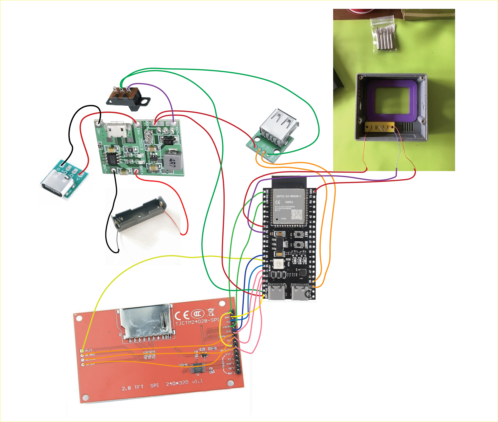

# DIY Build Guide for Micro Journal Rev.5

This guide walks you through building your own **Micro Journal Rev.5** device. I'll cover all the steps, tools, and components you'll need. If you run into issues or find something missing, feel free to reach out.

This is a **free and open-source project**. All design files and source code are freely available. If you find this project useful and want to support further development, even small gestures mean a lot.

* [Buy me a coffee](https://www.buymeacoffee.com/unkyulee)
* [DIY Kit - Micro Journal Rev.5](https://www.tindie.com/products/unkyulee/diy-kit-micro-journal-rev5/)

---

## Video Guide

* [Build Video](https://youtu.be/xDClC_4uQIw)

The full build process has been recorded. If you get stuck, the video may help clarify the trickier steps.

---

## Components Used

* [ESP32-S3 N16R8](https://www.amazon.it/gp/product/B0CLD4QKT1)
  – Any ESP32-S3 devkit will work (not limited to N16R8). The firmware also runs on ESP32 Wroom boards with less flash/PSRAM.

* [ILI9341 2.8" TFT LCD (240x320)](https://www.amazon.it/ILI9341-Display-seriale-Arduino-Raspberry/dp/B07YTWRZGR)
  – Includes a built-in SD card slot (used in this build). Variations exist, so double-check dimensions if using the provided STL files.

* [LiPo Charge Controller + 5V Boost Module](https://www.amazon.it/Ouitble-caricabatteria-integrato-scarico-caricabatterie/dp/B09MQ6ND2Q)
  – A simple, versatile power solution for 5V projects.

* **Micro SD card** (≤32GB recommended)
  – Avoid ultra-fast cards; simple cards work better. If using >32GB, create a partition ≤32GB (ESP32 is 32-bit and can't read larger).

* USB-C female adaptor

* 6mm push button

* SPDT position switch

* [8x M3 heat inserts (3mm length)](https://www.aliexpress.com/item/1005004535859664.html)

* [8x M3 hex screws (10mm length)](https://www.aliexpress.com/item/32442183034.html)

* [2x M2 machine screws (6mm length)](https://www.aliexpress.com/item/1005004177352184.html)

---

## Required Skills and Tools

* Basic soldering skills
* Soldering iron
* Philips screwdriver
* TORX T10H driver (for hex screws)
* Hot glue gun
* 30 AWG wires


---

## Step 1. 3D Print the Enclosure

* [STL FILES](https://github.com/unkyulee/micro-journal/tree/main/micro-journal-rev-5-esp32-usbhost/STL)

Print, fit, and assemble with heat inserts and screws.

  


---

## Step 2. Preparing the Display

1. Wire the **MOSI, MISO, and CLK** pins from the SD card side to the display side. Assign the SD card's CS pin to the ESP32 board.
2. Both the display and SD card use the **SPI bus**, so MOSI, MISO, and CLK are shared.

Expose the following pins as \~10 cm wires (to connect later to the ESP32):

* MISO
* MOSI
* SCLK
* DC
* RST
* VCC + LED (tie together)
* GND
* CS (Display)
* CS (SD)

When finished, the module should look like this:

  

---

## Step 3. Power Supply

The LiPo charger module is the core of the power system:

* **OUT →** position switch → ESP32 power connector
* **IN →** USB-C female connector (for charging)
* **BATT →** battery pack (e.g., 18650 cell or any LiPo)

⚠️ Double-check polarity. Connect positives (+) to positives and negatives (–) to GND.

  

Image courtesy of *DessyTab*, who struggled (and survived) through figuring out the wiring.

---

## Step 4. Preparing the USB-A Female Connector

This is where your keyboard plugs in. Look for "USB-A female connector module" (example [here](https://www.aliexpress.com/item/4001146122421.html)).

Connections:

| Pin  | Purpose                |
| ---- | ---------------------- |
| GND  | To power supply GND    |
| VBUS | 5V from sliding switch |
| D-   | ESP32 pin 19           |
| D+   | ESP32 pin 20           |

  

---

## Step 5. Wiring the ESP32

Solder wires according to this pinout:

**SPI + Display + SD:**

| ESP32 Pin | Purpose                 |
| --------- | ----------------------- |
| 13        | MISO                    |
| 12        | SCLK                    |
| 11        | MOSI                    |
| 10        | CS (Display)            |
| 9         | CS (SD)                 |
| 46        | DC (Display)            |
| 3         | RST (Display)           |
| 3V3       | VCC (Display)           |
| GND       | GND (Display + Buttons) |

**USB Host:**

| ESP32 Pin | Purpose |
| --------- | ------- |
| 19        | USB D-  |
| 20        | USB D+  |

**Optional Buttons:**

| ESP32 Pin | Purpose |
| --------- | ------- |
| 16        | Back    |
| 15        | Menu    |

When done, it'll probably look like this:

  

Yes, it's spaghetti. Delicious, functional spaghetti.


---

## Step 6. Compile & Upload Firmware

1. Clone the firmware repo:
   [https://github.com/unkyulee/micro-journal](https://github.com/unkyulee/micro-journal)
2. Navigate to `/micro-journal-rev-4-esp32` for the PlatformIO project.
3. Open in **Visual Studio Code** with the PlatformIO plugin.
4. Compile and upload to ESP32-S3.
5. Run `Platform → Upload Filesystem Image` at least once to set up SPIFFS.

You may also need to edit:
`/src/service/keyboard/usb/usb.cpp` → adjust `usbHost.setHIDLocal()` for your keyboard layout.

  

---

## Step 7. Google Drive Sync

1. Copy the Google Apps Script from:
   `/micro-journal-rev-4-esp32/install/google/sync.js`
2. In Google Drive, create a new Apps Script, paste the code, and deploy it as a **web app**.
3. Copy the web app URL.
4. Add it to `config.json` on your SD card (see next step).

---

## Step 8. Configure WiFi (config.json)

On the SD card, create a file called `config.json`:

```json
{
  "network": {
    "type": "wifi",
    "access_points": [
      {
        "ssid": "WIFI_AP_NAME",
        "password": "WIFI_PASSWORD"
      }
    ]
  },
  "sync": {
    "url": "Google Apps Script URL here"
  }
}
```

This enables WiFi and Google Drive sync.

---

That's it! Your **Micro Journal Rev.5** is ready to type, save, and sync.


