# Quick Start Guide

# Diagram

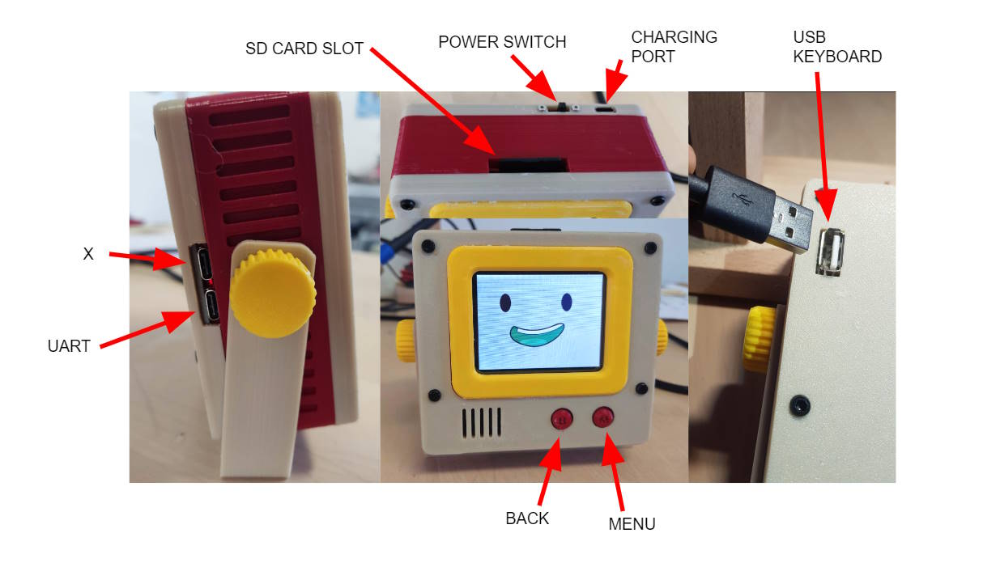

# First things to do

When you receive the writerDeck, you need to first install a battery and SD card. Please, follow the steps below to complete the setup.

Also, please update the firmware when you receive the device. The firmware on the device is still under development and you may not have the latest releases. You can find the guide how to update the firmware on this document.

# Battery

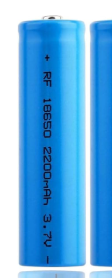

writerDeck requires one 18650 3.7V Lithium ion Battery. Search with keyboard "18650" in amazon then you should be able to find one. Both flatop and button top works fine. 

* LiPo 18650
* Flattop, Button Top both fine
* Check for Short Circuit Protection on the battery
* Not more than 3300 mAh capacity

**This is not AA battery or AAA battery.**

Please, note that when buying the battery, please buy from a well known brand. One of the tip when buying the battery is to look for maximum capacity. It should _NOT_ be higher than 3300 mAh. There are no such battery with this form factor that has higher capacity that 3300 mAh, so, be careful and note this number when buying a battery.

Make sure that the battery has short circuit protection on it.

In case, you don't have the battery yet. You can plug in a usb cable to the charging port. The device should be able to turn on with it.

# SD card


writerDeck takes a SD card. Try to buy lower capacity as possible. If the size is bigger than 32 GB... you need to setup a special partition to make it recognized in the writerDeck. I believe 1 GB should be more than enough.

Some ultra fast sanDisk micro SD cards were not recognized. So, try to buy something not that fancy.

Make sure to buy the one that has the adapter to the bigger size. writerDeck takes the bigger size SD card.

# Step 1. Open the back cover and install the battery

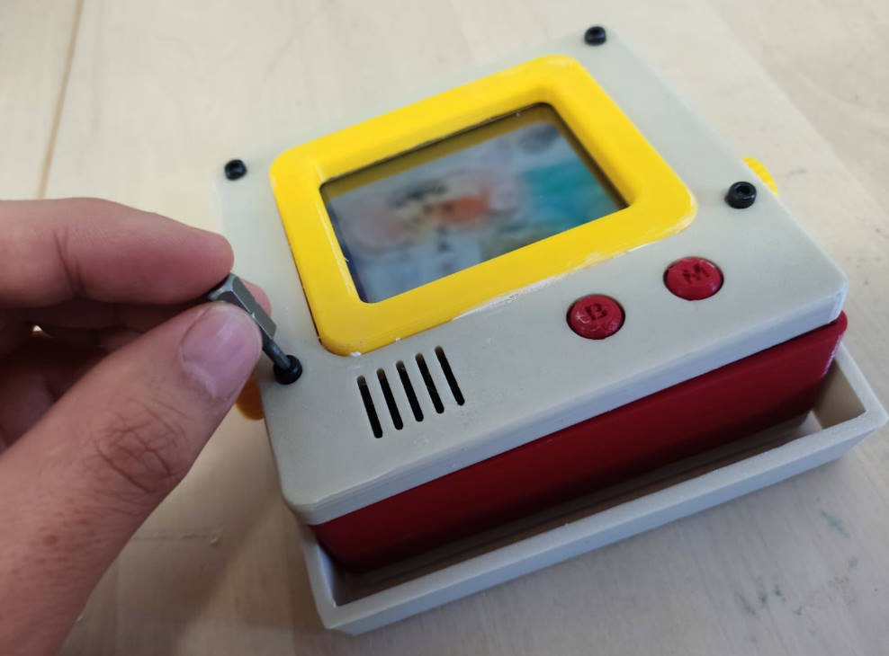

**PLEASE BE EXTRA CAREFUL TO + and - POLARITY OF THE BATTERY**

Install the battery when the enclosure is open. Battery holder should have the polarity written on the bottom. Please check carefully before inserting the battery.

The place with the spring on the holder is the negative (-) side. 

Check that the positive (+) end of battery is making contact with the positive terminal in the battery panel. Battery can fit snugly, preventing contact. Suggest turning on power switch to confirm connectivity before putting screws back.


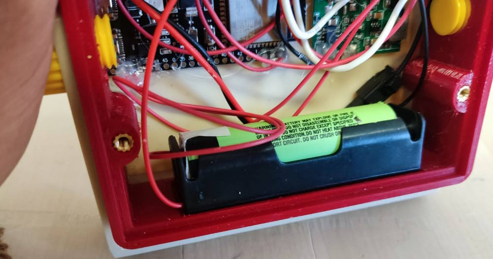

**PLEASE BE EXTRA CAREFUL TO + and - POLARITY OF THE BATTERY**

When installed the battery with the wrong polarity, it can cause a unreparable damange to the device.

**Be extra careful with the battery. It can cause fire**

When closing the enclosure back. Check very carefully while screwing. Do not force it too much. If the case is not getting aligned well. This means some cable may be clipped. Take a lot of attention when closing the enclosure to check if any cable is clipped. This can cause short circuit and damage the component and in some cases can cause a fire.


# Step 2. Prepare SD card

SD card needs to be formatted before inserted into the writerDeck. Connect the SD card to your computer, and initiate formatting process.

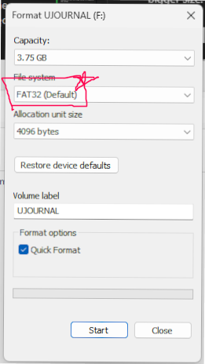

Make sure to format the disk with File system **FAT32**

In case FAT32 options are not appearing. You will need to create a partition that is smaller than 32 GB.

Once the SD card is formatted. Put it inside the writerDeck and the writerDeck should be ready.

# Step 3. Google Sync Setup

## 1. Connect to Google Drive

https://drive.google.com

## 2. Create a folder: "uJournal"


## 3. Go inside the uJournal folder

## 4. Create Google Apps Script

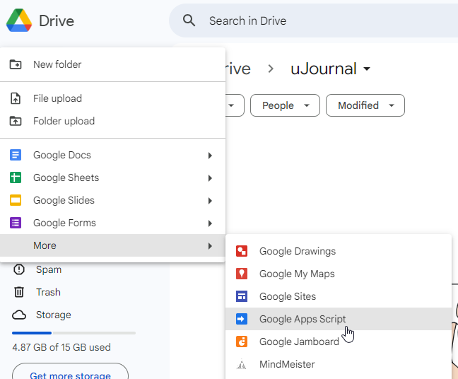

## 5. Copy the Sync Script

Open the following link to get the lastest script code. Open it can copy and paste the code to the apps script. Overwrite what was existing in the apps script before

https://raw.githubusercontent.com/unkyulee/micro-journal/main/micro-journal-rev-4-esp32/install/google/sync.js

Give some name to the apps script project

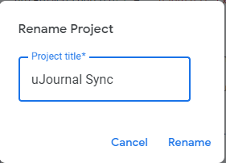

## 6. Deploy the Apps Script

Click on the "Deploy" button

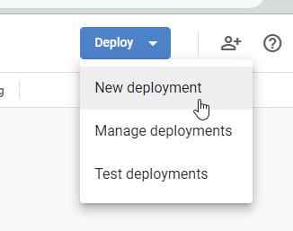

Choose the deployment type as "Web app"

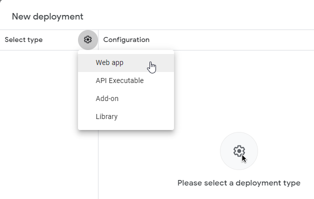

Configure as the following. Execute as "Me". This will allow the script to access to your drive.


Who has access as "Anyone". This way writerDeck can access to the drive. As long as you don't share the link that is provided. Only the writerDeck should have access to the drive.

## 7. Press "Deploy" on the popup

Wait for a bit, then it will ask you to authorize the app. Choose the account of the google drive.


It will give a scary message while authorizing it. The script that you just copied is not verified. Considering that this script is on your google drive and will access your own google drive, it is ok to press, "go to uJournal Sync".


Allow the Drive access at the next screen. Your account name should appear. (Not mine)


## 8. COPY THE LINK PROVIDED AS WEB APP URL


## 9. Open the SD card of the writerDeck

Connect the SD card to the PC and create a file "config.json" \
If the file already exists then no need to create one \
Open the file with a text editor (notepad) from PC. 

If aren't familiar with the JSON format. Then delete the existing content and replace it with the following json. Then edit the following part only. 

!!!COPY YOUR WEB APP URL HERE!!!!!

Make sure to not to remove / add any comma (,) or bracket ({, }) or quotes (") while you are editing. If by any chance, the format gets broken. Start over by removing all texts inside config.json file and copy & paste the following template.

If you are familiar with the JSON format. One thing you need to add is the "sync" property as the root property in the JSON and leave the rest of the property as it is.

```json
{
  "sync": {
    "url": "!!!COPY YOUR WEB APP URL HERE!!!!!"
  }
}
```

Save the file to the sd card. Safely remove the card from the PC and then you place the SD card back to the writerDeck. After that you should have your Google Sync working with the writerDeck.

While you are on the writerDeck. Press "ESC" on the keyboard then press "S" to see if it is working. Make sure to have the wifi information set before the sync.

**NOTE THAT WIFI IS LIMITED TO 2.4 Ghz. ESP32 doesn't support 5 Ghz wifi at this moment**


## 10. Wifi Setup

* Press ESC on the keyboard
* When you see the menu screen press W 
* In the wifi settings page press the number of the slot where you want to place the wifi information
* type in WIFI SSID then press enter
* type in WIFI password then press enter
* wifi information is saved to the device


# Firmware Update

Please, make sure that you have the latest firmware on the device. The firmware is still under a development and your device may have shipped with outdated firmware.

To check the current firmware version. You can press "ESC" on the keyboard or "M" button on the device to see the version.

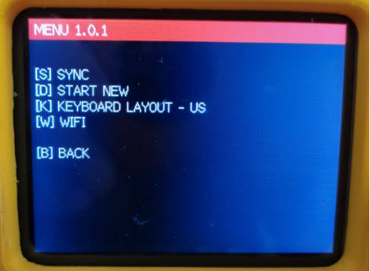

**!!IF YOU SEE 1.0.0 ON YOUR SCREEN PLEASE UPDATE THE FIRMWARE!!**

## 1. Check latest release

You can check the latest firmware from the following link.

https://github.com/unkyulee/micro-journal/releases

## 2. Download the "firmware.bin"

Download the file from Assets "firmware_rev_5.bin"

## 3. Place "firmware.bin" inside the SD card

Turn off the writerDeck. \
Pull out the SD card from the writerDeck. \
Copy "firmware_rev_5.bin" file inside the SD card. \
Put back the SD card to the writerDeck. \
Turn on the writerDeck. \
writerDeck will show white screen for 10 seconds then automatically boot again to the updated firmware.

In case if firmware_rev_5.bin does not trigger the update. Try to rename to firmare.bin and try again.

# USB Keyboard

Most of the USB keyboard should work by connecting to the writerDeck.

- Bluetooth keyboard is not able to connect to the writerDeck. (Should be possible in the future development)
- Wireless keyboard with 2.4 Ghz USB dongle should work
- Wired USB keyboard should work
- Some keyboards that has USB Hub on board does not work.
- **Keyboard should be without a hub, without a battery system. Connecting directly to the keyboard that requries charging will break the Micro Journal**
- **Keyboards that has many LEDs or has high power demand is not recommended to be connected to the Micro Journal**


# Customizing Start and Sleep Animation

If you want to change the Startup and Sleep animation. You can place the gif files directly in the SD card. Filename should be exactly the same in order to have the effect.

- wakeup.gif

Startup animation file. When the device boots. It will play the wakeup.gif

- sleep.gif

When no key press for one minute. Device goes into sleep mode and will play the sleep.gif animation.

- File size

Width: 320 px \
Height: 240 px

Each file should not exceed 1 MB

Use the following web site to create your own animation files.

https://ezgif.com/


- Example


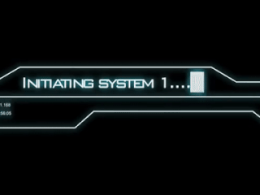

