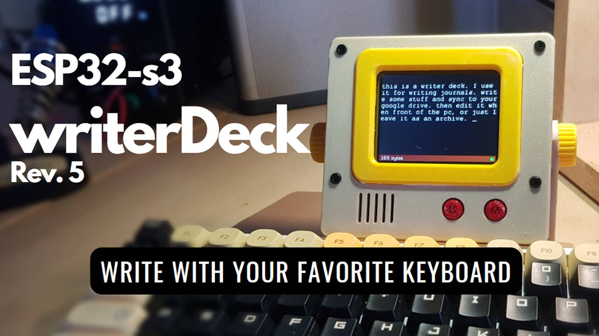

## Micro Journal Rev.5: A Personal Journey

With Rev.5, I wanted to take a step back from building the keyboard itself and instead focus on something more flexible: letting writers use the keyboard they already love. The idea was simple — instead of being tied to a built-in keyboard, why not make the device work with *any* mechanical keyboard?

That's where the USB port comes in. By tapping into the ESP32-S3's native USB host features, I was able to design an enclosure that sits neatly next to your keyboard and connects directly. After updating the code and refining the hardware, Rev.5 came to life.

This version is less about dictating how you write and more about giving you the freedom to choose your own tools. Whether it's a beloved mechanical board or a minimalist setup, Rev.5 turns it into a writerDeck.  

If you're curious about the technical journey — including the exploration of USB host support on the ESP32 and ESP32-S3 — you can dive into the build guides and full story in the link above.

### Documents 

* [Behind Story](./story.md)
* [Micro Journal Rev.5 Features and Use Cases](https://youtu.be/felg-JbUMr0)
* [Build Guide](./build-guide.md)
* [Build Video](https://youtu.be/xDClC_4uQIw)
* [Quick Start Guide](./quickstart/readme.md)

## Resources

* [Firmware Release Page](https://github.com/unkyulee/micro-journal/releases)
* [Firmware Source Code](../micro-journal-rev-4-esp32/)
* [Design Files](./STL)

### Videos

* [YouTube Playlist of Micro Journal Rev.5](https://www.youtube.com/playlist?list=PLrUXYLEnAaNT9xCD-dFa0QLdjVJLV7N7T)

### User Reviews

* [+1 for the Micro Journalk](https://www.reddit.com/r/writerDeck/comments/1cyvjsf/1_for_the_micro_journal/)
* [My first WriterDeck - the Micro Journal Rev 5.](https://www.reddit.com/r/writerDeck/comments/1cytyq6/my_first_writerdeck_the_micro_journal_rev_5/)

### Community

* [Flickr - AlphaSmart - Writing Tools](https://www.flickr.com/groups/alphasmart/discuss/72157721921183163/)
* [Reddit - writerDeck](https://www.reddit.com/r/writerDeck/)

### Press

* [Hackster.io: Micro Journal Offers a Customizable writerDeck Experience](https://www.hackster.io/news/micro-journal-offers-a-customizable-writerdeck-experience-4ffbf773f3ec)
* [Guest Starring at Canadian National Radio](https://ici.radio-canada.ca/nouvelle/2080542/telephone-idiot-minimaliste-dumbphone)
* [Pascal Forget: Micro Journal – machine à écrire](https://www.pascalforget.com/micro-journal/)
* [98.5 Canadian Radio Channel about Micro Journal](https://www.985fm.ca/audio/632913/un-clavier-ergonomique-ideal-pour-le-teletravail)
* [Tindie Blog: Micro Journal DIY Kit](https://blog.tindie.com/2024/11/micro-journal-diy-kit/)

### Online Shop

* [Order from Un Kyu's Tindie Shop](https://www.tindie.com/stores/unkyulee/)
* [DIY Kit - Micro Journal Rev.5](https://www.tindie.com/products/unkyulee/diy-kit-micro-journal-rev5/)

## Support

Micro Journal is an open-source project, built and nurtured with curiosity, care, and a genuine love for writing. If you've enjoyed exploring the project or building your own writerDeck, and you'd like to show some support, even a small gesture goes a long way. Every contribution helps me continue improving Micro Journal and sharing it with the community.  

* [Buy me a coffee](https://www.buymeacoffee.com/unkyulee)  
