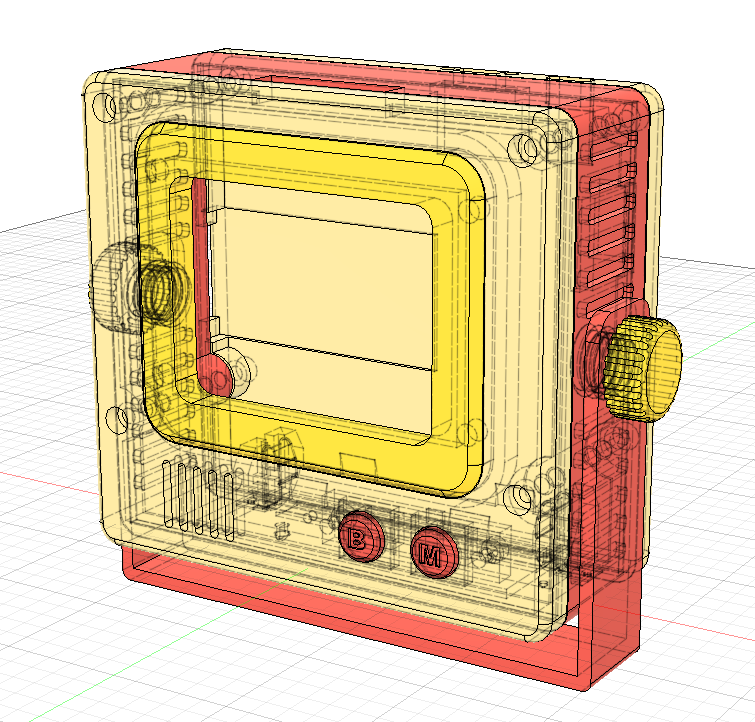

# Micro Journal Rev.5: WriterDeck using any USB mechanical keyboard

Rev.5 is a distraction-free writing device powered by the ESP32-S3 with a 3-inch display. This time, instead of building yet another fixed keyboard, I wanted to give writers the freedom to use their own. Simply plug in any USB mechanical keyboard, and you're ready to write. The device comes in a small enclosure that sits next to your keyboard and is portable enough to carry anywhere.

---

# Why a new version?

The earlier Rev.4 was something I personally enjoyed. It's an instant-on, minimalist device built around a fixed 30-key layout that matched *my* preferences perfectly. I loved it. But when I shared it, I quickly realized that what worked beautifully for me was actually a barrier for others. A hyper-personalized keyboard wasn't practical if I wanted this to be useful beyond my desk.

So I asked myself: what if the keyboard wasn't part of the device at all? What if Micro Journal could let people bring *their* favorite keyboard. Instead of forcing them to use mine? That thought became the spark for Rev.5.

With the ESP32-S3's USB host features, that idea became possible. Any mechanical keyboard with a USB interface could now connect, and even wireless 2.4 GHz dongles started opening up new possibilities. That flexibility felt exciting enough to chase. So I began the long, messy process of making it real.

---

# The USB Host Journey

To connect a USB keyboard, the device itself has to act as a host, supplying power and managing communication. PCs and smartphones do this effortlessly, but the ESP32 was never designed with that in mind. Early on, I didn't even have an ESP32-S3 board, so I experimented with a software-based USB host library on a regular ESP32 (WROOM).

And at first… it worked! I plugged in an old keyboard, typed, and saw characters on the screen. Victory. Or so I thought.

Reality hit when I tried a newer keyboard. Instead of typing, the ESP32 crashed instantly, over and over again.

That's when I learned the catch. The software USB host only supports *USB 1.0 Low Speed* devices. My old keyboard worked because it was ancient. My real keyboard. Like most made in the last 20 years. Was USB 2.0. The whole approach was a dead end.

So I pivoted, ordered an ESP32-S3 devkit, redesigned the enclosure, rewired everything, and started fresh.

---

# ESP32-S3: Hardware USB Host

On paper, the ESP32-S3 supports USB host natively. In practice, I still ran into problems. Wiring D+ and D- seemed straightforward, but when I connected a keyboard, nothing happened. After a lot of head-scratching, I discovered the devkit doesn't supply power to the USB port. Of course. That would have been too easy.

Once I supplied power externally, though, it finally worked. Keystrokes flowed, the screen responded, and Rev.5 began to feel real. I owe credit here to [tanakamasayuki's EspUsbHost repo](https://github.com/tanakamasayuki/EspUsbHost) and to **Vince_Gill**, who pointed me in the right direction.

---

# Coming from the Future

This is me, one year after releasing the Micro Journal Rev.5. I opened the old design file to optimize the build process and was struck by what I saw. A trail of struggles, detours, and unnecessary complexity. Problems that could have been solved in one or two steps had taken me twenty.

  

Back then, I only knew how to use two tools in Fusion 360. **Sketch** and **Extrude**. Yet, with just those two, I built the entire enclosure. Looking at it now feels surreal. It's like having only a hammer and nails but still managing to put together a house. Not the best house, maybe. But a house nonetheless.

When I see my past self through this lens, I can't help but notice how reckless it all was. Reckless, ridiculous... but also determined. I didn't stop just because I didn't know how to do something. I pushed through with what I had, and somehow, it worked. It's reminder for current me. I am probably still reckless at this very moment, just not knowing of which.

It's a little embarrassing, a little self-indulgent to admit, but it also feels important to record. I *get things done*. Whether I know the "right" way or not, I keep moving. That persistence has its costs. Wasted time, messy iterations. It also reminds me of why I love making things in the first place.

And now I see why people laughed when I start anything... Imagine a kid holding a hammer, announcing proudly that he's going to build a house. Most would chuckle. But sometimes, the kid actually builds one.

---

# Conclusion

When I showed the finished device at home, my wife and daughter. Usually unimpressed with my creations. Actually smiled this time. Maybe it was the shiny yellow enclosure, maybe the Iron Man–like colors. Or maybe they just saw how much this one meant to me.  

She still teases me, convinced only three people in the world care about projects like this: me, my friend Hook, and you (if you've read this far). She's probably right. But that's enough.

Rev.5 is more than another gadget that types words. It's proof, to myself at least, that I can take an idea, chase it through dead ends, fix the mistakes, and make something a little better each time. Even if the meaning of all this isn't always clear, the act of building — of solving problems I didn't know existed — keeps me going. And maybe that's reason enough.
