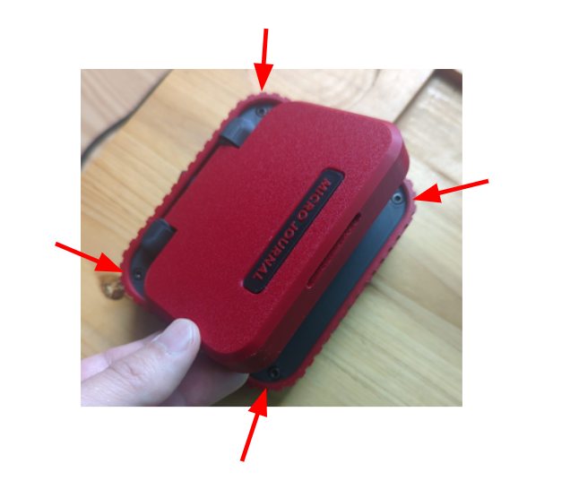
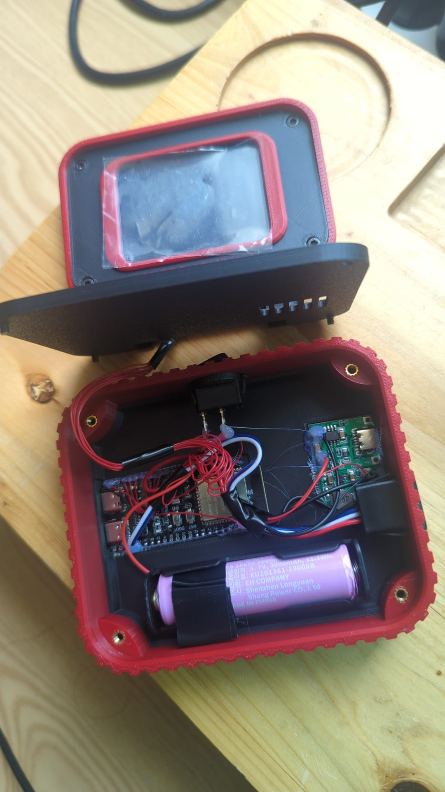

# **Micro Journal Rev.5.1 — Quick Start Guide**

The Micro Journal Rev.5.1 has the same internal hardware as the Micro Journal Rev.5, so you can follow the Rev.5 manual for all general instructions.

Please, visit the following link to get more information about how to use the software, and setup Google Drive Sync, and custom GIF startup animations and more.

- [Rev.5 User Manual](../micro-journal-rev-5-esp32-usbhost/quickstart/readme.md)

The only difference is access to the battery holder. To reach it, you need to remove the four screws on the top cover. 

## What You Need

Before turning on the device for the first time, prepare:

* **One 18650 Lithium-ion 3.7V battery**
* **One SD card (1–32 GB recommended)**

## Battery Installation

You will need TH10 hex screw driver to remove the screws. Remove all four screws on the top cover.

Carefully lift the cover. There are wires connected to the microconroller, so so pull it too hard, it should have length just enough to have the display laid next to it. 

Install the battery then close it back up. Make sure, to check, double check, triple check, quadruple check the batery POLARITY. Wrong polarity battery will break the charging module. 

Also, place a tape around the battery to create a handle so that it can be easy to pull out. 

To understand which batter to purchase, you can find more details on the [Rev.5 User Manual](../micro-journal-rev-5-esp32-usbhost/quickstart/readme.md).

Un Kyu Lee