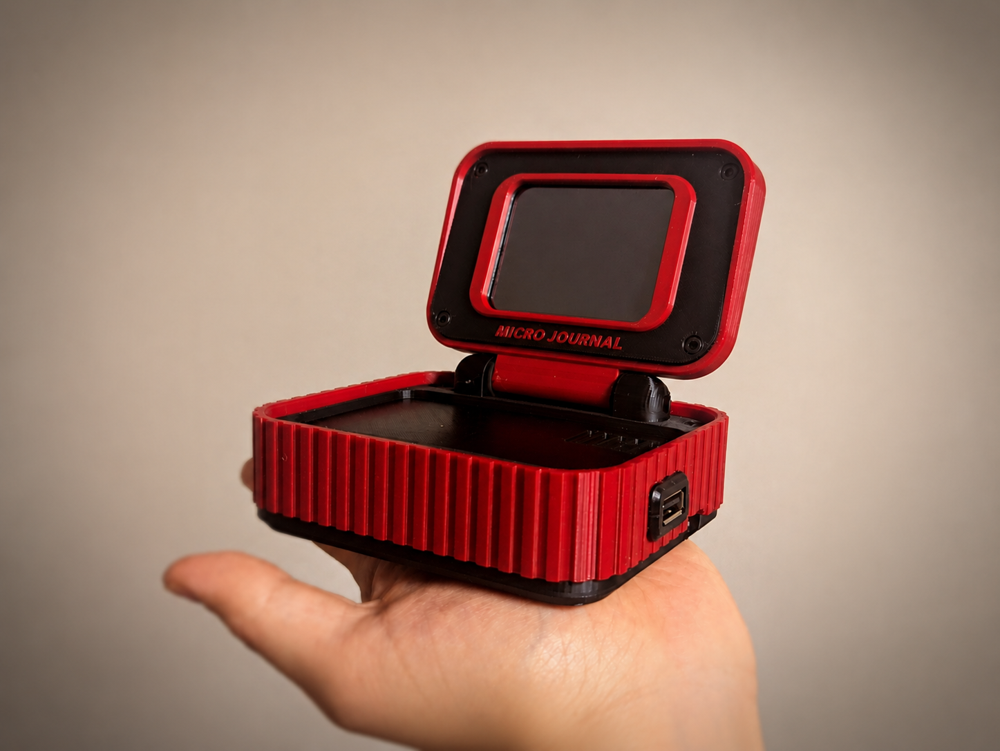

## Micro Journal Rev.5.1: A Personal Journey

This is a focused writing device. Where you can connect your own keyboard to create a distraction-free writing setup. It has a USB port on the side that allows to connect your favorite mechanical keyboard and write away. This build is based on ESP32 S3 dev module, and ST7789 display. 

This is an enhanced version of [previous rev.5](../micro-journal-rev-5-esp32-usbhost/). With foldable design to protect the screen, and slightly improved screen module which should provide larger viewing angle and sharper display quality from the previous version.

### Documents 

* [Behind Story] TBD
* [Introduction Video] TBD
* [Quick Start Guide] TBD
* [Build Guide](./build.md)

### Resources

* [Design Files](./STL)
* [Micro Journal ESP32 S3 Firmare Source Code](../micro-journal-rev-4-esp32/)

### Community

* [Un Kyu Lee's Timeline](https://www.yesbut.it/)
* [Flickr - AlphaSmart - Writing Tools](https://www.flickr.com/groups/alphasmart)

### Press

### Online Shop

* [Order from Un Kyu's Tindie Shop](https://www.tindie.com/stores/unkyulee/)
