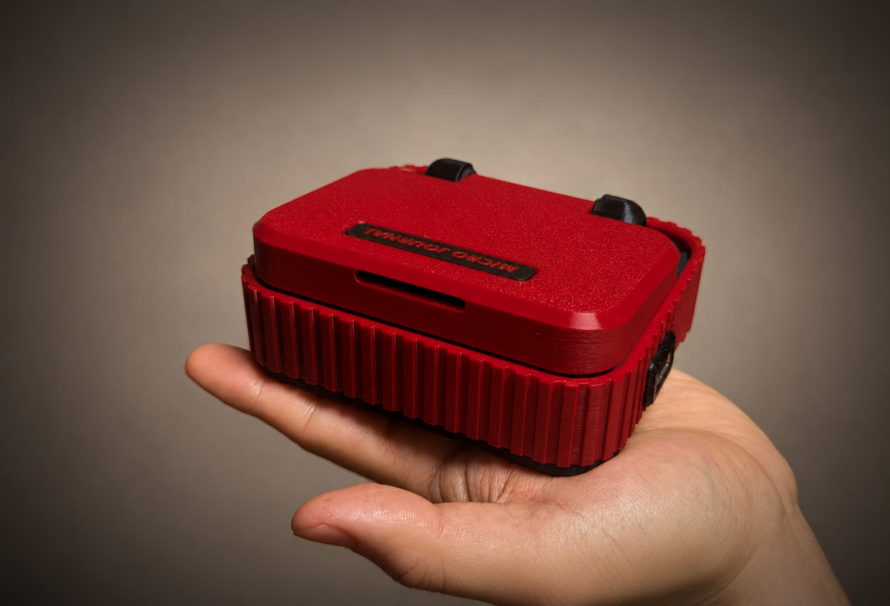
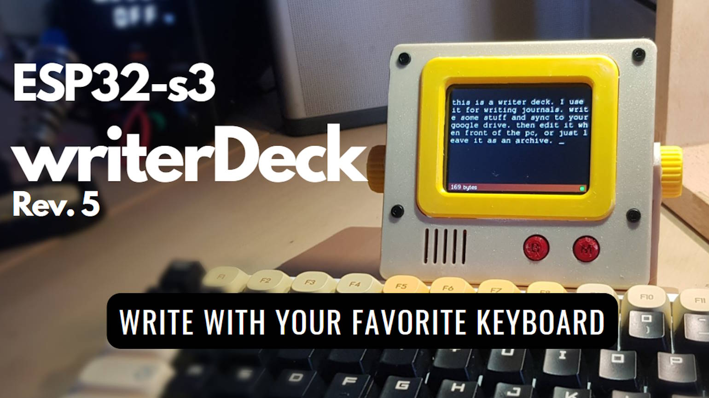

# A Personal Journey.

Could a craftsman like me be considered an artist? Sometimes the idea feels absurd. As if making something functional, something practical, makes sense as an art? I can, with some shyness, accept being called a designer. But artist? The word still catches in my throat.

And yet, I want it. Deeply. I keep moving in that direction without fully understanding why. Perhaps because the label carries something sacred. Not fame exactly, nor sophistication, but the hope that what one creates might touch another person beyond utility. That it might linger in someone's mind after its practical purpose is over.

I wonder about Micro Journal. It is, in many ways, simply a tool. A functioning object. Something people use. But because it carries a peculiar sensitivity in its design, because it seems to evoke emotions beyond efficiency, could it also be considered art?

This is where the confusion begins. What is an artist, really? And why do I desire the label so much? The desire certainly exists, though part of me is afraid to examine it too closely. Like opening a banking account after an expensive month. You suspect something uncomfortable is waiting inside.

I have been iterating on Micro Journal for three years now. What I've come to understand is that I care about the influence to surroundings. The emotions it broughtu up.

A few weeks ago, someone emailed me saying they were inspired by the design, and also by the philosophy behind it. That message stayed with me. For sure, touchier subject  than questions about battery life or product specifications ever do. It made me pause.

What philosophy did they see? What exactly was being expressed through these objects I keep making? 

The journey to answer itself is worth cherishing. Not the label waiting at the end of it.

## The very first interaction with others

First love stays forever.

The first time holding hands. The overwhelming emotions. Then the first kiss. A vivid scene that refuses to leave the mind even after decades. It is not necessarily because it was perfect, nor even because it was good. It remains because it was the first. The first experience enters the memory before we have developed any defenses against feeling.

Rev.5, built in 2024, carries that same feeling for me. It was the first build where I genuinely wanted it to look like a product. Not just a personal experiment. Something another person might desire to own. Capable of pulling attention toward itself.

I studied countless objects and products from designers. I looked obsessively at proportions, curves, textures, and tiny details I barely understood at the time. With little to no knowledge of CAD, I started designing anyway.

The process was horribly inefficient. Almost embarrassingly complicated. I fought the software constantly, solving simple problems in absurd ways. But none of that mattered. Eventually, I arrived at the form I had imagined in my head.

One day, a friend passed by my office and noticed the printed prototype sitting on the table. He picked it up and paused for a moment.

"Oh wow. This looks 'almost' like a real product."

That sentence stayed with me. It felt different from the reactions to previous iterations. Most of my builds carried the atmosphere of engineering projects. Functional. Curious. Homemade. But Rev.5 carried a small spark of seduction. It was the first time I felt that my design could create desire in another person.

Not merely usability, but attraction. The force that makes someone want to touch an object before fully understanding why. I wanted people to feel that pull. To feel an almost irrational urge to hold the thing in their hands.

Not that I had successfully created something irresistible. That would be too arrogant. But for the first time, it felt plausible that someone might actually pay money for what I made. And that itself felt monumental.

I sold a few units of Rev.5. Only three, technically. Still, I remember waking up the next morning and seeing the email saying the product was sold out. Rationally, it was insignificant. Three units is hardly an empire. But emotionally, it felt enormous. Proof that the strange vision inside my head had briefly crossed into another person's world.

Someone saw what I saw. This is why first creations stayed so deeply. They are not yet polished enough. Later work may become more refined. But the first meaningful creation contains something rare. An evidence.

## To be continued