# Build Guide

This is a build for Micro Journal Rev.6. This guide allows you to build one on your own. Also, providing detailed information to trouble shoot when some parts of the build fails. Or, for someone wants to know how Micro Journal Rev.6 is built, this guide will resolve many of your curiosity.

You need to know how to solder in order to complete this guide. It doesn't require you to have advanced soldering skills. All the components will be through the hole types, and with some practice, you should be able to reach a sufficient level to achieve the build.

You will need 3D prints, in order to complete the build. There should be many 3d printing services available. In case, you want to build you own, but having difficulty supplying the components, then contact me and I will try to find a way to send you a type of DIY-kit.

- [Buy a DIY Kit](https://www.tindie.com/products/unkyulee/diy-kit-micro-journal-rev6/)

---

## Video Guide

* [Build Video](https://youtu.be/6zRsx2ufwUU)

The full build process has been recorded. If you get stuck, the video may help clarify the trickier steps.

---

# Required Tools

- You will need TORX T10H to handle Hex screws 

- Any typical wires for electronics would do. I use [Wires 30 AWG](https://it.aliexpress.com/item/1005007081117235.html)

# Build Order

1. Prepare the Enclosure
2. Build Keyboard PCB
3. Wire up with ESP32
4. Display
5. Power Supply
6. Closing the Enclosure
7. Switches and Keycaps

# Enclosure Preparation

[STL files](https://github.com/unkyulee/micro-journal/tree/main/micro-journal-rev-6-one-piece/STL) for the 3D prints are available in the github.

Please, refer to the image below for placement of the prints. Most of the prints requries support. I have used tree support for the best results. Bolts do not need supports. Protection lid requires to be as straight as possible on a vertical diretion in order to get the most smooth surface. I have used PLA for the print material.

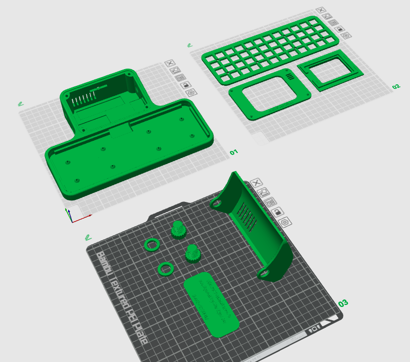

Once the prints are done. Remove the support materials from the print.

# Keyboard PCB

[Gerber File](https://github.com/unkyulee/micro-journal/tree/main/micro-journal-rev-6-one-piece/PCB) for the Keyboard PCB are available in the github.

You can print and order the PCB using the PCB manufacturing services. Typically I use JLCPCB or PCBWay for the order. They will ask for minimum quantify of 5 PCBs. So you will have extra PCB. These PCBs can be reused for other projects that needs mini mechanical keyboard, so, it's not too bad to have some extra laying around.

I think Keyboard PCB is the only component that can't be sourced from the market. Apart from the 3d printed materials. I have prepared a kit packed with PCB and diode and hotswappable sockets. If ordering from PCB manufacturer is found a bit difficult, you can use my tindie shop to order a PCB parts. 

https://www.tindie.com/products/unkyulee/diy-kit-micro-journal/

In order to assemble the keyboard PCB. You will need 48 pieces of the following items.

- Kailh Hot-swappable PCB socket Hot Plug
- IN4148 diode. Through hole size.

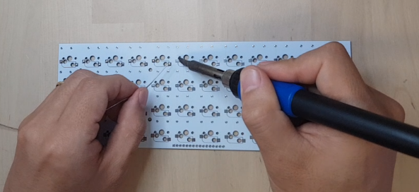

First step is to apply solder to the PCB, where hot socket will be placed. Place the tip of the soldering iron on top of squared copper pad on the PCB, then melt the solder on it. Apply it slightly more than usual. Until you feel like there is a little blob of solder on it. It will be easier to place the hot-swappable socket.

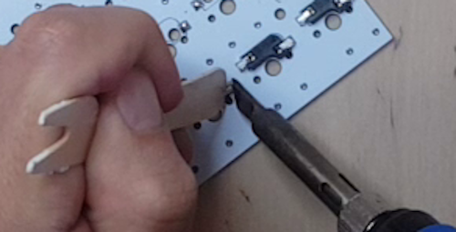

Once both slots are pre soldered. Place the hotswappable socket on top of it. There should be a hole that fits into the PCB, so should be quite easy to place them. Once there are on the right place. Place the soldering iron on the side where you have presoldered, you will feel the solder melting and the socket sinking into the hole. Try to use some wooden stick not to get burned. Apply the solder on both ends of the socket.

Do this for 48 times.

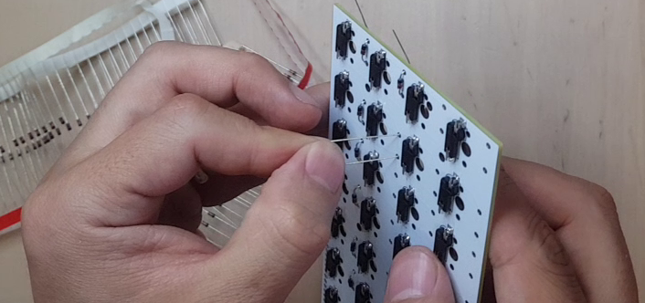

Now it is time to place the diodes. Place the diode head on the side where there are the sockets. Place the black line aligned with the directions that are printed on the PCB. Diodes has polarity. So, you must make sure that the direction that you place the diodes are correct.

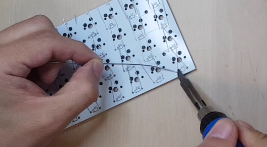

When all diodes are in place. Solder their legs, and cut of to the excess legs.

Do this for 48 times.

# ESP32 and Keyboard Wiring

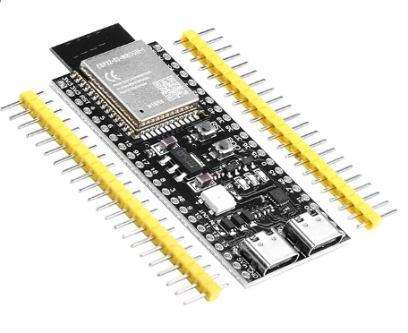

Micro Process used in this build is called ESP32-S3 devkit. There are N16R8 and N8R2 models of ESP32-S3. You can choose either of them. I use N16R8 in this build.

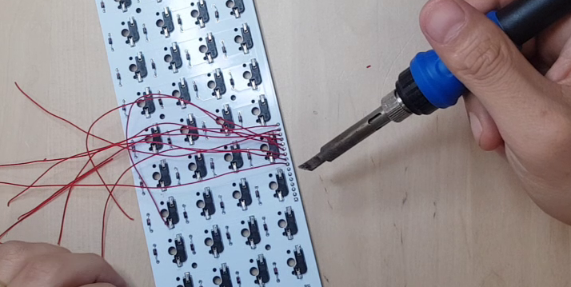

Next step is to wire up the keyboard and ESP32. This is going to use the pin holes placed on the top of the keyboard PCB. Prepare 16 wires, cut in 20 cm length. Solder the wires on the keyboard PCB. Make sure that the wires are located at the side where hot swappable socket is placed.

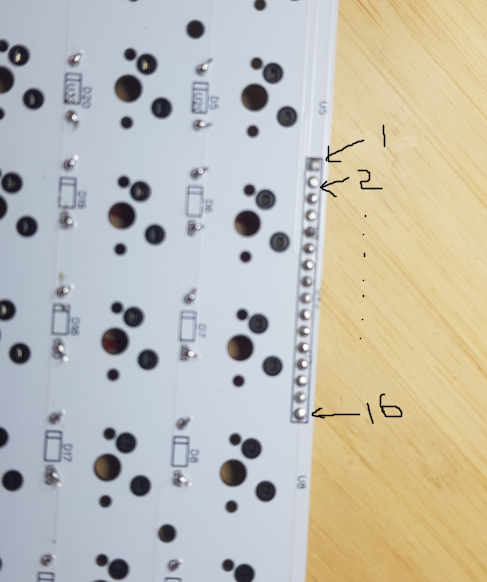

Note that the pin holes there are one that is squared. That is pin no. 1. Then goes till number 16. Here is how each wires from the keyboard should be mapped to ESP32.

| Keyboard PIN No. | ESP32 PIN No. |
| ---------------- | ------------- |
| 1                | 15            |
| 2                | 16            |
| 3                | 17            |
| 4                | 18            |
| 5                | 1             |
| 6                | 2             |
| 7                | 42            |
| 8                | 41            |
| 9                | 40            |
| 10               | 39            |
| 11               | 45            |
| 12               | 48            |
| 13               | 47            |
| 14               | 21            |
| 15               | 20            |
| 16               | 19            |

When all the wires are soldered they should look like this.

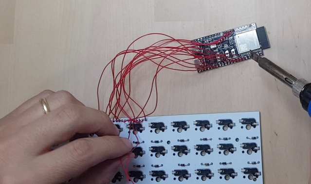

For some ESP32 boards, they [may not power on at the cold boot](https://github.com/unkyulee/micro-journal/issues/7). In that case, connect a resistor (bigger than 10k) from 3.3v pin to GPIO 0 of the ESP32. This will allow to boot correctly.

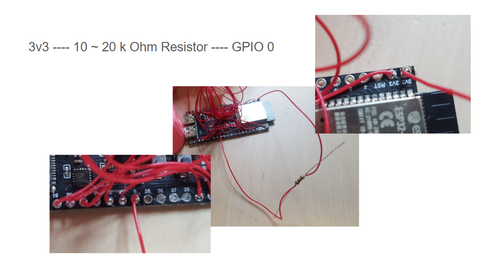

Once all the wirings are done. Place the keyboard PCB and the ESP32 inside the enclosure. This needs to be done, before wiring power supply and display.

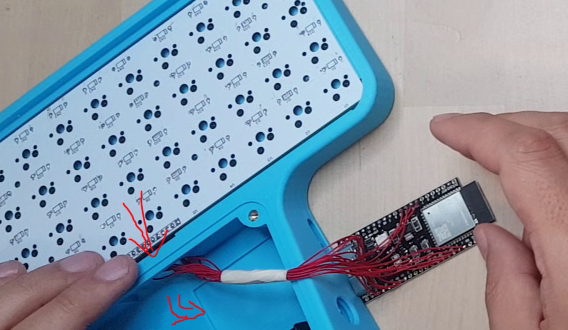

# Display

Display used in this build is called

- ILI9341 320 \* 240 TFT LCD display

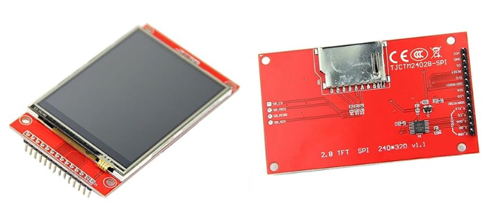

Make sure to choose the model that has the SD card slot as the picture. Some models have SD card slot more closre to the left side. Should be more or less in the middle of the board.

Remove the pins soldered on the display board using a nipper. Proceed slowly and gently to avoid scratching the board surface with the tools.

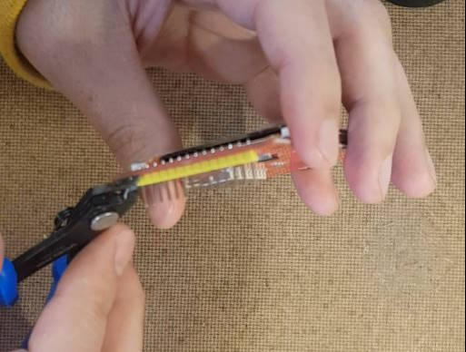

Apply additional solder to the pins, then use the nipper to remove them while melting the solder. Ensure to add extra solder when removing the pins.

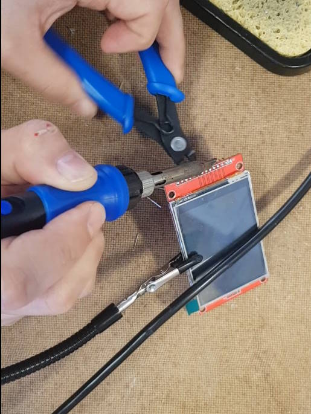

Wire the MOSI, MISO, and CLK (SCK) pins from the SD card side of the pins to the DISPLAY part of the pins. Assign the CS pin of the SD card to the ESP32 board.

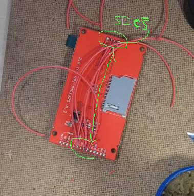

We will utilize the ILI9341 and SD card slot in this module, both utilizing the SPI interface. Therefore, the MOSI, MISO, and CLK pins are shared between the DISPLAY and SD functions.

Expose the following display pins as 10 cm wires from the board, which will later be connected to the ESP32 board:

- MISO
- MOSI
- SCLK
- DC
- RST
- VCC - LED combine these two together
- GND
- CS DISPLAY
- CS SD

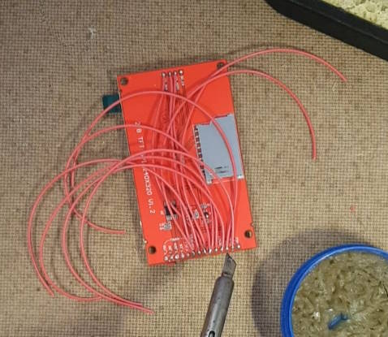

Once done the board should like the picture above.

| ESP32 PIN | DISPLAY      |
| --------- | ------------ |
| 13        | MISO         |
| 12        | SCLK         |
| 11        | MOSI         |
| 10        | CS - DISPLAY |
| 9         | CS - SD      |
| 46        | DC           |
| 3         | RST          |
| 3V3       | DISPLAY VCC  |
| GND       | DISPLAY GND  |

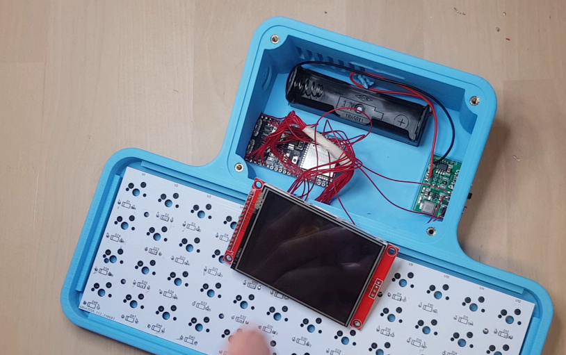

Solder the wires from the display to ESP32 based on the table above. Make sure that ESP32 and the keyboard is installed before soldering the display.

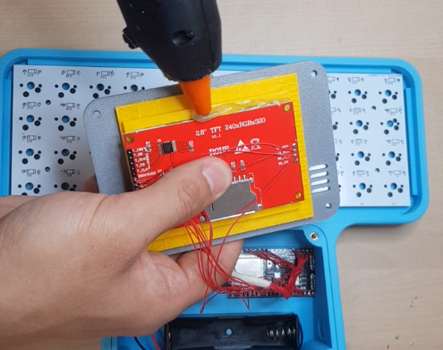

Use the glue gun to connect the display to the display panel. Make sure that the glue touches the display and the display panel so that they provide a good grip. Once those glue settles, it really is difficult to get it off. So, this method should be sufficient to hold things together.

## Power Supply

Switch is difficult to find on the internet when you don't know the name of it.
This type of switch is called "slide switch". Find something that fits the dimension as the picture below.

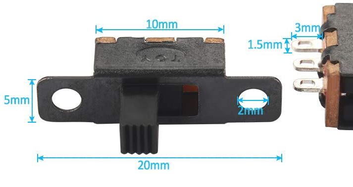

Charge module is called... I don't know. I searched for a module that can charge 18650 lipo battery, and also has a voltage booster to generate 5v and found this one. In order to get something, you need to search with the specs. There should many similar modules like this.

https://www.amazon.it/gp/product/B091YQRZPL/ref=ppx_yo_dt_b_search_asin_title?ie=UTF8&psc=1

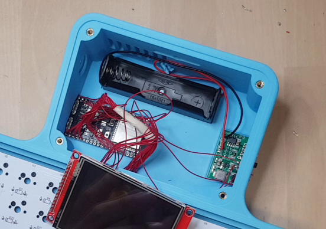

Solder the battery holder to the correct polarity. Then wire up power output to the switch and to the ESP32.

| ESP32 PIN | POWER SUPPLIER |
| --------- | -------------- |
| GND       | Vout -         |
| 5Vin      | Vout +         |

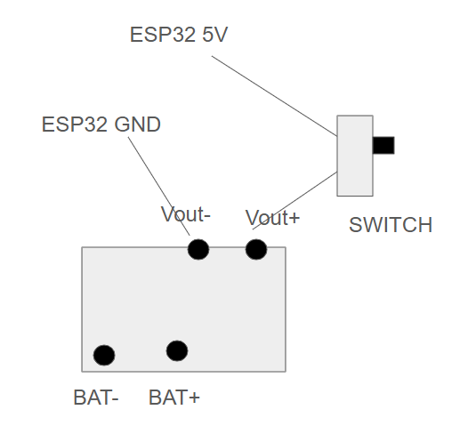

Power supply unit has variable voltage output. Most of the modules comes with 5V preset, but sometimes they come with random voltages. Make sure to measure the vout voltage is in the range of 5 ~ 6 V before connecting to any components. 

# Closing the enclosure

You need:

4x m3 heat inserts
8x m2 heat inserts

4x m3 Hex Screws
8x m2 machine screws

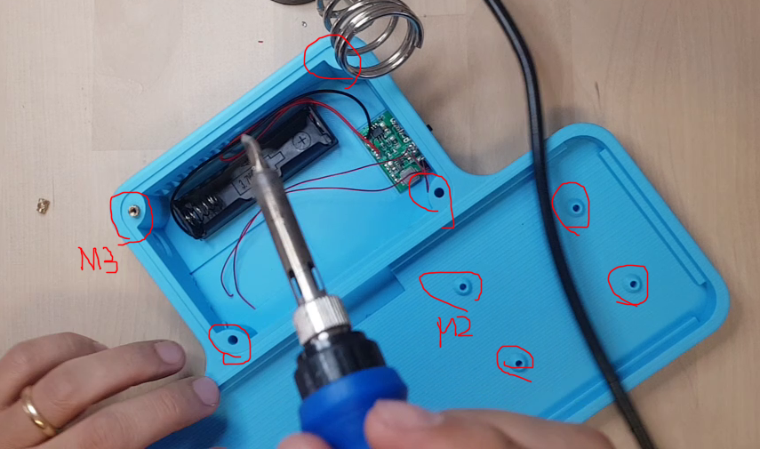

Install M3 and M2 heat inserts using the soldering iron.

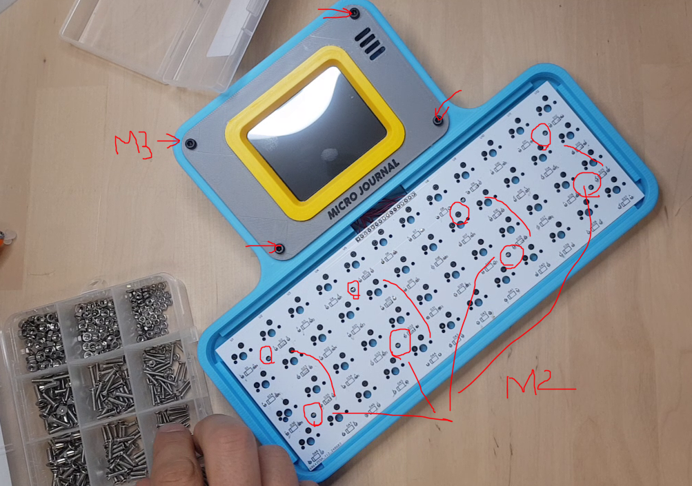

Then place the display panel and PCB and use corresponding screws to close up. 

# Switches and Keycaps

Place the keyboard plate on top of the PCB. This should create a friction fit. You may need to push a little bit in order to fit in. 

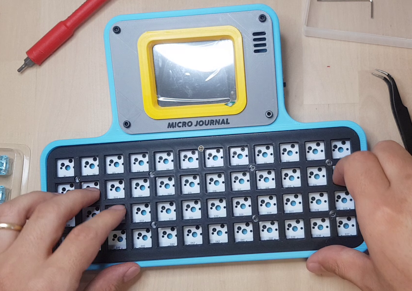

Push the switches on top of the plates, make sure that all the pins are positioned in the correct place. 

Do this 48 times. 

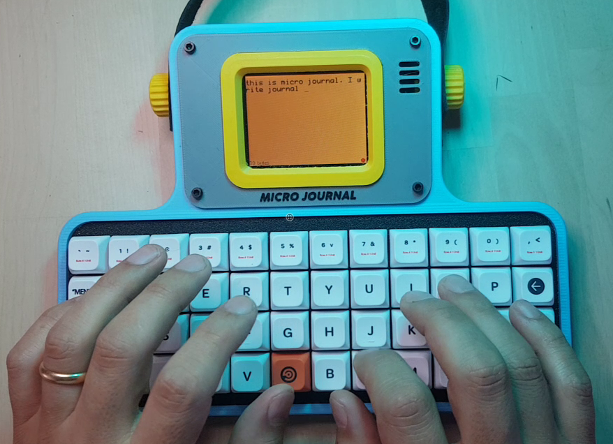

Place your favorite keycaps on top of it and you are done!

Enjoy and have fun!

# Flashing the firmware for the first time

Once all the hardware is built, you need to flash the firmware on the device. 
This step requires you to download this github repository.  
Install Visual Studio Code on your PC
Install PlatformIO plugin inside the Visual Studio Code
Then open the folder "micro-journal-rev-4-esp32" using Visual Studio Code.
Connect ESP32 UART port to the PC
Upload File Systeam Image
Upload Firmware
Then you should the smile face on the screen

# Quick Start Guide

Setup the device following the guide here

https://github.com/unkyulee/micro-journal/blob/main/micro-journal-rev-6-one-piece/quickstart.md