## Google Sync Setup

If you have already set up Google Sync on another Micro Journal, you can reuse the same URL stored in the `config.json` file on your SD card. Otherwise, follow the steps below to configure Google Sync for the first time.

### 1. Connect to Google Drive

Open [Google Drive](https://drive.google.com) in your browser.

### 2. Create a Folder

Create a new folder named **uJournal**.  
This will be the destination for your synced files.

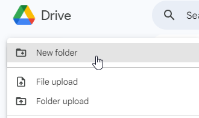

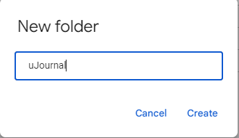

### 3. Create a Google Apps Script

Navigate inside the newly created **uJournal** folder. From within the folder, create a new **Google Apps Script** project.

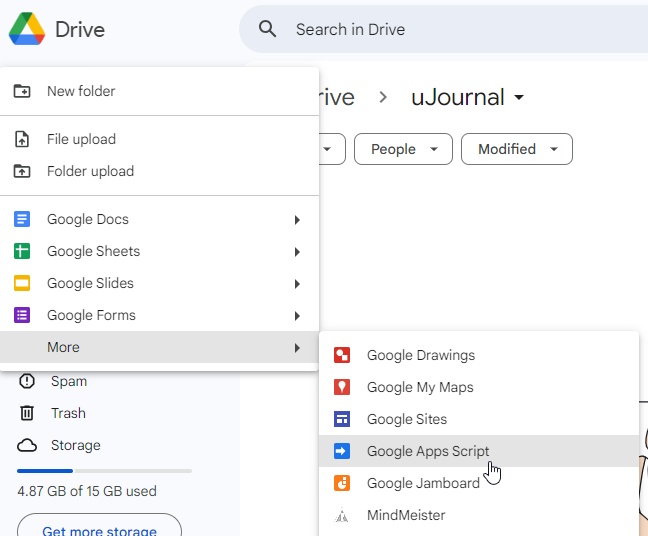


### 4. Copy the Sync Script
1. Open the latest sync script here:  
   [Sync Script (GitHub)](https://raw.githubusercontent.com/unkyulee/micro-journal/main/micro-journal-rev-4-esp32/install/google/sync.js)  
2. Copy the entire code and paste it into your new Apps Script project, replacing any existing content.  
3. Give the project a recognizable name (e.g., *uJournal Sync*).

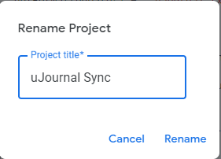

### 5. Deploy the Script
1. Click **Deploy** → **New Deployment**.  
2. Choose **Web app** as the deployment type.  
3. Configure as follows:  
   - **Execute as:** *Me* (this allows the script to access your Google Drive).  
   - **Who has access:** *Anyone* (only those with the URL can access, so keep it private).  
 
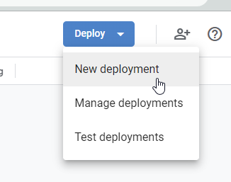

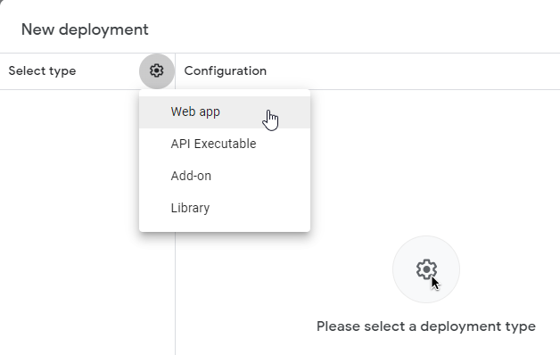

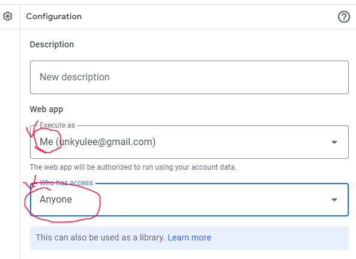

### 7. Authorize the Script
1. Press **Deploy**.  
2. Sign in with your Google account and authorize the script.  
   - You may see a warning that the script is unverified. Since this script runs only in your own Google Drive, it is safe to proceed.  
3. Confirm access when prompted.

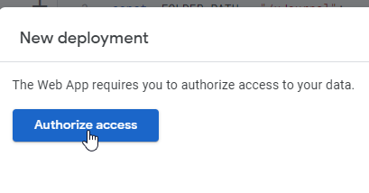

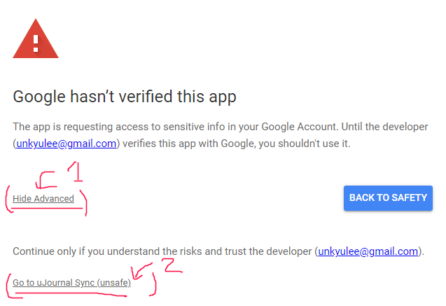

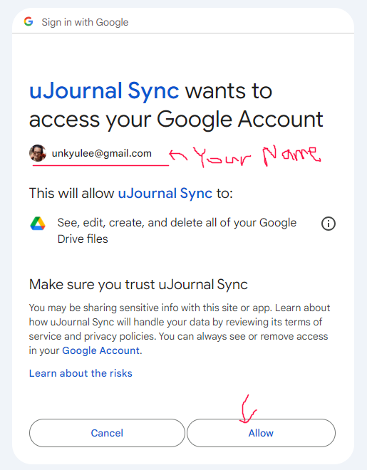


### 8. Copy the Web App URL
After deployment, you will be given a **Web App URL**. Copy this link — it will be used by your Micro Journal Rev.6 to sync files.

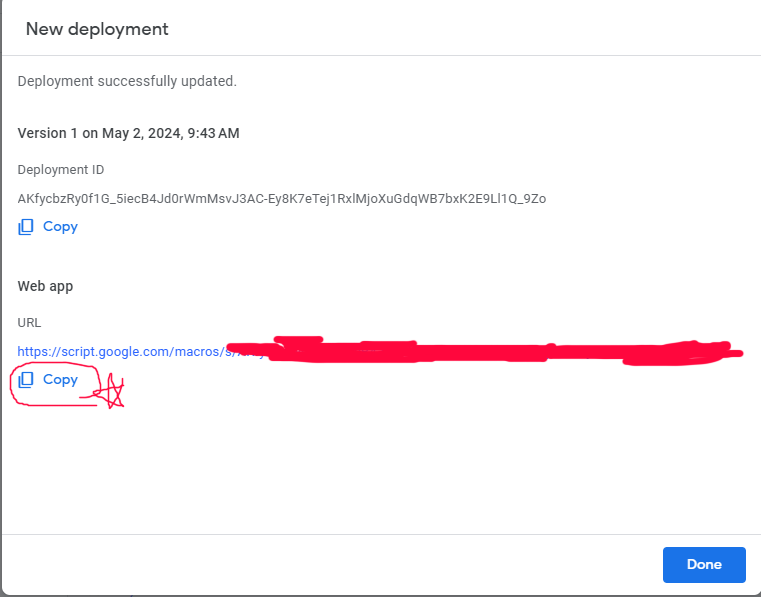

### 9. Configure the SD Card

In case of Rev.8 use Drive Mode

1. Insert the SD card into your computer.  
2. Open (or create) a file named `config.json`.  
3. Replace its contents with the following template, inserting your Web App URL in place of the placeholder:

```json
{
  "sync": {
    "url": "PASTE_YOUR_WEB_APP_URL_HERE"
  }
}
```

⚠️ Be careful not to remove or add extra commas, brackets, or quotes. If the file becomes corrupted, delete its contents and paste the template again.

4. Save the file, safely eject the SD card, and reinsert it into the Micro Journal Rev.6.

### 10. Test the Sync
Ensure WiFi is configured before attempting sync.  

1. On the device, press **MENU**.  
2. Press **S** to initiate sync.  

**Note:** The ESP32 only supports **2.4 GHz WiFi**. It will not connect to 5 GHz networks. Sync menu will not appear if Google Drive Sync is not configured.
