# Quick Start Guide

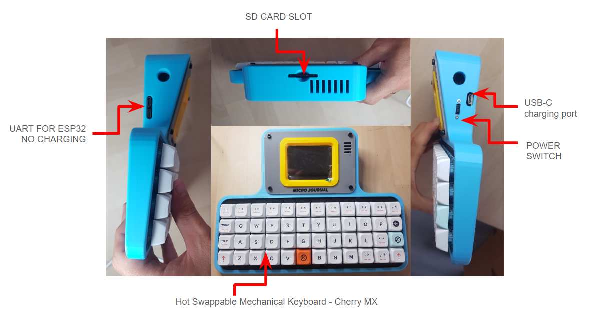

# First things to do

When you receive the Micro Journal Rev.6, you need to first install a battery. Please, follow the steps below to complete the setup.

If you want to test the device without a battery, plug into the ESP32 UART port (Left-hand side) and the device will run without battery installation. Do not plug the charging cable on the right-hand side without a battery. Can be ok for some time (less than 10 minutes) but not too long without a battery. 

**When the 'P' and 'Backspace' Keys Aren't Working**

This issue usually occurs if the battery hasn't been installed or if the USB cable is plugged into the wrong port. Make sure not to use the USB-C port on the lower left side, which is closer to the keyboard. There are two USB-C ports on the left side of the device; always use the upper USB-C port to power the device properly.


Also, please update the firmware when you receive the device. The firmware on the device is still under development and you may not have the latest releases. You can find the guide how to update the firmware on this document.


# Choosing the Battery


**This is not AA battery or AAA battery.**

**You need to buy your own LIPO battery. LIPO battery is NOT included in the package. EU delivery restrictions prevent batteries in the parcel. The device requires one 18650 battery to operate. Please read the following guide for the choice of your battery**

Micro Journal Rev.6 requires one 18650 3.7V Lithium ion Battery. Search with keyboard "18650" in amazon or any shopping means you have then you should be able to find one. Flat top, button top - either type is fine. Some reports that flat top probably is a better fit. 

Please, note that when buying the battery, try to buy from a well known brand. One of the tip when buying the battery is to look for maximum capacity. It should _NOT_ be higher than 3300 mAh. There are no such battery with this form factor that has higher capacity that 3300 mAh, so, be careful and note this number when buying a battery.

[Battery Buying Guide](https://www.reddit.com/r/18650masterrace/comments/qp21o8/buying_18650_batteries_start_here/?share_id=RTqe02Hqv2l_VwJTwoIi1&utm_content=2&utm_medium=android_app&utm_name=androidcss&utm_source=share&utm_term=1)


# Battery Indicator User Mod

There is a way to add battery indicator with some user modifications. Please find more details from the link below.

https://github.com/unkyulee/micro-journal/issues/21


# SD CARD

**SD card is included in this Micro Journal Rev. 6. You don't need to buy. Refer to this step only when you need to buy a new one**

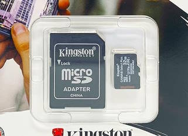

Micro Journal Rev.6 takes a SD card. Try to buy lower capacity as possible. If the size is bigger than 32 GB... you need to setup a special partition to make it recognized in the Micro Journal Rev.6. I believe 1 GB should be more than enough. It will takee 8 years of typing to fill it up.

Some ultra fast sanDisk micro SD cards were not recognized. So, try to buy something not that fancy.

Make sure to buy the one that has the adapter to the bigger size. Micro Journal Rev.6 takes the bigger size SD card which is not microSD.


# Step 1. Open the display panel and install the battery

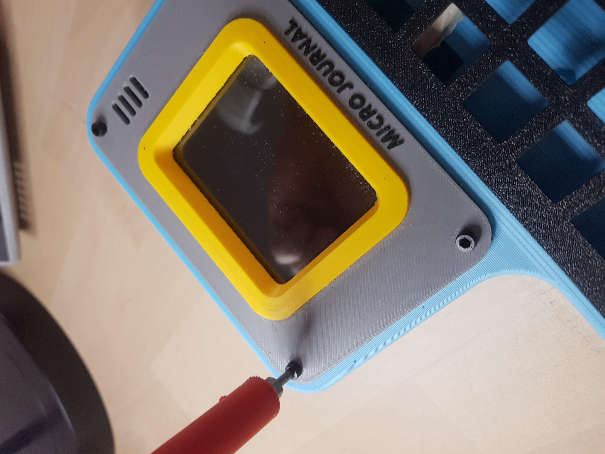

Unscrew four screws on the display panel. Then very gently lift up the panel and try to place it on top of the keyboard.

**PLEASE BE EXTRA CAREFUL TO + and - POLARITY OF THE BATTERY**

Install the battery when the enclosure is open. Battery holder should have the polarity written on the bottom. Please check carefully before inserting the battery.

The place with the spring on the holder is the negative (-) side. 

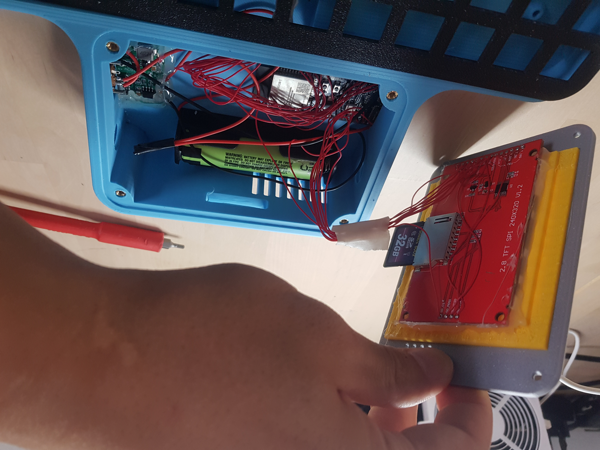

**PLEASE BE EXTRA CAREFUL TO + and - POLARITY OF THE BATTERY**

When installed the battery with the wrong polarity, it can cause a unreparable damange to the device.

**PLEASE ENSURE THE BATTERY IS FULLY CHARGED BEFORE USE**

LiPo batteries do not come fully charged, so it’s essential to charge the battery before using the device. Install the battery, connect it to the charging port, and leave it charging for at least 4 hours before turning it on for the first time.

When the battery is low, the screen may turn white or flicker—these are common signs of a low battery. If you notice this happening, please check that the battery is functioning properly or recharge it before continuing to use the device.

**Be extra careful with the battery installation. Can cause a fire**

When closing the panel back. Check very carefully while screwing. Do not force it too much. If the case is not getting aligned well. This means some cable may be clipped. Take a lot of attention when closing the panel to check if any cable is clipped. This can cause short circuit and damage the component and in some cases can cause a fire.

#### Charging the Battery

Charging port is located on the right hand side of the rev.6. When charging there should be red light coming out from the hole. When fully charged it will become blue light. 
If no light appears. Then it is possible that the charger is not compatible. PD chargers, USB c to c type chargers most likely won't work. 
It needs to connect to the USB A to C type chargers which are used for phone charging. 


#### Keep the battery charged

When battery gets low. Screen may start to blink to white and flicker. This is because battery is not able to provide sufficient power to the device and it is keep getting turn on and off. 

It is highly recommended to turn off the device and do not turn back on until the battery is fully charged. In this state, there are many reports that SD card gets corrupted and you can risk to lose your texts. 

Make sure to backup your contents frequently, and keep the battery charged. Here is a user mod that can install a battery indicator.

https://github.com/unkyulee/micro-journal/issues/21


# Step 2. Prepare SD card

**SD card is already setup in this Micro Journal Rev. 6. Refer to this step only when you are inserting a new one**

SD card needs to be formatted before inserted into the Micro Journal Rev.6. Connect the SD card to your computer, and initiate formatting process.


Make sure to format the disk with File system **FAT32**

In case FAT32 options are not appearing. You will need to create a partition that is smaller than 32 GB.

Once the SD card is formatted. Place it inside the Micro Journal Rev.6 and the Micro Journal Rev.6 should be ready.

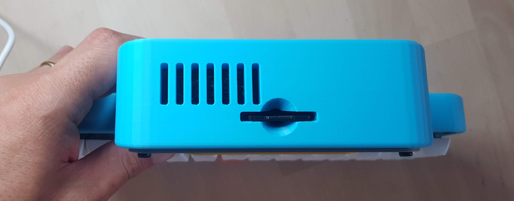

**WHEN PLACING THE SD CARD. WATCH WITH YOUR OWN EYES WHEN INSERTING IT AND TRY TO INSERT TO THE SLOT WHICH IS DEEP INSIDE THE ENCLOSURE. IF NOT PLACED IT CORRECTLY, IT CAN FALL INSIDE THE ENCLOSURE AND YOU WILL NEED TO REOPEN THE PANEL. TO PICK IT UP**

ask me how I know.


# Step 3. Google Sync Setup

If you already have Google Sync Setup. No need to setup again. You can use the same URL that you have retrieved previously. URL can be found in the config.json file inside the SD card.

## 1. Connect to Google Drive

https://drive.google.com

## 2. Create a folder: "uJournal"

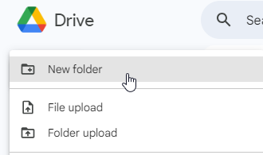

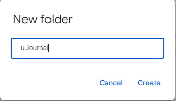

## 3. Go inside the uJournal folder

## 4. Create Google Apps Script


## 5. Copy the Sync Script

Open the following link to get the lastest script code. Open it can copy and paste the code to the apps script. Overwrite what was existing in the apps script before

https://raw.githubusercontent.com/unkyulee/micro-journal/main/micro-journal-rev-4-esp32/install/google/sync.js

Give some name to the apps script project


## 6. Deploy the Apps Script

Click on the "Deploy" button


Choose the deployment type as "Web app"


Configure as the following. Execute as "Me". This will allow the script to access to your drive.

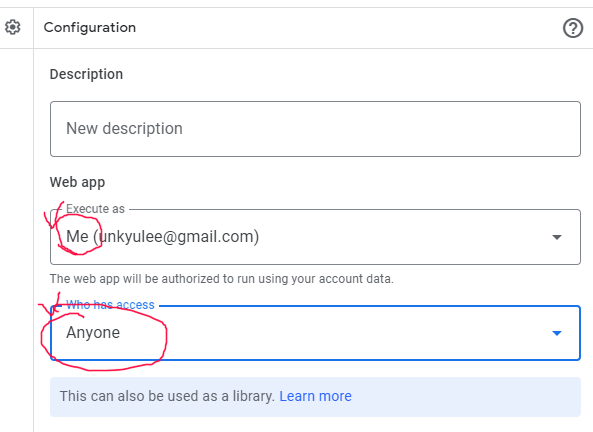

Who has access as "Anyone". This way Micro Journal Rev.6 can access to the drive. As long as you don't share the link that is provided. Only the Micro Journal Rev.6 should have access to the drive.

## 7. Press "Deploy" on the popup

Wait for a bit, then it will ask you to authorize the app. Choose the account of the google drive.

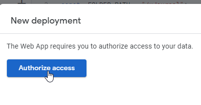

It will give a scary message while authorizing it. The script that you just copied is not verified. Considering that this script is on your google drive and will access your own google drive, it is ok to press, "go to uJournal Sync".

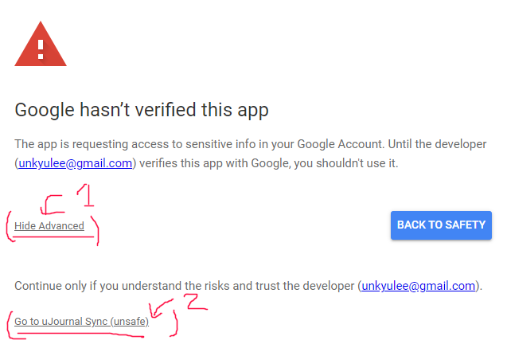

Allow the Drive access at the next screen. Your account name should appear. (Not mine)


## 8. COPY THE LINK PROVIDED AS WEB APP URL

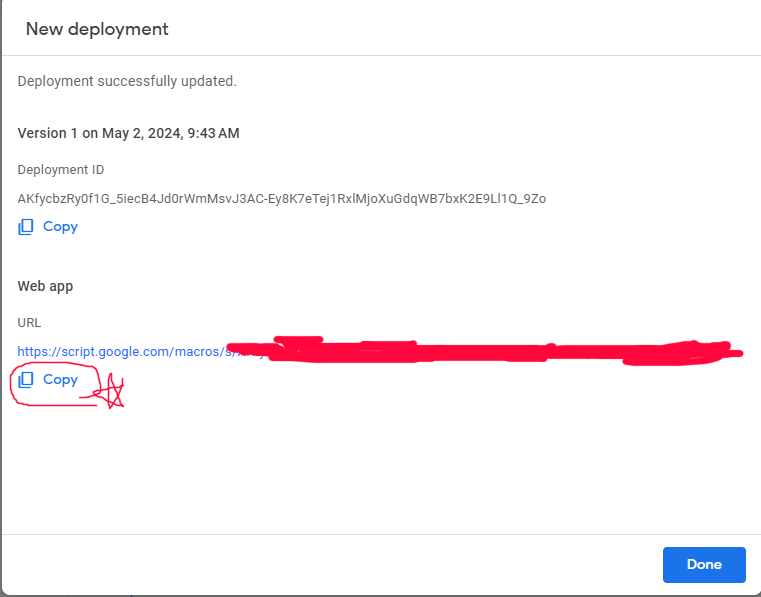

## 9. Open the SD card of the Micro Journal Rev.6

Connect the SD card to the PC and create a file "config.json" \
If the file already exists then no need to create one \
Open the file with a text editor (notepad) from PC. 

If aren't familiar with the JSON format. Then delete the existing content and replace it with the following json. Then edit the following part only. 

!!!COPY YOUR WEB APP URL HERE!!!!!

Make sure to not to remove / add any comma (,) or bracket ({, }) or quotes (") while you are editing. If by any chance, the format gets broken. Start over by removing all texts inside config.json file and copy & paste the following template.

If you are familiar with the JSON format. One thing you need to add is the "sync" property as the root property in the JSON and leave the rest of the property as it is.

```json
{
  "sync": {
    "url": "!!!COPY YOUR WEB APP URL HERE!!!!!"
  }
}
```

Save the file to the sd card. Safely remove the card from the PC and then you place the SD card back to the Micro Journal Rev.6. After that you should have your Google Sync working with the Micro Journal Rev.6.

While you are on the Micro Journal Rev.6. Press "MENU" on the keyboard then press "S" to see if it is working. Make sure to have the wifi information set before the sync.

**NOTE THAT WIFI IS LIMITED TO 2.4 Ghz. ESP32 doesn't support 5 Ghz wifi at this moment**


## 10. Wifi Setup

* Press MENU on the keyboard
* When you see the menu screen press W 
* In the wifi settings page press the number of the slot where you want to place the wifi information
* type in WIFI SSID then press enter
* type in WIFI password then press enter
* wifi information is saved to the device


# Firmware Update

Please, make sure that you have the latest firmware on the device. The firmware is still under a development and your device may have shipped with outdated firmware.

To check the current firmware version. You can press "MENU" on the keyboard.


**!!IF YOU SEE 1.0.0 ON YOUR SCREEN PLEASE UPDATE THE FIRMWARE!!**

## 1. Check latest release

You can check the latest firmware from the following link.

https://github.com/unkyulee/micro-journal/releases

## 2. Download the "firmware_rev_6.bin"

Download the file from Assets "firmware_rev_6.bin"

Turn off the Micro Journal Rev.6. \
Pull out the SD card from the Micro Journal Rev.6. \
Copy "firmware_rev_6.bin" file inside the SD card. \
Put back the SD card to the Micro Journal Rev.6. \
Turn on the Micro Journal Rev.6. \
Micro Journal Rev.6 will show white screen for 10 seconds then automatically boot again to the updated firmware.

In case "firmware_rev_6.bin" doesn't trigger the update. Rename the file to "firmware.bin" and try again


# Strap Installation

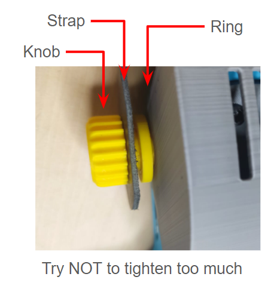

1. Place the strap between the knob and the ring. The ring acts as a buffer to prevent the knob from overtightening. Avoid tightening the knob too hard.

2. Be gentle when opening or closing the hood. The twisting motion can cause the knob to tighten further, potentially leading to breakage.

3. If the knob breaks, you can download the 3D model file and request 3D printing services for a replacement. Additionally, a gel-type glue (silicon type) can help to repair and sustain any cracks.

3D Model files:
https://github.com/unkyulee/micro-journal/tree/main/micro-journal-rev-6-one-piece/STL


# Some bags

https://www.reddit.com/r/writerDeck/comments/1euch12/travel_case_for_micro_journal/


# Customizing Start and Sleep Animation

If you want to change the Startup and Sleep animation. You can place the gif files directly in the SD card. Filename should be exactly the same in order to have the effect.

- wakeup.gif

Startup animation file. When the device boots. It will play the wakeup.gif

- sleep.gif

When no key press for one minute. Device goes into sleep mode and will play the sleep.gif animation.

- File size

Width: 320 px \
Height: 240 px

Each file should not exceed 1 MB

Use the following web site to create your own animation files.

https://ezgif.com/


# Keyboard Layout

The Micro Journal Rev. 6 utilizes a 48-key ortholinear keyboard, which may look quite different from the typical office keyboard. Many might wonder how to press the space bar or even if it’s possible to type effectively with it. The usability of this unconventional keyboard can be hard to imagine at first glance.

It's true that this keyboard doesn't follow the standard format. Initially, using it can be challenging. However, you'll be amazed at how quickly your brain can adapt to the new system. After just three days of stuttering through typing, you'll start to feel fluent.


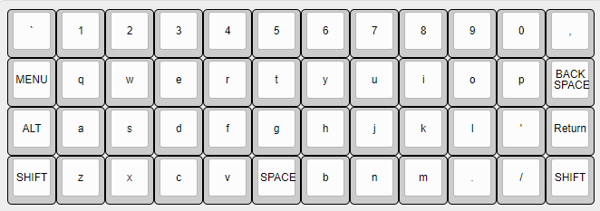

ALT LAYER

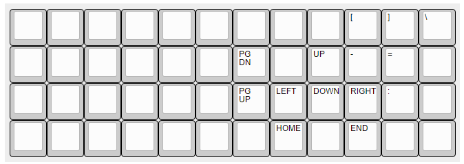

While pressing down ALT key, you should have access to cursor navigation features.


# Keyboard Layout Customization

Keyboard layout can be customized to fit your needs. Please, refer to [Key Map Customization](./keymap.md).  


# Keyboard Layout Templates

## QWERTY

For those who want to have the space bar on the bottom, try this layout and use it as a starting point for your customization.

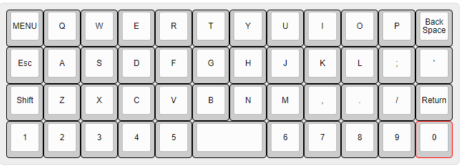

```json
{
    "main": 
    [     
     "ESC", "q", "w", "e", "r", "t", "y", "u", "i", "o", "p", "BACKSPACE",
     "ALT", "a", "s", "d", "f", "g", "h", "j", "k", "l", ";", "'",
     "SHIFT", "z", "x", "c", "v", "b", "n", "m", ",", ".", "/", "\n",
     "1", "2", "3", "4", "5", " ", " ", "6", "7", "8", "9", "0"
    ],

    "main-shift": 
    [     
     "ESC", "Q", "W", "E", "R", "T", "Y", "U", "I", "O", "P", 127,
     "ALT", "A", "S", "D", "F", "G", "H", "J", "K", "L", ":", "\"",
     "SHIFT", "Z", "X", "C", "V", "B", "N", "M", "<", ">", "?", "\n",
     "!", "@", "#", "$", "%", " ", " ", "^", "&", "*", "(", ")"
    ],

    "alt": 
    [     
     "ESC", "q", "w", "e", "r", "t", "y", "u", "i", "-", "=", 127,
     "ALT", "a", "s", "d", "f", "g", "h", "j", "k", "L", ":", "'",
     "SHIFT", "z", "x", "c", "v", "b", "n", "m", "<", ">", "?", "\n",
     "`", "-", "=", "4", "5", " ", " ", "6", "7", "8", "[", "]"
    ],

    "alt-shift": 
    [     
     "ESC", "Q", "W", "E", "R", "T", "Y", "U", "I", "_", "+", 127,
     "ALT", "A", "S", "D", "F", "G", "H", "J", "K", "L", ":", "'",
     "SHIFT", "Z", "X", "C", "V", "B", "N", "M", "<", ">", "?", "\n",
     "~", "_", "+", "$", "%", " ", " ", "^", "&", "*", "{", "}"
    ]
}
```


## DRAFTY - by Hook

Written by Hook: 

First, I wanted a longer space bar.  The trouble was, none of the longer space bars I found had the proper spacing for the sockets to fit to multiple individual switches. Ten I got the idea to just pull the switches on either side of the space key and plug the space bar key cap into only the middle switch.  I was afraid the result would be like a teeter-totter is hit in the wrong place, but, in fact, it's solid.

Next I wanted explicit arrow keys. There's no good reason for this.  It.s not like I couldn't remember where I assigned the arrow key functions. But I did want the directional navigation to work on the main level without the Alt key.  So, yeah, I wanted the keys properly labeled. 

So now I had eliminated 6 keys from a 48 key keyboard, and I still wanted all my punctuation.  How?

The solution turned out to be simple.  I took away all the number keys and moved the 3 letter rows up.  At the drafting phase, as a fiction writer, I really don't use numbers much.  In fiction, you mostly spell out numbers,  I moved the 1, 9, and 0 keys to the bottom because they are primary punctuation keys.  Then I set the top row of the Alt-level to be the numbers and the shift-Alt top row to be the symbols (1, 9, and 0 are redundantly included).  Turns out, that's very easy to remember without the prints.

And now I have everything I want, with 95% of what I need for drafting fiction on the main and shift-main layers. 

```json
{
    "main": 
    [
     "-", "q", "w", "e", "r", "t", "y", "u", "i", "o", "p", "BACKSPACE",
     "ESC", "a", "s", "d", "f", "g", "h", "j", "k", "l", ";", "\n",
     "SHIFT", "z", "x", "c", "v", "b", "n", "m", ",", ".", "UP", "'",
     "ALT", "1", "9", "0", "", " ", "", "=", "/", "LEFT", "DOWN", "RIGHT"
    ],

    "main-shift": 
    [
      151, "Q", "W", "E", "R", "T", "Y", "U", "I", "O", "P", 127,
     "ESC", "A", "S", "D", "F", "G", "H", "J", "K", "L", ":", "\n",
     "SHIFT", "Z", "X", "C", "V", "B", "N", "M", "<", ">", "UP", "\"",
     "ALT", "!", "(", ")", "", " ", "", "+", "?", "LEFT", "DOWN", "RIGHT"
    ],

    "alt": 
    [
     "_", "1", "2", "3", "4", "5", "6", "7", "8", "9", "0", "BACKSPACE",
     "ESC", "", "", "", "", "", "", "", "", "", "", "\n",
     "SHIFT", "", "", 169, "", "", "", "", "", "", "PGUP", "",
     "ALT", "", "[", "]", "", " ", "", "", "\\", "HOME", "PGDN", "END"
    ],

    "alt-shift": 
    [
     "_", "!", "@", "#", "$", "%", "^", "&", "*", "(", ")", 127,
     "ESC", "", "", "", "", "", "", "", "", "", "", "\n",
     "SHIFT", "", "", "", "", "", "", "", "", "", "PGUP", "",
   "ALT", "", "{", "}", "", " ", "", "", "|", "HOME", "PGDN", "END"
    ]
}
```

## Other templates

https://github.com/unkyulee/micro-journal/tree/1.0.16/micro-journal-rev-6-one-piece/keyboard_template


You can find the pre-defined key maps from the link above. If you want your key map to be registered in the repository. Please, let me know. 


# For hardware trouble shooting

Micro Journal Rev.6 is built with components that you can find in Amazon. So, if some of the components are not working properly, or worn out, you should be able to find a replace from the market quite easily.

Here is the build guide where it explains the wiring and the steps to build one your own. This document should give you good enough information to identify the hardware troubles that you may encounter.

[Build Guide](https://github.com/unkyulee/micro-journal/blob/main/micro-journal-rev-6-one-piece/build-guide.md)


# User Manual by Hook

Written By Hook:


http://www.thewritekeys.com:8080/

This is a site dedicated to providing help links, reviews, documentation and even downloads to support writers using the various Writer Decks I own and have actual hands on experience with. I started out with an Alphasmart Neo 2 in 2007, when I bought it new shortly after it's release by Renaissance Learning. It revolutionized my writing experience, giving me a great deal of focus. It allowed me to draft 5 novels and a large collection of short stories. It was, and still is, a remarkable Writer Deck more than 10 years since it was discontinued.

