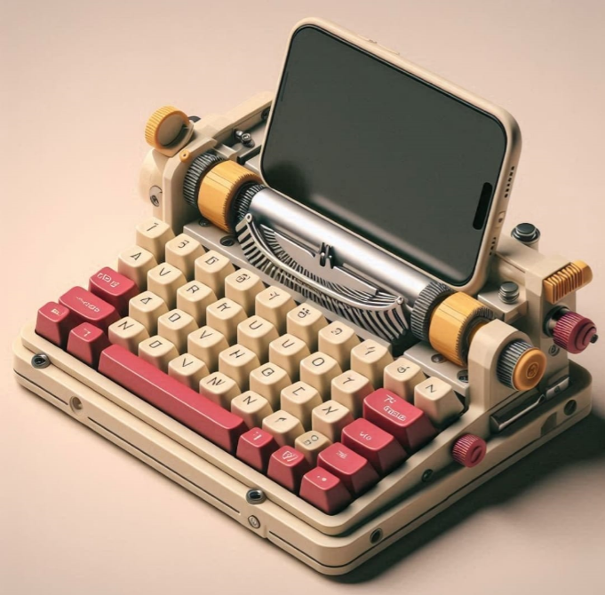
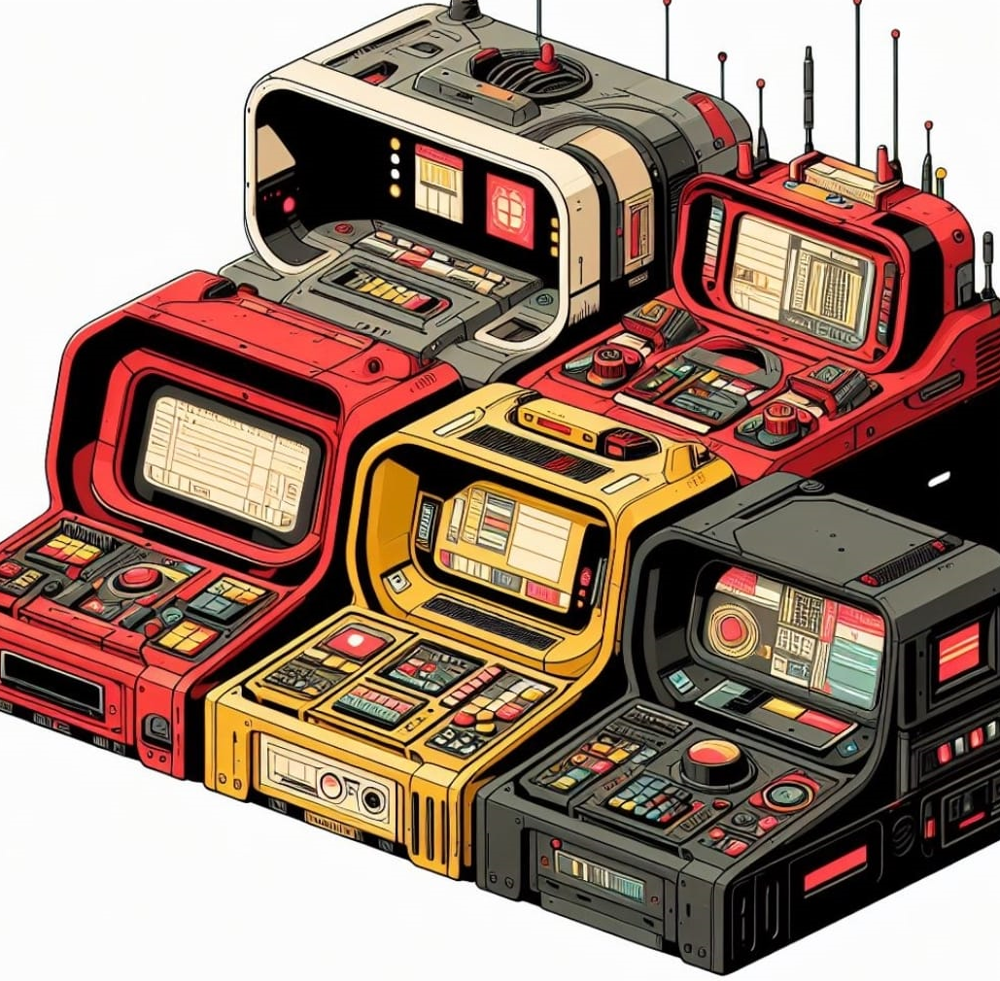
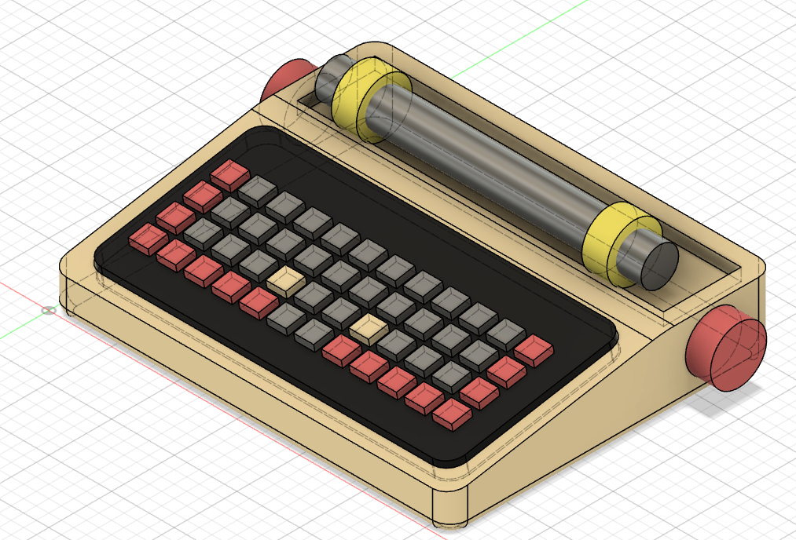
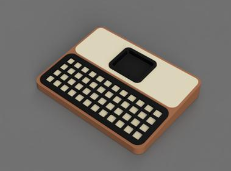
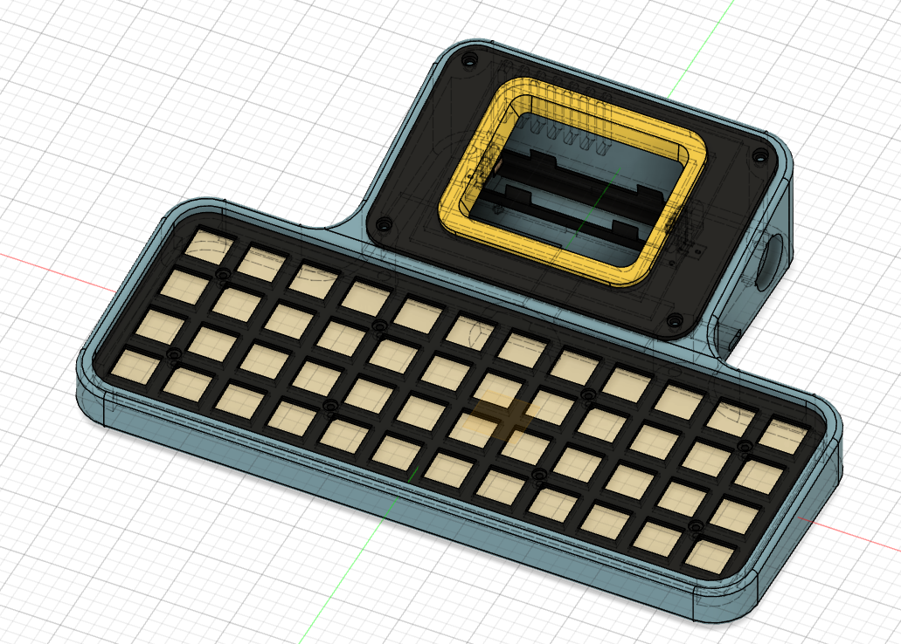
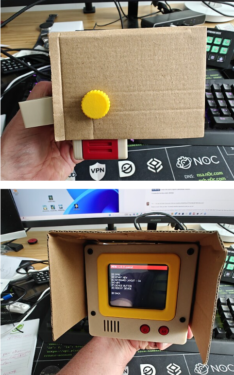

# Micro Journal Rev.6: Write with Style - Build Story

A playwright from New York once asked for a writing device he could carry around, use in cafés, and proudly show off. He wanted something compact, practical, and distraction-free—something stylish.

Introducing the Micro Journal: a blend of modern practicality and stylish minimalism. This compact, sleek device features a distinctive design with a bold colored border contrasting against white keys. It’s a hot-swappable mechanical keyboard, allowing for hyper-personalization. Easy to carry with its leather straps, it’s perfect for writers on the go.

Micro Journal seamlessly combines functionality with personality, making it ideal for capturing spontaneous ideas and drafting stories wherever inspiration strikes, be it a café, park, or during travels. Its chic, contemporary look makes it a fashionable and practical tool for any writer.

# Six'th is always a charm?

Here's one of the feedback gems from the Reddit community:

> I've been searching for something like this for years. Alphasmarts were close, but the keyboard was where they fell down, I always wanted to use my mechanical keyboards. I had ideas of a Raspberry Pi box and a small monitor, but they always felt too much like the dekstops/laptops I wanted to get away from. - u/PresidentScree
https://www.reddit.com/r/writerDeck/comments/1cytyq6/my_first_writerdeck_the_micro_journal_rev_5/

This feedback touches me deeply. Someone finally found in my build the solution they've been longing for. Nothing else solved their problem—until the Micro Journal. My creation provided real value, making their writing experience better. This is what makes me feel alive. Creating and building something useful and valuable for others fuels my passion. 

# A contact from a playwright 

A playwright reached out, asking if I had an assembled version of the Micro Journal with a keyboard that could be used in cafés or as a writing device on the go.

This exchange wasn't just a simple inquiry; it was a conversation infused with the essence of a writer. His words painted vivid scenes of his desires, perfectly aligning with what I had already built. He was clear about what he liked and didn't like, making it easy for me to chart a path to meet his needs.

Being upfront about the budget, he made it clear what he could afford. I proposed that the product resulting from this process would be sold just like any other item in my online shop, with no additional design or customization fees. It was a win-win situation: I had a playwright with clear desires to guide my work, and he could get the writing device he longed for.

# Conceptual Design

I embarked on a conceptual design process to bring the playwright's vision to life. With the help of AI services, specifically Microsoft's co-pilot, I generated some visuals.

I prompted:

> Draw me a retro vibe typewriter that has a mechanical keyboard that can hold a small display. 

This is what I received:

After a few more tries, I also got this:

These designs are fantastic. I would love to see these aesthetics materialize in real life. It's a blend of nostalgia and modern functionality, and I'm eager to make it happen.

# But ...... the Reality is

So, I sketched out some designs using basic shapes like boxes and cylinders, aiming to capture the essence of the conceptual designs. Despite my best efforts to add colors and details, the result was underwhelming.

It looks like a doodle from elementary school. Realizing my limitations, I decided to lower my expectations and focus on what I could realistically achieve: building a functional enclosure without fancy details. I started from scratch, keeping it simple with a straightforward design—a box with a keyboard on the bottom and a display on top.

When I saw this, it felt achievable. I could envision each step: how to screw it together, where to place the battery and wires. It was practical and buildable.

But, really? From the cool concept art to this mundane slab of plastic? I couldn't bring myself to share this vision with the playwright. At this point, why not just buy an AlphaSmart? This design wasn't something I could proudly show off. It felt predictable and uninspired, like a bear roaring for a carrot.

# Delete All, Draw Again, Delete All, Draw Again

I experimented with a hinge design, which ended up looking like two fat books stacked together. Despite my efforts, I couldn't achieve a sleek, cohesive look. I didn't want it to resemble a bulky hamburger case, and I struggled to smoothly connect the keyboard and display sides as the hinge made it thicker.

I tried placing the display in the middle of the keyboard, but that split version would be too long to fit in a bag. I considered putting the display on the side, which seemed cool but raised many practical questions. (Revisiting this idea now, I might give it another shot in the future.)

Not being an expert in 3D design, every iteration took ages to complete. After numerous attempts and deletions, I reached a point where I had to accept my limitations and stop pushing for something beyond my current skills.

Two weeks passed with no tangible progress, and I was starting to feel demotivated. After several desperate iterations, I settled on a platform resembling the AlphaSmart or my initial design.

It wasn't vastly different from the initial concept, but it was something I could complete. I needed to finish at least one build with a keyboard. After two weeks of no results, this is where I concluded the design phase.

# The Playwright's Kind Words

I sent the design to the playwright, and his feedback was invaluable. He provided suggestions for adjustments and shared stories about what he envisioned from the design, offering rich material for me to work with.

He mentioned hinges, protective covers, wrist protections, and handles for carrying. His feedback was a breath of fresh air, especially after countless iterations that left my head spinning with possibilities but no clear direction. His specific observations and desires helped me decide what to focus on and what to let go.

Although hinges were beyond my current capabilities, the other elements seemed feasible. However, figuring out where and how to incorporate them was still a challenge.

# What a Timing!

Then, an image arrived in my inbox. One of the buyers sent me his ingenious application of bolts on the Micro Journal.

Just adding a bolt joint system solved so many problems and opened up numerous possibilities.

(Thanks, Pascal Forget!)

Once I created the hole and modeled the thread, it resolved all the issues related to the handle and the protective cover. What a relief!

After a few prints and adjusting the measurements with the hardware, it was finally ready.

For the first time, I held the Micro Journal in my hand without worrying about people wondering what weird gadget I was holding.

This time, it felt like something I could carry around with, let's say... a fancy nerd vibe?

# Conclusion

I needed a Micro Journal that I could use while sitting on the sofa. Sometimes I don't want to be at a desk to jot down my random thoughts and nonsensical ideas. They don't deserve a formal setting; just pick up the journal, plop down on the sofa, and start writing without any boot-up delay.

Its minimal yet practical design provides a full-sized keyboard experience in a compact form factor. The display is adequate for reviewing what I've written without the need for immediate editing or verification—just continuous writing, edit later.

After completing the build and making final adjustments, it looked really cute. I had a light and happy day when it was finished—almost like I was in love. Was it the satisfaction of closing a project, or is it genuinely in love?

My 7-year-old daughter declared that when it goes on sale, it will sell out in a second. Well, it practically did—within minutes of my Reddit post, the first order came in.

The playwright seems eager to receive the package. I'll be sure to note his reaction here when he receives it.
