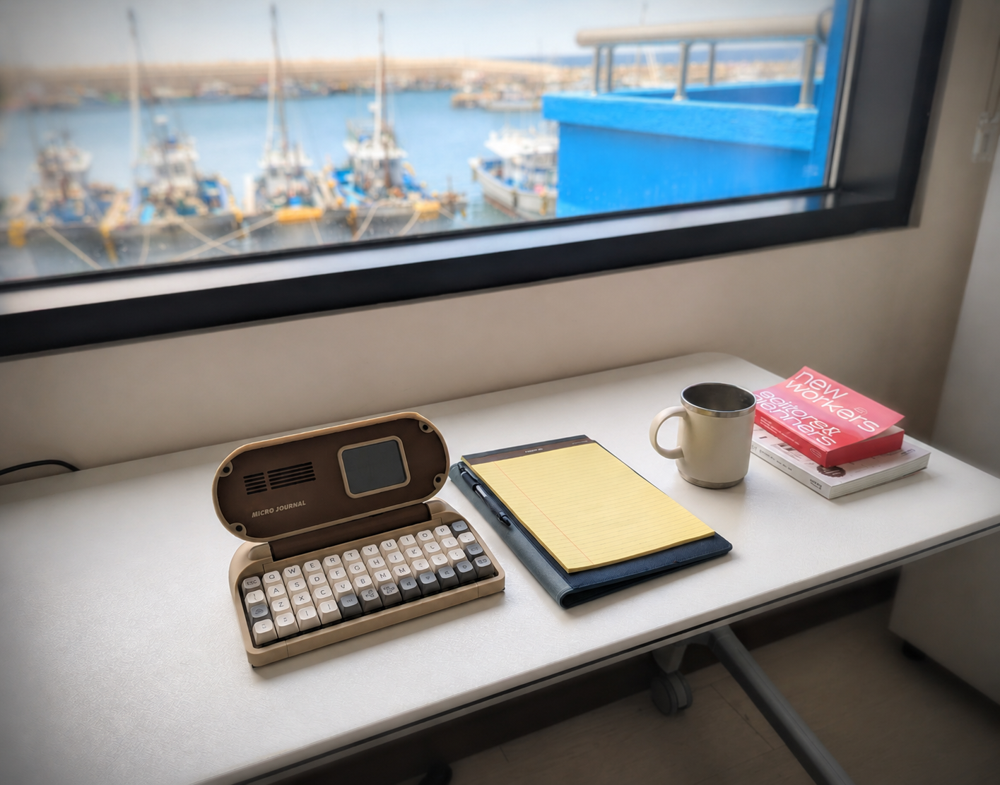

# Micro Journal Rev.6.1: Mini

### Documents 

* [Behind Story] TBD
* [Introduction Video](https://www.youtube.com/watch?v=DYZrfpyJvLY)
* [Quick Start Guide] TBD
* [Build Guide] TBD

### Resources

* [Design Files](./STL)
* [Firmware Release Page](https://github.com/unkyulee/micro-journal/releases)
* [Firmware Source Code](../micro-journal-rev-4-esp32/)

### Tips and Tricks

* [Using Micro Journal Rev.6 as a Bluetooth Keyboard](https://youtu.be/IW5ninGiN7k)

### Community

* [Un Kyu Lee's Timeline](https://www.yesbut.it/)
* [Flickr - AlphaSmart - Writing Tools](https://www.flickr.com/groups/alphasmart/discuss/72157721923133428/)

### Press

* [Yanko Design - A Solo Korean Maker Just Built the Writing Device Your Phone Isn’t](https://www.yankodesign.com/2026/06/13/a-solo-korean-maker-just-built-the-writing-device-your-phone-isnt/)

### Online Shop

* [Order from Un Kyu's Tindie Shop](https://www.tindie.com/stores/unkyulee/)
