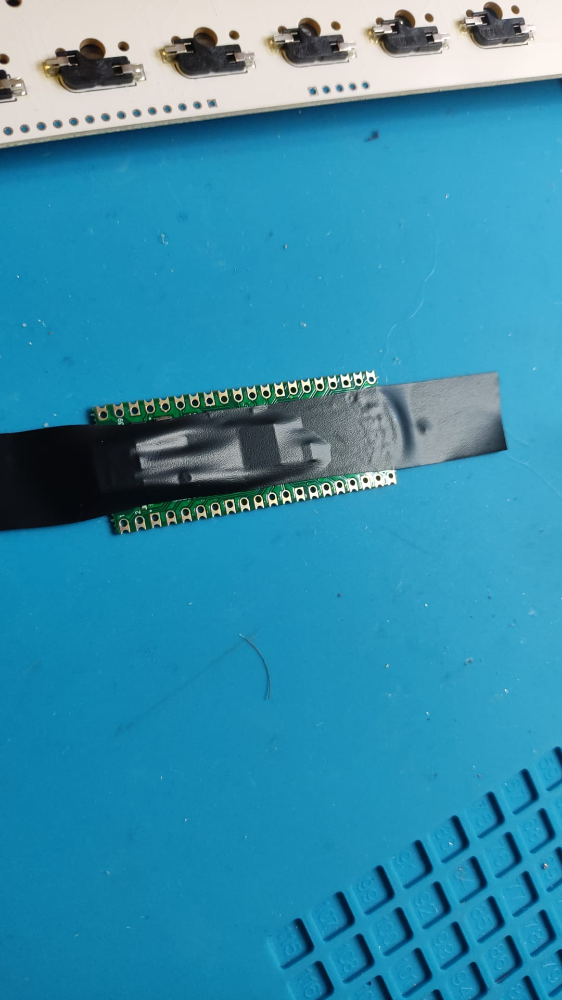
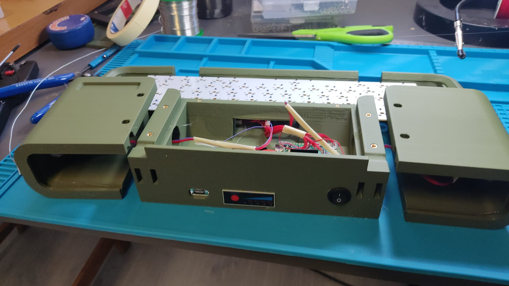

# Micro Journal Rev.7. Build Guide

This guide is for building the **Micro Journal Rev.7**, allowing you to assemble one on your own. It provides detailed information for troubleshooting if any parts of the build encounter issues and serves as a resource for those curious about the construction of the Micro Journal Rev.7.

To complete this build, basic soldering skills are necessary, though advanced skills aren't required. All components are through-hole types, so with some practice, you'll be able to achieve the level needed.

You'll also need access to 3D-printed parts to complete the build. Many 3D printing services are available, but if you'd prefer to assemble your own and are having difficulty sourcing components, feel free to contact me—I'll do my best to help provide a DIY kit.

- Build Time: 4 ~ 6 hours
- Basic level of soldering is required to complete the build
- [Buy a DIY Kit](https://www.tindie.com/stores/unkyulee/)

# System Architecture

Rev.2. is a small computer. Process of the building rev.2. is very similar to building a PC. There is a computer at the center of it, the assembly consists of connecting a display, power supply and the keyboard.

### A. E-Paper Display with ESP32

This build utilizes [LILYGO T5 e-Paper](https://lilygo.cc/products/t5-4-7-inch-e-paper-v2-3) module. This board contains e-paper display and ESP32 module in a single board.

### B. Keyboard Controller - Raspberry Pi Pico RP2040

Keyboard controller is going to provide USB interface to connect to the raspberry pi computer. In order to control the key inputs, you are going to need a "raspberry pi PICO". Please, note that this is not to be confused with "Raspberry Pi Zero 2W". PICO is a micro controller. It is a tiny processing unit that is dedicated to handle the key inputs. This component will be called as "keyboard controller" throughout the document.

### C. Keyboard PCB

[Keyboard PCB](https://github.com/unkyulee/micro-journal/tree/main/micro-journal-rev-7-e-ink/PCB/SMD) can be found here. It is using SMD components. So, it's not going to be too easy to build it by hand for most people. It is possible to order the PCB assembled from the popular PCB assembly services or you can order one from my [tindie store](https://www.tindie.com/stores/unkyulee/).

### D. Knob - EC11

Rev.7 uses two EC11 knobs. They are wired to the keyboard PCB.

### E. LIPO Charger and Voltage Boost Controller

Power is supplied externally from LIPO batteries. In this build 18650 batteries are used. In theory, you can pick up any LIPO batteries and use them. Lilygo T5 has battery charger included in the board itself. However, it is not possible to use it in this setup. Because, keyboard is using the USB port of the T5 and in order to have the USB keyboard properly functioing, T5 needs to produce 5V and supply to the keyboard controller. However, T5 board lacks providing power via USB port. So, additional charging and voltage boost module is used to regulate the power to the build.

# Materials

- [LILYGO T5 e-Paper (Touch)](https://lilygo.cc/products/t5-4-7-inch-e-paper-v2-3)
- Raspberry Pi Pico (rp2040)
- [69 Keyboard PCB](https://www.tindie.com/products/unkyulee/diy-kit-keyboard-pcb/)
- Micro SD card minimum 8 GB

- 12x M3 Heated Inserts OD 4.5mm Length 3mm
- 4x M3 Hex Screw Length 20mm
- 4x M3 Hex Screw Length 10mm
- 4x M3 Hex Screw Length 70mm

- 14x M2 Heated Inserts OD 3.2mm Length 3mm
- 12x M2 Hex Screw Length 5mm
- 2x M2 HEx Screw Length 3mm

- [LiPo Charger and Step Up Controller](https://www.aliexpress.com/item/1005006366996657.html)

- [Battery Inidicator 1S Lithium 4.2V](https://www.aliexpress.com/item/1005006350742151.html)

- [18650 Battery Holder](https://www.aliexpress.com/item/1005005084346241.html)

- [Type C to USB-C Slim 90 Angled Adapter straight- side bend](https://it.aliexpress.com/item/1005007531893239.html)

- [2 Pin Round Snap Rocker Switch 0.65 inch](https://www.aliexpress.com/item/1005006005552235.html)

- 2x [EC11 15mm Half handle](https://it.aliexpress.com/item/1005005983134515.html) 
  
- [Spacebar Stabilizer 6.25](https://it.aliexpress.com/item/1005007119644385.html)

- [B-7000 Glue](https://www.aliexpress.com/item/1005005379063116.html)

- You will need TORX T10H to handle Hex screws
- A Wire Wrap Hand Tool can be a life saver for a lot of tasks - WSU-30
- Any typical wires for electronics would do. I use [Wires 30 AWG](https://it.aliexpress.com/item/1005007081117235.html)

# Build Order

1. Enclosure Preparation
2. Display Preparation
3. Power Supply
4. EC11 Rotary Encoder Preparation
5. Keyboard PCB Wiring

### Enclosure Preparation

[STL files](https://github.com/unkyulee/micro-journal/tree/main/micro-journal-rev-7-e-ink/STL) for the 3D prints are available in the github.

Please, refer to the image below for placement of the prints. Vertical placements of the enclosure parts gave the best prints results, so far in my builds. This orientation gives the most coverage of the smooth surfaces.

Once the prints are done. Remove the support materials from the print.

### Installing Heat Inserts

### Display Preparation

Use B-7000 glue to apply on the display rim. Then attach to the display body.

Make sure to apply some pressure on the display while glue is dried. Leave some heave book on top of it for an hour before using it for the assembly.

### Power Supply

Cut fours wires in 15 cm (6 inches) length.

Merge battery indicator and battery holder and solder it to the power supply module.
Solder two wires on the Vout+ and Vout-. Preferrably, use different colored wires or place a label for each polarity. This can be useful to identify the wires to connect with the power switch.

Prepare the round switch. Attach wires, preferrably same color. Apply some hot glue one the leads if possible. This will prevent any shorts while moving around.

Pick up the middle enclosure. The order of the installation is important. If you place the battery holder first, then you can't push the battery indicator. So, make sure to follow the order

1. Use hot glue on the bottom of the power supply module and stick it in.
2. Then, push the battery indicator towards outside, and glue it in
3. Lastly, use a double sided tape or hot glue to place the battery holder
4. Power switch can be pushed in from the outside.

Take one wire from the switch, and then take Vout+ wire from the power supply module. Merge these two wires. Insulate it with a tape or hot glue.

### EC11 Rotary Encoder Preparation

EC11 rotary encode needs to be prep'd. You can use Wire Wrap Hand Tool to make things easier to wrap around the wire to those legs.

Cut 10x 30 cm wires. Make two with different colors to identify the GND pin if possible.

There are two holes in the tool. Pass through the wire into the hole closer to the surface. Then pass through the leg to the hole in the middle. That roll it. Afer some several roles. Wires are neatly wrapped on to the leg.

Wire up all 5 legs. Making one leg in the middle as a different color can be useful. This is GND point. The wires are pretty well stuck so, no need to do further actions. But, if you want to make sure then apply the solder in order to stick it permanently.

### Keyboard PCB Wiring

Cut 22x 12 cm wires.

Make sure to flip the keyboard PCB to see the sockets. Then from the top is PIN 0, then pin number increments till the end.

First 5 pins are for the knob on the left hand side. Last 5 pins are for the knob on the right hand side. Middle pins are for the keyboard matrix that will be connected to the keyboard controller (raspberry pi pico)

| Keyboard PCB PIN | Connects to           |
| ---------------- | --------------------- |
| Pin 0            | Right Knob Out B       |
| Pin 1            | Right Knob GND         |
| Pin 2            | Right Knob Out A       |
| Pin 3            | Right Knob Switch      |
| Pin 4            | Right Knob Switch GND  |
|                  |                       |
| Pin 5            | PICO GPIO 2           |
| Pin 6            | PICO GPIO 3           |
| Pin 7            | PICO GPIO 4           |
| Pin 8            | PICO GPIO 5           |
| Pin 9            | PICO GPIO 6           |
| Pin 10           | PICO GPIO 7           |
| Pin 11           | PICO GPIO 8           |
| Pin 12           | PICO GPIO 9           |
| Pin 13           | PICO GPIO 10          |
| Pin 14           | PICO GPIO 11          |
| Pin 15           | PICO GPIO 12          |
| Pin 16           | PICO GPIO 13          |
| Pin 17           | PICO GPIO 14          |
| Pin 18           | PICO GPIO 15          |
| Pin 19           | PICO GPIO 16          |
| Pin 20           | PICO GPIO 17          |
| Pin 21           | PICO GPIO 18          |
| Pin 22           | PICO GPIO 19          |
| Pin 23           | PICO GPIO 20          |
| Pin 24           | PICO GPIO 21          |
| Pin 25           | PICO GPIO 22          |
| Pin 26           | PICO GND              |
|                  |                       |
| Pin 27           | Left Knob Out B      |
| Pin 28           | Left Knob GND        |
| Pin 29           | Left Knob Out A      |
| Pin 30           | Left Knob Switch     |
| Pin 31           | Left Knob Switch GND |

--
Currently rev.7 build guide work is in progress.

Before soldering on Raspberry Pi Pico, make sure to cover it with a tape. Without covering the board, there has been many cases that the board fails to work. Since, I have covered it up, it has never failed. I think there is some heat or solder spilling out and could cause some issues. Covering it will prevent some direct heat or solder spills to break the circuit. It's better safe than sorry approach. I do not know if there is any scientific explanations to this measure. 

Once the soldering is done. The board will looks like this. Apply some hot glue on the joints, and use some tapes to keeps the wires together. 

### Connect Power Supply to the Keyboard Controller

There should be Red wire (+5V) and a Blue wire (GND) from the enclosure. Solder that to the raspberry pi pico VBus and GND respectively. 

### Upload Keyboard Firmware 

Download the keyboard firmware from the link below

https://github.com/unkyulee/micro-journal/tree/main/micro-journal-rev-7-e-ink/keyboard

Connect the Raspberry Pi Pico to the PC. It will show up as a USB drive. Copy "unkyulee_68_vial.uf2" to the drive. Once the file is copied over then the drive will auto disconnect and then you will see the keyboard firmare is activated on the pico.

You can download [Vial](https://get.vial.today/) to check if the firmware is correctly loaded

### Assembly the enclosure

You will need this shape of USB cable. It's USB type C male to male. One end is angled in such way as the picture. 

Assemble the display enclosure first. You will need to place the display module aligned with the display port. Do not push it hard. It's quite fragile and too much force can destory the display. 

Attach the USB C cable as the picture above. Then place the back enclosure. Use m3 10mm screws to close up. Do not tighten it too hard. Be very gentle. Tightening it too hard can break the display module because the cable can bend when pressured too hard.

Make the knob wire go through the hole in the middle enclosure. Tighten them on each side. Make sure to place the back panel before tightening the screws. 

Assemble the left hand side enclosure. First tighten the keyboard PCB with m2 6mm, then use m3 70mm screws, and then m2 20mm. It's important to screw in with following the order. This is the order that I found that aligns the keyboard PCB. 

Place the assembled display. Make sure that the USB cable is passing through the internal hole and connect to the keyboard controller. 

While carefullly enclosing the wires. Place the screws in the order presented in the picture. First, keyboard PCB and then work on the enclosure. 

When you reach this point. Try to place a battery and one or two keyboard switches to see if the all the connections are well made. 

### Keyboard Stabilizer

Installing keyboard switches and keycaps are going to be rather a standard procedure. One thing that is a bit difficult is how to place the stabilizer. 

Make sure to place the stabilzer as the picture above. Important to note that when those components are place it should not have tension and the wire should be moving up and down freely. 

Make sure to place the component in the orientation as the above picture. 

