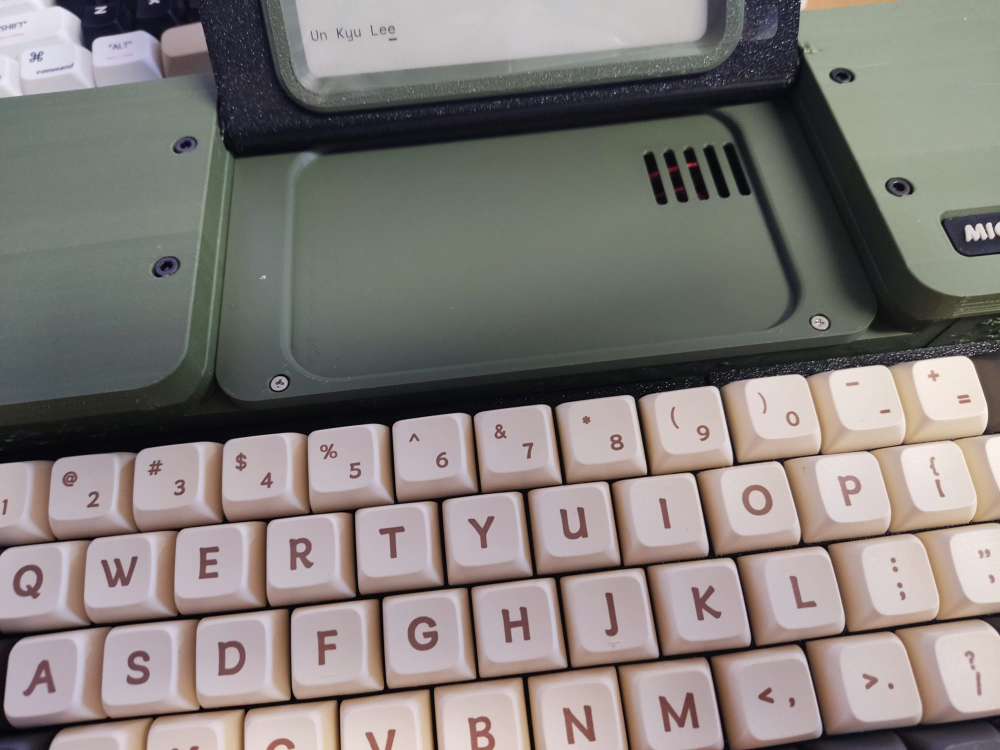
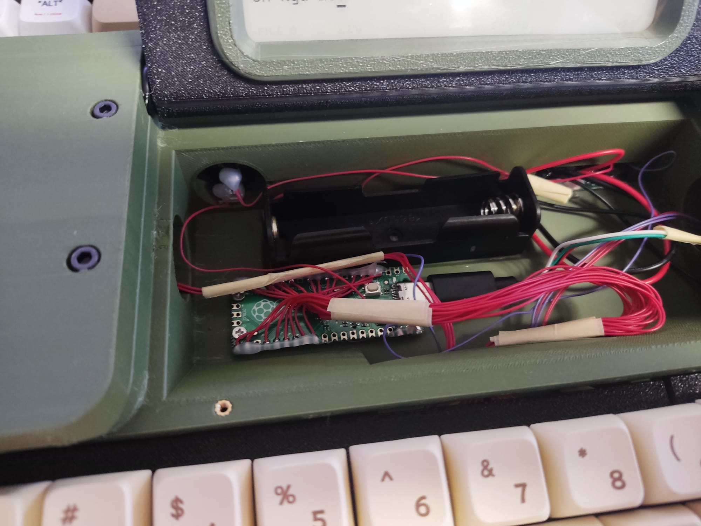
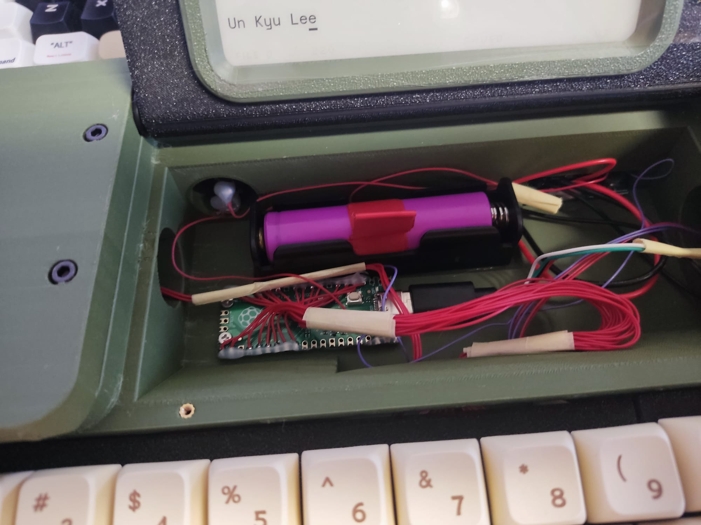
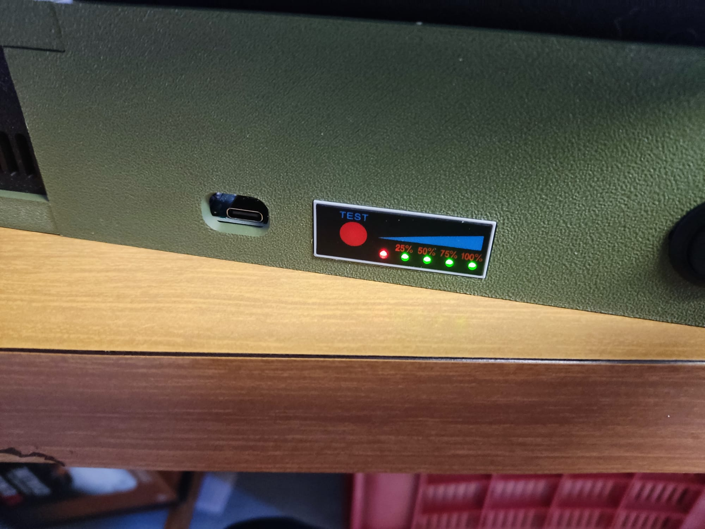
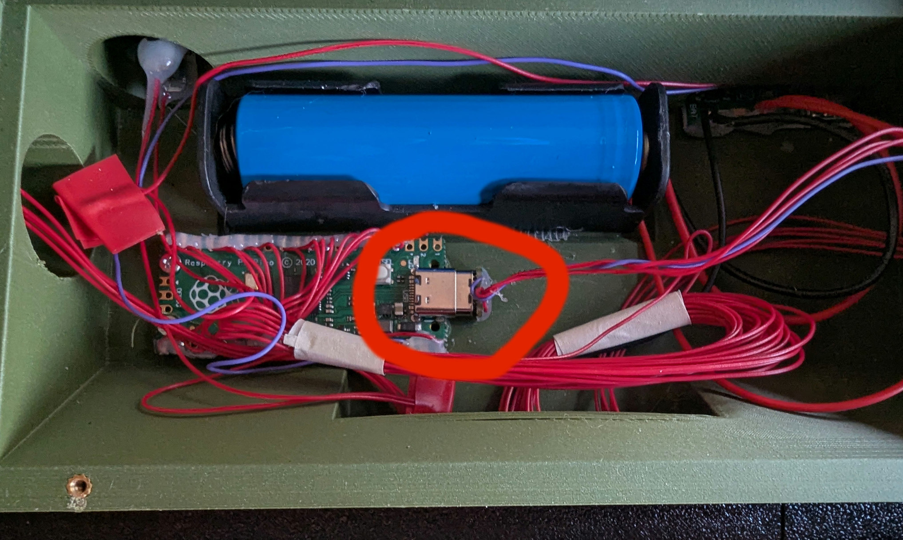
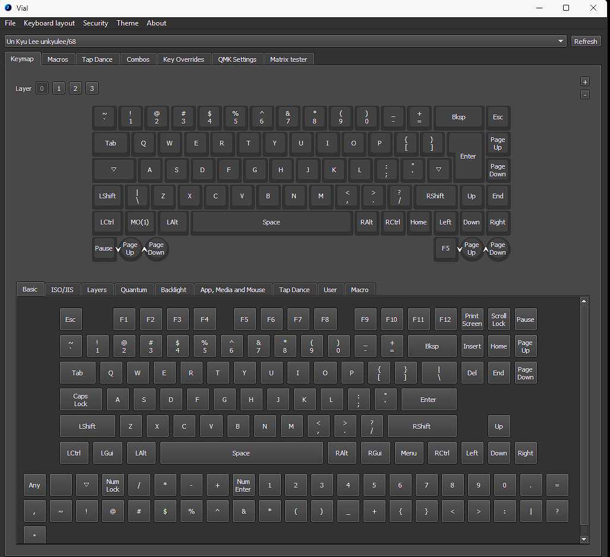

# **Micro Journal Rev.7 — User Guide (v1.2)**

v1.2

Prepared by Hook then Edited by Un Kyu Lee


## **Table of Contents**

- [**Micro Journal Rev.7 — User Guide (v1.2)**](#micro-journal-rev7--user-guide-v12)
  - [**Table of Contents**](#table-of-contents)
  - [**1. Things to Buy**](#1-things-to-buy)
  - [**2. Quick Instructions**](#2-quick-instructions)
  - [**3. Battery Installation**](#3-battery-installation)
    - [**Step 1: Open the Bottom Compartment**](#step-1-open-the-bottom-compartment)
    - [**Step 2: Charging the Battery**](#step-2-charging-the-battery)
  - [**4. Google Drive Sync**](#4-google-drive-sync)
    - [**Step 1: Create Folder**](#step-1-create-folder)
    - [**Step 2: Google Apps Script**](#step-2-google-apps-script)
    - [**Step 3: Configure Micro Journal**](#step-3-configure-micro-journal)
  - [**5. Wifi Setup**](#5-wifi-setup)
  - [**6. Firmware Update**](#6-firmware-update)
  - [**7. Customizing Keyboard Layout**](#7-customizing-keyboard-layout)
  - [**8. Trouble-shooting**](#8-trouble-shooting)
  - [Introducing the Micro Journal Rev 7](#introducing-the-micro-journal-rev-7)
  - [Using the Micro Journal Rev 7 - A Walkthrough](#using-the-micro-journal-rev-7---a-walkthrough)
    - [Setting Up the Micro Journal Rev 7](#setting-up-the-micro-journal-rev-7)
  - [Using the Rev 7 Part 1: The Editor](#using-the-rev-7-part-1-the-editor)
  - [Using the Rev 7 Part 2: The Menu Screen](#using-the-rev-7-part-2-the-menu-screen)
  - [Using the Rev 7 Part 3: Modifying the Rev 7's Key Map with Vial.](#using-the-rev-7-part-3-modifying-the-rev-7s-key-map-with-vial)

---

## **1. Things to Buy**

Before using the **Micro Journal Rev.7**, you need a battery.

1. **Buy a 18650 Lithium-Ion battery**
   Search for "LiPo 18650". Recommended links:

   * [Battery Buying Guide](https://www.reddit.com/r/18650masterrace/comments/qp21o8/buying_18650_batteries_start_here/?share_id=RTqe02Hqv2l_VwJTwoIi1&utm_content=2&utm_medium=android_app&utm_name=androidcss&utm_source=share&utm_term=1)
   * [Flat-top battery (US)](https://www.amazon.com/gp/aw/d/B0CPBGDP1H)

2. **Install the battery**
   The device will not power on without a battery.

3. **Power on**
   Once installed, power on and start using your device.

---

## **2. Quick Instructions**

* **USB-C port** at the back: battery charging

  * **Red:** Charging
  * **Blue/Green:** Fully charged

* **Knobs**:

  * Right knob click → Clear screen
  * Left knob click → Sleep mode

---

## **3. Battery Installation**

### **Step 1: Open the Bottom Compartment**

1. Unscrew the two Philips screws on the battery cover.

2. Lift the lid to access the battery holder.

3. **Check polarity carefully:**

   * Spring side = Negative (-)
   * Flat side = Positive (+)

4. Install the 18650 battery correctly.

   * Use tape around the battery for easy removal.
   * Ensure no cables are pinched when closing the lid.

  
  
  
  

**Safety Notes:**

* Fully charge before first use (at least 4 hours).
* Avoid over-tightening screws or pinching cables to prevent short circuits or fire.

---

### **Step 2: Charging the Battery**

* Use **USB-A to USB-C cable**.
* USB-C to USB-C or PD chargers may not work.
* Red/Green light indicates charging; no light → incompatible charger.

---

## **4. Google Drive Sync**

### **Step 1: Create Folder**

1. Go to [Google Drive](https://drive.google.com)
2. Create folder `uJournal`

  
  

### **Step 2: Google Apps Script**

1. Inside `uJournal`, create a new Apps Script.
2. Copy the latest sync script:
   [Sync Script](https://raw.githubusercontent.com/unkyulee/micro-journal/main/micro-journal-rev-4-esp32/install/google/sync.js)
3. Give the project a name and deploy as **Web App**:

   * Execute as: Me
   * Access: Anyone

  
  

4. Authorize the app. Select your Google account. Click **Go to uJournal Sync** if warned.
5. Copy the Web App URL.

### **Step 3: Configure Micro Journal**

1. Open SD card on PC.
2. Create or edit `config.json`:

```json
{
  "sync": {
    "url": "!!!COPY YOUR WEB APP URL HERE!!!!!"
  }
}
```

3. Save and reinsert SD card.
4. Press `MENU → S` on the Micro Journal to test sync.

---

## **5. Wifi Setup**

* ESP32 only supports **2.4 GHz Wi-Fi**.
* Steps: `MENU → W` → Select slot → Enter SSID → Enter password → Test connection.

---

## **6. Firmware Update**

1. Check latest firmware: [Releases](https://github.com/unkyulee/micro-journal/releases)
2. Download `firmware_rev_7.bin`
3. Copy to SD card, reinsert, and power on.
4. The device shows a white screen (~10s), then boots with updated firmware.

---

## **7. Customizing Keyboard Layout**

  

* Use **QMK-Vial** software: [https://get.vial.today/](https://get.vial.today/)
* Steps:

  1. Open battery cover.
  2. Disconnect USB wires to controller PCB.
  3. Connect USB to computer.
  4. Launch Vial and edit keymap.
  5. Reconnect wires, secure plate, power on.

---

## **8. Trouble-shooting**

* Micro Journal components are common; replacements are available.
* Refer to [Build Guide](../build-guide.md) for wiring and troubleshooting.
* Report bugs: [GitHub Issues](https://github.com/unkyulee/micro-journal/issues)


## Introducing the Micro Journal Rev 7

The Rev 7 Is one of a line of Micro Journal Writer Decks aimed at (my words) *writing focused* drafting. That is, they are digital typewriters that help you focus on getting the words out when you are drafting. That is certainly what the Rev 7 is optimized for. It can do other things. You can edit on it, though you probably should export the text to a more capable computer (which the Rev 7 has the means to do) for the heavier lifting type of editing like moving text around and rewriting. The software is simple, but capable, and the design—the shape of the Rev 7, the rise of the keys, the mechanical keyboard, the attachment shelf for a clip-on light, the folding eInk screen—all of it gives this digital typewriter a presence that draws you in. You want to start writing.

The Micro Journal Rev 7 is a complete replacement for an Alphasmart Neo. It is instant on with 10 file spaces to switch between. It can "send " the text in a file space to any computer or phone that you can connect to. It can also be connected to a computer to be used as a keyboard. And it has a full staggered QWERTY keyboard. It adds to those capabilities things the Alphasmart Neo didn't have such as Bluetooth and an eInk screen.  It is larger than many of the other Micro Journals, but it is not heavy and you can put it in a bag to take it with you, but it is larger than other Micro Journals. It runs off a rechargeable Lithium Ion battery. More on that in the quick start guide.


## Using the Micro Journal Rev 7 - A Walkthrough

### Setting Up the Micro Journal Rev 7

Before we dive in, **make sure you have the latest stable firmware for the Rev 7** before you proceed any further. If a version is marked [DEV], that is a version in development and could have bugs, although it may have desirable features and fixes. Read the changelog and decide which version you want. You can download the current firmware from here:

https://github.com/unkyulee/micro-journal/releases

Then, just remove the SD card from the Rev 7 and use a card reader with your computer to transfer the firmware file to your SD card. Put the SD card back in the Rev 7. When you turn on the Rev 7, you will be asked to acknowledge loading the new firmware.  Then, after some screen flashing, you will be set to go.

## Using the Rev 7 Part 1: The Editor

For right now, we are only considering the Rev 7's editor and it's very simple feature set. We will save other features like WIFI and BT connectivity for the next section when we look at the menu. The Editor is the core functionality of the Rev 7 and it requires no external connections. It is a digital typewriter to help you get your words out with reduced distractions.

The editor is very basic. It types characters. It has a 4.7 inch (540 x 960 pixels) e-Paper screen which is easy on the eyes., with the font size used gives you 11 rows with about 25 characters across. The text is small but quite readable in an eye-pleasing sans serif font with double spacing. None of these text characteristics can be modified by the user.

There is only one thing this editor does. It types words in plain text format, saves them as you go and allows you to navigate through the text with arrow keys if you want to check something, delete or backspace. There is no copy and paste, no spell check, no paragraph formatting (although you can do that with markdown if you wish) and no AI. Best of all, there is no need to be connected to the internet or BT to use this editor and save your texts. If you are distracted, it won't be because of anything on the Rev 7.

The editor has 10 filespaces, labeled 0-9. These filespaces are where you do your writing. This is very much like the Neo 2 except you don't have dedicated keys to open the different file spaces. Instead you use the menu to select filespaces.

When you first turn on the Rev 7, you are instantly placed in the first filespace, numbered 0. The screen is blank except for a status area at the very bottom of the screen. In the status area you will see (left to right) the filespace number, the word count, the save status (saved/unsaved) and, to the far right, the keyboard layout you are using (more on keyboard layout when we look at the menu). When you first enter the editor the save status will say "Saved" even if the filespace is empty. When you start typing, the  save status will change to unsaved and the word count will start updating.

The Rev 7 doesn't save letter-by-letter, but will save when you pause your typing. You will see the "Unsaved" status change to "Saved" whenever you pause. You are safest if you wait (it isn't a long one) until the status changed to "Saved" before turning off the Rev 7. And that's it. You type. You can use arrow keys to navigate to review or make small local fixes. And you can check your word count. By the way, subsequent to this first session, the Rev 7 will start up in whatever file space you were working in last. 

While in the editor, the two scroll wheels have functions as well. Turning either the right or left scroll wheel is another way to do Page Up and Page Down on the text. They don't scroll line by line in typewriter fashion due to the refresh challenges of e-Paper. Pushing the right scroll wheel in refreshes the screen if you get artifacts on the e-paper screen. Pushing in the left knob performs a shutdown. Text will come on the screen reminding you to turn off the power using the switch at the back of the Rev 7. 

Be aware that the buffer that maintains the text on your screen, allowing you to navigate back to review the text, is limited. When the buffer limit is exceeded, text at the top of the buffer (which will be the earliest text you typed) is lost in the sense that you can't navigate to review it. However, the text is still in your file on the SD card. Nothing should ever be lost. However, this is also how this editor is different from more elaborate editors on your computer. It cannot load files from off the SD card, it can only save text you are creating.

Also, note, if you leave the Rev 7 on for a long period without any activity, it will shut down showing a message on the screen to turn off the power switch.

So, you have turned on the Rev 7 and written some text. Now, what can you do with that text? Do you want to edit it on your computer? How do you get it there? Can you sync directly or to a cloud? What settings are available to change your experience of the editor? For these questions or more, we turn to the menu system. 

## Using the Rev 7 Part 2: The Menu Screen

On the default keyboard layout, the top row left-most key is the menu key, whatever that key is labeled on the key cap. Most often it will be the Esc key.

The Menu has several types of things. The top of the screen shows what firmware version you have. On the right hand side of the menu screen is a list of the 10 file spaces.  You can change filespace here by simply typing a number. You can also delete the contents of a file space here by typing "D" on this screen. It will delete the contents of the last file space you were working in (you'll see the number of the filespace to be deleted next to the Clear file item.

On the left side of the menu are are various settings and functions that affect the editor or allow you to backup you text files to other devices or the cloud. Each one is engaged by typing the single letter in brackets next to them. They are:

* ***[W] WIFI***
* ***[S] SYNC***
* ***[K] KEYBOARD LAYOUT***
* ***[T] BLUETOOTH KEYBOARD***

* ***[B] BACK***

Lets go through each of them one by one.

**WIFI** - Typing "W" on the menu screen will take you to the WIFI settings screen. You only should need to do this once, though you can have up to 5 WIFI profiles if you take the Rev 7 to different locations. Type the number of the profile you want to set up or edit. You will be asked for an SSD and a password for that SSD. The software will then test the connection. If it succeeds, you are done.  Wifi doesn't stay on, there's no reason for it to do so.  It is only used for syncing to Google Drive. Running Sync will turn on WIFI, sync and turn off Wifi.

<u>*Note*</u> The Rev 7 can only connect to 2.4 Ghz Wifi. It won't connect to 5Ghz WIFI. Sometimes, especially if you use a router that offers both in a mode where the router decides which is appropriate for the device trying to sync, you may have to go through the setup more than once until the router gets it right. After that, you won't have any more trouble.

**SYNC** - This requires WIFI to be set up first and it requires the Google Apps Script you set up in the Quickstart guide (which  is done on your computer, and then the app link is added to the config.json file on your Rev 7). If everything is set up correctly, Typing "S" on this menu will send whatever was in the file you were just working in to Google Drive. If you did this for another Micro Journal already you can reuse the same link without going through the whole setup again.

**KEYBOARD LAYOUT** - This allows you to select which standard international keyboard layout you want to use, such as US, UK, French (AZERY), etc.  There is one standard layout option on this list that is not tied to language and that is DVORAK.  Select the letter that represents your choice and you will be returned to the last filespace you were working in. Remember, you will see what keyboard layout you are using in the lower right hand corner of the editing screen. These are standard layouts in each case. This is different than the possibility of custom Key Maps we will mention later.

**BLUETOOTH KEYBOARD** - This has two functions. It first can be paired to a nearby computer, tablet or phone to allow the Rev 7 to be used as a keyboard for any of those 3 devices. The first time with any device you will have to do the pairing, but after that the connection should be automatic once you invoke it on the Rev 7 by typing "T".

The second function is that, while connected to your other device as a keyboard, you can also "Send" the text of the file you last worked on to your computer or phone. This is just like the "Send" function on an Alphasmart Neo. Make sure the active window on your computer or phone is where you want the text sent, such as your word processor. Then press the left knob. The Rev 7 will begin typing out the file into whatever text handling program you have prepared. When you are done using Bluetooth, turn off the Rev 7 to end the typing session.

**BACK** - Typing B on the Menu returns you to the editor in the last filespace you were working in.


## Using the Rev 7 Part 3: Modifying the Rev 7's Key Map with Vial.

Because the Rev 7 uses a full staggered QWERTY keyboard, there may not be a compelling reason to make custom modifications of your standard keyboard layout, but you can if you wish. The Rev 7 doesn't you the Json file method of altering your Key Map that the Rev 4, Rev 5 and Rev 6 use. Instead it uses QMK-Vial software on your computer and making a direct connection to your keyboard controller from your computer to the Rev 7.  This is a little more technical but it really gives you full control over your keyboard layout. As such, this method has more of a learning curve, so you might consider whether you really need to tweak the default keyboard layout. However, it is quite doable.

To change your key map assignments you will need to download and install a program called Vial on your computer (not the Rev 7). The following instructions are based on Windows version, but there is also a Mac and Linux version that shouldn't look much different. To download Vial go to https://get.vial.today/  There is also a user manual there if you want to delve deeper into Vial’s capabilities than we will here.

This will be a brief introduction, just to get you started. Although the keyboard controller works with Vial, you should consider it a developer capability. There is no obligation that we will guide you through the whole process. If you need to significantly change the key map layout, you will need to be the one to learn Vial well enough to do it. This is simply an advanced tool we are making available to you if you want to  do the research to learn it.

After you have installed Vial on your computer, you need to connect the keyboard
controller to your computer so vial can read the current Key Map.  To do this,
first switch off the power using the toggle switch in back of the Rev 7. remove
the two screws from the plate that the screen folds down onto. Then slide the
plate out. You  will see a small PCB in the area under where that plate was.
You will see wires connected by a USB plug to that board. 

  

Unplug the wires and connect one end of a USB cable (USB-c Male) to the board where the wires had been connected and the other end of the USB cord to your computer. Then launch Vial on your computer.  When it fully loads, you should see a screen like this:

  

This screen roughly divides into 2 halves. The top half is your keyboard, showing the key assignments. Just above that keyboard to the left are the tabs for different layers 0, 1, 2 and 3. Because we have a full QWERTY keyboard, there's not much reason to get into layers. If you have keys you want to create on another layer, consult the Vial documentation.

The bottom half is your source of key functions to assign.  There are several tabs, This is the basic tab and it is all I’m going to show you because it has pretty much everything you need for the Rev 7.

Lets look at the Key Map for your keyboard in the top half. First, notice there are 6 rows. However, your keyboard only has 5 rows, so ignore everything in that bottom incomplete row and don’t put any key assignments you intend to use there. By the way, you don’t have to match the size of the key in the lower half to assign that key function.

So now let me walk you through changing key functions and layers: There are two things you will most likely want to do. One is to replace a function with another function. The other to move a function to another location.

**Replacing** a key function is easy.  You simply click on the key you want to replace on your key map on the top half.  Then click the key  function you want to replace it with on the bottom half. The reassignment on the Rev 7’s keyboard is made instantly.  You don’t save. It is done.  You also have no undo, except by reassigning the key the same way. Note, in the screen shot of Vial, I have made one change  to the default layout already. Where you will have (and would expect) a Caps Lock key, I have assigned an upside down triangle from the keys in the bottom half. An upside down triangle key means "do nothing." I always find ways to get rid of Caps Lock on my keyboards. 

**Moving** a key function is the same basic instructions except you are involving more than one key. To move a function, it is the same as replace,  Select the key in the top half of your Key Map, where you want to move a function, then click on that function. But now you have a duplicate key in the old location. Replace that key’s function, possibly with the function you eliminated in the first step.

When you are done with whatever changes you are making, close Vial and unplug your Rev 7 from the computer. Now, remove the USB cord from the Rev 7 and replug in those wires. Put the plate you removed back on and secure it with the screws again.

So here are the basic steps, from beginning to end, for making simple changes (replace function, move function) to your Key Map summarized for you.  


##Procedure: Changing your Key Map.##

1. Back up any writing on your Rev 7. This is just a precaution. Very little can go wrong here.

2. Shutdown the Rev 7 and click the power switch to off. 

3. Remove the two screws from the front of the plate that the screen folds down onto. Look for the USB connection on the small PCB inside. Disconnect the USB connection.

4. Using a USB cord to plug into the connector to the board inside the Rev  7 Connect the other end of the USB cord to your computer. Then start up Vial on your computer.

5. Make your changes to either replace or move functions as detailed above. Click on the key you want to replace on your Key Map in the top half of the screen and then click on the function you want to replace it with in the bottom half of the screen. Repeat this for as many changes as you wish.  

6. When you have completed all your changes, simply exit Vial on your computer and disconnect the USB cable that connects your Rev 7 to the computer. 

7. Reconnect the wires with the USB plug to the USB port on the board inside the Rev 7. Replace the plate and secure it with the 2 screws. 

That’s it.  The next time you boot up, you should have the changes on the Rev 2’s keyboard. It really is that easy.


