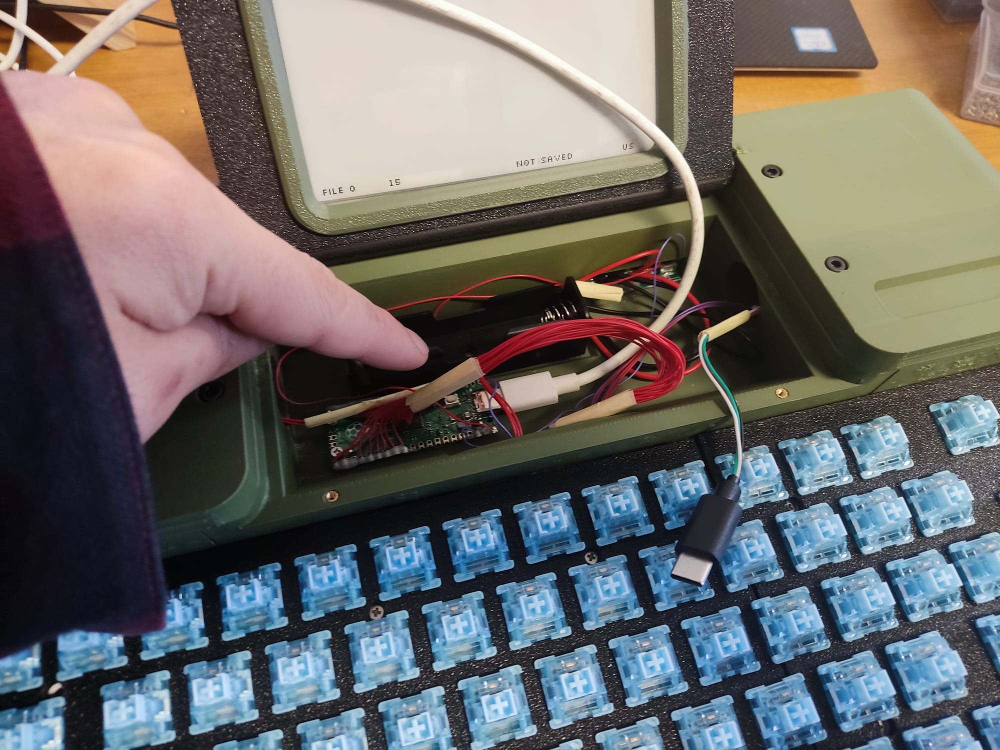

# Quick Start Guide - Micro Journal Rev.7

## Things to buy

When you receive the **Micro Journal Rev.7**, you'll need to install a battery before using it. Please follow the steps below to complete the setup:

* [Battery Buying Guide](https://www.reddit.com/r/18650masterrace/comments/qp21o8/buying_18650_batteries_start_here/?share_id=RTqe02Hqv2l_VwJTwoIi1&utm_content=2&utm_medium=android_app&utm_name=androidcss&utm_source=share&utm_term=1)

1. **Buy 18650 Lithium ion battery**. Search with term "LiPo 18650" and should be able to find the fitting battery. Here is the link where battery is sourced typically from the users.

2. **Install the battery**: The **Rev.7** will not function without a battery. Ensure the battery is properly installed before attempting to power it on.

3. **Power on**: Once the battery is installed, you're ready to power on and begin using your device.

---

## 1. Battery Installation

### Step 1. Open the Bottom Compartment and Install the Battery


There are two screws on the battery cover. They are regular philips screws. Unscrew them and open the lid.


Once lifted, you will now see the battery holder. 


**Check the battery polarity carefully.** The battery holder has markings for positive (+) and negative (-) polarity. The spring side of the holder is the negative (-) side. Incorrect polarity can cause irreversible damage to the device.

**Install the 18650 battery,** ensuring you follow the correct polarity as shown on the battery holder.

**Double-check the installation** to ensure the battery is properly seated and the polarity is correct. Having a tape sticked around the battery as shown in the picture, can help to easily and swiftly pull out the battery in case of any issues.


After installing the battery make sure that no cable is clipped on to the edge while closing the lid. 


### Important Notes:

**Check the battery polarity carefully.** The battery holder has markings for positive (+) and negative (-) polarity. The spring side of the holder is the negative (-) side. Incorrect polarity can cause irreversible damage to the device.

**Ensure the battery is fully charged** before use. LiPo batteries are not shipped fully charged. After installing the battery, connect the device to the charging port and leave it charging for at least 4 hours before first use.

**Battery installation safety:** Improper handling or installation can cause a fire. Be cautious and avoid over-tightening the screws. If the case doesn’t close easily, check that no cables are pinched, as this could lead to short circuits, damage, or fire hazards.


---

## 2. Google Drive Sync


#### 1) Connect to Google Drive

* https://drive.google.com

#### 2) Create a folder: "uJournal"


#### 3) Go inside the uJournal folder

#### 4) Create Google Apps Script


#### 5) Copy the Sync Script

Open the following link to get the lastest script code. Open it can copy and paste the code to the apps script. Overwrite what was existing in the apps script before

https://raw.githubusercontent.com/unkyulee/micro-journal/main/micro-journal-rev-4-esp32/install/google/sync.js

Give some name to the apps script project


#### 6) Deploy the Apps Script

Click on the "Deploy" button


Choose the deployment type as "Web app"


Configure as the following. Execute as "Me". This will allow the script to access to your drive.


Who has access as "Anyone". This way Micro Journal Rev.6 can access to the drive. As long as you don't share the link that is provided. Only the Micro Journal Rev.6 should have access to the drive.

#### 7) Press "Deploy" on the popup

Wait for a bit, then it will ask you to authorize the app. Choose the account of the google drive.


It will give a scary message while authorizing it. The script that you just copied is not verified. Considering that this script is on your google drive and will access your own google drive, it is ok to press, "go to uJournal Sync".


Allow the Drive access at the next screen. Your account name should appear. (Not mine)


#### 8) COPY THE LINK PROVIDED AS WEB APP URL


#### 9) Open the SD card of the Micro Journal

Connect the SD card to the PC and create a file "config.json" \
If the file already exists then no need to create one \
Open the file with a text editor (notepad) from PC. 

If aren't familiar with the JSON format. Then delete the existing content and replace it with the following json. Then edit the following part only. 

!!!COPY YOUR WEB APP URL HERE!!!!!

Make sure to not to remove / add any comma (,) or bracket ({, }) or quotes (") while you are editing. If by any chance, the format gets broken. Start over by removing all texts inside config.json file and copy & paste the following template.

If you are familiar with the JSON format. One thing you need to add is the "sync" property as the root property in the JSON and leave the rest of the property as it is.

```json
{
  "sync": {
    "url": "!!!COPY YOUR WEB APP URL HERE!!!!!"
  }
}
```

Save the file to the sd card. Safely remove the card from the PC and then you place the SD card back to the Micro Journal Rev.6. After that you should have your Google Sync working with the Micro Journal Rev.6.

While you are on the Micro Journal Rev.6. Press "MENU" on the keyboard then press "S" to see if it is working. Make sure to have the wifi information set before the sync.

---

## 3. Wifi Setup

**NOTE THAT WIFI IS LIMITED TO 2.4 Ghz. ESP32 doesn't support 5 Ghz wifi at this moment**

* Press MENU on the keyboard
* When you see the menu screen press W 
* In the wifi settings page press the number of the slot where you want to place the wifi information
* type in WIFI SSID then press enter
* type in WIFI password then press enter
* wifi information is saved to the device


---

## 4. Firmware Update

Please, make sure that you have the latest firmware on the device. The firmware is still under a development and your device may have shipped with outdated firmware.

To check the current firmware version. You can press "MENU" on the keyboard.


#### Check latest release

You can check the latest firmware from the following link.

* https://github.com/unkyulee/micro-journal/releases

#### Download the "firmware_rev_6.bin"

Download the file from Assets "firmware_rev_6.bin"

* Turn off the Micro Journal
* Pull out the SD card from the Micro Journal 
* Copy "firmware_rev_7.bin" file inside the SD card. 
* Put back the SD card to the Micro Journal 
* Turn on the Micro Journal
* Micro Journal will show white screen for 10 seconds then automatically boot again to the updated firmware.

---

## 5. Customizing Keyboard Layout



* Open up the battery cover lid. 
* Locate the USB port 
* Very Very carefully remove the USB cable 
* Use other USB-C cable connect to the keyboard controller in the Micro Journal
* Connect the other end to the PC
* Use QMK-Vial software from the PC to customize the key map
    * https://get.vial.today/

---

## Trouble-shooting Guide

Micro Journal is built with components that you can buy common market places. If some of the components are not working properly, or worn out, you should be able to find a replace from the market quite easily.

Here is the build guide where it explains the wiring and the steps to build one your own. This document should give you good enough information to identify the hardware troubles that you may encounter.

* [Build Guide] TBD

Please, use github issues for reporting the bugs

* https://github.com/unkyulee/micro-journal/issues