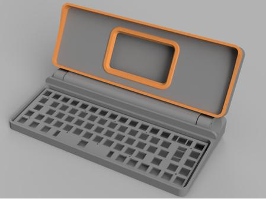
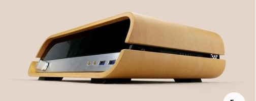
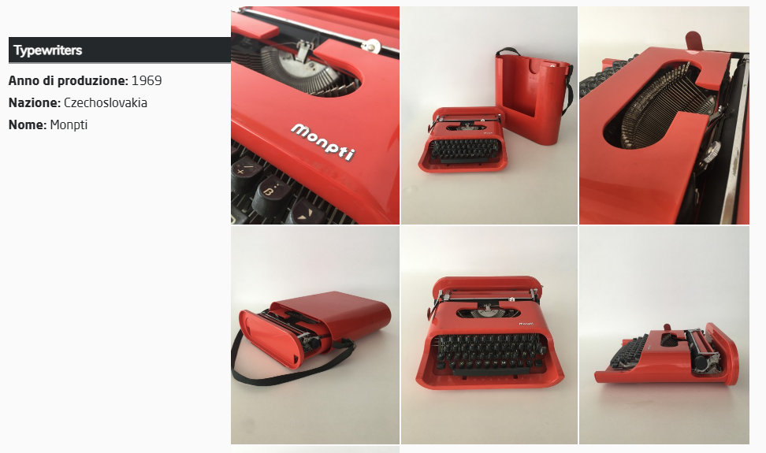
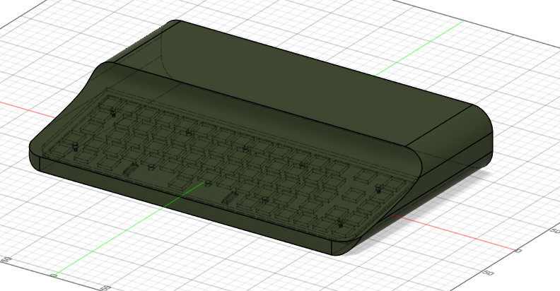
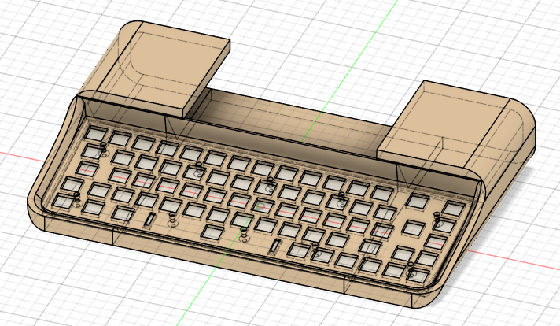
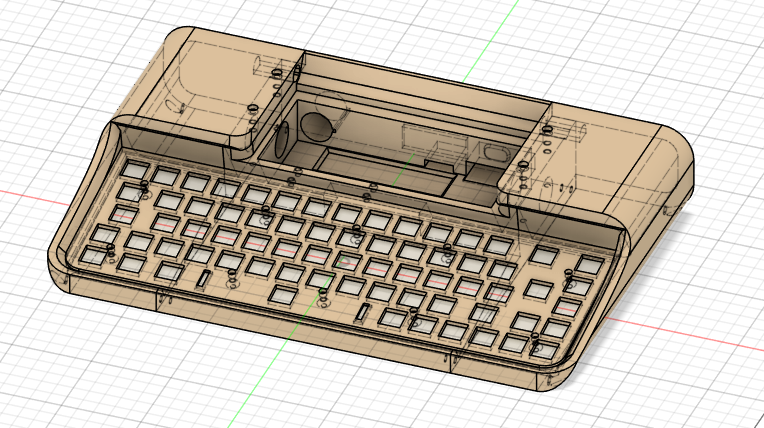
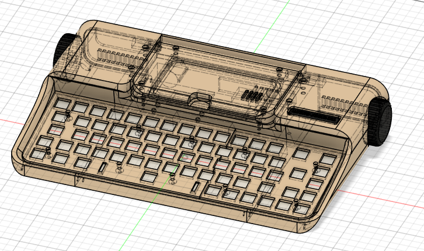

# Micro Journal Rev.7: Kindred Gift

This is 7th revision of the micro journal. When you scroll the home screen where all the past revisions are. It looks like quite an evolution from one to the other. It has been one year since the Micro Journal started. Wow... one year of building one thing that does one thing and one thing only. 

This time, I tried to tone down my creativity and try to make things that is sound and grounded. Least amount of surprise. Something that people see and immediately can get used to. 

This revision is tribute to Hook, Pascal, and Frank. They are the one who have been supportive since my very first release of the micro journal and had more trust on the project than myself. Rev.7 is a kindred gift for those who have been supporting me since day one. 

# Staggered keyboard layout

Key point of Rev.7 is the keyboard layout. It is staggered layout. Which you can find easily when looking for a keyboard from the market. There is no particular catch on this keyboard layout. Maybe it has a cursor navigation and few more keys on the right-hand side. Trying to fit in the rectangular shape. Staggered layout is a keyboard that doesn't requires a re-learning process. Most of people who are familiar with computer. They will know how to type, and won't have struggles to find keys that they need to. 

I was planning to gift my previous Micro Journal revisiotn to people around me. Which has ortholinear keyboard. I showed to my friends. They thought it was nice and all. But couldn't get into the writing that easily. There were stutter moments to find the keys and trying to type in. I felt that unless there are huge amount of desire to type on the new style of keyboard. For most of the people it can be a daunting task to get used to. If I am going to convince my friends to type on this. Probably, best approach was to make the keyboard as conventional as possible. 

It's a signal that I am designing the Micro Journal not only for myself and few. I am starting look at people from broader area. Those people who were looking for a spacebar. Here it is. 

# e-Ink display

Another point for rev.7 is about the display. It is using e-ink display. This is a display that has paper like sensation when characters are displayed on the screen. It's like kindle book reader from amazon. Once the letters are printed on the screen they stay on, until it is electronically removed. 

I have chosen e-ink display as more people were asking for the option. Some people had problem with their eyes and were in a situation where they must use e-ink displays. Some people were thinking that is was cool. For me, it was a technology where I had to test it out and feel the feasibility myself. When I chose this option, I had in mind if this display doesn't work, I can scrap it off from the project. But at least let's try.

## Problem with e-ink: delays and ghosting

I wasn't so convinced with e-ink display. They are fancy tech and many people talks about it. But, they have delays and also ghosting. Also, really slow refreshing rate. It's going to be clunky writing on it. When the letters appear later than when I typed. When there are residue of the previous written texts... 

I have tried with e-ink display tablet to write on it. Used Boox onyx air 2 paired with a bluetooth keyboard. It does work. But there is something that doesn't feel write. It's the delay? or Android itself isn't optimized for a writing device? 

When I implemented the features for testing purpose and started to see the text appear. With the default setup. It was horrible. Really slow. 1 second to see what I wrote and that felt very clunky. 

## Partial Refresh

The product I used for the display, [T5 e-Paper from Lilygo](https://lilygo.cc/products/t5-4-7-inch-e-paper-v2-3) has partial refresh features. So, I modified the code to refresh the part that are only updated from the last refresh. It did improve a lot. Still there are delays but the refresh rate was going down to 100 ms ~ 200 ms range. This is 5 times refresh per seconds. It's not fast in any computing standards. But it start to feel like an acceptable range to feel the text appearing as I type. 

Ghosting is still a problem, but adding a special button to full refresh the screen and also adding a logic to refreshing the screen from time to time, could solve some of the ghosting issues. 

When I have arrived to the point when partial refresh was working. Is it because I have committed too much? Is it too late to go back? I start to like it. 

## Still... you must feel what I felt

When writing on the e-ink display. While all the rest of the screen is blank. The letter appears, smudgely. You can feel the letter turning black from gray, also a bit of spread of the edges of the font spreading. A slightest feel of analog. It brings incredible sensation when writing. It feels like writing on a paper using keyboard. A ghost is writing in front of me with a invisible pencil. You can feel the letter, appearance coming out from the screen. This brings a lot similar to the sensation when you would be typing on a typewriter. A letter by letter printed out on the screen after a smacking on the ink ribbon.  

Well... despite all the techinical constraints. I did like the sensation that e-ink has brought. Also, quite forgiving when it comes to writing out drafts. 

## I might make a LCD variation in the future.

I will add LCD screen version in the future. I won't increase the revision on it. I can find something that can replace just the screen, and keep the rest of the form factor. 

---

# Design

Let's talk about the design. 

## Some concerns

Normal keyboard is quite huge. It almost the twice as big from the ortholinear keyboard from the previous revisions. With the small keyboard. It was quite easier to find the design that fits. Because keyboard itself was a great design element. It looked cute just by those witty nitty keycaps laid out in squares. 

When the keyboard goes in staggered layout. It just looks like a keyboard from the office. It was quite a concern for me. If I could make it look good and well placed in the design.

## Inspirations

Whatever the concerns, I went out to the internet and eye-shopping'd around for some inspiration. 

Came upon this product. Catched my eyes. I liked the simple rounded corner shape. No fancy engravings. Just speaking with the shape. Little line of margin horizontally acrossing the body. Covering the black body and showing off at the side. It's so sexy.

Oooo... I saw some Rev.6 shape there. Heavy curve. Tunneling the entire body with that shape. It felt so simple. Very strong statement. 

Those two images were getting into my head. These were something that I really wanted to realize. A simple shape crossing through the entire body. Felt like this is what some artist would do. Draw a circle, and extrude till the end. Then call it a day. 

I started to look around the typewriter section and see if there were anything that resembles the simple shape boldly crossing through the body. 

Then this beautiful master piece came through. Red. Red. Thick Red. You want some design? Here we go. Draw a circle and extrude. Make a hole in the middle and put that damn typewriter in. Full stop. One typewriter ready. 

What comes as a beauty must be a personal thing. But bringing out a chunk of a cylinder shape and yet being able to be exclusively attractive. It's magical. I had a strong desire to realize this shape and print it out in the world. 

So I sat down and started to draw a circle.

## Implementation

What I learned so far is that. First step is to get the shape and volume right. Then work on the details. This way less to worry about connecting the detailed components. 

Shape was getting pretty close to what I wanted. Extruded a big box then cut the corners with the circle. Placed the keyboard plate inside to figure out the placement of the openings. Then cut again. 

Then worked the way up to the detailing out the placement of the keyboard. Also, figuring out the placement for the display. Hollowed out the back so that there is a room for electronic components to go.

Keep detailing out for the screw holes and making a compartment for the keyboard controller and battery placement. Holes for switches and USB chargers. 

Then added knobs and added the display enclosure on top of it. I have used the same hinge mechanism as rev.2.revamp. With a rubber o-ring to create a soft friction on it. This is display compartment is much lighter than the rev.2.revamp. So, I wasn't so worried about the friction get being enough to hold the screen. 

Hmm.... I wanted to see how different from the imagination to the implementation. But this time, it's quite close. Provided that the inspiration shape was simple, the implementation didn't have much room to be too bad.  

I had quite a few iterations on this design. Had same results every iteration, so, I think I really liked the design. I saw the reddit post that I did in Novemeber compared to the one in Januaray. I had put quite siginificant time redesigning. But the end results looked exactly the same.

To be continued. 