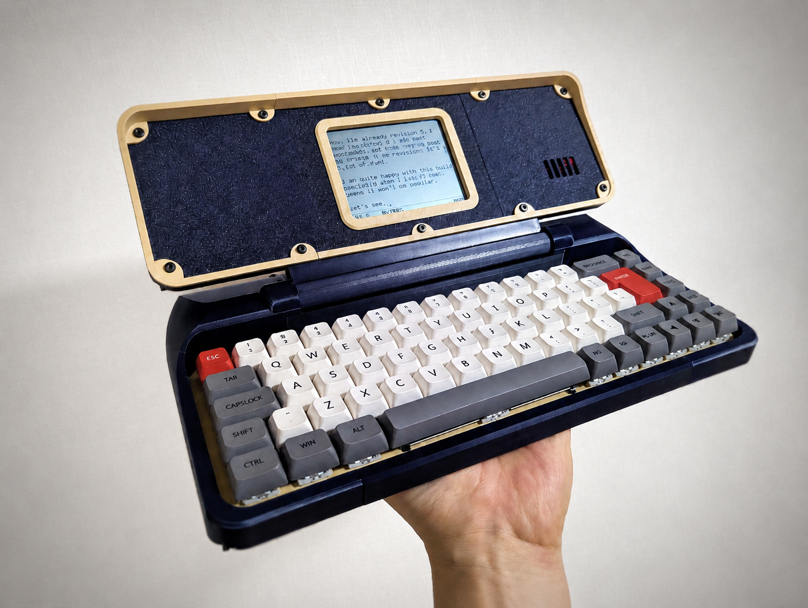

## Micro Journal Rev.8: Melodica

This time, I tried to build a writing machine that uses a reflective LCD.

The interesting thing about this display is that it becomes clearer under brighter light. Unlike most displays, it does not fight against ambient light. Instead, it benefits from it, a bit like what e-ink screens are famous for.

The screen is also monochrome, showing only black dots on the display. That simplicity makes it pleasant to look at. It has some of the character of an e-ink display, but with a much faster refresh rate.

Since there is no light source behind the screen, it feels very easy on the eyes and remains enjoyable even during long writing sessions.

For a writing machine, I feel like this could be it. Maybe this is the end of my personal journey. The final chapter, where everything finally finds its shape and the story reaches a satisfying closure.

I really think this build is amazing for writing. Simple, readable, and fast enough to keep up with your thoughts.

### Hardware Features

* Get into the writing with an instant. Micro Journal Rev.8 takes 1 seconds to boot and be ready to take your note. As soon as the power switch is on. You can start writing. 

* Hot-Swappable Mechanical Keyboard. Micro Journal Rev.8 uses full sized mechanical keyboard switches, and choose any after market switches and keycaps that fits your preference.

* Reflective LCD screen: Becomes brighter under the sun light. The display used in this device become brighter when used under the sunlight. You can see clearly what you have written outside. Enjoy writing in outdoors, and parks. Under the sunlight.

* Battery is replaceable. Uses 18650 LIPO battery. Which you can easily purchase, and you can replace it with ease. No need to worry that battery will be worn out. 

### Software Features

* Draft and Simple Editing Text. This device is optimized for drafting. Yet, you can navigate in the middle of the texts and edit while you edit. 

* Three ways to transfer you text

1) Connect to your PC
Using USB cable to connect your PC. You will see a Drive and all the files can be found.

2) Send via BLE
Micro Journal Rev.8 can become a Bluetooth Low Energy Keyboard. You can "SEND" all the text you've written using BLE keyboard connection.

3) Sync to Google Drive
You can setup your own Google Drive then back up your files via Wifi. There is no 3rd party cloud services nor subscription involved. Just your wifi and Google Drive. Device will connect to wifi only during the sync process.

* Ten file slots. 

* Latin Language Support. Italian, Spanish, French, German, Swedish, Danish, and Canadian Multi-Language is supported.

### Documents 

* [Behind Story](./story.md)
* [Introduction Video](https://youtu.be/VGHCE0Egx4Q)
* [Quick Start Guide](./guide.md)
* [Build Guide](./build.md)

### Resources

* [Design Files](./STL)
* [Micro Journal ESP32 S3 Firmare Source Code](../micro-journal-rev-4-esp32/)

### Community

* [Un Kyu Lee's Design Gallery](https://www.yesbut.it/)
* [YouTube – @unkyulee](https://www.youtube.com/@unkyulee)
* [Reddit – Un Kyu Lee](https://www.reddit.com/r/unkyulee/)
* [Micro Journal Rev.8 Discussion Forum](https://www.flickr.com/groups/alphasmart/discuss/72157721925271377/72157721925345415/)

### Online Shop

* [Order from Un Kyu's Tindie Shop](https://www.tindie.com/stores/unkyulee/)
