# Process of building a Micro Journal Rev.8: Iron Man

In this revision, I would like to show, as raw as possible, how a new revision is invented.

A step by step record of how things get added, changed, removed, and evolve along the way.

Hopefully, I will remain vigilant in writing down the steps.

## Initiatives

A monochrome LCD screen. Some call it a Sharp Memory LCD. I do not think what I got should be called a Sharp Memory LCD screen. But I got something that resembles it.

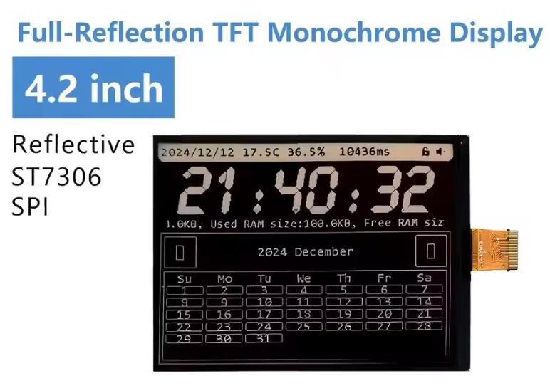

There have been quite a few posts on Reddit about this module. It is just black and white, and it should become clearer under brighter light. Meaning it would become more visible under the sun. Almost like a key feature of an e-ink screen, but with a much better refresh rate.

It's called [Osptek Display with model number YDP420H001-V3](https://ko.aliexpress.com/item/1005012114591531.html). 

It has 300 x 400 dot matrix TFT LCD module. Very thin, and looks too good to be true. The only problem I see is that this module is produced by only one company. I do not think it is a common module.

Well... I going to try it anyhow. 

It is interfaced with SPI and an ST7306 display controller. It is a perfect fit for a microcontroller build.

## Buying the module

So, I bought one module to test it out.

I also bought a [FPC Adapter - 0.5-2.54MM, 24P](https://ko.aliexpress.com/item/1005007617729176.html) which breaks out the film cable coming out from the display. A place to solder and connect wires to the ESP32 S3 module.

I am going to use an ESP32 S3 microcontroller. I thought about RP2040. I think it should be much easier to run it with RP2040. But I ended up with ESP32... because Wi-Fi is a fundamental feature for syncing text files.

It is going to take around two weeks to arrive.

It did arrive. Actually, the connector was more expensive than the display and took longer to arrive.

## Janky Janky Janky

So... I need to know if this hardware is going to work at all. I mean, the hardware should be fine. It is more that I do not know if my skill will be enough to make it work.

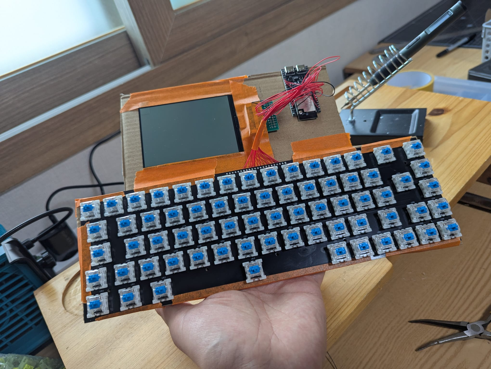

So, I picked up a cardboard, laid the modules on it, taped them down, and soldered them on. It is the moment when a commitment is made. I cannot return this anymore. I soldered the display to the ESP32 S3 first. It uses an SPI interface, so I used exactly the same wire map as Rev.6.

## Printing a letter on the Display

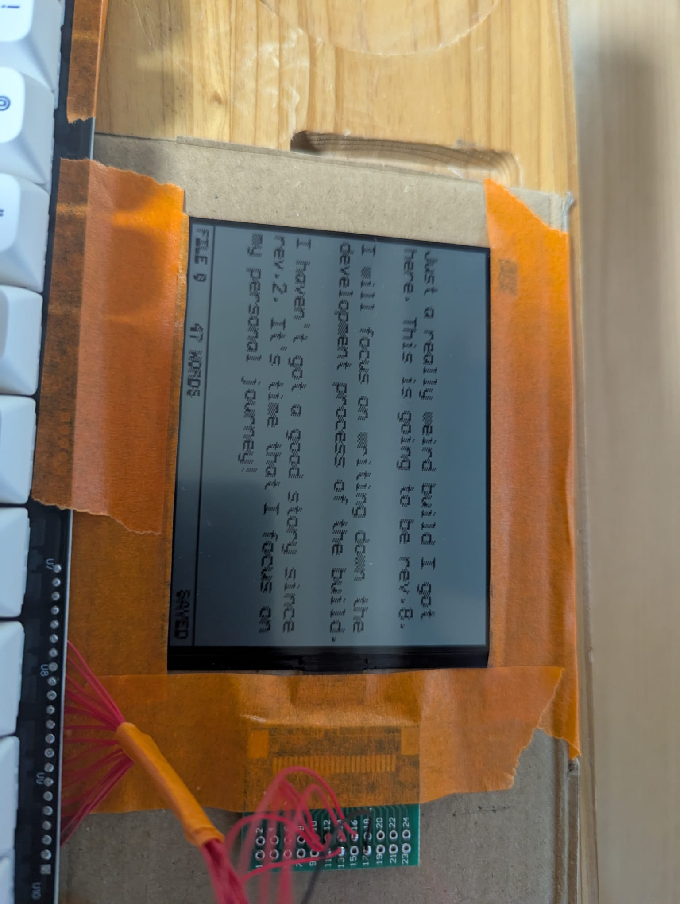

When I saw STxxxx and SPI interface, I thought this was going to be a piece of cake to make work. I have done this numerous times. I was cocky.

Apparently, there are not many resources available on this display module. But seeing that it uses ST7306, which is supposed to be supported by Arduino... I kept digging.

I found a GitHub library that should support the build

[ST7305_MonoTFT_Library](https://github.com/FT-tele/ST7305_MonoTFT_Arduino_Library)

I tried the example code and tried to run it.

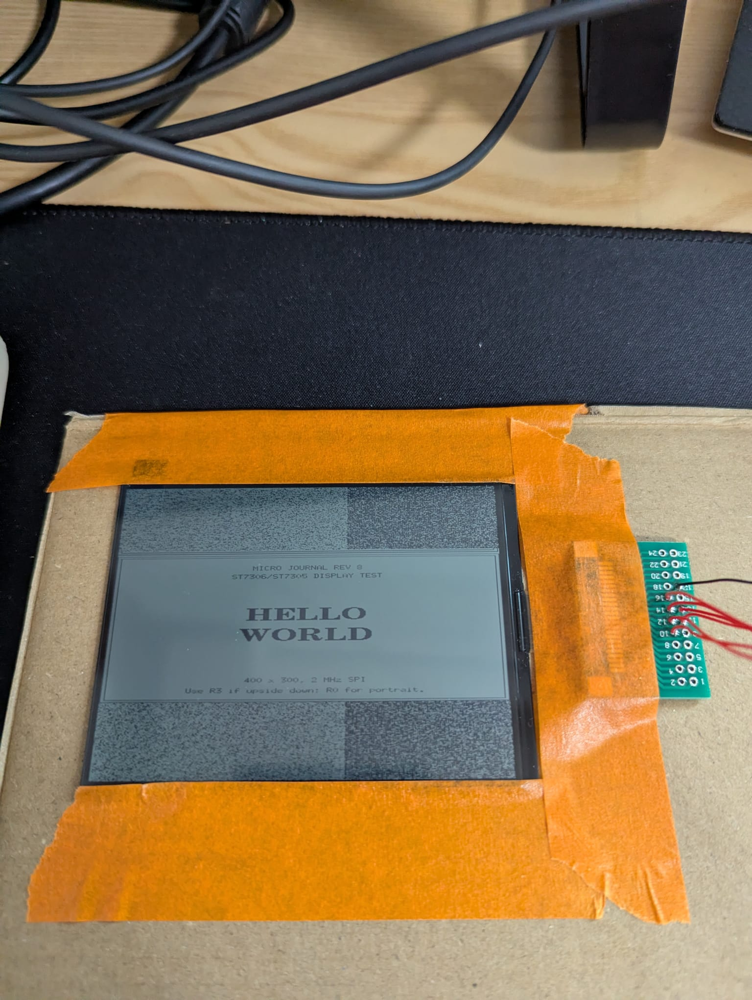

The first sample code actually ran. The good news is that it displayed something intended. But I could not use the entire space of the display. Hmm... this is bad. Because I do not really have the skillset to get into the details of driving the hardware.

After numerous attempts trying out changing parameters at the sample code, I could not figure out how to fill up the display. I tried rotating it. I tried using another library. It always ended up using only half of the surface.

I got frustrated. I almost gave up and threw away everything.

Then... I thought about looking into the hardware driver code. I am going to be honest. I asked AI to explain each line of the driver code, to understand what was going on at a low level. I actually asked AI to write the driver for me. That story will come a bit later.

I learned, well... AI told me that the original library was using only 1 bit to send display information. Whereas it looked like I should send 2 bits, which means the display has grayscale. It is not mono. It has some shades of gray on it.

So, I started modifying the data communication structure, little by little. I watched the changes from each line, just to make sure that I understood what I was doing before moving to higher level code.

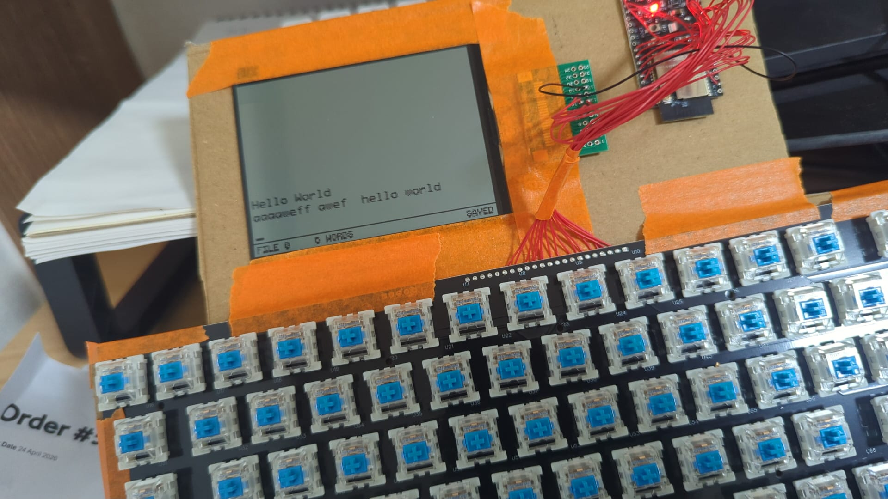

Not gonna lie. It was really, really difficult and, at the same time, not really. Because something was displaying on the screen. So it was not really bad. I could feel that it was something really simple to change, but it could be something at a very fundamental level.

The driver library was not so long. So, I was able to understand what it does and control which parts I should change. It took some time. 

The lesson I learned here is that when working on fundamental stuff, I should understand it, first. I cannot just copy and paste AI-generated code and hope it will work. It may work, but because I did not understand anything... when a little issue arises that I need to fix, I cannot fix it.

Understanding the mechanism with the help of AI, but having control over what changes. This felt like a good line to keep.

Probably, this is the situation most businesses face with AI. There are tasks that you can simply ask AI to generate. But certainly, not all of it can be taken over. Humans still need to take control and make important decisions.

For sure, with the help of AI, I could read explanations of the code when, before, it would have taken so long or been almost impossible. That really helped a lot. I would even say that part made the project feasible. Otherwise, it could have been thrown away.

But what changes, and why it changes, has to be explained by myself. I was not able to handle the bug... because I could not understand it. Asking AI to solve it was just generating piles of code that eventually were not a solution. Then I was out of tokens. After that, I changed my attitude. I asked AI to explain the code, and the code that went in was written by me. Through my decisions.

Then it worked!

Seeing Hello World on the screen was such a pleasure. Yeah, I would not have felt this way if the code had all been written by AI.

## Reflective LCD is it good?

After testing the display was done, I attached the keyboard PCB and started testing the user interaction. Then the quality of the display started to reveal its real face.

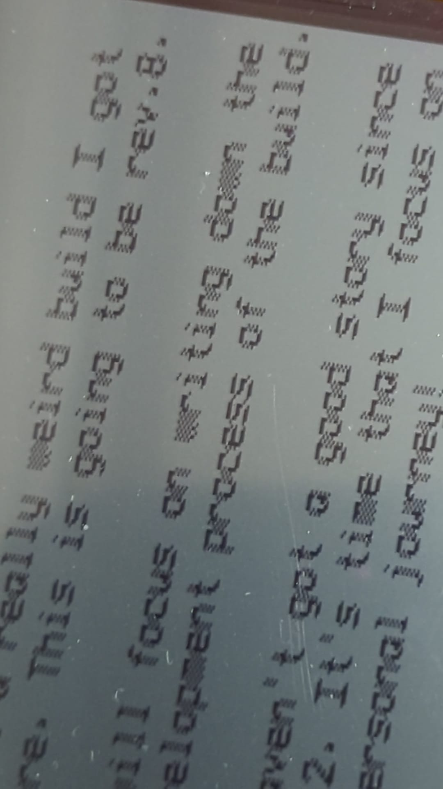

It is a nice screen. It feels really good. Like an old engineering calculator. But the resolution is not very high. When you look closer, you can see that "W" is a little bit smudged. It is because the display screen has a large physical surface, but it only has 400 x 300 pixels. So, it will look literally pixelated. It is probably a matter of the display resolution. It is not the densest display. But for the purpose of writing, this was plenty acceptable.

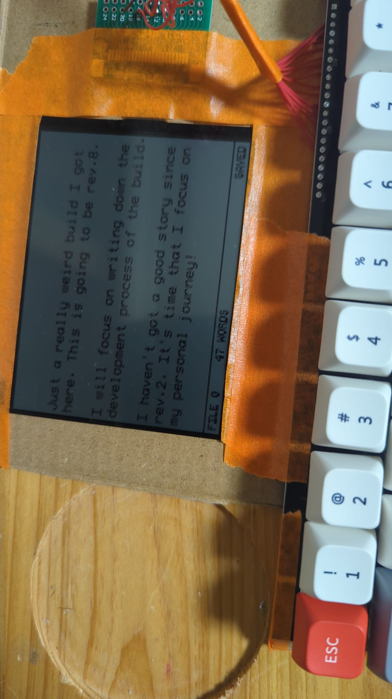

Also, since it requires light to reveal the contents on the screen, there is quite a difference in how the letters appear depending on the light. It is not invisible. It is more like this. It shows so well under a nice light, then suddenly transitions to not so visible. This transition is a bit awkward.

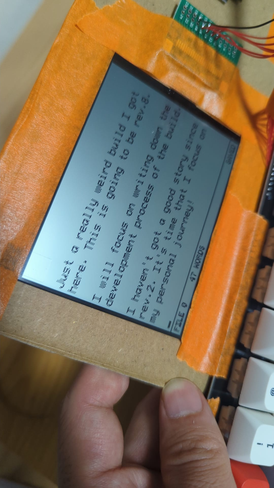

As advertised, under the light, the letters appear very clearly and the contrast is really good. It is really clear. Such a thin display showing the contents so well without a backlight. I was very happy with it.

As a conclusion, there is a bit of pixelation due to the low resolution given the large surface area. It also can look a bit blurred when you look at it close up. Although, under decent light and with a bit of distance, this display works really well.

Edit: Pixelation was due to my software bug. This is fixed, and it's looking clear.

# 3D Model Design

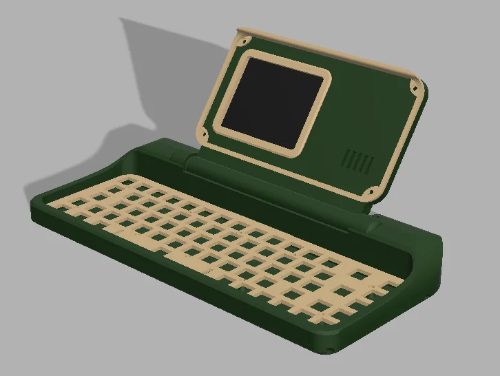

Once the technical feasibility was resolved, I opened Fusion 360 and started designing the actual enclosure.

My first goal was to make the device as thin as possible. The mechanical keyboard would naturally take up most of the thickness, but I was not going to use a thin keyboard for a writing machine. For me, the typing experience is too important. So, that part of the thickness was fixed from the beginning.

Given that constraint, I decided to use a flat keyboard angle.

Usually, I use a 7 to 9 degree angle on my keyboards to provide a more comfortable typing position. This time, I removed that angle entirely. By keeping the keyboard flat, I could reduce the overall thickness by around 1 cm.

My 3D printer can print up to 23 cm, but this build is almost 40 cm across at its longest point. So, I used a trick that I have relied on before: splitting the enclosure into three pieces.

The middle section remains large and solid, giving the build its main structure and stability. Then, the two side pieces work almost like wings. This makes the build look visually stable, but also physically stable.

Technically, I could have split the enclosure into two halves. Half of 40 cm would still fit inside my printer. However, I prefer splitting it into three pieces because I want the center portion of the build to stay as one solid piece.

Even with the most precise method of joining printed parts, split lines can create small cracks, skews, or alignment issues. When those imperfections happen near the outer edges, they are still acceptable because the main center body remains solid. But when a build is split directly in half, even a small skew starting from the middle can make the entire device feel unstable.

That is why I find the three-piece split to be the best method for a build like this. It respects the limitation of my printer while still keeping the most important part of the structure strong.

# I Didn't Like the Design...

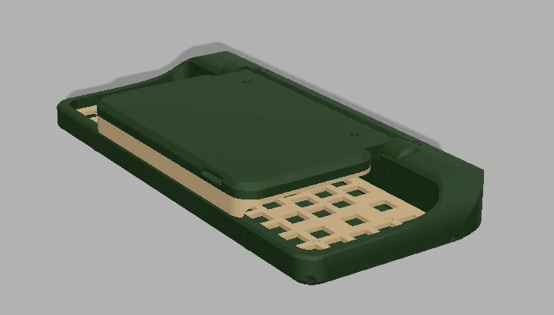

I don't know exactly how to describe it, but I did not like the initial design.

At first, the display enclosure ended up being smaller than the keyboard area. My thought was that covering the entire keyboard would create too much empty space on both sides of the display. I was afraid that would make the proportions feel strange.

So, my first design used a middle display section that only covered the screen area, a little like what I did with Rev.6.1. In this version, the display enclosure covered only about half of the keyboard width.

At first, I thought this could be a good idea.

But after finishing the design, it did not feel right.

It looked unusual, but not in an interesting or artistic way. It felt too intentional. Too forced. The shape did not click with me.

So, I uploaded the design to my subreddit and asked for feedback:

https://www.reddit.com/r/unkyulee/comments/1u3qmux/drafting_rev8_what_should_i_change_here/

At that time, my subreddit had very few members. But they were the real members. People who genuinely cared about Micro Journal and had been following the project closely.

So, when I asked for their feedback, I knew it would be valuable. I explicitly asked for negative feedback if possible, because I wanted to fix the design. I knew something needed to change, but I did not yet have confidence in which direction to take.

The feedback was much richer than I expected. macjsc93 and Hookmt both pointed me toward covering the entire keyboard, which became the most important direction for the final shape. That_Drummer_2795 gave a very practical reason for it: if the device goes into a bag, the keyboard should be protected as much as possible. That comment helped me realize I had been looking at the form too narrowly from the design side, and not enough from the carrying-and-using side.

Other comments opened interesting doors too. goodspeak suggested thinking about a hinged lid with a light, which made me consider how a light could be attached or supported. Hookmt suggested a small shelf for a phone or tablet, and jiadarola mentioned the possibility of a MagSafe mount. amrithr10 imagined a second hinged area for post-its or a small whiteboard-like thinking space, and even a rolling keyboard cover, like opening a tiny shop before writing. VintageFender226 suggested a second screen for notes or comparison. Some ideas were practical, some were wild, and some may belong to future builds, but all of them helped me see Rev.8 from a wider angle.

In the end, the most important change was clear: the enclosure should cover the full keyboard. It made the device look more complete, and more importantly, it made the clamshell design feel right. It was no longer just a screen holder. It became a protective shell for a portable writing machine.

Getting that social confirmation gave me the confidence to move toward what I probably should have done from the beginning.

So, I redesigned it to cover the entire keyboard area.

That became the final direction.

# Testing with Real Prints to Test the Real Form

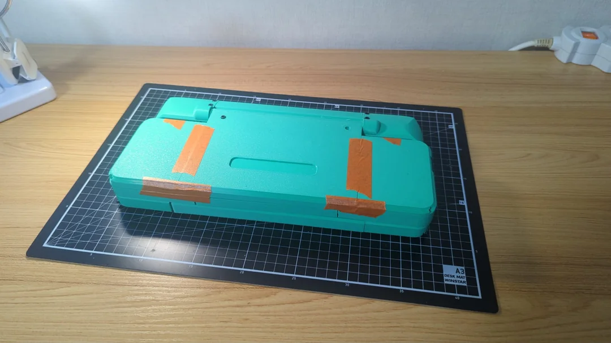

Once the design was finalized, I went ahead and printed it.

Usually, or actually, always, the first print is not usable. Even when I feel confident that everything is perfectly designed, I have never been able to use the first print as the final version. Screws holes missing, dimensions were wrong... Every thing can go wrong, goes wrong in the first print.

This step is essential. A 3D render can give me some idea of the shape, but seeing the build in the real world is completely different. Sometimes what looked great in the render does not feel right in real life. Sometimes the opposite happens too.

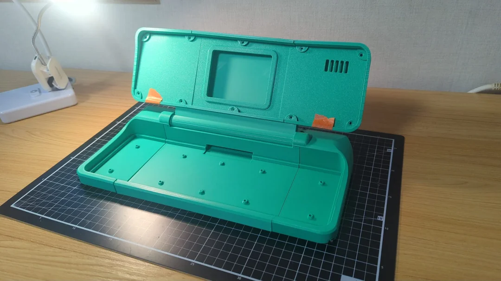

When I printed the parts and taped them together into one piece, I was surprised.

It was long.

It felt really long. This is the point, where I decided the name for this build: Melodica.

Of course, that makes sense, because it basically has the width of a full keyboard. But still, seeing that length in the real world made a very different impression from the render.

Other than that, the real print felt very good. It opened and closed well, and the thickness was satisfying. The display enclosure was not too thin or flimsy. It felt sturdy enough.

The mechanism I designed to hold the long display enclosure across three separate printed pieces also worked well.

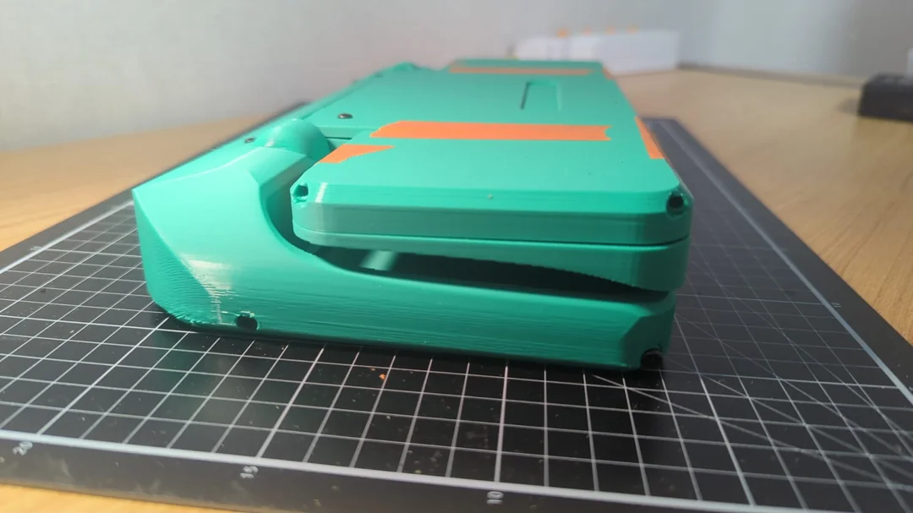

After three more print iterations, I finally reached a quality where I could start placing the internal components inside.

# Assembling the Electronic Components for the First Time

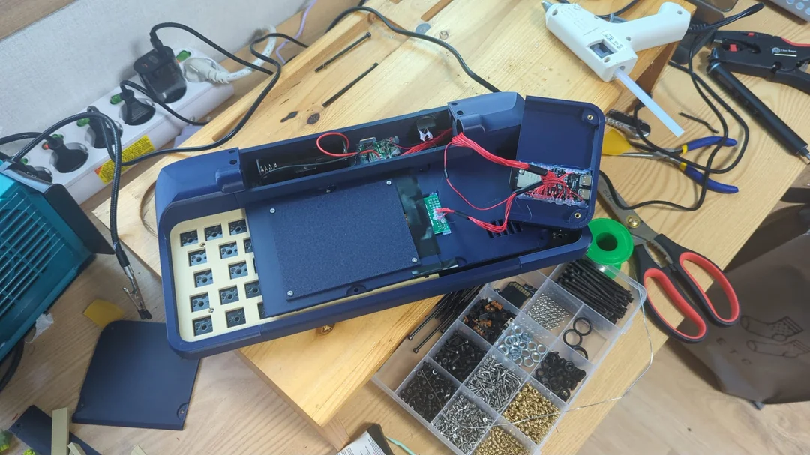

I took the electronic components out of the cardboard prototype and resoldered them into the new enclosure.

It was not too difficult. Most of the work was just readjusting the wire lengths. The wires from the keyboard PCB needed to reach all the way to the display area, so they had to be quite long.

After that, I glued and screwed the components into place.

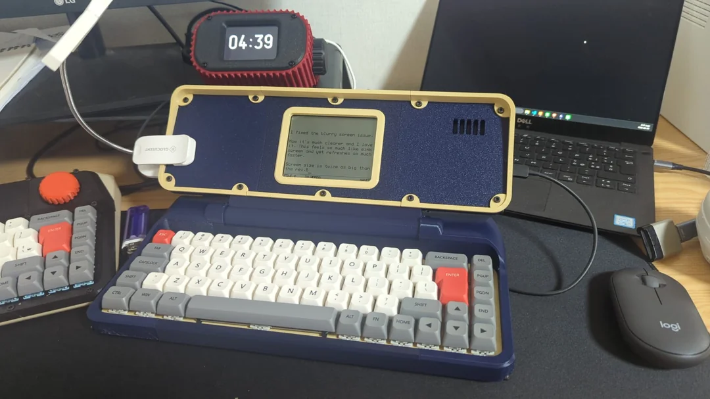

At this point, the build was mostly complete.

There were still a few minor adjustments to make. I had to increase the size of the ESP32 USB port openings. I also moved the front panel grill to sit above the ESP32, so that the LED lights could be visible for activity signals, and so that the area could have some ventilation.

Then, the build was done.

I also needed a place to hold a book light, in case I wanted to use the device in a dark room, in bed, or anywhere without enough ambient light. The book light clip fit really well on the left-hand side.

It felt very good when everything came together and clicked into place.

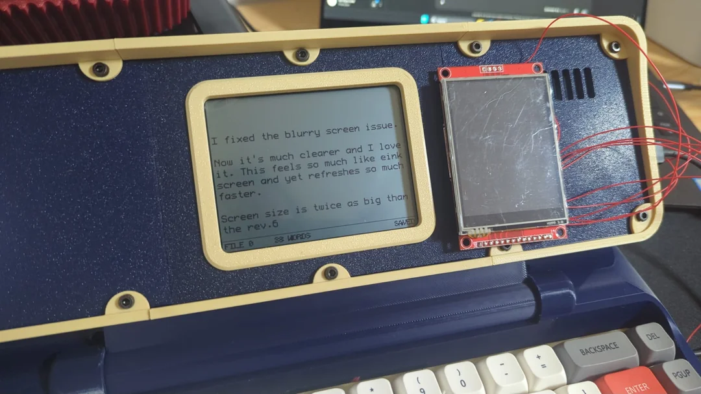

At first, I was planning to use the Rev.6 screen for this build. In this photo, you can see that the new screen is almost twice as wide.

Even with this larger screen, it still feels fairly compact. I can't imagine how small the display would have felt if I had used the Rev.6 screen instead.

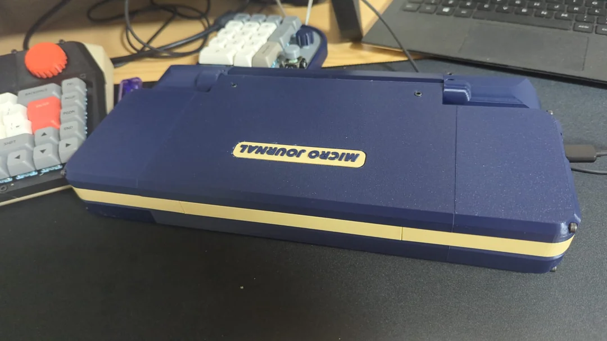

It also looks good when the enclosure is closed.

It was definitely the right decision to make the display enclosure cover the keyboard fully. I feel lucky to have a community that was willing to give feedback so quickly and generously.

# What Do I Do Now?

After a build is complete, and after it reaches a quality where it can also be printed and assembled for others, there are still several things I need to do.

* Put together a video to introduce the features and use cases.
* Write a README page for Rev.8 in the GitHub repository.
* List it in my Tindie store.
* Start sharing it with communities that may be interested in this build.

I made a release post in my subreddit first. Usually, the first batch goes quickly, and the follow-up batches come much later.

I wanted to share this build first with the community that had helped me and watched the progress together. So, before uploading the video or posting in bigger communities, I let the news slip into my subreddit first.

https://www.reddit.com/r/unkyulee

The build also came with many different color option ideas. Now, I need to figure out how to make those colorways happen for Rev.8.

Figuring out colorways is one of the fun parts. It feels like creating a new personality for Rev.8, again and again, through different versions.

# What Happens Next?

I should also write a detailed build guide, but usually I do that a little later.

The reason is that early builds can still reveal critical mistakes. Sometimes, after using the device for a while, I may find something that needs to be changed. In some cases, I might even redesign a large part of the build, just like what happened with Rev.6.1.

So, before writing a full step-by-step guide, I usually wait until the build feels more stable and settled.

That said, I do not want to close off any important information. Even before the detailed guide is ready, I try to leave the essential notes available, such as the bill of materials and the pinout mapping table. That way, people who are comfortable figuring out the remaining details by themselves can still build it on their own.

I genuinely do not intend to hide or withhold any information.

Maybe part of it is just me being slow with documentation. Maybe part of it is me using 'waiting for the build to stabilize' as a very convenient excuse. But the intention is simple: I want the information to be open, while also avoiding a situation where I write a full guide too early and then discover that the build needs to change again.

# Idea about the next build?

Whenever a new build is completed, it feels like I can open the next door in my idea bank and start dreaming about how to make the next thing real.

As always, when a new build is released, I get excited because I can finally jump into the next build.

I already have one and many forming inside my head.

I hope that one also finds its way out into the real world in a satisfying form.

Thank you for reading this story!

Un Kyu Lee

