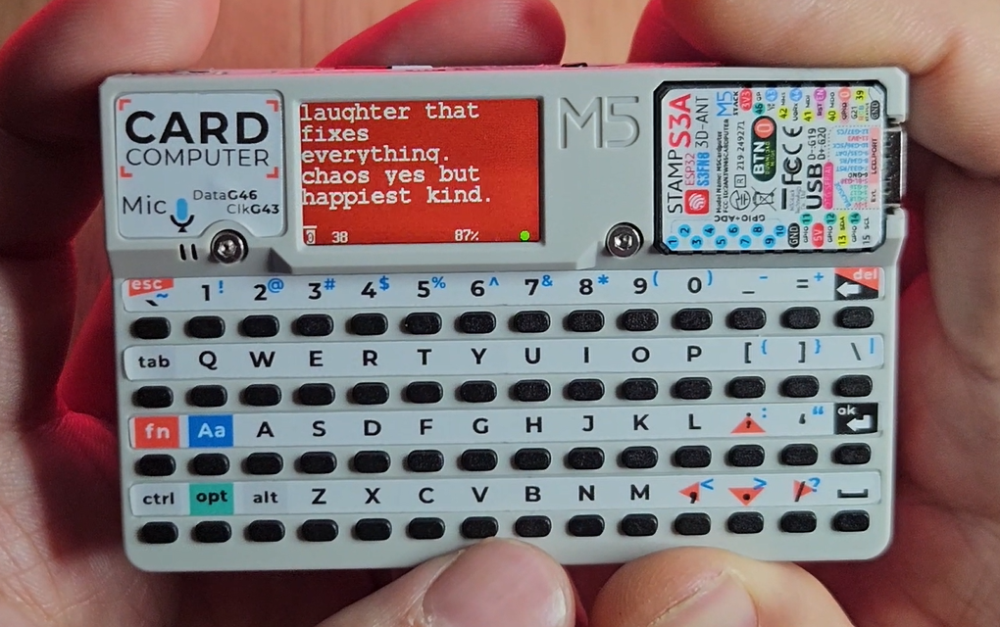
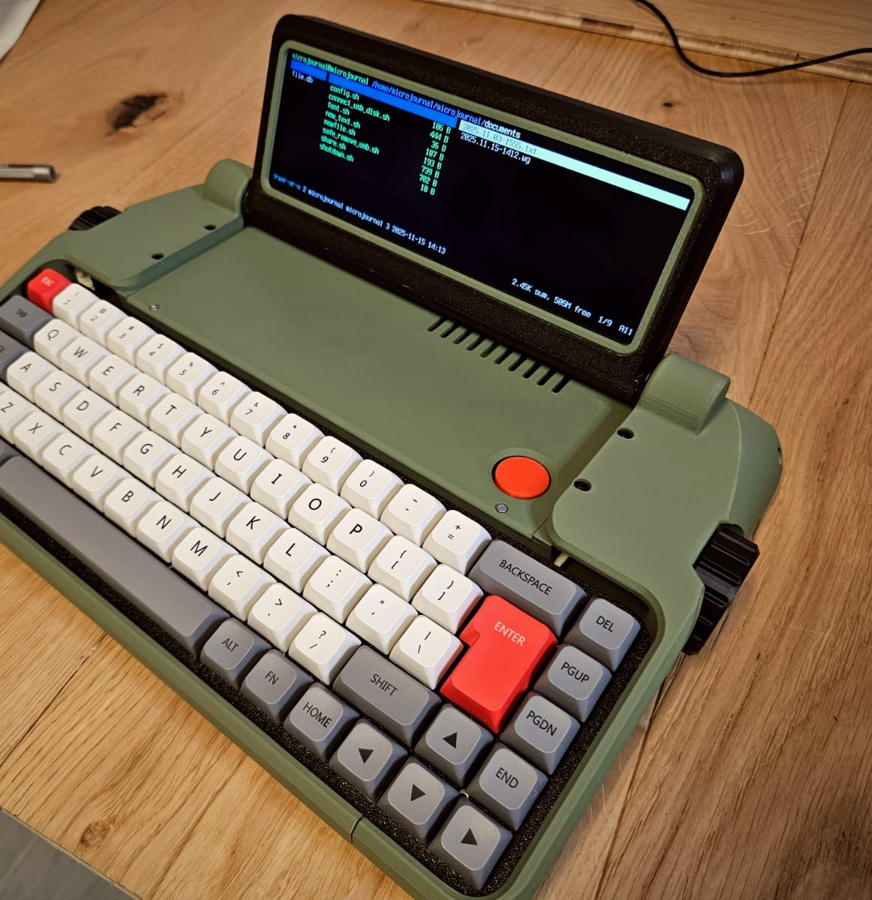
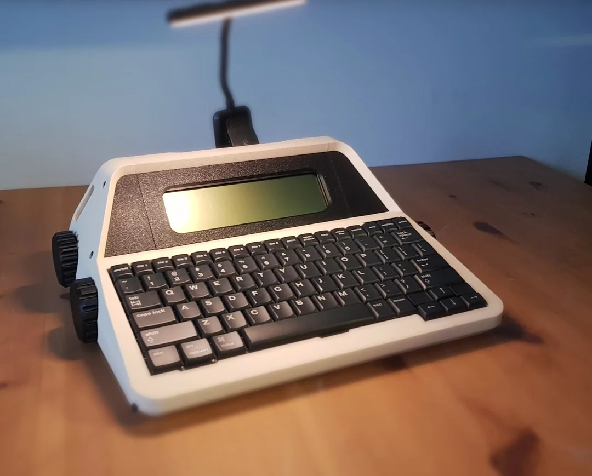
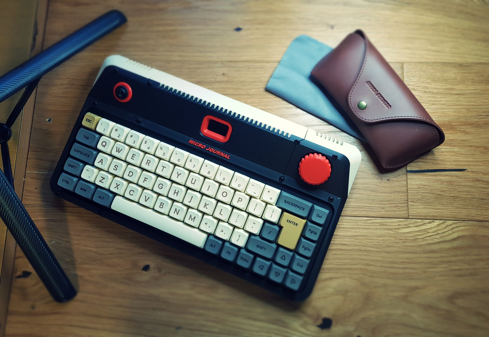
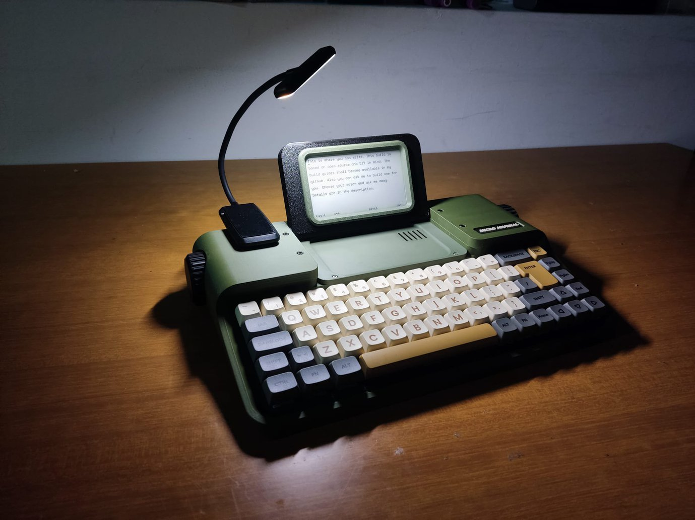
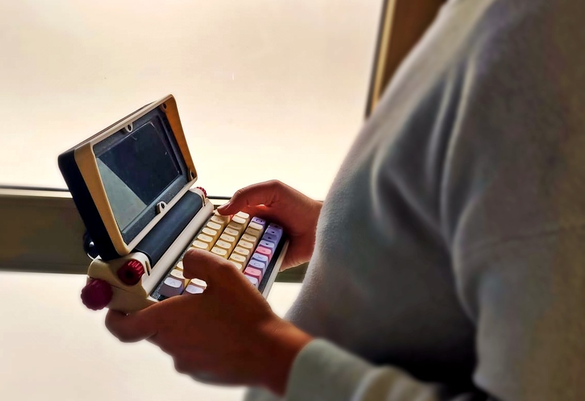
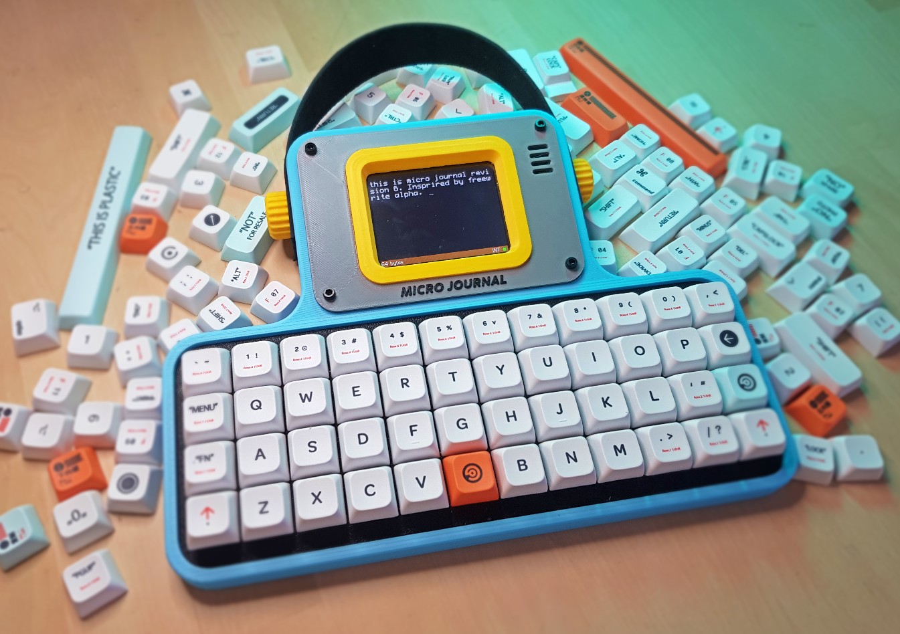
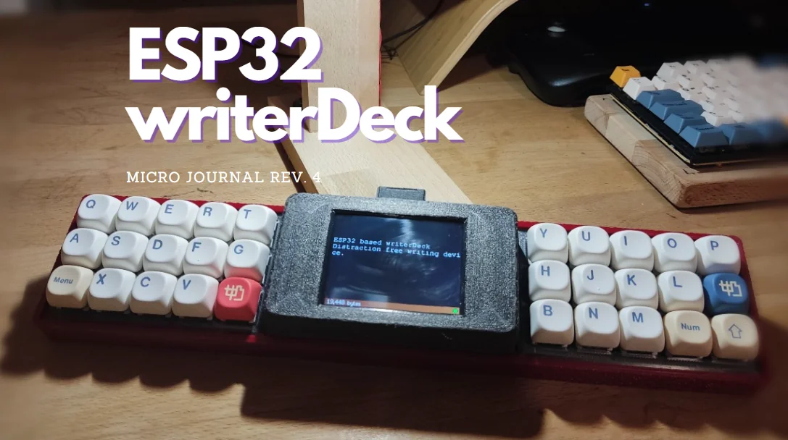
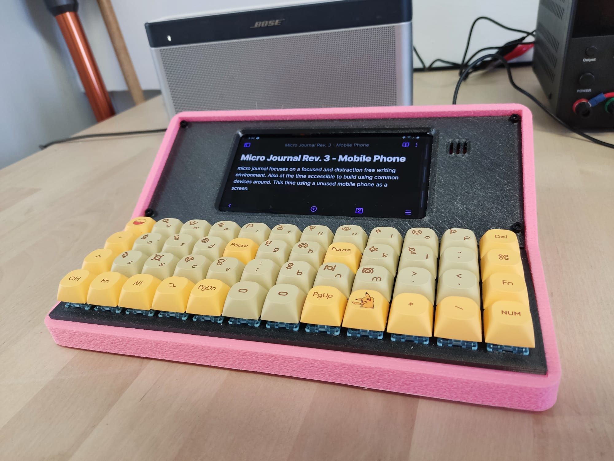
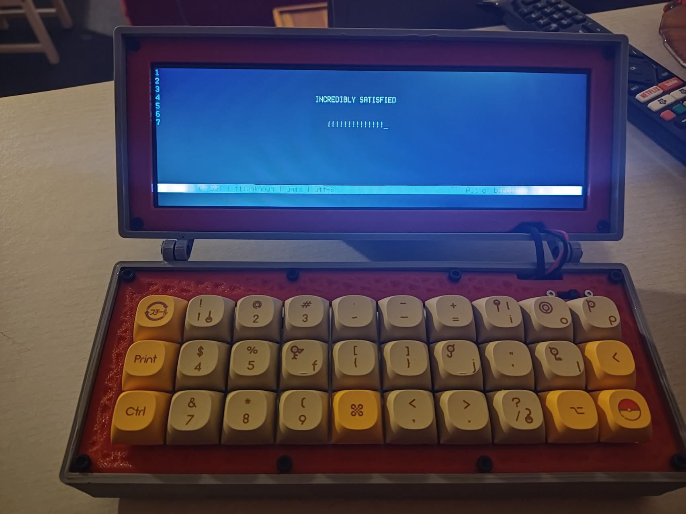

# Micro Journal

**Micro Journal** is an open-source DIY project that reimagines the joy of focused writing through a personal **writerDeck**. A writerDeck is a modern take on the typewriter: a simple, distraction-free device made for writing, without the noise of notifications, apps, or endless browser tabs. It brings back the purity of just you and your words, while quietly adding the convenience of digital storage and portability.

With Micro Journal, I'm exploring how to build such a device from the ground up. Experimenting with hardware, design, and features across different revisions. Each iteration aims to refine the experience, from adding battery power and portability to improving usability and syncing. Every revision comes with documentation and build guides, so that anyone who wishes can create their own. And if you'd prefer to have one made for you, there's also an [online shop](https://www.tindie.com/stores/unkyulee/) where you can request a custom build.

## Timeline

| Date       | Revision                                                                | Preview                                                                        |
| ---------- | ----------------------------------------------------------------------- | ------------------------------------------------------------------------------ |
| 2025-12-02 | **[Cardputer](/cardputer/readme.md)**                                   |                              |
| 2025-11-11 | **[Rev.2.1](/micro-journal-rev-2.1/readme.md)**                         |                  |
| 2025-09-26 | **[AlphaSmart Neo2 Desktop TypeWriter](/micro-journal-neo2/readme.md)** |                     |
| 2025-07-26 | **[Rev.4 Revamp](/micro-journal-rev-4-revamp/readme.md)**               |             |
| 2025-01-30 | **[Rev.7](/micro-journal-rev-7-e-ink/readme.md)**                       |             |
| 2024-09-17 | **[Rev.2 Revamp](/micro-journal-rev-2-revamp/readme.md)**               |        |
| 2024-06-13 | **[Rev.6](/micro-journal-rev-6-one-piece/readme.md)**                   |          |
| 2024-04-18 | **[Rev.5](/micro-journal-rev-5-esp32-usbhost/readme.md)**               |      |
| 2024-03-15 | **[Rev.4](/micro-journal-rev-4-esp32/readme.md)**                       |                |
| 2024-03-15 | **[Rev.3](/micro-journal-rev-3-samsung-galaxy-s8/readme.md)**           |  |
| 2024-03-04 | **[Rev.2](/micro-journal-rev-2-raspberypi/readme.md)**                  |        |

## Type of Revisions

* Rev.1 – *a place holder for future projects*

* **[Rev.2](/micro-journal-rev-2-revamp/readme.md)** – A Raspberry Pi–based setup with a wide display and mechanical keyboard. This version aimed to combine a focused writing experience with the editing power of a full computer, offering both simplicity and flexibility. A variant with bigger keyboard is called [Rev.2.1: CyberDeck](/micro-journal-rev-2-revamp/readme.md).

* Rev.3 – *a place holder for future projects*

* **[Rev.4](/micro-journal-rev-4-revamp/readme.md)** – A writer-focused mechanical keyboard that blends seamless everyday typing with instant transformation into a standalone writing device, offering specialized keys, customizable functions, and a tactile, inspiring typing experience to capture ideas the moment they strike.

* **[Rev.5](/micro-journal-rev-5-esp32-usbhost/readme.md)** – An ESP32-powered screen-only device where you can plug in your own keyboard. This revision focused on flexibility, letting users pair the device with their favorite mechanical keyboards while keeping the writing deck lightweight and minimal.

* **[Rev.6](/micro-journal-rev-6-one-piece/readme.md)** – An ESP32-based all-in-one unit combining both screen and keyboard. Portable and self-contained, this version brought the writerDeck concept closer to a dedicated, ready-to-use device with a clean design.

* **[Rev.7](/micro-journal-rev-2-revamp/readme.md)** – An ESP32-based an e-ink writing device with a built-in keyboard. Optimized for comfort, it offers an easy-on-the-eyes experience and works beautifully in bright environments thanks to its paper-like e-ink display.

## Extra Projects

* **[AlphaSmart Neo2 Desktop TypeWriter Conversion Kit](/micro-journal-neo2/readme.md)** – Transform your AlphaSmart Neo2 into a beautiful desktop typewriter with this custom-designed enclosure.  

* **[M5Stack Cardputer](/cardputer/readme.md)** – Micro Journal Firmware running on a M5Stack Cardputer.

## Support

Micro Journal is an open-source project, built and nurtured with curiosity, care, and a genuine love for writing. If you've enjoyed exploring the project or building your own writerDeck, and you'd like to show some support, even a small gesture goes a long way. Every contribution helps me continue improving Micro Journal and sharing it with the community.  

* [Buy me a coffee](https://www.buymeacoffee.com/unkyulee)  

Micro Journal is a DIY project, complete with build guides so you can source the components and assemble it yourself. You can also purchase a DIY kit from my shop, or have me assemble a complete device for you. Supporting the project this way helps it grow and ensures it keeps reaching more writers and makers like you.  

* [Tindie – Online Shop](https://www.tindie.com/stores/unkyulee/)

## Contact

* [YouTube – @unkyulee](https://www.youtube.com/@unkyulee)
* [Reddit – Background\_Ad\_1810](https://www.reddit.com/user/Background_Ad_1810/)
