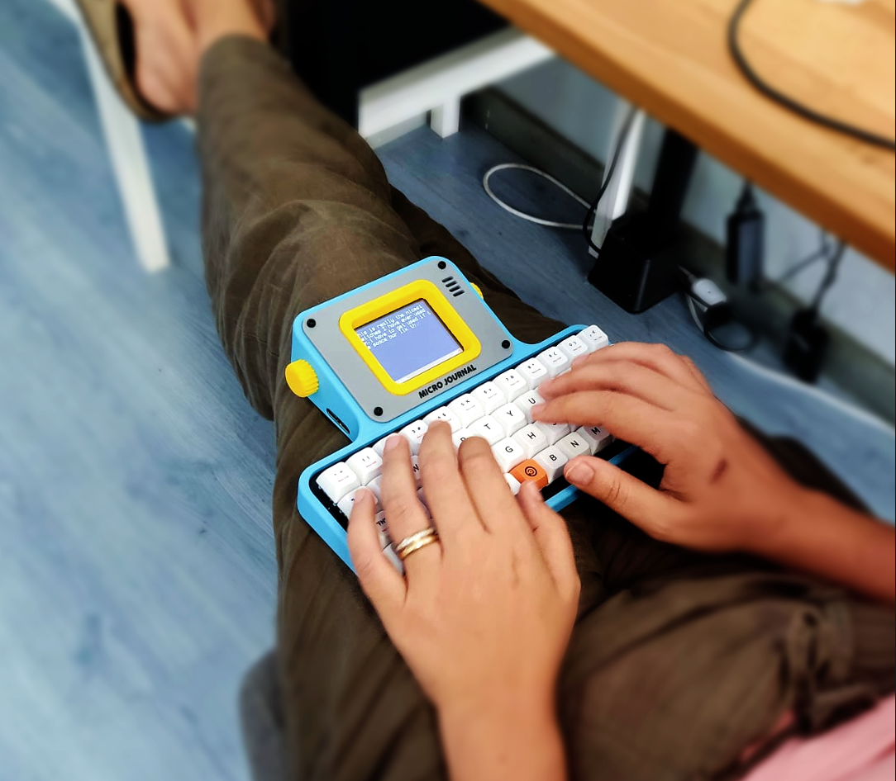
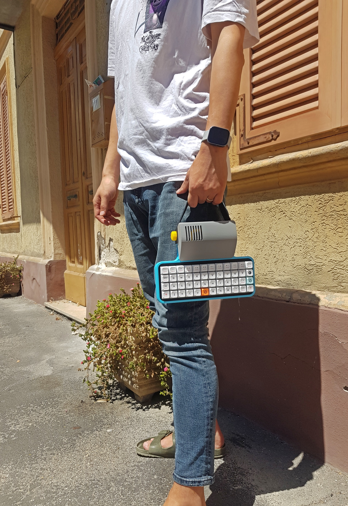

# Micro Journal: Distraction-Free Writing Device: WriterDeck

I aimed to create a specialized writing device, focusing on the tactile experience of mechanical keyboards. This device would be portable, with a compact form factor, designed to enhance the writing process in a focused environment. The goal was to provide a distraction-free writing experience, allowing users to immerse themselves fully in their creative work.

## Fifth iteration: Write with Style

[Buy from my Tindie shop](https://www.tindie.com/products/unkyulee/micro-journal-rev6-vivian-in-new-york/)

[Micro Journal Rev.6 Design Process Story](/micro-journal-rev-6-one-piece/readme.md)

[Quick Start Guide] TBD

[Build Guide] TBD

[Features and Introduction](https://youtu.be/1ZP9wwYMaMY)

[Typing Test Video](https://youtu.be/7LUKOb-125s)

[How to Customize Keyboard Layout] TBD

### Press

[The Verge: You can customize the mechanical keyboard on this distraction-free digital typewriter.](https://www.theverge.com/2024/6/18/24180889/you-can-customize-the-mechanical-keyboard-on-this-distraction-free-digital-typewriter)

[Boing Boing: MicroJournal: a distraction-free writing device with knobs
](https://boingboing.net/2024/06/17/microjournal-a-distraction-free-writing-device-with-knobs.html)

I'm deep in the throes of this iteration, and it's a special one. A playwright needed a sleek, stylish, and compact writing device that could be used in cafes and parks. It had to have a handle for easy carrying and a protective cover to keep it safe in the bag.

Enter the Micro Journal Rev.6, now with Cherry MX hot-swappable sockets, letting users customize their mechanical keyboard setup. It features a 48-key ortholinear layout, with a custom configuration via SD card (still in the works). The leather strap makes it easy to carry, and the display protective case doubles as a hood for privacy while writing on the go.

I'm having some feelings that might be akin to love. I'm trying to deny this affection for an object, but I can't ignore the joy and lightness I feel when holding the leather strap.

## Fourth iteration: writerDeck with any mechanical keyboard

In this iteration, I delved into exploring the potential of utilizing the USB port to enable connectivity with a wide range of mechanical keyboards. This enhancement offers the flexibility for users to employ their preferred keyboard for writing purposes, thereby enhancing the personalized experience and comfort level during usage.

So, I proceeded to design an enclosure to sit next to the keyboard, utilizing the ESP32-S3, which boasts native USB host features. I then updated the code, and voilà! The new version was born.

There are some stories detailing the exploration of USB HOST features in ESP32 and ESP32-S3. Check out the link above for the full narrative and build guides.

For those who wants to build on your own: [Micro Journal Rev.5 Build Details](/micro-journal-rev-5-esp32-usbhost/readme.md)

For those who already have the device: [Quick Start User Guide](/micro-journal-rev-5-esp32-usbhost/quickstart/readme.md)

If you want to buy one: [Buy this writerDeck](https://www.tindie.com/products/unkyulee/micro-journal-esp32-writerdeck/)

User Reviews:

[+1 for the Micro Journalk](https://www.reddit.com/r/writerDeck/comments/1cyvjsf/1_for_the_micro_journal/)

[My first WriterDeck - the Micro Journal Rev 5.](https://www.reddit.com/r/writerDeck/comments/1cytyq6/my_first_writerdeck_the_micro_journal_rev_5/)

[Introduction and Features](https://youtu.be/OuGs6Pu1ZMg)

### Press

[Hackster.io: Micro Journal Offers a Customizable writerDeck Experience](https://www.hackster.io/news/micro-journal-offers-a-customizable-writerdeck-experience-4ffbf773f3ec)

[Guest Starring at Canadian National Radio](https://ici.radio-canada.ca/nouvelle/2080542/telephone-idiot-minimaliste-dumbphone)

[Pascal Forget: Micro Journal – machine à écrire](https://www.pascalforget.com/micro-journal/)

## Third iteration: Immeidate power on and writing

Transitioning from the previous iteration using an old phone, I sought a solution that would provide an instant writing experience similar to commercial WriterDecks, utilizing an ESP32 microcontroller.

This version represents the most challenging DIY build among my iterations. Handwiring the keyboard directly to the ESP32 and connecting the display to the board required a hardcore DIY approach, as resources and guides for this specific setup were scarce. It demanded some prior knowledge and experimentation to get it up and running.

Despite the challenges, this version comes closest to my ideal writing device. It powers on almost instantaneously (within 1 second) and prompts you to start writing immediately. Additionally, it offers Google Drive sync functionality, allowing seamless file synchronization with your cloud storage.

With these features in place, this build proves to be highly practical. It's perfect for capturing sudden bursts of inspiration or quickly jotting down important tasks or ideas. It's a device that can be kept on your bedside table, ready to record your dreams at a moment's notice. All you need to do is find the power switch before immortalizing your weirdest dream ever in writing.

[Micro Journal Rev.4 Build Details](/micro-journal-rev-4-esp32/readme.md)

## Second iteration: Using an old phone to make a writerDeck

In the next iteration, I explored building a writing device using easily accessible components, such as an old phone. Old phones still possess sufficient power to serve as effective writing tools when coupled with a keyboard.

The primary focus of this build was to provide a platform for my daughter to write journals without the complexities associated with Linux commands. Since she was accustomed to tablet environments, this solution aligned well with her needs. She could simply pick up the device and begin writing.

This particular build involved 3D prints and hand-wired keyboards, making it slightly more complex. However, the core idea of combining an old phone with a keyboard can be easily replicated for similar purposes.

It's important to note that achieving a distraction-free environment was challenging with this build. Phones are inherently versatile devices, offering access to various forms of entertainment like YouTube and music streaming services. Consequently, maintaining focus on writing proved difficult. Despite this limitation, the device still served its purpose well by assisting my daughter in continuing her journal writing.

Here are build guides:

[Micro Journal Rev.3 Build Details](/micro-journal-rev-3-samsung-galaxy-s8/readme.md)

[Reddit Post](https://new.reddit.com/r/writerDeck/comments/1bfhnfz/writerdeck_with_samsung_s8_using_an_old_mobile/)

## First iteration: Using Raspberry Pi and 30 Keys mechanical keyboards. 

I experimented with various iterations to explore different options for creating a distraction-free writing device. The initial version involved using a Raspberry Pi 2W, a small Linux computer, paired with a 30-key mechanical keyboard.

A crucial aspect of achieving distraction-free writing is to eliminate all possible distractions. The Raspberry Pi 2W excelled in this regard due to its Linux terminal-based interface, devoid of any graphical user interface. This meant there were no avenues for distractions like YouTube or other similar distractions.

Upon powering on the device, I utilized the midnight commander to navigate to the desired folder and used the "micro" editor (similar to nano or vi) to begin writing. The screen transformed into a simple black-and-white display, solely focused on the text being written. This immersive environment facilitated quick entry into the flow state, resulting in remarkable productivity and quality of writing. When the brain is compelled to focus solely on one task, the results can be truly impressive.

This is the write up for the build guide of ths raspberry pi build.

[Micro Journal Rev.2 Build Details](/micro-journal-rev-2-raspberypi/readme.md) 

[Reddit Post](https://new.reddit.com/r/writerDeck/comments/1b6ff16/micro_journal_rev_2/)

# Further Information

https://new.reddit.com/r/writerDeck\
https://www.writerdeck.org/

# Press

KBD NEWS\
https://kbd.news/Micro-Journal-2332.html

Hackaday\
https://hackaday.com/2024/04/05/esp32-provides-distraction-free-writing-experience/

# Online shop

You can find my shop at the following link: 

https://www.tindie.com/stores/unkyulee/

