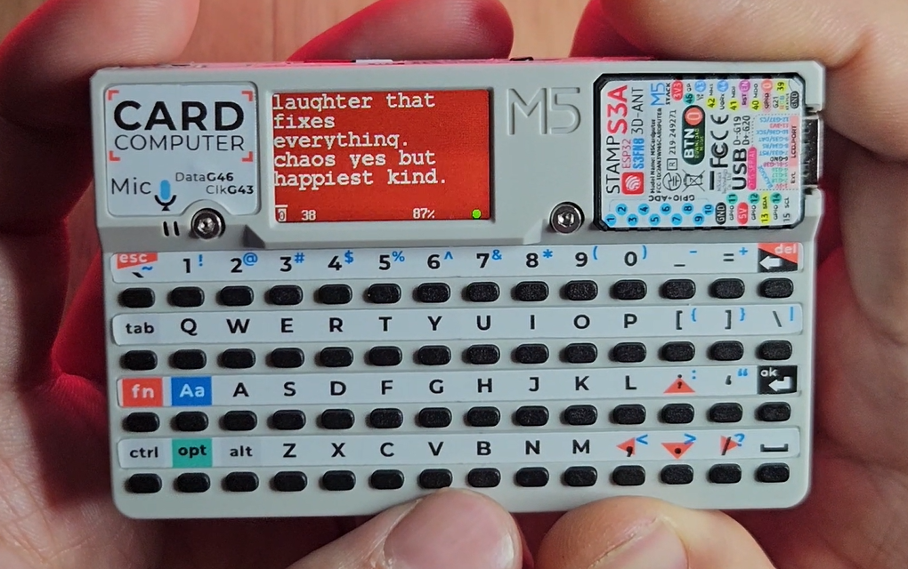
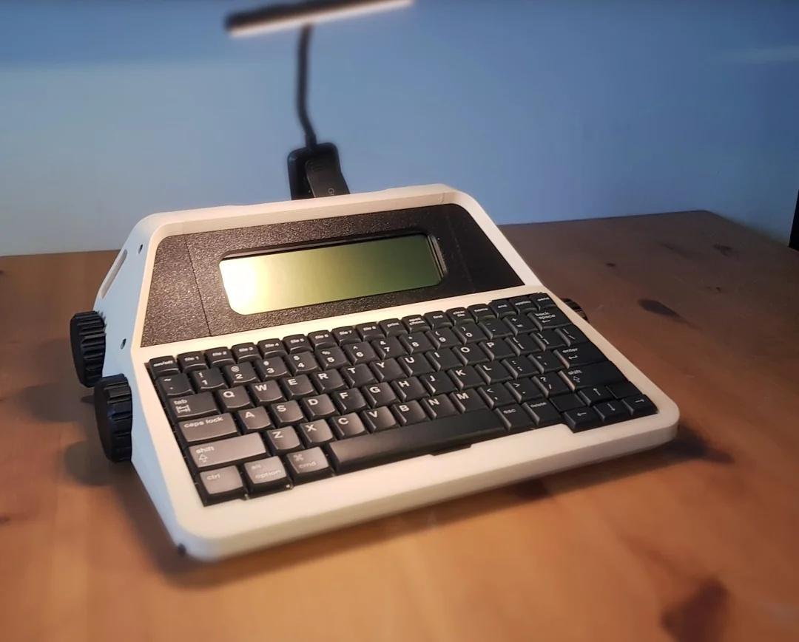
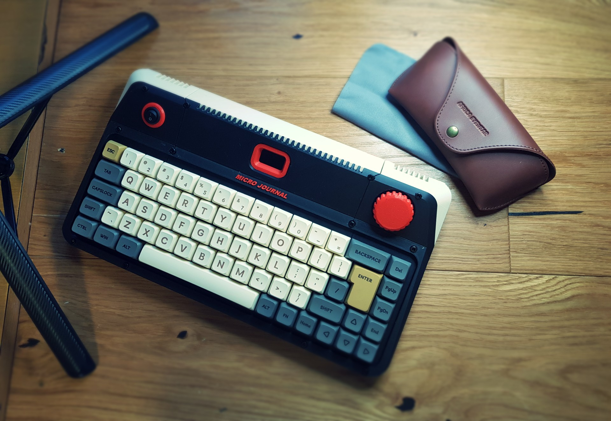
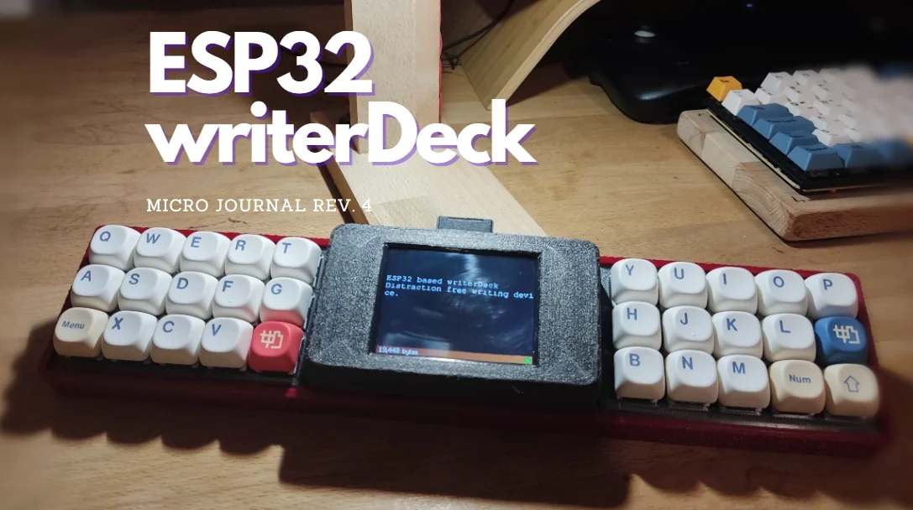
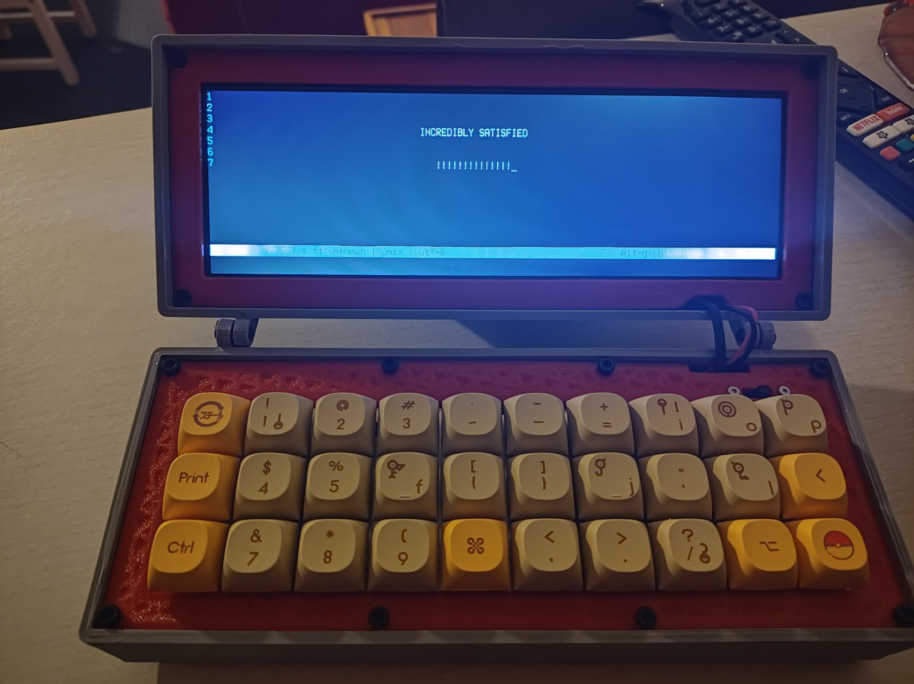

# Micro Journal

**Micro Journal** is an open-source DIY project that reimagines the joy of focused writing through a personal **writing device**. It is a modern take on the typewriter: a simple, distraction-free device made for writing, without the noise of notifications, apps, or endless browser tabs. It brings back the purity of just you and your words, while quietly adding the convenience of digital storage and portability.

With Micro Journal, I'm exploring how to build such a device from the ground up. Experimenting with hardware, design, and features across different revisions. Each iteration aims to refine the experience, from adding battery power and portability to improving usability and syncing. Every revision comes with documentation and build guides, so that anyone who wishes can create their own. And if you'd prefer to have one made for you, there's also an [online shop](https://www.tindie.com/stores/unkyulee/) where you can request a custom build.

## Timeline

| Date       | Revision                                                                                         | Preview                                                                                                    |
| ---------- | ------------------------------------------------------------------------------------------------ | ---------------------------------------------------------------------------------------------------------- |
| 2026-05-23 | **[Rev.8 Melodica](/rev.8/8.0/readme.md)**                                             |                                                |
| 2026-05-23 | **[Rev.5.1 A Personal Journey](/rev.5/5.1/readme.md)**                               |                                              |
| 2026-03-09 | **[Rev.6.1 Mini](/rev.6/6.1/readme.md)**                                        |                                      |
| 2026-03-09 | **[Rev.3 Nadia](/rev.3/3.0.revamp/readme.md)**                                         |                                         |
| 2025-12-02 | **[Cardputer](/extra/cardputer/readme.md)**                                                            |                                                          |
| 2025-11-17 | **[Micro Journal PC](https://github.com/unkyulee/micro-journal-linux/blob/main/debian-live.md)** |  |
| 2025-11-11 | **[Rev.2.1](/rev.2/2.1/readme.md)**                                                  |                                              |
| 2025-09-26 | **[AlphaSmart Neo2 Desktop TypeWriter](/extra/neo2/readme.md)**                          |                                                 |
| 2025-07-26 | **[Rev.4 Revamp](/rev.4/4.0.revamp/readme.md)**                                        |                                         |
| 2025-01-30 | **[Rev.7](/rev.7/7.0/readme.md)**                                                |                                         |
| 2024-09-17 | **[Rev.2 Revamp](/rev.2/2.0.revamp/readme.md)**                                        |                                    |
| 2024-06-13 | **[Rev.6](/rev.6/6.0/readme.md)**                                            |                                      |
| 2024-04-18 | **[Rev.5](/rev.5/5.0/readme.md)**                                        |                                  |
| 2024-03-15 | **[Rev.4](/rev.4/4.0/readme.md)**                                                |                                            |
| 2024-03-15 | **[Rev.3](/rev.3/3.0/readme.md)**                                    |                              |
| 2024-03-04 | **[Rev.2](/rev.2/2.0/readme.md)**                                           |                                    |

## Type of Revisions

* Rev.1 – *a place holder for future projects*

* **[Rev.2](/rev.2/2.0.revamp/readme.md)** – A Raspberry Pi–based setup with a wide display and mechanical keyboard. This version aimed to combine a focused writing exp*a place holder for future projects*

* **[Rev.4](/rev.4/4.0.revamp/readme.md)** – A writer-focused mechanical keyboard that blends seamless everyday typing with instant transformation into a standalone writing device, offering specialized keys, customizable functions, and a tactile, inspiring typing experience to capture ideas the momerience with the editing power of a full computer, offering both simplicity and flexibility. A variant with bigger keyboard is called [Rev.2.1: CyberDeck](/rev.2/2.0.revamp/readme.md).

* **[Rev.3 Nadia](/rev.3/3.0.revamp/readme.md)** - A setup for a phone. The phone is a distraction trap. It easily leads you into endless scrolling before you even notice it. Yet somewhere inside those long stretches of drifting attention, there are small moments when you actually want to write. Sometimes it is an elegant troll comment. Sometimes it is a thoughtful reply to an email, hiding the fact that it was written on a phone. It is a setup that anyone could make. A phone. A keyboard. A place to rest your hands.

* **[Rev.5.1](/rev.5/5.1/readme.md)** – An ESP32-powered screen-only device where you can plug in your own keyboard. This revision focused on flexibility, letting users pair the device with their favorite mechanical keyboards while keeping the writing deck lightweight and minimal.

* **[Rev.6](/rev.6/6.0/readme.md)** – An ESP32-based all-in-one unit combining both screen and keyboard. Portable and self-contained, this version brought the writerDeck concept closer to a dedicated, ready-to-use device with a clean design.
  * **[Rev.6.1](/rev.6/6.1/readme.md)** - Clamshell version of Rev.6

* **[Rev.7]/micro-journal-rev-7-e-ink/readme.md)** – An ESP32-based an e-ink writing device with a built-in keyboard. Optimized for comfort, it offers an easy-on-the-eyes experience and works beautifully in bright environments thanks to its paper-like e-ink display.

* **[Rev.8](/rev.8/8.0/readme.md)** – An ESP32-based an Reflective LCD writing device.

## Extra Projects

* **[AlphaSmart Neo2 Desktop TypeWriter Conversion Kit](/extra/neo2/readme.md)** – Transform your AlphaSmart Neo2 into a beautiful desktop typewriter with this custom-designed enclosure.  

* **[M5Stack Cardputer](/extra/cardputer/readme.md)** – Micro Journal Firmware running on a M5Stack Cardputer.

* **[The PDA Terminal](https://github.com/unkyulee/phone-enclosure)** - Phone Enclosure with a keyboard for Boox Palma 2

## Community

* [Un Kyu Lee's Design Gallery](https://www.yesbut.it/)
* [YouTube – @unkyulee](https://www.youtube.com/@unkyulee)
* [Reddit – Un Kyu Lee](https://www.reddit.com/r/unkyulee/)
* [Focused Writing Device Forum](https://www.flickr.com/groups/alphasmart/discuss/)
* [Hook's Web Site with Micro Journal Reviews](http://www.thewritekeys.com:8080/)

## Support

If Micro Journal helped you build something you love, consider buying me a coffee through the link below. It is a small gesture, but it helps keep the project alive, cared for, and open for everyone.

* [Buy me a coffee](https://www.buymeacoffee.com/unkyulee)  

Un Kyu Lee