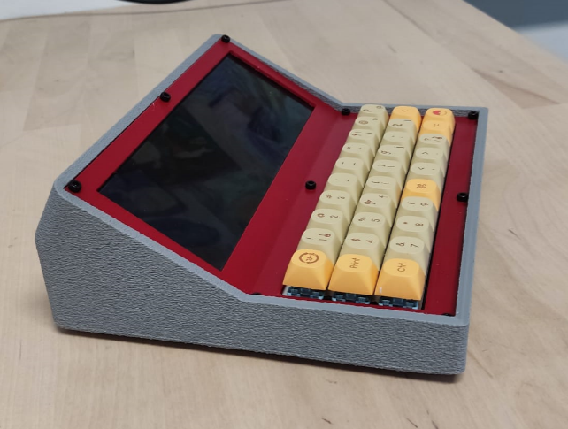
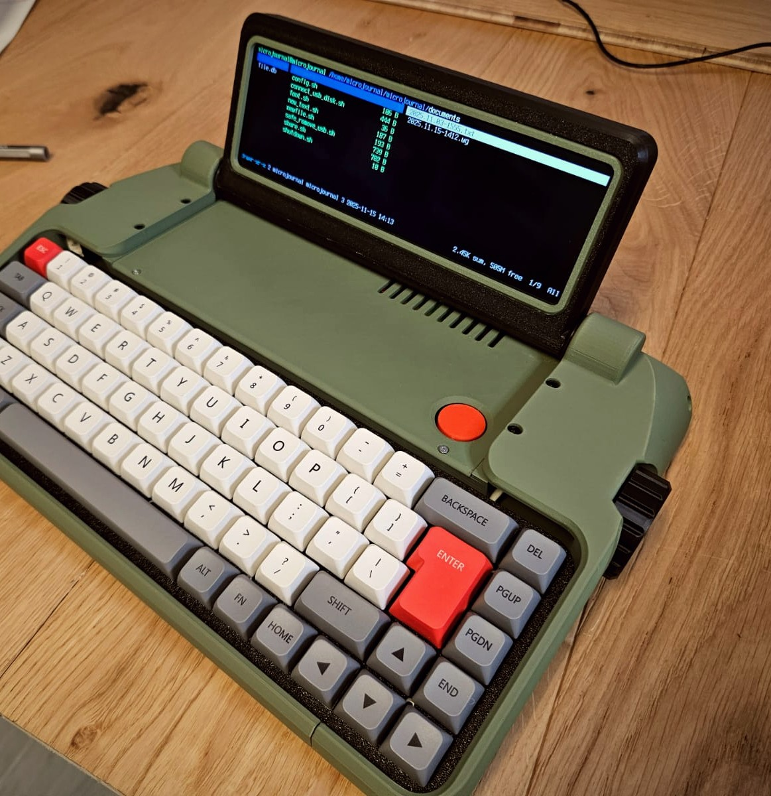

# Rev.2: Raspberry Pi Writing Decks

Rev.2 is built around a Raspberry Pi, a small full Linux computer. It trades instant power-on for flexibility: a wide display, a mechanical keyboard, and a real computer behind a distraction-free interface.

| Preview | Revision | Characteristics |
| ------- | -------- | --------------- |
|  | **[Rev.2](./2.0/readme.md)** | The first iteration. A Raspberry Pi Zero 2W with a 30-key mechanical keyboard, running a terminal-only Linux setup (Midnight Commander and the *micro* editor) with no graphical desktop to distract you. |
|  | **[Rev.2 Revamp: Mother of Twins](./2.0.revamp/readme.md)** | A foldable enclosure that protects the device, with a Raspberry Pi Zero 2W, a 48-key mini keyboard and side knobs for easy scrolling. |
|  | **[Rev.2.1: cyberDeck](./2.1/readme.md)** | A portable writing deck with a wide, clear display, a Raspberry Pi Zero 2 W and a mechanical keyboard. |
