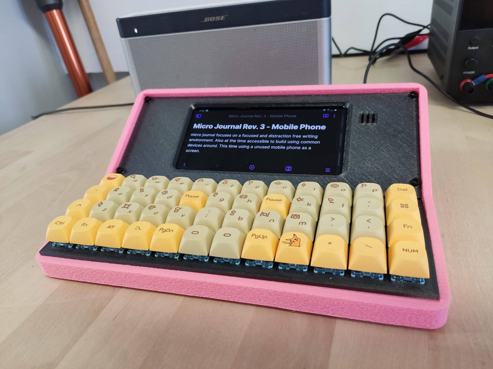
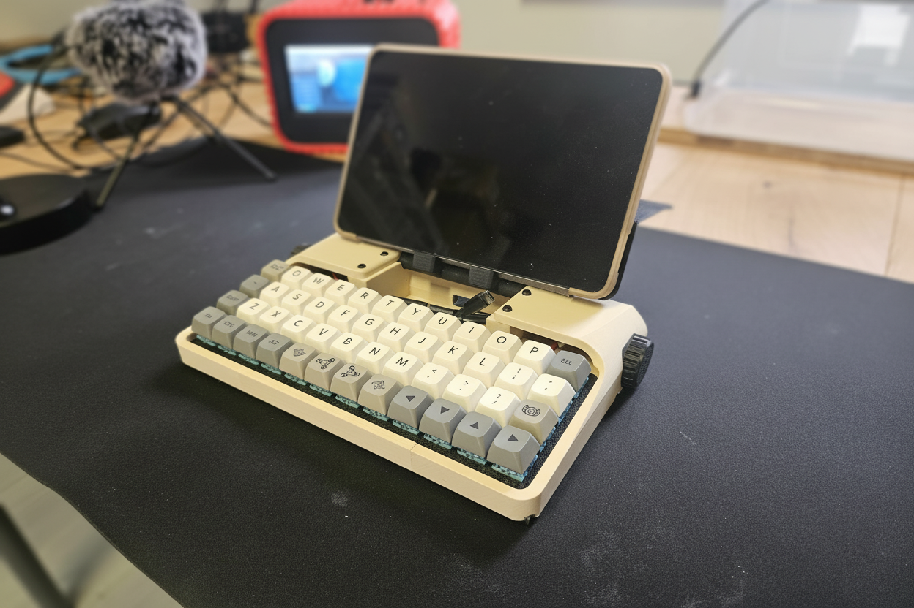

# Rev.3: Phone-Based Writing

Rev.3 turns a smartphone or tablet into a writing tool by pairing it with a dedicated keyboard and hand rest, for focused typing on the go.

| Preview | Revision | Characteristics |
| ------- | -------- | --------------- |
|  | **[Rev.3](./3.0/readme.md)** | A writerDeck made from an old phone (Samsung Galaxy S8) and a keyboard. Old phones still have plenty of power to be effective writing tools. |
|  | **[Rev.3 Revamp: Nadia](./3.0.revamp/readme.md)** | A small keyboard that lives beside a phone or tablet, so you can write without the distractions of the phone itself. |
