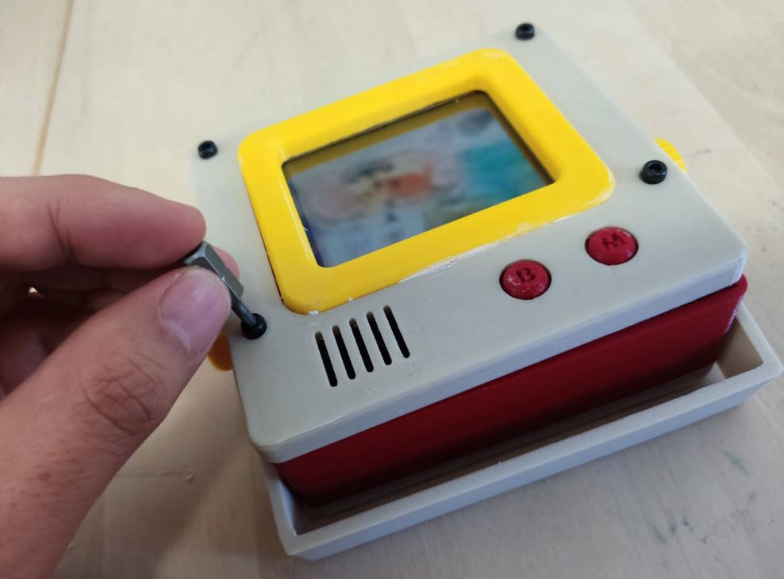

# **Micro Journal Rev.5 — Complete User Guide**


# **Table of Contents**

- [**Micro Journal Rev.5 — Complete User Guide**](#micro-journal-rev5--complete-user-guide)
- [**Table of Contents**](#table-of-contents)
- [**Introduction**](#introduction)
- [**Quick Setup**](#quick-setup)
  - [**What You Need**](#what-you-need)
  - [**Step 1 — Choose a Battery**](#step-1--choose-a-battery)
  - [**Step 2 — Install the Battery**](#step-2--install-the-battery)
  - [**Step 3 — Charge the Battery**](#step-3--charge-the-battery)
  - [**Step 4 — Connect a Keyboard**](#step-4--connect-a-keyboard)
  - [**Step 5 — Power On and Write**](#step-5--power-on-and-write)
- [**WiFi Setup**](#wifi-setup)
- [**Transfer or Back Up Your Writing**](#transfer-or-back-up-your-writing)
  - [**Drive Mode**](#drive-mode)
  - [**Google Drive Sync**](#google-drive-sync)
- [**Firmware Update**](#firmware-update)
  - [**1. Check Current Version**](#1-check-current-version)
  - [**2. Regular Update (firmware 2.x)**](#2-regular-update-firmware-2x)
  - [**3. Full Web Flash (coming from firmware 1.x)**](#3-full-web-flash-coming-from-firmware-1x)
- [**Customizing Start and Sleep Animation**](#customizing-start-and-sleep-animation)
- [Using the Micro Journal Rev 5 - A Walkthrough](#using-the-micro-journal-rev-5---a-walkthrough)
  - [Introducing the Micro Journal Rev 5](#introducing-the-micro-journal-rev-5)
  - [Setting Up the Micro Journal Rev 5](#setting-up-the-micro-journal-rev-5)
  - [Using the Rev 5 Part 1: The Editor](#using-the-rev-5-part-1-the-editor)
  - [Using the Rev 5 Part 2: The Menu Screen](#using-the-rev-5-part-2-the-menu-screen)

---


# **Introduction**

Welcome to the **Micro Journal Rev.5**, a portable digital typewriter designed for distraction-free writing.

The Rev.5 is a screen with a built-in editor. You add your own keyboard. This guide walks you through the complete setup, from installing the battery to backing up your writing.

---

# **Quick Setup**

## **What You Need**

Before turning on the device for the first time, prepare:

* **One 18650 Lithium-ion 3.7V battery.** The battery is not included.
* A **5V USB-A charger** (non-PD)
* A **USB-A to USB-C cable**
* A **keyboard**. See [Step 4](#step-4--connect-a-keyboard) for which keyboards work.

You do **not** need an SD card. Starting with firmware version 2.x, all text files are stored in the Micro Journal's internal flash memory. You reach them from your computer through [Drive Mode](#drive-mode).

---

## **Step 1 — Choose a Battery**


The Micro Journal requires a **single 18650 Lithium-ion 3.7V battery**.

* Both **flat-top** and **button-top** batteries work.
* Choose **well-known brands**.
* **Maximum real capacity is ~3300 mAh.** Anything advertised above this is fake.
* Make sure the battery includes **short-circuit protection**.
* Recommended: [Flat-top, verified working (US)](https://www.18650batterystore.com/products/samsung-30q)

If you don't have a battery yet, the device can run temporarily on USB power.

> **Safety warning:** Never use AA or AAA batteries. Use only an 18650 Li-ion battery. The wrong battery type may damage the device or cause a fire.

---

## **Step 2 — Install the Battery**

> **⚠️ EXTREMELY IMPORTANT: check the polarity.**
> Double-check the battery polarity (+ and –) **before** inserting the battery. Reversed polarity can permanently damage the device.



1. Switch the device off.
2. Open the enclosure by removing the screws. On the Rev.5.1 the battery is reached from the top cover instead. See [How to Open Rev.5.1](../5.1/guide.md).
3. Locate the battery holder and identify its two ends:

   * **The spring = negative (-)**
   * **Flat metal = positive (+)**
4. Insert the battery carefully, with the end marked `+` against the flat metal contact.
5. Before closing the case:

   * Toggle the power switch to confirm the screen turns on.
   * Make sure **no cables are caught** when closing.
6. Close the enclosure and put the screws back.

---

## **Step 3 — Charge the Battery**

Charge the battery for **at least 4 hours before first use**.

The Micro Journal **does NOT support USB Power Delivery (PD)**. A PD charger may not charge or power the device at all.

**Use:**

* A **standard 5V USB-A charger**
* A **USB-A to USB-C cable**

**Do NOT use:**

* USB-C to USB-C cables or PD chargers
* USB-C laptop chargers
* High-wattage PD power banks

**Signs of a low battery:**

* Screen flickering
* Screen turning white

Recharge the battery if you see either of these. Keep the battery sufficiently charged: a sudden loss of power while the device is saving can corrupt the internal storage and cause the loss of saved files.

---

## **Step 4 — Connect a Keyboard**

The Rev.5 has no keyboard of its own, so it relies on the keyboard you connect.

**Supported:**

* Wired USB keyboards, connected to the USB port on the back
* Wireless 2.4 GHz dongle keyboards
* BLE (Bluetooth Low Energy) keyboards, paired through the BLE Keyboard option in the menu

**Not recommended or incompatible:**

* Keyboards with built-in USB hubs
* Keyboards that charge through USB (the power draw is too high)
* RGB or gaming keyboards with a heavy LED load
* Anything else that draws a high current

Do not put a USB hub between the Rev.5 and the keyboard.

> **Warning:** High-power keyboards may damage the Micro Journal.

---

## **Step 5 — Power On and Write**

1. Toggle the power switch. The editor is ready as soon as the device is on.
2. Start typing. Your text is saved automatically whenever you pause.
3. Press **ESC** on your keyboard, or the **M** button under the screen, to open the menu. From the menu you can change files and reach WiFi, Sync, Drive Mode and the other settings.

That is everything you need to start writing. The rest of this guide covers backing up your writing, updating the firmware and customization.

---

# **WiFi Setup**

WiFi is needed for Drive Mode on your home network and for Google Drive Sync. Set it up once.

1. Press **ESC** to open the menu.
2. Press **W**.
3. Select a profile number.
4. Enter the network name (SSID).
5. Enter the password.
6. The connection is tested automatically.

You can save up to **5 Wi-Fi networks**.

**Wi-Fi notes:**

* Only **2.4 GHz** networks are supported.
* 5 GHz Wi-Fi cannot connect.

---

# **Transfer or Back Up Your Writing**

## **Drive Mode**

Drive Mode replaces the SD card. Use it to open, edit, download, upload and delete the files on your Micro Journal from a web browser, over WiFi. No cable or card reader is needed.

1. Press **ESC** to open the menu.
2. Select **Drive Mode**.
3. Wait for the screen to show a web address. Open that address in a browser on a computer or phone connected to the same WiFi network.
4. Click a file to open it. To back up a file, download it to your computer.
5. To add files such as firmware, GIFs or `config.json`, click **Upload**.
6. When you are done, leave Drive Mode on the Micro Journal to return to the editor.

Keep Drive Mode open on the Micro Journal while you work in the browser, and close it when you are done, because WiFi uses extra battery.

> **Note:** Later sections of this guide may still refer to the SD card. Wherever they do, use Drive Mode instead.

## **Google Drive Sync**

Google Drive Sync uploads the file you are working on to your own Google Drive over WiFi. Set up WiFi first.

Please follow the [Google Drive Sync Setup Guide](../../shared/GoogleDriveSync/readme.md) to complete the setup. Once it is configured, open the menu and press **S** to sync the current file.

---

# **Firmware Update**

Keeping the firmware updated gives you fixes and new features. How you update depends on the version your Micro Journal is running now.

## **1. Check Current Version**

Press **ESC** or **M** to open the menu. The firmware version is shown at the top of the screen.

* **Version 2.x:** use the [Regular Update](#2-regular-update-firmware-2x).
* **Version 1.x:** you must do a [Full Web Flash](#3-full-web-flash-coming-from-firmware-1x) once.

---

## **2. Regular Update (firmware 2.x)**

1. Download `firmware_rev_5.bin` from the latest release:
   [https://github.com/unkyulee/micro-journal/releases](https://github.com/unkyulee/micro-journal/releases)
2. Open [Drive Mode](#drive-mode) and open the address shown on the screen in a web browser.
3. Click **Upload** and choose `firmware_rev_5.bin`.
4. Leave Drive Mode and restart the device.

The screen turns white for ~10 seconds, then the device reboots with the new firmware.

---

## **3. Full Web Flash (coming from firmware 1.x)**

If the menu shows **Version 1.x**, a regular update will not work. You need to use the Web Flash Tool once to move to version 2.x. Follow the instructions in the 2.0 release note:

https://github.com/unkyulee/micro-journal/releases/tag/2.0.0

> **Important:** From version 2.x the text files are stored in the internal flash memory instead of the SD card. Copy your text files and `config.json` from the SD card to your computer before you start.

After this one-time web flash, later updates use the regular update above.

---

# **Customizing Start and Sleep Animation**

You can replace the two animated GIFs:

* **wakeup.gif** → plays at boot
* **sleep.gif** → plays after 1 minute of inactivity

**GIF requirements:**

* **320 × 240 px**
* **≤ 1 MB each**

Upload them through [Drive Mode](#drive-mode), using exactly these file names.

Create or convert GIFs here:
[https://ezgif.com/](https://ezgif.com/)

---


# Using the Micro Journal Rev 5 - A Walkthrough


v1.2

Prepared by Hook

```
I am not Un Kyu Lee, so any mistakes in this document are likely mine and not his. 

- Hook
```

## Introducing the Micro Journal Rev 5

The Rev 5 is one of a line of Micro Journal Writer Decks aimed at (my words) *writing focused* drafting. That is, they are digital typewriters that help you focus on getting the words out when you are drafting. The Rev 5 is the simplest of this line. It is, for the most part, a screen with editing software. You need to add a keyboard to use it. Firmware-wise, it is very similar to a Rev 6, except you may not have to carry a keyboard with you if you are going someplace with a spare keyboard. However, you may want to find a smaller, lightweight keyboard you can use with it. But, ultimately, you don't need to buy a keyboard if you already own keyboards.

Not all keyboards will work, but most will. Wired is easiest, just attach it to the USB port on the back of the Rev 5. But Wireless dongle keyboards should work and BT keyboards should work. However, there are a few things to avoid. In general, don't have a hub between the Rev 5 and a wired keyboard. For wired keyboards, avoid any that have their own internal battery, or draw  excessive power (as might be indicated by lights and LEDs. This isn't an issue for BT keyboards since they are not being connected directly. If wireless keyboards don't work it is likely to be a protocol or signal problem on the part of the keyboards.

We will not be concerned here with the keyboards. There are so many. This guide will assume the user has found a keyboard that works and just run through the features offered by the software.


## Setting Up the Micro Journal Rev 5

Before we dive in, **make sure you have the latest stable firmware for the Rev 5** before you proceed any further. If a version is marked [DEV], that is a version in development and could have bugs, although it may have desirable features and fixes. Read the changelog and decide which version you want. You can download the current firmware from here:

https://github.com/unkyulee/micro-journal/releases

Then, open Drive Mode on the Rev 5 and upload the firmware file from your computer through the web browser (see the Firmware Update section above). When you next turn on the Rev 5, you will be asked to acknowledge loading the new firmware.  Then, after some screen flashing, you will be set to go.

## Using the Rev 5 Part 1: The Editor

For right now, we are only considering the Rev 5's editor and it's very simple feature set. We will save other features like WIFI and syncing for the next section when we look at the menu. The Editor is the core functionality of the Rev 5. With an added keyboard, it becomes a digital typewriter to help you get your words out with fewer distractions.

The editor is very basic, but drafting and journaling don't require a very large feature set. It types characters. It has a 320 x 240 pixel color LCD screen, which, with the font size used gives you 11 rows with about 25 characters across. The text is quite sharp, clear and readable assuming good vision (including good vision correction). There is only one thing this editor does. It types words in plain text format, saves them as you go and allows you to navigate through the text with arrow keys if you want to check something, delete or backspace. There is no copy and paste, no spell check, no paragraph formatting (although you can do that with markdown if you wish) and no AI. Best of all, there is no need to be connected to the internet to use this editor and save your texts. If you are distracted, it won't be because of anything on the Rev 5.

The editor has 10 filespaces, labeled 0-9. These filespaces are where you do your writing. This is very much like the Neo 2 except you don't have dedicated keys to open the different file spaces. Instead you either use the menu to select filespaces.

When you first turn on the Rev 5, you are instantly placed in the first filespace, numbered 0. The screen is blank except for a status area at the very bottom of the screen. In the status area you will see (left to right) the filespace number, the word count and, to the far right a green dot. When you start typing, the red dot will change to red, meaning there is unsaved typing, and the word count will start updating. When writing, words appear at the bottom and are pushed up, a typewriter metaphor. The text word-wraps with Enter creating a new paragraph. 

The Rev 5 doesn't save letter-by-letter, but will save when you pause your typing. You will see the red dot turn to green whenever you pause. You are safest if you wait (it isn't a long one) until the dot turns green before turning off the Rev 5. And that's it. You type. You can use arrow keys to navigate to review or make small local fixes. And you can check your word count. By the way, subsequent to this first session, the Rev 5 will start up in whatever file space you were working in last. 

Be aware that the buffer that maintains the text on your screen, allowing you to navigate back to review the text, is limited. When the buffer limit is exceeded, text at the top of the buffer (which will be the earliest text you typed) is lost in the sense that you can't navigate to review it. However, the text is still in your file on the SD card. Nothing should ever be lost. However, this is also how this editor is different from more elaborate editors on your computer. It cannot load files from off the SD card, it can only save text you are creating.

So, you have turned on the Rev 5 and written some text. Now, what can you do with that text? Do you want to edit it on your computer? How do you get it there? Can you sync directly or to a cloud? What settings are available to change your experience of the editor? For these questions or more, we turn to the menu system. 


## Using the Rev 5 Part 2: The Menu Screen

You can exit the Editor to the menu screen one of two ways. You can either use the Esc key on your keyboard or you can press the M button on the front of the Rev 5. There are two buttons under the screen on the Rev 5 that can be used any time, even without a keyboard attached. The M button, which takes you to the Menu screen and a button marked B which issues the "Back" command, usually used on the menu screen or to exit a menu function.

The Menu has several types of things. The top of the screen shows what firmware version you have. On the right hand side of the menu screen is a list of the 10 file spaces.  You can change filespace here by simply typing a number. You can also delete the contents of a file space here by typing "D" on this screen. It will delete the contents of the last file space you were working in (you'll see the number of the filespace to be deleted in parentheses next to the Clear file item.

On the left side of the menu are are various settings and functions that affect the editor or allow you to backup you text files to other devices or the cloud. Each one is engaged by typing the single letter in brackets next to them. They are:

* ***[S] SYNC***
* ***[K] KEYBOARD LAYOUT***
* ***[F] DEVICE BUTTON***
* ***[M, MENU] BLE KEYBOARD***
* ***[W] WIFI***
* ***[G] BACKGROUND COLOR***
* ***[C] FONT COLOR***

* ***[B] BACK***

Lets go through each of them one by one.

**SYNC** - This requires WIFI (the next menu item) to be set up first and it requires the Google Apps Script you set up in the Quickstart guide (which  is done on your computer, and then the app link is added to the config.json file on your Rev 5). If everything is set up correctly, Typing "S" on this menu will send whatever was in the file you were just working in to Google Drive. If you did this for another Micro Journal already you can reuse the same link without going through the whole setup again.

**KEYBOARD LAYOUT** - This allows you to select which standard international keyboard layout you want to use, such as US, UK, French (AZERY), etc.  There is one standard layout option on this list that is not tied to language and that is DVORAK.  Select the letter that represents your choice and you will be returned to the last filespace you were working in. These are standard layouts in each case.

**DEVICE BUTTON** - This just determines whether you use the device buttons under the screen. The default is that they function. You cannot assign different functions to them.

**BLE KEYBOARD** - "BLE" stands for Bluetooth Low Energy. It allows a limited range connection from a Bluetooth Keyboard. The first time with any device you will have to do the pairing, but after that the connection should be automatic once you invoke it on the Rev 5 by typing either "M" or pressing the Menu button on the front of the Rev 5.

**WIFI** - Typing "W" on the menu screen will take you to the Wifi settings screen. You only should need to do this once, though you can have up to 5 WIFI profiles if you take the Rev 6 to different locations. Type the number of the profile you want to set up or edit. You will be asked for an SSD and a password for that SSD. The software will then test the connection. If it succeeds, you are done.  Wifi doesn't stay on, there's no reason for it to do so.  It is only used for syncing to Google Drive. Running Sync will turn on WIFI, sync and turn off Wifi.

<u>*Note*</u> The Rev 6 can only connect to 2.4 Ghz Wifi. It won't connect to 5Ghz WIFI. Sometimes, especially if you use a router that offers both in a mode where the router decides which is appropriate for the device trying to sync, you may have to go through the setup more than once until the router gets it right. After that, you won't have any more trouble.

**BACKGROUND COLOR** - This lets you customize the background color of the editor.

**FONT COLOR** - This lets you customize the color of the font in the editor.

**BACK** - Typing B on the Menu returns you to the editor in the last filespace you were working in.


You'll notice there is no Keymap customization option beyond the standard layouts provided on the menu. That shouldn't be a mystery. The Rev 5 has no keyboard and simply relies on whatever keyboard is attached (USB, BT or Wireless) to provide the character map. The Rev 5 is a very simple Writer Deck.

You should be ready to jump in and write. If you have any questions, feel free to drop by and post them here: https://www.flickr.com/groups/alphasmart/

Happy writing!

