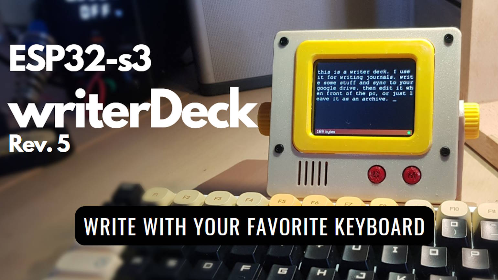

# Rev.5: Writing Screen for Your Own Keyboard

Rev.5 is a compact ESP32-S3 writing screen with a USB host port. Connect the keyboard you already love and it becomes a writerDeck.

| Preview | Revision | Characteristics |
| ------- | -------- | --------------- |
|  | **[Rev.5: A Personal Journey](./5.0/readme.md)** | An enclosure that sits next to your keyboard and connects through the ESP32-S3's native USB host. |
|  | **[Rev.5.1](./5.1/readme.md)** | An enhanced Rev.5 with a foldable design to protect the screen and an improved display module with a wider viewing angle and sharper picture. |
