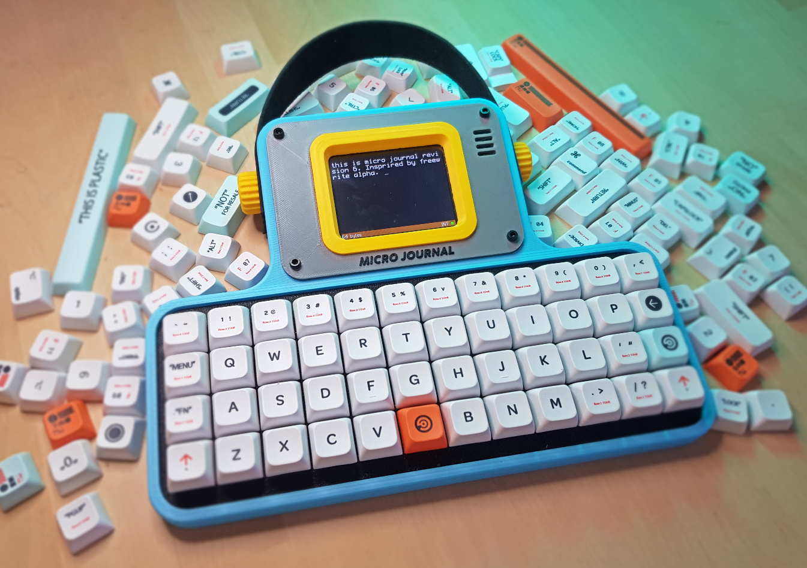
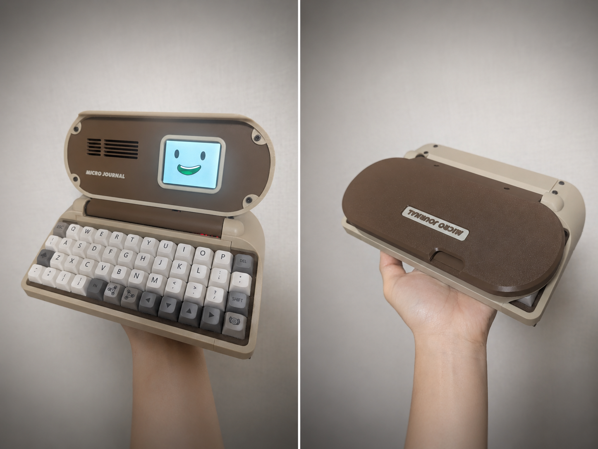

# Rev.6: All-in-One Portable Writing Device

Rev.6 is an ESP32-based writing device that combines the display and keyboard in one portable body.

| Preview | Revision | Characteristics |
| ------- | -------- | --------------- |
|  | **[Rev.6: Vivian in New York](./6.0/readme.md)** | A compact build for cafes and parks, with Cherry MX hot-swappable sockets, a 48-key ortholinear layout, a leather carrying strap and a protective cover. |
|  | **[Rev.6.1: Mini](./6.1/readme.md)** | A smaller Rev.6. It can also be used as a Bluetooth keyboard. |
