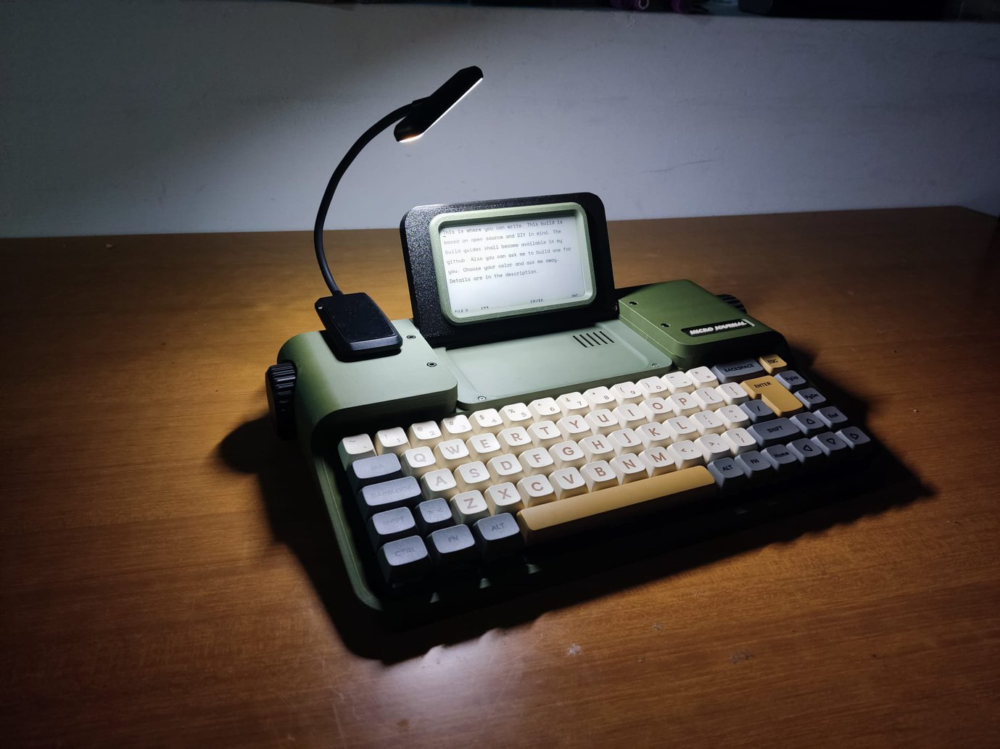

# Rev.7: E-Ink Writing Device

Rev.7 is an ESP32-S3 writing device with an e-ink display, for a paper-like screen that is easy on the eyes.

| Preview | Revision | Characteristics |
| ------- | -------- | --------------- |
|  | **[Rev.7: Kindred Gift](./7.0/readme.md)** | A paper-like display and a keyboard in a typewriter form factor, with a more traditional keyboard layout. It turns on instantly. |
