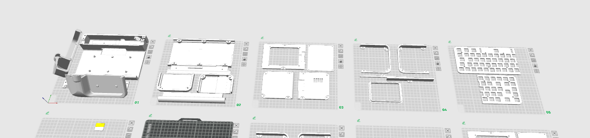
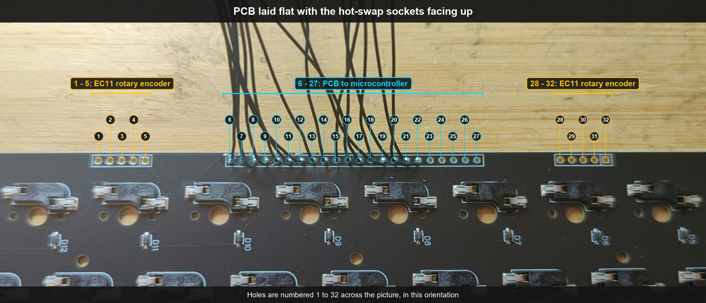
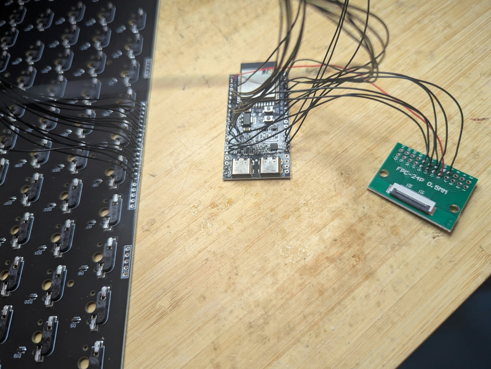
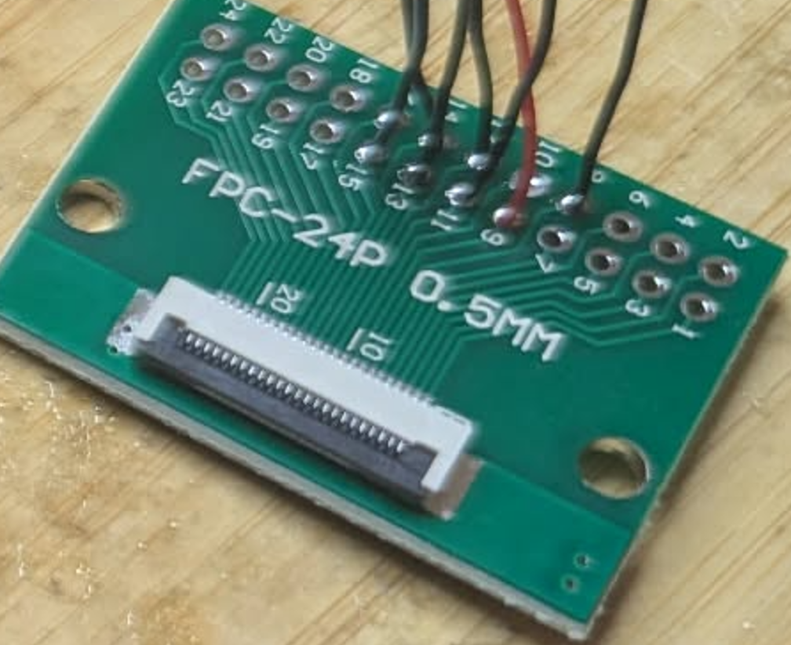
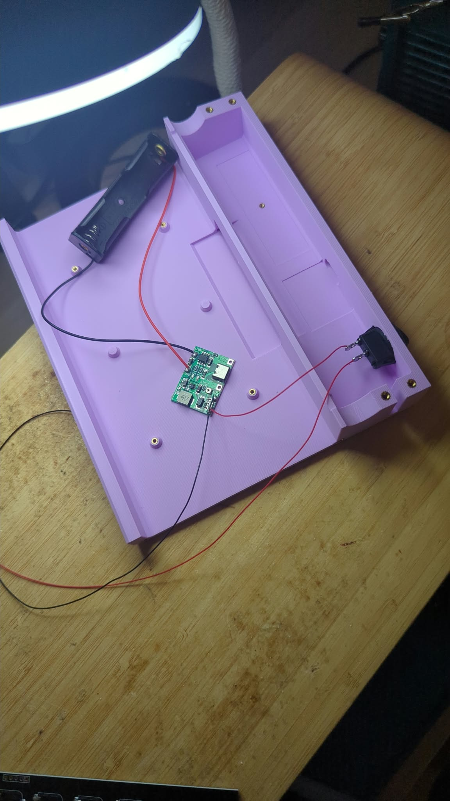

# Build Guide

This is the build guide for Micro Journal Rev.8.

> **Status:** This guide is a work in progress. Detailed step-by-step instructions will be added once the build has stabilized. For now, it provides the bill of materials and the wiring reference, so people who are comfortable figuring out the remaining details on their own can still build it at this stage. Sections that are not written yet are marked **TBD**.

- [Build Guide](#build-guide)
- [Requirements](#requirements)
  - [Soldering](#soldering)
  - [Basic Electronics Knowledge](#basic-electronics-knowledge)
  - [Patience](#patience)
- [Video Guide](#video-guide)
- [Bill of Materials](#bill-of-materials)
  - [Electronics](#electronics)
  - [Keyboard](#keyboard)
  - [Hardware](#hardware)
  - [3D Printed Parts](#3d-printed-parts)
- [Required Tools](#required-tools)
- [Build Order](#build-order)
- [1. Enclosure Preparation](#1-enclosure-preparation)
  - [Printing](#printing)
  - [Assembling the Printed Parts \& Heated Inserts](#assembling-the-printed-parts--heated-inserts)
- [2. Keyboard PCB](#2-keyboard-pcb)
  - [Getting the PCB](#getting-the-pcb)
  - [Parts on the PCB](#parts-on-the-pcb)
  - [Connection Holes](#connection-holes)
  - [Design Files](#design-files)
- [3. Wire the Keyboard to the ESP32](#3-wire-the-keyboard-to-the-esp32)
- [4. Display](#4-display)
  - [Display Module](#display-module)
  - [Wiring the Display to the ESP32](#wiring-the-display-to-the-esp32)
- [5. Power Supply](#5-power-supply)
- [6. Firmware](#6-firmware)
- [7. Switches and Keycaps](#7-switches-and-keycaps)
  - [Stabilizer](#stabilizer)
- [Troubleshooting](#troubleshooting)
- [Support](#support)

---

# Requirements

## Soldering

You need to be able to solder to complete this build. Advanced skills are not required. A basic soldering iron and solder will do the job.

## Basic Electronics Knowledge

Basic electronics knowledge is not strictly necessary, but it helps a lot in understanding what is going on and in solving problems when something does not work.

This is not a guide that spells out every single step. In some places you will need to make assumptions and figure things out on your own, based on basic electronics knowledge. Before diving in, you should be somewhat familiar with a few things:

- What a short circuit is, and how to avoid one
- What can happen when a lithium battery is shorted
- How to read a wiring table and follow a pin from one board to another

> **Warning:** This build uses a lithium battery. A shorted lithium battery can overheat, catch fire, or explode. Double-check your wiring and the battery polarity before connecting the battery.

## Patience

Everything here is achievable as long as you have the will. It is not rocket science. You will probably run into some hurdles along the way. You may feel like blaming me, and maybe even want to insult me to my face. I understand. 
One thing I can tell you: if you stick to the objective and get it working with your own hands, it is an incredible feeling. I promise.

---

# Video Guide

TBD

---

# Bill of Materials

## Electronics

| Part                                                                                         | Notes                                                                                                                       |
| -------------------------------------------------------------------------------------------- | --------------------------------------------------------------------------------------------------------------------------- |
| [Reflective LCD Display Module](https://ko.aliexpress.com/item/1005012114591531.html)        | ST7306, 300 x 400, model YDP420H001-V3. [Alternative purchase option](https://it.aliexpress.com/item/1005012685492159.html) |
| [FPC Adapter - 0.5-2.54MM, 24P](https://ko.aliexpress.com/item/1005007617729176.html)        | Breakout board for the display cable                                                                                        |
| ESP32 S3 N16R8                                                                               | Microcontroller                                                                                                             |
| [LiPo Charger and Step Up Controller](https://www.aliexpress.com/item/1005006366996657.html) |                                                                                                                             |
| [18650 Battery Holder](https://www.aliexpress.com/item/1005005084346241.html)                |                                                                                                                             |
| [2 Pin Round Snap Rocker Switch 19mm](https://it.aliexpress.com/item/1005008528747478.html)  | Power switch                                                                                                                |
| [Wires 30 AWG](https://it.aliexpress.com/item/1005007081117235.html)                         | Any typical wires for electronics would do                                                                                  |

## Keyboard

| Part                                                                                       | Notes                                                                                                                                        |
| ------------------------------------------------------------------------------------------ | -------------------------------------------------------------------------------------------------------------------------------------------- |
| [69 Keyboard PCB](https://www.elecrow.com/micro-journal-diy-kit-68-keys-keyboard-pcb.html) |                                                                                                                                              |
| Costar Stabilizer 6.25u                                                                    | For the spacebar                                                                                                                             |
| Keyboard switches                                                                          | Cherry MX compatible (MX-style) switches. Both 3-pin and 5-pin switches are supported.                                                       |
| Keycaps                                                                                    | Any keycap set made for MX-style switches. Make sure the set includes an **ISO Enter** key, the tall Enter key shaped like an upside-down L. |

## Hardware

| Part                                                                 |
| -------------------------------------------------------------------- |
| M3 Heated Inserts OD 4.5mm Length 3mm                                |
| M2 Heated Inserts OD 3.2mm Length 3mm                                |
| DIN 912 M3 Hex Screw Length 5mm                                      |
| DIN 912 M3 Hex Screw Length 10mm                                     |
| DIN 912 M3 Hex Screw Length 70mm                                     |
| DIN 7046 M2 Machine Screw Length 5mm                                 |
| [B-7000 Glue](https://www.aliexpress.com/item/1005005379063116.html) |

## 3D Printed Parts

The [STL files](./STL) for the 3D prints are available in this repository. A combined project file, `rev.8.3mf`, is in the same folder.


---

# Required Tools

- Soldering iron and solder
- Phillips screwdriver
- TORX T10H screwdriver to handle the hex screws
- Nipper
- Hot glue gun
- Black electrical tape
- A lot of positive thinking, to suppress the "why am I doing this" thoughts

---

# Build Order

1. Prepare the enclosure
2. Build the keyboard PCB
3. Wire the keyboard to the ESP32
4. Wire the display
5. Wire the power supply
6. Install the firmware
7. Close the enclosure
8. Install switches and keycaps

---

# 1. Enclosure Preparation

## Printing



The print project is in [rev.8.3mf](./STL/rev.8.3mf). I set it up in Bambu Studio and printed it on a Bambu Lab P1S using PLA+ filament.

The parts in the project are arranged in the best layout I could find. It gives the most consistent print quality and needs the least amount of support material.

You should be able to print with any printer and slicer, as long as you keep the same part orientation.

## Assembling the Printed Parts & Heated Inserts

Before assembling the printed parts, you need to install the M3 and M2 heated inserts.

I will leave this part to common sense. Each insert has a hole in the print that fits it. Push the insert into the hole with a soldering iron until it holds in place. Try to get the top of each insert as flat and level with the surface as possible.


---

# 2. Keyboard PCB

The Rev.8 uses the 68 keys keyboard PCB that is shared with other Micro Journal builds. Its design files and full details are in [shared/keyboard-68](../../shared/keyboard-68/readme.md).

## Getting the PCB

There are two ways to get the board:

- **Order a single board:** you can order just one piece from [Elecrow](https://www.elecrow.com/micro-journal-diy-kit-68-keys-keyboard-pcb.html).
- **Order from a PCB assembly service:** upload the files in the [GERBER](../../shared/keyboard-68/GERBER) folder (Gerber files, BOM, and pick and place file) to a PCB assembly service.

## Parts on the PCB

Only two parts are used on the board:

| Part                        | Part name                                                    | Quantity |
| --------------------------- | ------------------------------------------------------------ | -------- |
| Hot-swappable switch socket | Hot-swap socket for Cherry MX compatible switches            | 69       |
| Diode                       | `1N5819WS S4` Schottky diode, SOD-323 (LCSC part `C2927280`) | 71       |

## Connection Holes

The picture shows the PCB laid flat with the hot-swap sockets facing up. The connection holes along the top edge are numbered 1 to 32 as they appear in this picture. The orientation flips once the PCB is installed, so always identify a hole by its number in this view.



| Holes   | Used for               |
| ------- | ---------------------- |
| 1 - 5   | EC11 rotary encoder    |
| 6 - 27  | PCB to microcontroller |
| 28 - 32 | EC11 rotary encoder    |

## Design Files

The schematic is in the [DESIGN](../../shared/keyboard-68/DESIGN) folder, in case you need to deep dive into the PCB.


---

# 3. Wire the Keyboard to the ESP32

The keyboard PCB connects to the ESP32 through the **middle holes** only, which are holes 6 to 27 in the [Connection Holes](#connection-holes) picture. 17 of them are used: **holes 6 to 22**. The rows come first, followed by the columns. Holes 23 to 27 are left empty.

Connect the holes to the ESP32 pins in this order. The hole numbers are the ones shown in the picture, with the PCB laid flat and the hot-swap sockets facing up.

| KBD PCB hole | Signal | ESP32 pin |
| ------------ | ------ | --------- |
| 6            | ROW 1  | 8         |
| 7            | ROW 2  | 18        |
| 8            | ROW 3  | 17        |
| 9            | ROW 4  | 16        |
| 10           | ROW 5  | 15        |
| 11           | ROW 6  | 7         |
| 12           | ROW 7  | 6         |
| 13           | ROW 8  | 5         |
| 14           | COL 1  | 1         |
| 15           | COL 2  | 2         |
| 16           | COL 3  | 42        |
| 17           | COL 4  | 41        |
| 18           | COL 5  | 40        |
| 19           | COL 6  | 39        |
| 20           | COL 7  | 45        |
| 21           | COL 8  | 48        |
| 22           | COL 9  | 47        |

The same mapping as it appears in the firmware:

```cpp
byte rowPins[ROWS] = {8, 18, 17, 16, 15, 7, 6, 5};
byte colPins[COLS] = {1, 2, 42, 41, 40, 39, 45, 48, 47};
```



---

# 4. Display

## Display Module

| Item                  | Value                                               |
| --------------------- | --------------------------------------------------- |
| Driver                | ST7306                                              |
| Type                  | 300 x 400 dot matrix TFT LCD module                 |
| Model                 | YDP420H001-V3                                       |
| Manufacturer          | Osptek Display                                      |
| Driver reference code | https://gitee.com/osptek/4.2-lcd-300x400-spi-st7305 |

## Wiring the Display to the ESP32

The display connects to the ESP32 through the FPC adapter (breakout board). Solder a wire from each pin of the breakout board listed below to the matching ESP32 pin.

> **Note:** The breakout board has different pin numbers printed on the front and on the back. This build uses the numbers printed on the side with the FPC socket, shown in the **PIN (Socket Side)** column.

| DISPLAY | PIN (Socket Side) | ESP32 |
| ------- | ----------------- | ----- |
| VCI     | 9                 | 3.3V  |
| GND     | 8                 | GND   |
| SCLK    | 12                | 12    |
| SDI     | 11                | 11    |
| CS      | 13                | 10    |
| LCD DC  | 14                | 46    |
| LCD_RES | 15                | 3     |



Solder the wires on the side of the breakout board where the FPC socket sticks out, as in the picture. Lay the board with its flat side down on the table while you solder.

> **Be careful with the power wires.** It is easy to mix up 3.3V and GND, and I often get confused about which one is which. I use wires of different colors for power and ground to avoid the confusion. Double-check these two wires before powering the display.


---

# 5. Power Supply

The power supply uses the LiPo charger and step up controller, the 18650 battery holder, and the rocker switch.

Wiring diagram: TBD

You want to have the switch installed in the enclosure before soldering the wires. 
Switch will be cutting of one of Vout wires, and after all the wiring is completed. You should have long + and long - wires coming out to be soldered to the ESP32.



---

# 6. Firmware

The firmware source code is in the [micro-journal-mcu](https://github.com/unkyulee/micro-journal-mcu) repository. Firmware files are published on the [releases page](https://github.com/unkyulee/micro-journal/releases).

To install the firmware on a new board, follow the full web flash steps in [Update the Firmware](./guide.md#5-update-the-firmware).


---

# 7. Switches and Keycaps

## Stabilizer

The spacebar uses a Costar Stabilizer 6.25u.

Installation steps: TBD

---

# Troubleshooting

TBD

---

# Support

If Micro Journal helped you build something you love, consider buying me a coffee through the link below. It is a small gesture, but it helps keep the project alive, cared for, and open for everyone.

* [Buy me a coffee](https://www.buymeacoffee.com/unkyulee)

Un Kyu Lee
