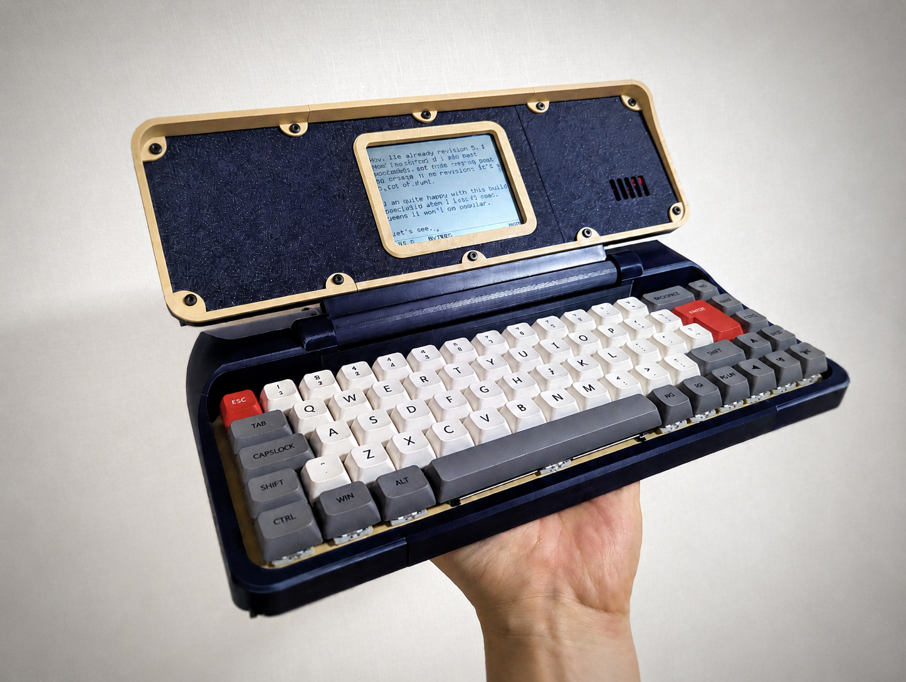

# Rev.8: Reflective LCD Writing Device

Rev.8 is an ESP32-based writing device with a reflective LCD. It responds fast, uses little power, and stays readable in bright environments.

| Preview | Revision | Characteristics |
| ------- | -------- | --------------- |
|  | **[Rev.8: Melodica](./8.0/readme.md)** | A monochrome reflective screen that gets clearer under bright light, like e-ink but with a much faster refresh rate. It boots in about 1 second and has hot-swappable mechanical switches. |
