# Google Drive Sync Setup

Google Drive Sync uploads the file you are working on from your Micro Journal to a folder in your own Google Drive, over WiFi. There is no third-party service or subscription. You install a small script in your Google Drive, and the Micro Journal sends your text to it.

This guide applies to every Micro Journal revision that has a **Sync** menu.

Setup has three parts:

1. [Set up the script in Google Drive](#part-1-set-up-the-script-in-google-drive) (on your computer)
2. [Add the script URL to your Micro Journal](#part-2-add-the-script-url-to-your-micro-journal)
3. [Run a sync](#part-3-run-a-sync)

**Already set up on another Micro Journal?** Skip Part 1. Copy the `sync` URL from the `config.json` file of that device and continue from Part 2.

## Before You Start

- You need a Google account and a computer with a web browser.
- The Micro Journal needs a WiFi network saved on it. Set this up first, as described in the guide for your revision.
- The Micro Journal connects to **2.4 GHz WiFi only**. It cannot connect to a 5 GHz network.

## Part 1. Set Up the Script in Google Drive

### 1. Create the uJournal folder

1. Open [Google Drive](https://drive.google.com) in your browser and go to **My Drive**.
2. Click **New** → **New folder**.

   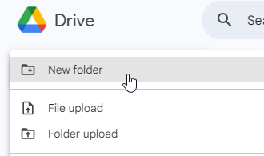

3. Name the folder exactly `uJournal` and click **Create**.

   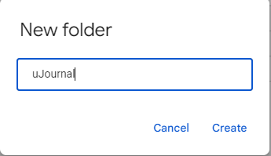

The name is case-sensitive, and the folder must be directly inside **My Drive**, not inside another folder. Your synced files will appear here.

### 2. Create a Google Apps Script

1. Open the **uJournal** folder.
2. Click **New** → **More** → **Google Apps Script**.

   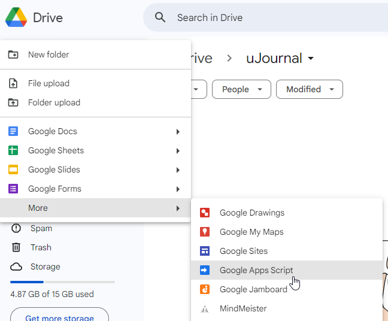

A new tab opens with the script editor.

### 3. Paste the sync script

1. Open the sync script: [sync.js](https://raw.githubusercontent.com/unkyulee/micro-journal/main/shared/GoogleDriveSync/sync.js). The same file is stored next to this guide as [sync.js](./sync.js).
2. Select all of the text on that page and copy it.
3. In the script editor, delete everything that is already there and paste the copied script.
4. Click the project name at the top of the page, usually **Untitled project**, and rename it to `uJournal Sync`.

   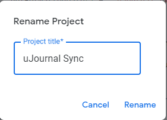

5. Click the **Save** icon, or press `Ctrl+S` (`Cmd+S` on a Mac).

### 4. Deploy the script as a web app

1. Click **Deploy** → **New deployment**.

   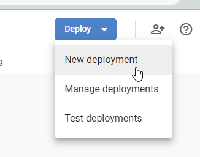

2. Click the gear icon next to **Select type** and choose **Web app**.

   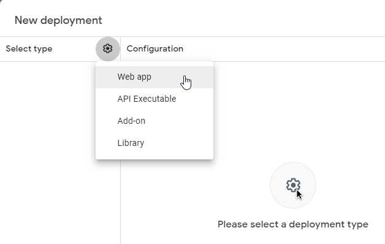

3. Set the two options under **Web app**:
   - **Execute as:** `Me`. This lets the script save files to your Google Drive.
   - **Who has access:** `Anyone`. Do not choose *Anyone with Google account*; the Micro Journal cannot sign in, so the sync would fail.

   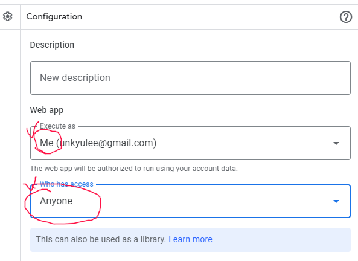

4. Click **Deploy**.

`Anyone` means that anybody who has the web app URL can add files to your uJournal folder. Treat the URL like a password and do not share it.

### 5. Authorize the script

Google now asks for permission for the script to use your Google Drive.

1. Click **Authorize access**.

   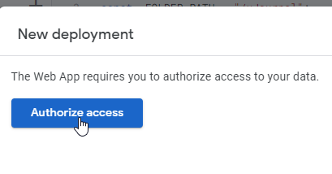

2. Choose your Google account.
3. Google shows a warning, **Google hasn't verified this app**. This is expected, because the script is your own copy and has not been reviewed by Google. Click **Advanced**, then click **Go to uJournal Sync (unsafe)**.

   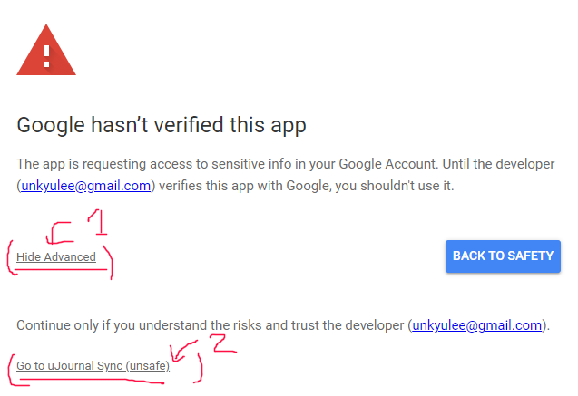

4. Click **Allow**.

   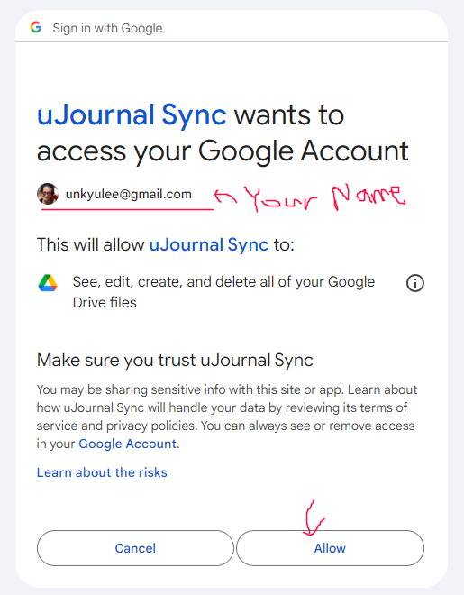

### 6. Copy the web app URL

When the deployment finishes, a summary appears. Under **Web app**, click **Copy** below the **URL**. The URL starts with `https://script.google.com/macros/s/` and ends with `/exec`.

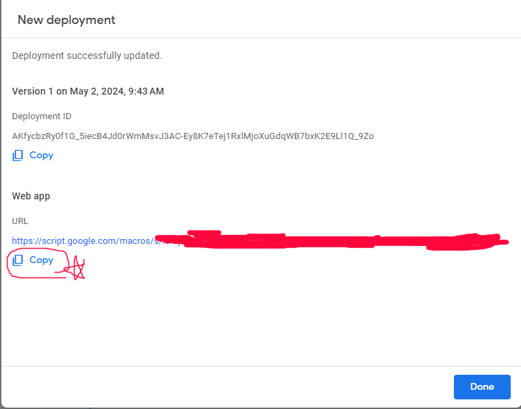

Copy the **URL**, not the **Deployment ID** shown above it. Paste it somewhere safe, such as a text file on your computer. You need it in Part 2.

## Part 2. Add the Script URL to Your Micro Journal

The Micro Journal reads the URL from a settings file named `config.json`.

### 1. Open config.json

How you reach the file depends on your revision and firmware. Use the method described in the guide for your revision:

- **Web Editor:** open **Web Editor** from the menu, then open `config.json` in your browser.
- **Drive Mode:** open **Drive Mode** from the menu, connect the USB cable, then open `config.json` on the drive that appears on your computer.
- **SD card:** switch off the Micro Journal, put the SD card in your computer, then open `config.json` on the card.

Open the file with a plain text editor such as Notepad or TextEdit, not a word processor. If the file does not exist, create it.

### 2. Add the sync URL

Add a `sync` section with your URL. **Keep everything that is already in the file.** The same file stores your WiFi networks and other settings, and deleting them will stop the sync from working.

If the file already has content, add the `sync` section next to the existing sections, separated by a comma:

```json
{
  "network": {
    "type": "wifi",
    "access_points": [
      {
        "ssid": "YOUR_WIFI_NAME",
        "password": "YOUR_WIFI_PASSWORD"
      }
    ]
  },
  "sync": {
    "url": "PASTE_YOUR_WEB_APP_URL_HERE"
  }
}
```

If the file already has a `sync` section, replace only the URL inside the quotes.

If the file is empty or new, use this:

```json
{
  "sync": {
    "url": "PASTE_YOUR_WEB_APP_URL_HERE"
  }
}
```

Check that every opening `{` has a closing `}`, that the URL is inside double quotes, and that sections are separated by commas with no comma after the last one. The Micro Journal cannot read the file if this punctuation is wrong.

### 3. Save and restart

1. Save the file.
2. Close the connection the way you opened it: press `Esc` to leave Web Editor or Drive Mode (eject the drive on your computer first), or eject the SD card and put it back in the Micro Journal.
3. Switch the Micro Journal off and on again so that it reads the new settings.

## Part 3. Run a Sync

1. Open the file you want to upload.
2. Press `Esc` to open the menu.
3. Select **Sync** or press `S`.

The Micro Journal connects to WiFi, uploads the file, reports the result, and switches WiFi off again.

Open the **uJournal** folder in Google Drive. You should see a new file named with the date and time of the sync, for example `2026.10.07-14.30_uJournal.txt`. Each sync uploads the file you currently have open and creates a new file in the folder. Earlier uploads are not overwritten.

## Troubleshooting

**Sync is not in the menu.**
The Sync option appears only when both WiFi and the sync URL are configured. Check that a WiFi network is saved on the Micro Journal and that `config.json` contains the `sync` section, then restart the device.

**The Micro Journal cannot connect to WiFi.**
Check the network name and password. Make sure the network is 2.4 GHz; 5 GHz networks do not work.

**The sync fails, or no file appears in Google Drive.**

- Check that the folder is named exactly `uJournal` and is directly inside **My Drive**.
- Check that the URL in `config.json` is the full web app URL ending in `/exec`.
- Check that **Who has access** is set to `Anyone`. To see the setting, open the script and click **Deploy** → **Manage deployments**.
- Check the inbox of your Google account. When the script fails, it sends you an email with the subject **Error in Micro Journal Sync Process**.

**I want to use a different folder.**
Change the folder name in the first lines of the script, in `const _FOLDER_PATH = "/uJournal";`, and create a folder with that name in Google Drive. Then click **Deploy** → **Manage deployments**, click the pencil icon, choose **New version**, and click **Deploy**. The URL stays the same.
